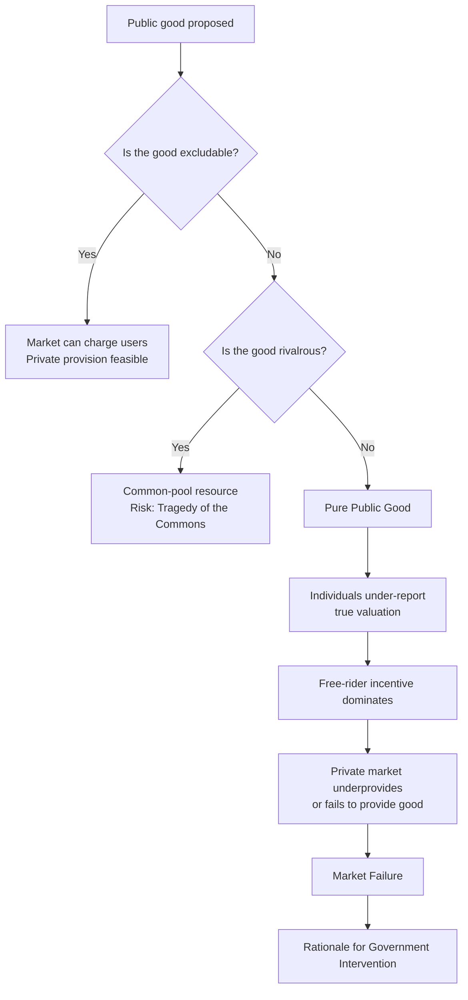

## Public Goods and the Free-Rider Problem

### Definition and Core Characteristics

A public good is a good or service defined by two properties that distinguish it from private goods traded in ordinary markets.

**Non-excludability**: once the good is provided, no individual can be effectively prevented from consuming or benefiting from it, regardless of whether they paid for it. Excluding non-payers is either technologically impossible or prohibitively costly.

**Non-rivalry (non-rivalrous consumption)**: one person's consumption of the good does not diminish the quantity or quality available to others. Marginal cost of serving an additional consumer is zero.

Goods can be classified along these two dimensions:

|  | Excludable | Non-excludable |
| --- | --- | --- |
| **Rivalrous** | Private goods (food, clothing) | Common-pool resources (fisheries, groundwater) |
| **Non-rivalrous** | Club/toll goods (cable TV, toll roads) | Public goods (national defense, lighthouses, clean air) |

A good that is purely non-excludable and non-rivalrous is called a **pure public good**. Most real-world public goods are **impure**, exhibiting these properties only partially or under certain conditions (e.g., a park is non-excludable but becomes partially rivalrous under congestion).

### Classic Examples

- National defense
- Public street lighting
- Basic scientific research
- Lighthouses (the canonical economics textbook example, historically debated — some lighthouses were privately funded via port fees, which is [Unverified] as a fully general claim about lighthouse provision)
- Clean air and climate stability
- Herd immunity from vaccination (technically a positive externality with public-good characteristics)
- Open-source software and public-domain knowledge

### The Free-Rider Problem

The free-rider problem arises directly from non-excludability. Because no one can be excluded from consuming the good once it exists, each individual has an incentive to let others pay for it while still enjoying the benefit. If everyone reasons this way, the good is underfunded or never produced at all, even though its total social value may exceed its cost.

**Formal logic**: Consider $n$ individuals who would each value a public good at $v_i$. The good costs $C$ to provide and benefits everyone once built. Efficiency (via the **Samuelson condition**) requires:

$$\sum_{i=1}^{n} MB_i = MC$$

where $MB_i$ is individual $i$'s marginal benefit and $MC$ is the marginal cost of provision. This contrasts with private goods, where efficiency requires each individual's marginal benefit to separately equal marginal cost ($MB_i = MC$ for each $i$).

Because no private actor captures the full social benefit $\sum MB_i$, but each bears the full cost of contributing, individuals under-contribute relative to the efficient level. In the extreme case with purely selfish, non-cooperative individuals, private markets can fail to supply the good entirely — this is the **market failure** result.

### Game-Theoretic Framing

The free-rider problem is a variant of the **prisoner's dilemma** generalized to $n$ players, often called a **public goods game**.

**Simple two-player example**: Two neighbors each decide whether to contribute $100 toward a shared streetlamp worth $150 to each of them individually ($300 total social value) if built.

|  | Neighbor B contributes | Neighbor B free-rides |
| --- | --- | --- |
| **Neighbor A contributes** | Both get lamp; net payoff: (50, 50) | A pays, both get lamp; payoff: (50, 150) |
| **Neighbor A free-rides** | B pays, both get lamp; payoff: (150, 50) | No lamp; payoff: (0, 0) |

Each player's dominant strategy is to free-ride, since free-riding yields a higher payoff regardless of the other's choice (150 > 50 if the other contributes; 0 > -100 if the other doesn't — wait, adjust: 0 > if you contribute alone you'd get 150 - 100 = 50, so actually contributing alone still nets positive 50). The Nash equilibrium in many parameterizations is mutual non-contribution, which is Pareto-inferior to mutual contribution — the hallmark of the underlying dilemma structure.

**Key Points**

- The free-rider incentive scales with group size: larger groups typically experience more severe free-riding because each individual's share of the benefit relative to their potential to be blamed or socially sanctioned shrinks (this is sometimes called the **large-group problem**, following Mancur Olson's *The Logic of Collective Action*).
- Repeated interaction, reputation effects, and social sanctions can partially mitigate free-riding in small, close-knit groups — a finding well documented in experimental economics [Inference: magnitude of mitigation is context-dependent and varies across experimental designs].
- The free-rider problem is distinct from, but related to, the **tragedy of the commons**, which applies to rivalrous, non-excludable **common-pool resources** rather than non-rivalrous public goods.

### Diagram: Provision Outcomes Under Free-Riding

### Demand Aggregation: Public vs. Private Goods

For private goods, market demand is the **horizontal summation** of individual demand curves (quantities added at each price). For public goods, since all consumers simultaneously consume the same unit, market demand is the **vertical summation** of individual demand curves (marginal benefits added at each quantity).

<svg xmlns="http://www.w3.org/2000/svg" viewBox="0 0 640 380" font-family="sans-serif">
<text x="320" y="24" text-anchor="middle" font-size="16" font-weight="bold">Vertical Summation of Demand for a Public Good (svg_diagram)</text>
<line x1="80" y1="330" x2="580" y2="330" stroke="black" stroke-width="2" />
<line x1="80" y1="330" x2="80" y2="50" stroke="black" stroke-width="2" />
<text x="580" y="350" font-size="13">Quantity (Q)</text>
<text x="40" y="55" font-size="13">Price / MB</text>
<line x1="80" y1="290" x2="480" y2="90" stroke="#2563eb" stroke-width="2" />
<text x="490" y="90" font-size="12" fill="#2563eb">MB_A (Individual A)</text>
<line x1="80" y1="250" x2="380" y2="70" stroke="#16a34a" stroke-width="2" />
<text x="390" y="70" font-size="12" fill="#16a34a">MB_B (Individual B)</text>
<path d="M80,250 L200,190 L380,70" stroke="#dc2626" stroke-width="3" fill="none" />
<text x="200" y="120" font-size="12" fill="#dc2626" font-weight="bold">Sum MB = MB_A + MB_B</text>
<text x="200" y="136" font-size="12" fill="#dc2626">(Social Marginal Benefit)</text>
<line x1="80" y1="330" x2="480" y2="150" stroke="#7c3aed" stroke-width="2" stroke-dasharray="6,4" />
<text x="490" y="150" font-size="12" fill="#7c3aed">MC (Marginal Cost)</text>
<circle cx="255" cy="177" r="4" fill="black" />
<line x1="255" y1="177" x2="255" y2="330" stroke="black" stroke-width="1" stroke-dasharray="3,3" />
<text x="245" y="345" font-size="12" font-weight="bold">Q*</text>
<text x="260" y="172" font-size="11">Efficient quantity</text>
</svg>

The efficient quantity $Q^*$ occurs where the **vertically summed** marginal benefit curve intersects the marginal cost curve, satisfying the Samuelson condition. Left to private markets, individuals typically reveal demand based only on their own $MB_i$, leading to underprovision relative to $Q^*$.

### Government Responses to the Free-Rider Problem

**Direct public provision**: The government funds the good through general taxation and provides it directly (e.g., national defense, public parks maintained by municipal budgets). This sidesteps free-riding because contribution is compulsory via the tax system rather than voluntary.

**Subsidies to private/voluntary provision**: Government subsidizes NGOs, charities, or firms that supply goods with public-good characteristics (e.g., subsidies for basic research, tax deductions for charitable giving).

**Regulation and mandates**: Requiring certain behaviors (e.g., vaccination mandates) to correct underprovision of goods with public-good-like externalities.

**Assignment or clarification of property rights**: Where feasible, converting a public good into an excludable club good (e.g., toll roads, pay-per-view broadcasting, patents on innovations) restores private incentives to provide it, at the cost of some efficiency loss from exclusion of consumers whose valuation exceeds marginal cost but not the toll/price.

**Preference-revelation mechanisms**: Mechanism-design solutions such as the **Clarke-Groves (Vickrey-Clarke-Groves, VCG) mechanism** are theoretically capable of inducing truthful revelation of individual valuations for a public good by making each person's payment depend on their reported valuation's effect on the group decision, removing the incentive to understate demand. [Inference: VCG mechanisms are theoretically elegant and truth-inducing under standard assumptions, but real-world implementation faces significant practical hurdles including budget balance, computational complexity, and susceptibility to collusion.]

### Related Concepts and Common Confusions

**Public goods vs. government-provided goods**: Not all government-provided goods are public goods in the economic sense (e.g., public housing or subsidized healthcare are typically rivalrous and excludable — they are provided by government for equity or merit-good reasons, not because of non-excludability/non-rivalry).

**Merit goods**: Goods that are under-consumed relative to the socially optimal level due to information failures or myopia (e.g., education, vaccination), which is a distinct rationale for intervention from the public-goods rationale, though the two often overlap in policy discussions.

**Club goods**: Excludable but non-rivalrous (up to a congestion point) — e.g., streaming subscriptions, gated communities, satellite TV. These do not suffer from the free-rider problem in the same way because exclusion is feasible, allowing a market price to be charged.

**Global public goods**: Public goods whose non-excludability operates at the international level (e.g., climate stability, ozone layer protection, pandemic preparedness), which create free-rider problems between *nations* rather than individuals, complicating provision because there is no supranational taxing authority to compel contribution. [Inference: this framing is standard in international economics literature but the practical severity of free-riding varies by issue area and the presence of side-payments or sanctions regimes.]

### Empirical and Experimental Evidence

Laboratory public-goods games (where subjects choose how much of an endowment to contribute to a shared pot that is multiplied and redistributed equally) consistently find that:

- Contribution rates start substantially above the zero-contribution Nash equilibrium prediction, often in the 40–60% range of endowments in initial rounds.
- Contributions tend to decay toward the free-riding equilibrium over repeated rounds without punishment mechanisms.
- Introducing costly punishment options for free-riders can sustain higher cooperation levels, though punishment itself is costly and can reduce net welfare in some designs.

[Unverified: precise contribution percentages vary widely across studies, populations, and experimental parameters (multiplication factor, group size, framing); the qualitative pattern of initial over-contribution followed by decay is a well-replicated stylized fact in the experimental economics literature.]

### Worked Numerical Example

Three residents (A, B, C) are considering funding a communal well. Their individual valuations (maximum willingness to pay) are:

- $MB_A = \$40$
- $MB_B = \$30$
- $MB_C = \$20$

The well costs $C = \$60$ to build.

**Social efficiency check**: Sum of marginal benefits $= 40 + 30 + 20 = \$90 > \$60 = C$. The well is socially efficient to build — total benefit exceeds total cost.

**Private market outcome**: If provision depends on each resident voluntarily paying their own valuation and the well is only built if total voluntary contributions reach $60, each resident has an incentive to underreport their valuation or wait for others to pay, since once built, no one can be excluded from using it. Without a coordination or enforcement mechanism, contributions may fall short of $60 even though building it would make all three better off — this is the free-rider problem in miniature.

**Government solution**: A local government could levy a tax proportional to some formula (e.g., equal shares of $20 each) and provide the well directly, achieving the efficient outcome without relying on voluntary truthful revelation.

**Related Topics**

- Externalities (positive and negative) and Pigouvian taxes/subsidies
- The Tragedy of the Commons and common-pool resource management (Elinor Ostrom's governance frameworks)
- Coase Theorem and its limits in addressing public goods problems
- Median Voter Theorem and public choice theory (how public goods quantities get determined politically)
- Mechanism design and the Vickrey-Clarke-Groves (VCG) mechanism
- Cost-Benefit Analysis for public projects
- Merit goods, demerit goods, and paternalistic intervention
- Club theory and the economics of shared, excludable goods
- Global public goods and international collective action problems
- Olson's Logic of Collective Action and group-size effects on cooperation