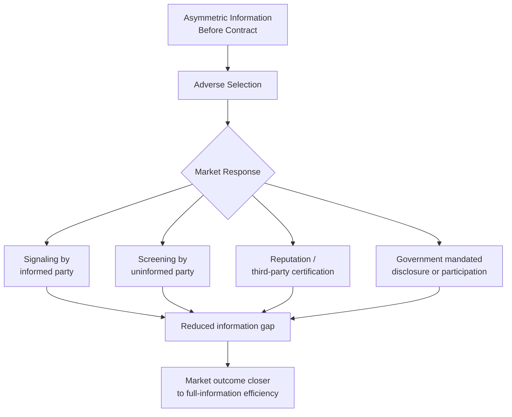

## Asymmetric Information: Adverse Selection and Moral Hazard

### Definition and Core Concept

**Asymmetric information** describes a market condition in which one party to a transaction possesses more or better information than the other party. This informational imbalance can distort incentives, prices, and quantities away from what would prevail under full information, producing a distinct category of market failure separate from public goods, externalities, and common resources.

Asymmetric information problems are conventionally divided into two categories based on **when** the informational imbalance matters relative to the transaction:

- **Adverse selection**: a *hidden information* (or *hidden characteristics*) problem arising **before** a transaction is completed — the informed party knows something about quality or risk that the uninformed party does not, affecting *who* selects into the transaction.
- **Moral hazard**: a *hidden action* problem arising **after** a transaction is completed — one party can take actions unobservable to the other party that change the likelihood or size of an outcome, affecting *behavior* once the contract is in place.

### Adverse Selection

**Mechanism**: Adverse selection occurs when asymmetric information about quality or risk causes a disproportionate share of low-quality or high-risk participants to select into a market, potentially driving out higher-quality participants and, in extreme cases, causing the market to unravel entirely.

**Canonical example — Akerlof's "Market for Lemons"**: George Akerlof's 1970 paper "The Market for 'Lemons': Quality Uncertainty and the Market Mechanism" (for which he shared the 2001 Nobel Memorial Prize in Economic Sciences along with Michael Spence and Joseph Stiglitz) formalized adverse selection using the used-car market.

- Sellers know the true quality of their car (good cars, "peaches," vs. defective cars, "lemons"); buyers cannot distinguish quality before purchase.
- Buyers, unable to verify quality, are only willing to pay a price reflecting the *average* quality of cars on the market.
- At that average price, owners of high-quality cars find the price too low relative to their car's true value and exit the market, while owners of lemons are happy to sell at the average price.
- As high-quality cars exit, the average quality of remaining cars falls, buyers revise their willingness to pay downward further, and the cycle can continue until only the lowest-quality goods remain — a phenomenon sometimes summarized as **"the bad driving out the good"** (an adverse-selection analogue to Gresham's Law).

**Formal sketch**: Let car quality $\theta$ be uniformly distributed on $[0, 1]$, known to sellers but not buyers. If buyers only know the distribution of $\theta$, they are willing to pay the expected value $E[\theta]$ conditional on which sellers choose to sell at a given price $p$. If sellers with $\theta > p$ refuse to sell (holding out for a better price than the pooled average reflects), the pool of available cars shrinks to $\theta \le p$, lowering $E[\theta \mid \theta \le p]$, which further lowers the price buyers are willing to pay — a self-reinforcing downward spiral that can converge to a market with only the lowest-quality goods, or in extreme cases, **market collapse** (no trade occurs even though mutually beneficial trades exist at every quality level).

**Other classic examples**:

- **Insurance markets**: Individuals know their own health/accident risk better than insurers do. Without risk-based pricing tools, high-risk individuals are more likely to purchase (or purchase more) insurance, raising average claims costs and pushing up premiums, which can drive low-risk individuals out of the market.
- **Credit markets**: Borrowers know their own creditworthiness and repayment intentions better than lenders. Raising interest rates to compensate for average default risk can perversely attract riskier borrowers (who are less deterred by high rates because they may not intend or expect to repay) while discouraging safe borrowers — a mechanism formalized by Stiglitz and Weiss (1981) explaining **credit rationing**.
- **Labor markets**: Job applicants know their own skill and work ethic better than employers do at the hiring stage.

**Key Points**

- Adverse selection is a problem of **hidden types/characteristics** that exist prior to the contract.
- It can lead to **inefficiently thin markets** or **complete market unraveling**, even when gains from trade exist at every quality level.
- The core inefficiency is that the *pooling equilibrium price* reflects average quality, which is unattractive to above-average-quality participants.

### Market Responses to Adverse Selection

**Signaling** (informed party acts to reveal information): The party with private information takes a costly, verifiable action to credibly signal quality. Michael Spence's job-market signaling model (1973) is the canonical formalization: workers acquire education not necessarily because it raises productivity, but because it is cheaper for high-ability workers to obtain than for low-ability workers, making education a credible (separating) signal of underlying ability. [Inference: the pure signaling interpretation of education is one strand of labor economics and coexists with human-capital theory, which holds that education directly raises productivity; the relative empirical weight of each channel remains a subject of ongoing research and is not settled by theory alone.]

**Screening** (uninformed party acts to sort types): The less-informed party designs a menu of contracts such that different types of the informed party self-select into different options, revealing their type indirectly. Example: insurers offering a menu of policies (e.g., low premium/high deductible vs. high premium/low deductible), where risk types self-sort based on which contract they find most attractive.

**Guarantees and warranties**: Sellers of high-quality goods can credibly signal quality by offering warranties, since offering a warranty is more costly for a seller of low-quality goods (who expects more claims).

**Reputation and repeated interaction**: Institutions such as branded dealerships, certification bodies, credit bureaus, and online review systems reduce informational asymmetry by aggregating and publicizing quality/reliability information over time.

**Mandatory disclosure and government regulation**: Requiring standardized information disclosure (e.g., vehicle history reports like Carfax, nutrition labeling, lending disclosure laws such as Truth in Lending) or mandating universal participation (e.g., health insurance mandates, which prevent the healthy from opting out and thereby stabilize the risk pool).

### Moral Hazard

**Mechanism**: Moral hazard occurs when one party to a transaction can take a hidden action after the contract is formed that affects the probability or magnitude of an outcome, and the contractual arrangement changes that party's incentives — typically because the party bearing the risk is no longer the party experiencing the full consequence of their own behavior.

**Canonical example — insurance**: Once insured, individuals may take on more risk or exert less precaution than they would if fully exposed to the cost of bad outcomes, because the insurer, not the individual, bears (part of) the loss.

- **Ex ante moral hazard**: reduced precaution taken *before* a loss occurs (e.g., a driver with full auto insurance may drive less cautiously, or an insured homeowner may under-invest in fire safety measures).
- **Ex post moral hazard**: excessive consumption of the insured service *after* an event that triggers coverage (e.g., an individual with generous health insurance may seek more medical treatment than they would if paying the full marginal cost out of pocket — the standard framing in health economics for why demand for medical care responds to insurance generosity).

**Other classic examples**:

- **Employment/principal-agent relationships**: An employee's effort level is often unobservable or costly to monitor; without appropriate incentive structures, workers may shirk since their pay does not fully depend on effort.
- **Banking and financial regulation**: Deposit insurance and "too big to fail" expectations can encourage banks to take on excessive risk, since losses beyond a certain point are absorbed by the government/deposit insurer rather than the bank's own stakeholders — a widely cited contributing factor in discussions of the 2007–2009 financial crisis. [Inference: the relative causal weight of moral hazard versus other factors (regulatory gaps, mortgage securitization incentives, monetary policy) in that crisis remains debated among economists and is not a settled, single-cause account.]
- **Corporate governance**: Managers (agents) may pursue their own interests (empire-building, perquisites, risk-shifting) at the expense of shareholders (principals) who cannot perfectly monitor managerial effort or decisions — the foundational **principal-agent problem**.

**Formal sketch**: Let an agent choose unobservable effort $e$ at personal cost $c(e)$, where $c'(e) > 0$ and $c''(e) > 0$ (increasing marginal cost of effort). Output or the probability of a good outcome depends on $e$, but the principal only observes the final outcome, not $e$ itself. If the agent's payment is fixed regardless of outcome (as under full insurance or a flat salary), the agent's private return to effort is zero, so a self-interested agent chooses $e = 0$ — the **minimum effort/maximum shirking** outcome, illustrating the incentive-compatibility problem at the heart of principal-agent theory.

**Key Points**

- Moral hazard is a problem of **hidden actions** taken after risk has been transferred or a contract has been signed.
- It arises whenever the party making a decision does not bear the full cost (or receive the full benefit) of that decision — a structural resemblance to externalities, except the "externality" here is imposed on a specific counterparty within a contractual relationship rather than on third parties generally.
- The core inefficiency is a distortion of effort, care, or consumption levels relative to what would occur if the acting party bore full responsibility for outcomes.

### Contractual and Institutional Responses to Moral Hazard

**Deductibles and co-payments**: Requiring the insured party to bear part of any loss restores some private cost to risky behavior or excessive consumption, partially realigning incentives (used extensively in auto, health, and property insurance).

**Coinsurance and coverage limits**: Capping the insurer's payout share or the total amount covered similarly preserves some marginal cost exposure for the insured party.

**Monitoring and auditing**: Principals invest in observing agents' actions or outcomes more closely (e.g., performance reviews, telematics/usage-based auto insurance that tracks driving behavior, financial audits).

**Incentive-compatible contracts**: Structuring compensation to align the agent's incentives with the principal's interests, such as:

- Performance-based pay, bonuses, stock options, and profit-sharing for employees/executives
- Experience rating in insurance (premiums adjusted based on past claims history)
- Efficiency wages (paying above-market wages to raise the cost of job loss, discouraging shirking)

**Bonding and collateral requirements**: Requiring the informed/acting party to post a stake that they forfeit if their behavior leads to a bad outcome (e.g., security deposits, collateral on loans, warranty bonds in construction contracts).

**Regulatory capital and risk-retention rules**: In banking, requiring institutions to hold minimum capital reserves or retain a portion of securitized loans on their own books (risk-retention rules) to ensure they bear some consequence of poor lending decisions.

### Distinguishing Adverse Selection from Moral Hazard

|  | Adverse Selection | Moral Hazard |
| --- | --- | --- |
| **Timing** | Before contract (ex ante information problem) | After contract (ex post behavior problem) |
| **Hidden element** | Type / characteristic | Action / effort |
| **Core question** | "Who selects into this contract?" | "How does behavior change once covered?" |
| **Classic remedy** | Signaling, screening, mandated disclosure | Deductibles, monitoring, incentive contracts |
| **Textbook example** | Used-car "lemons" market | Insured driver reducing precaution |

A useful heuristic: adverse selection is about **hidden information the other side never sees before agreeing**; moral hazard is about **hidden effort or behavior the other side can't watch after agreeing**.

### Worked Numerical Example (Insurance Moral Hazard)

Suppose a driver's probability of an accident depends on their level of caution, which is unobservable to the insurer.

- With **no insurance**, the driver bears the full expected accident cost of $2,000, so they invest $300 in careful driving habits (defensive driving course, safe following distances) because doing so reduces expected accident probability enough to save more than $300 in expected costs.
- With **full insurance** (zero deductible, zero co-pay), any accident cost is borne entirely by the insurer. The driver's private expected benefit from the same $300 investment in caution falls to near zero (they don't bear the loss), so a self-interested driver reduces caution investment toward $0.
- Insurers anticipating this behavioral shift **price the moral hazard into premiums** — i.e., a fully-insured pool of drivers is priced assuming *lower* average caution than an uninsured population would exhibit, which is part of why full-coverage policies command higher premiums per dollar of coverage than partial policies.
- Introducing a **$500 deductible** restores a partial private stake in accident avoidance: the driver again bears some cost ($500 rather than $2,000) if an accident occurs, which partially — though not fully — restores the incentive to invest in caution, illustrating the standard efficiency/risk-sharing trade-off in deductible design (more cost-sharing improves incentives but reduces the risk-pooling benefit that is the entire point of insurance).

### Broader Significance for Market Failure and Government Policy

Asymmetric information problems justify several categories of government intervention distinct from the public-goods and externality rationales covered elsewhere in this chapter:

- **Mandatory disclosure regulation** (securities law disclosure requirements, food labeling, lending terms)
- **Licensing and certification requirements** (medical licensing, professional certification) as government-backed signals of quality/competence
- **Mandated universal insurance participation** to prevent adverse-selection death spirals in insurance markets (e.g., individual mandates in health insurance systems)
- **Prudential financial regulation** (capital requirements, deposit insurance premiums tied to risk) to address moral hazard in banking

[Inference: the specific policy mix and its effectiveness vary substantially by country, sector, and historical period; this section describes the general theoretical rationale for intervention rather than an empirical claim about any specific regulatory regime's success.]

**Related Topics**

- Principal-Agent Theory and Contract Design
- Signaling and Screening Games (Spence, Rothschild-Stiglitz models)
- Externalities and Pigouvian Correction
- Public Goods and the Free-Rider Problem
- Insurance Markets and Risk Pooling
- Credit Rationing (Stiglitz-Weiss Model)
- Behavioral Economics and Bounded Rationality (as a related but distinct source of market imperfection)
- Financial Regulation and Systemic Risk