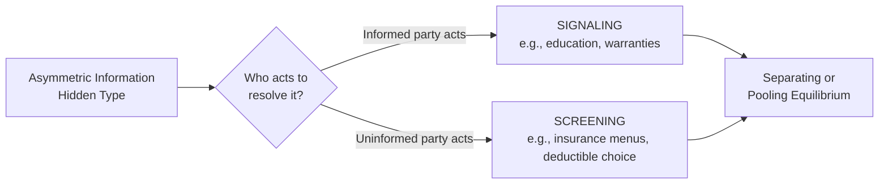

## Signaling and Screening

### Definition and Core Concept

Signaling and screening are two complementary market-based mechanisms that arise as responses to **asymmetric information**, specifically to the **adverse selection** problem: when one party to a potential transaction has private information about a relevant characteristic (quality, risk, ability) that the other party cannot directly observe.

- **Signaling**: the **informed** party takes a costly, observable action to credibly convey their private information to the uninformed party.
- **Screening**: the **uninformed** party designs a set of choices (a menu of contracts) such that different types of the informed party voluntarily sort themselves into different options, indirectly revealing their private information through their choice.

The key distinction is *who moves first and who bears the design burden*: in signaling, the informed party acts; in screening, the uninformed party structures the game so that self-selection reveals the truth.

### Signaling: Theoretical Foundation

**Michael Spence's job-market signaling model** (1973) is the canonical formalization, part of the body of work for which Spence shared the 2001 Nobel Memorial Prize in Economic Sciences with George Akerlof and Joseph Stiglitz.

**Setup**: Workers have an innate ability level (high or low) that is unobservable to employers. Workers can acquire education, which employers *can* observe. Crucially, the model does not require education to raise productivity at all — its power as a signal comes purely from a **cost differential**.

**Single-crossing property**: The cost of acquiring a given level of education is lower for high-ability workers than for low-ability workers (e.g., high-ability workers find coursework easier, complete it faster, or experience it as less unpleasant). Formally, if $C_H(e)$ and $C_L(e)$ are the cost functions for high- and low-ability workers as a function of education level $e$:

$$C_H'(e) < C_L'(e) \quad \text{for all } e$$

This single-crossing condition is what allows education levels to differ systematically by type in equilibrium — without it, no signal could separate types.

**Separating equilibrium**: There exists an education level $e^*$ such that:

- High-ability workers choose $e^*$, incurring cost $C_H(e^*)$, and are paid a wage reflecting high productivity.
- Low-ability workers find it not worth mimicking — the cost $C_L(e^*)$ of acquiring that same education level would exceed the wage gain from being perceived as high-ability — so they choose a lower education level (potentially zero) and are paid a wage reflecting low productivity.

For a separating equilibrium to be sustainable, incentive compatibility constraints must hold for both types — informally, each type must prefer its own (education level, wage) pair to mimicking the other type's pair.

**Key Points**

- In the pure signaling model, education is **valuable purely as a sorting device**, even if it adds zero productive value — a stark theoretical result that is often used to illustrate how markets can achieve efficient sorting through costly, observable actions alone.
- This is a distinct claim from **human-capital theory**, which holds that education directly raises worker productivity. [Inference: real-world education plausibly serves both functions simultaneously — building genuine skills (human capital) and credibly sorting workers by underlying ability (signaling) — and disentangling the relative empirical contribution of each channel is an active area of labor economics research without a fully settled consensus.]
- **Wasteful signaling**: Because signaling is valuable purely through its cost differential across types (in the pure model), a separating equilibrium can involve **socially wasteful expenditure** — resources spent solely on sorting rather than on production — even though it solves the private information problem. This is a genuine efficiency cost to weigh against the benefit of resolved uncertainty.

### Other Classic Signaling Examples

- **Product warranties**: A seller of a high-quality good can profitably offer a generous warranty because they expect few claims; a seller of a low-quality good would find the same warranty too costly (frequent claims), so offering a warranty credibly signals quality — this is the standard explanation in industrial organization for why warranty generosity correlates with product reliability.
- **Dividend policy in corporate finance**: A firm's decision to pay (or increase) dividends can signal management's confidence in future stable earnings, since cutting a dividend later is costly to a firm's reputation, deterring firms with uncertain prospects from signaling falsely.
- **Advertising as a signal**: Large, seemingly "wasteful" advertising expenditure (a firm burning money on ads with no direct informational content, such as a Super Bowl commercial) can signal that a firm is confident enough in repeat purchases and product quality to recoup the investment — a firm with a poor-quality product expects fewer repeat customers and thus finds the same advertising spend unprofitable. [Inference: this "money-burning" signaling explanation of advertising coexists with other economic explanations (direct informational content, persuasion, network effects) in the literature, and which mechanism dominates likely varies by market and advertising format.]
- **Collateral in lending**: A borrower's willingness to post collateral can signal confidence in their own ability to repay, since a borrower who expects to default finds posting valuable collateral more costly in expectation.
- **Countersignaling**: In some contexts, very high-status or high-ability individuals may signal *less* than moderately-ranked individuals (e.g., an established expert omitting credentials that a less-established person would prominently display), because their reputation is already independently verified through other channels. [Speculation: countersignaling is a documented theoretical possibility in signaling-game literature, but its empirical prevalence relative to standard monotonic signaling is less firmly established across contexts.]

### Screening: Theoretical Foundation

**Rothschild-Stiglitz model** (1976) is the canonical screening formalization, developed in the context of insurance markets, and forms part of the broader body of work recognized in Stiglitz's share of the 2001 Nobel Prize.

**Setup**: An insurer cannot directly observe whether a given customer is high-risk or low-risk, but knows the proportions of each type in the population. Rather than offering a single policy, the insurer offers a **menu of contracts** (different combinations of premium and coverage/deductible levels).

**Self-selection mechanism**: The menu is designed so that:

- Low-risk individuals prefer a contract with a **lower premium but higher deductible / partial coverage** (since they expect to file claims rarely, they're willing to accept more out-of-pocket exposure in exchange for lower premiums).
- High-risk individuals prefer a contract with a **higher premium but lower deductible / fuller coverage** (since they expect to file claims often, full coverage is worth the higher premium to them).

Because each type's preferences over the (premium, deductible) contract space differ systematically with their risk type, offering the right menu causes types to **reveal themselves through their choice** — a **separating equilibrium** — without the insurer ever directly observing risk type.

**Key Points**

- A separating screening equilibrium, if it exists, typically involves the low-risk group receiving **less than full insurance** — a genuine efficiency cost relative to a full-information world, since low-risk individuals would prefer full coverage at an actuarially fair price if their type were verifiable, but full coverage at a pooled price would be exploited by high-risk types.
- A key theoretical result of the Rothschild-Stiglitz model is that a **pooling equilibrium** (a single contract serving both types) is generally **not stable**: a competitor can always profitably "cream-skim" by offering a slightly different contract that attracts only low-risk types away from the pool, undermining the pooling arrangement. [Inference: whether a separating equilibrium exists at all depends on the proportion of high- versus low-risk types in the population; under certain population compositions, the model predicts that no equilibrium exists in pure strategies, a result that has generated substantial follow-up literature refining the model's assumptions.]

### Other Classic Screening Examples

- **Price discrimination via product versioning**: A software company offering a "basic" and "premium" tier at different prices screens customers by willingness to pay/use-intensity, since customers self-select into the tier that matches their actual needs.
- **Deductible/co-pay menus in health and auto insurance**: As above, letting customers choose their own risk-sharing arrangement screens by underlying risk type.
- **Minimum wage laws as unintentional screening removal**: [Speculation, tangential] some labor economists note that wage floors can remove certain low-productivity self-selection channels, though this is a secondary and debated application outside the core screening framework.
- **Educational tracking and standardized testing**: Employers or universities using test scores or degree requirements as a **screening device** to sort applicants by ability, complementing (or substituting for) the signaling actions applicants take on their own.
- **Government-provided workfare requirements**: Requiring welfare recipients to work a minimum number of hours to receive benefits can screen for genuine need, since individuals with better outside employment options find the work requirement more costly relative to the benefit received. [Inference: this is a theoretical application from public economics; its practical use and normative desirability are contested policy questions beyond the pure economic mechanism.]

### Signaling vs. Screening: Structural Comparison

|  | Signaling | Screening |
| --- | --- | --- |
| **Who acts** | Informed party (sender) | Uninformed party (mechanism designer) |
| **Mechanism** | Costly action taken voluntarily to reveal type | Menu of options designed to induce self-selection |
| **Timing relative to contract** | Before any contract offer | Embedded within contract offer itself |
| **Classic example** | Education (Spence) | Insurance contract menus (Rothschild-Stiglitz) |
| **Source of separation** | Single-crossing cost differential across types | Differing preferences over contract terms across types |
| **Typical efficiency cost** | Resources spent purely on signaling, no productive value in pure model | Under-provision of coverage/quantity to the "good" type to deter mimicry |

### Diagram: Separating Equilibrium in the Spence Signaling Model

<svg viewBox="0 0 640 400" xmlns="http://www.w3.org/2000/svg" font-family="sans-serif">
<text x="320" y="24" text-anchor="middle" font-size="16" font-weight="bold">Single-Crossing Property in Education Signaling (svg_diagram)</text>
<line x1="80" y1="340" x2="580" y2="340" stroke="black" stroke-width="2"/>
<line x1="80" y1="340" x2="80" y2="50" stroke="black" stroke-width="2"/>
<text x="580" y="360" font-size="13">Education level (e)</text>
<text x="20" y="55" font-size="13">Cost / Wage</text>
<path d="M80,330 Q 300,260 480,90" stroke="#dc2626" stroke-width="2.5" fill="none"/>
<text x="490" y="90" font-size="12" fill="#dc2626">C_L(e) — Low-ability cost</text>
<path d="M80,330 Q 250,300 480,220" stroke="#2563eb" stroke-width="2.5" fill="none"/>
<text x="490" y="220" font-size="12" fill="#2563eb">C_H(e) — High-ability cost</text>
<line x1="80" y1="150" x2="480" y2="150" stroke="#16a34a" stroke-width="2" stroke-dasharray="6,3"/>
<text x="490" y="150" font-size="12" fill="#16a34a">W_H (high-ability wage)</text>
<line x1="80" y1="280" x2="480" y2="280" stroke="#7c3aed" stroke-width="2" stroke-dasharray="6,3"/>
<text x="490" y="280" font-size="12" fill="#7c3aed">W_L (low-ability wage)</text>
<circle cx="330" cy="150" r="4" fill="black"/>
<line x1="330" y1="150" x2="330" y2="340" stroke="black" stroke-dasharray="3,3"/>
<text x="300" y="355" font-size="12" font-weight="bold">e* (separating level)</text>

<text x="90" y="70" font-size="11" fill="#444">High-ability cost curve lies below low-ability's:</text>

<text x="90" y="84" font-size="11" fill="#444">C_H'(e) < C_L'(e) for all e (single-crossing)</text>

</svg>

At the separating education level $e^*$, high-ability workers find it worthwhile to acquire education (their cost $C_H(e^*)$ is less than the wage gain $W_H - W_L$), while low-ability workers do not (their cost $C_L(e^*)$ exceeds that same wage gain) — sustaining a stable separating equilibrium purely through the cost asymmetry.

### Pooling vs. Separating Equilibria

Both signaling and screening games can, depending on parameters, settle into one of two broad equilibrium types:

- **Separating equilibrium**: different types choose different actions/contracts, fully revealing type (as described above). Achieves informational efficiency but often at some resource or coverage cost.
- **Pooling equilibrium**: all types choose the same action/contract, so no information is revealed; the uninformed party must price based on the average characteristics of the pool (structurally identical to the adverse-selection outcome in Akerlof's lemons model).

Which equilibrium (if any) emerges depends on the relative population shares of each type, the cost/preference differentials between types, and the specific game structure (simultaneous vs. sequential moves, competitive vs. monopolistic market structure for the uninformed party).

### Worked Numerical Example (Education Signaling)

Suppose there are two types of workers, High (40% of the population) and Low (60%), with true productivities $\pi_H = \$80{,}000$ and $\pi_L = \$40{,}000$ per year. Education cost per year of schooling is $c_H = \$4{,}000$/year for High types and $c_L = \$10{,}000$/year for Low types (satisfying single-crossing: $c_H < c_L$).

A prospective separating equilibrium: High types acquire $e^* = 4$ years of education; Low types acquire $0$ years.

- **Check High type's incentive to acquire $e^*$**: Cost = $4 \times \$4{,}000 = \$16{,}000$. Wage gain from being identified as High rather than Low = $\$80{,}000 - \$40{,}000 = \$40{,}000$. Since $\$40{,}000 > \$16{,}000$, High types are willing to acquire the education.
- **Check Low type's incentive to mimic**: Cost of acquiring the same $e^* = 4$ years = $4 \times \$10{,}000 = \$40{,}000$. Wage gain from mimicking = same $\$40{,}000$. Since the cost exactly equals the gain, this is the boundary case; any $e^*$ slightly above 4 years would strictly deter Low types from mimicking while remaining attractive to High types, illustrating how the equilibrium education level is pinned down by the *low type's* incentive-compatibility constraint at the margin.

This example illustrates the general principle: the minimum separating signal level is set exactly where the type with the higher signaling cost (here, Low) is just indifferent between mimicking and not — a standard result in signaling-game equilibrium construction.

### Policy and Market Design Relevance

Signaling and screening are not merely theoretical curiosities — they inform substantial areas of policy and institutional design:

- **Credential and licensing requirements** (professional licenses, accreditation) function as government-mandated or government-recognized signaling/screening devices, intended to resolve information gaps in labor and service markets.
- **Insurance regulation** often engages directly with screening menus, since regulators must decide whether to permit risk-based pricing menus (which improve efficiency via screening but can leave high-risk individuals only partially covered) versus mandating community-rated, pooled contracts (which sacrifice screening efficiency for broader risk-sharing).
- **Financial disclosure requirements** can be understood as government intervention to supplement or substitute for costly private signaling, reducing the resources firms must spend purely on credibility-building actions.

[Inference: the normative desirability of relying on market-based signaling/screening versus government-mandated disclosure involves an efficiency-equity trade-off that is a matter of policy judgment rather than a conclusion derivable from the positive economic models alone.]

**Related Topics**

- Asymmetric Information: Adverse Selection and Moral Hazard
- Principal-Agent Theory and Contract Design
- Price Discrimination and Market Segmentation
- Insurance Economics and Risk Pooling
- Human Capital Theory vs. Signaling Theory in Labor Economics
- Game Theory: Sequential Games and Bayesian Nash Equilibrium
- Credit Rationing and the Stiglitz-Weiss Model
- Behavioral Economics and Limits to Rational Signaling Interpretation