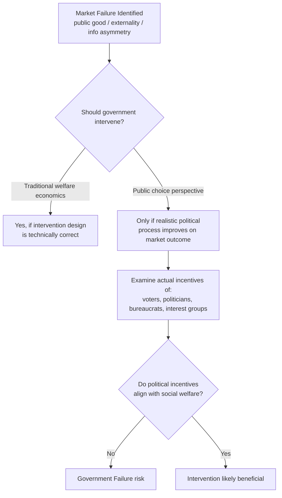

## Public Choice Theory and Government Failure

### Definition and Core Concept

**Public choice theory** applies the standard economic assumption of rational, self-interested behavior to actors within political and governmental processes — voters, politicians, bureaucrats, and interest groups — rather than assuming government acts as a benevolent, purely welfare-maximizing agent correcting market failures. It is often summarized as **"politics without romance,"** a phrase associated with James M. Buchanan, who along with Gordon Tullock founded the field and was awarded the 1986 Nobel Memorial Prize in Economic Sciences for this work (formalized notably in their 1962 book *The Calculus of Consent*).

**Government failure** is the public-choice counterpart to market failure: it describes situations in which government intervention, rather than correcting an inefficiency, produces outcomes that are themselves inefficient, fail to reflect genuine social preferences, or make matters worse than the market failure they were meant to address. The existence of a market failure is therefore, in the public-choice view, a **necessary but not sufficient** condition for beneficial government intervention — it must also be shown that the realistic political process will actually improve on the market outcome, given the incentives facing real political actors.

### Core Building Blocks of Public Choice Theory

**Methodological individualism**: Political outcomes are the aggregate result of individual actors — voters, politicians, bureaucrats — each pursuing their own utility, not the actions of a unified, benevolent "the government" pursuing social welfare directly.

**Rational ignorance**: Because any single voter's probability of being pivotal in a large election is vanishingly small, the expected benefit of becoming well-informed about policy details is low relative to the time cost of acquiring that information. Rational voters therefore often remain poorly informed about specific policies, a result formalized by Anthony Downs in *An Economic Theory of Democracy* (1957).

**Concentrated benefits, diffuse costs**: A recurring public-choice pattern in which a policy imposes small per-person costs on a large, diffuse group (e.g., all taxpayers or consumers) while conferring large per-person benefits on a small, concentrated group (e.g., a specific industry). The concentrated group has strong incentives to organize, lobby, and monitor the issue, while the diffuse group faces free-rider problems in organizing opposition (directly connecting to the free-rider material earlier in this chapter) — resulting in a systematic political bias toward policies favoring concentrated interests even when aggregate social cost exceeds aggregate social benefit.

**Rent-seeking**: Expenditure of real resources to obtain or protect a transfer of wealth (a "rent") through the political process, rather than through productive activity. Because rent-seeking resources (lobbying expenditure, legal fees, campaign contributions) are consumed in the pursuit of a transfer rather than in creating new value, rent-seeking represents a **pure efficiency loss** on top of whatever distortion the underlying policy itself creates — a concept formalized by Gordon Tullock (1967) and named by Anne Krueger (1974).

### The Median Voter Theorem

A foundational formal result in public choice: under certain conditions (single-peaked preferences, a single policy dimension, majority-rule voting between two candidates), the policy outcome that wins a majority-rule election converges to the preference of the **median voter** — the voter whose preferred policy position has an equal number of voters preferring more and preferring less.

**Implications**:

- Political competition, rather than yielding an ideologically diverse set of platforms, tends to push competing candidates or parties toward similar centrist positions matching the median voter's preference (**Hotelling-Downs convergence**).
- Policy outcomes reflect the preference of the median voter specifically, **not** the average voter, and certainly not a calculation of aggregate social welfare or economic efficiency — a distinct concept from the efficiency-maximizing outcome that would emerge from, e.g., the Samuelson condition for public goods.

[Inference: the median voter theorem's predictions depend heavily on its restrictive assumptions (single-peaked preferences, unidimensional policy space, two-candidate competition); real-world political competition often violates one or more of these conditions — e.g., multi-dimensional policy spaces, multi-party systems, or non-single-peaked preferences — limiting the theorem's direct empirical applicability, though it remains a foundational benchmark model.]

### Sources of Government Failure

**1. Voter ignorance and rational irrationality**

Beyond rational ignorance (not bothering to learn), some public-choice economists (notably Bryan Caplan, *The Myth of the Rational Voter*, 2007) argue voters may be **rationally irrational** — holding systematically biased beliefs about policy because the private cost of holding a mistaken belief in the voting booth is negligible (a single vote almost never changes an election outcome), removing the usual incentive to correct one's own biases. [Speculation: the "rational irrationality" thesis is an influential but contested extension of public choice theory; it is not uniformly accepted within the field to the same degree as the median voter theorem or concentrated-benefits/diffuse-costs framework.]

**2. Special interest capture / regulatory capture**

Regulatory agencies created to oversee an industry in the public interest can become **captured** by the very industry they regulate, since the regulated industry has concentrated interests and resources to influence agency decisions, while diffuse consumers/taxpayers have weaker organized counter-pressure. This is sometimes formalized in the **economic theory of regulation** (associated with George Stigler, 1971), which posits that regulation is often actively sought by industry to restrict competition (e.g., licensing requirements that limit entry) rather than imposed on industry against its interests.

**3. Bureaucratic incentives**

Public choice models of bureaucracy (notably William Niskanen's **budget-maximizing bureaucrat model**, 1971) suggest that government agency officials may have personal incentives to maximize their agency's budget and staff size (correlating with agency officials' status, pay, and influence) beyond what is socially optimal, since bureaucrats — unlike private firm managers residually claiming profit — capture value through organizational size and discretionary budget rather than direct profit. [Inference: the strict budget-maximization assumption has been refined in later public-choice literature (e.g., models emphasizing bureaucrats' preference for discretionary budget or slack rather than total budget), and empirical support for the pure Niskanen model is mixed.]

**4. Political business cycles**

Elected officials may have incentives to time expansionary fiscal or monetary policy to coincide with election periods (stimulating short-term economic conditions to improve re-election prospects) even when such timing is suboptimal for long-run macroeconomic stability — a pattern examined in the **political business cycle** literature (William Nordhaus, 1975).

**5. Logrolling and vote-trading**

Legislators may trade votes on unrelated bills ("I'll support your project if you support mine") to secure passage of individually narrow, locally beneficial but nationally costly projects (**pork-barrel spending**), a mechanism that can result in the passage of a bundle of projects whose aggregate cost exceeds aggregate benefit, even though each individual legislator is acting rationally given the incentive structure they face.

**6. Information and calculation problems**

Even a well-intentioned government faces the practical difficulty of determining the correct level and design of intervention: measuring externalities, eliciting true public-good valuations (recall the preference-revelation problem discussed in the public goods section), and predicting the behavioral responses of firms and households to regulation — all under conditions of imperfect information that mirror, rather than escape, the informational challenges facing private markets.

**Key Points**

- Government failure does not require any bad intent from political actors — the central public-choice insight is that following ordinary self-interested incentives within realistic institutional structures can produce socially undesirable outcomes even when every individual actor is behaving rationally given the incentives they face.
- The parallel structure to market failure is deliberate: just as markets can fail due to misaligned private and social incentives, political processes can fail due to misaligned individual and collective incentives among voters, politicians, and bureaucrats.
- Public choice theory does not claim government intervention is always counterproductive — rather, it argues that the case for intervention must be made by comparing realistic (imperfect) government processes against realistic (imperfect) markets, rather than comparing an idealized government against an imperfect market (a comparison sometimes critiqued in the literature as the **"nirvana fallacy,"** a term associated with Harold Demsetz, 1969).

### Diagram: Concentrated Benefits vs. Diffuse Costs

<svg viewBox="0 0 640 340" xmlns="http://www.w3.org/2000/svg" font-family="sans-serif">
<text x="320" y="24" text-anchor="middle" font-size="16" font-weight="bold">Concentrated Benefits, Diffuse Costs (svg_diagram)</text>
<rect x="80" y="80" width="180" height="180" fill="#bfdbfe" stroke="#2563eb" stroke-width="2"/>
<text x="170" y="70" text-anchor="middle" font-size="13" font-weight="bold">Small Industry Group</text>
<text x="170" y="175" text-anchor="middle" font-size="12">Large gain per member</text>
<text x="170" y="192" text-anchor="middle" font-size="12">Strong incentive to</text>
<text x="170" y="209" text-anchor="middle" font-size="12">organize & lobby</text>
<rect x="360" y="80" width="220" height="180" fill="#fecaca" stroke="#dc2626" stroke-width="2"/>
<text x="470" y="70" text-anchor="middle" font-size="13" font-weight="bold">Millions of Consumers/Taxpayers</text>
<text x="470" y="150" text-anchor="middle" font-size="12">Small cost per member</text>
<text x="470" y="167" text-anchor="middle" font-size="12">Free-rider problem</text>
<text x="470" y="184" text-anchor="middle" font-size="12">prevents organized</text>
<text x="470" y="201" text-anchor="middle" font-size="12">opposition</text>
<path d="M260,170 L360,170" stroke="black" stroke-width="2" marker-end="url(#arrow)"/>
<text x="270" y="160" font-size="11">Policy passes despite</text>
<text x="270" y="285" font-size="11" font-weight="bold">net social cost &gt; net social benefit</text>
<defs>
<marker id="arrow" markerWidth="10" markerHeight="10" refX="8" refY="3" orient="auto">
<path d="M0,0 L8,3 L0,6 Z" fill="black"/>
</marker>
</defs>
</svg>

### Worked Numerical Example (Concentrated Benefits, Diffuse Costs)

A proposed import tariff on a manufactured good would raise the price of that good for consumers nationwide.

- Total social cost of the tariff (deadweight loss plus higher consumer prices) is estimated at $300 million, spread across 100 million consumers — roughly $3 per person per year.
- Total benefit to the protected domestic industry (higher revenue and profit) is estimated at $150 million, concentrated among 200 firms — roughly $750,000 per firm per year.

Even though the policy is **socially inefficient** ($300 million cost exceeds $150 million benefit — a net social loss of $150 million), the political incentives are asymmetric:

- Each firm has a strong incentive to spend resources lobbying for the tariff, since $750,000 per firm easily justifies significant lobbying expenditure (rent-seeking).
- Each consumer, facing only a $3/year cost, has essentially no incentive to spend any time or resources opposing the tariff — the free-rider problem in political organizing mirrors the free-rider problem in public-goods provision covered earlier in this chapter.

This asymmetry in organizational incentive, not any difference in aggregate welfare effects, is what the public-choice framework identifies as the mechanism by which inefficient protectionist policy can nonetheless be enacted and sustained.

### Comparing Market Failure and Government Failure

|  | Market Failure | Government Failure |
| --- | --- | --- |
| **Underlying cause** | Misalignment between private and social costs/benefits (externalities, public goods, asymmetric information, market power) | Misalignment between individual political actors' incentives and aggregate social welfare |
| **Key mechanism** | Price signals fail to reflect true social cost/benefit | Voting, lobbying, and bureaucratic incentives fail to reflect true social preferences |
| **Typical remedy proposed** | Government intervention (regulation, taxation, provision) | Constitutional/institutional constraints, transparency rules, decentralization, market-based alternatives |
| **Underlying assumption critiqued** | Perfectly competitive, fully informed private markets | Benevolent, fully-informed, unified government actor |

### Proposed Institutional Responses to Government Failure

- **Constitutional constraints**: Rules-based limits on government action (balanced-budget requirements, supermajority requirements for tax increases, term limits) intended to constrain the scope for rent-seeking and short-term political incentive distortions — central to Buchanan and Tullock's broader **constitutional political economy** research program.
- **Transparency and sunlight provisions**: Public disclosure requirements for lobbying activity and campaign contributions, intended to raise the cost of concentrated-interest capture by making it more visible to the diffuse public.
- **Decentralization / fiscal federalism**: Assigning provision of certain public goods to smaller, more local jurisdictions, on the theory that "voting with one's feet" (Charles Tiebout, 1956) and closer proximity between voters and local officials can partially mitigate some information and agency problems present at larger scales. [Inference: fiscal federalism has its own trade-offs, including potential races to the bottom in regulation or taxation and underprovision of goods with spillover benefits across jurisdictions — decentralization is not a universal solution and is evaluated case by case in the public finance literature.]
- **Sunset clauses and independent oversight bodies**: Automatically expiring legislation/regulation requiring active reauthorization, and independent auditing bodies, intended to counteract the tendency of programs and agency budgets to persist or grow independent of their original social justification (echoing Niskanen's bureaucratic-growth concern).

**Related Topics**

- Public Goods and the Free-Rider Problem
- Median Voter Theorem and Political Competition
- Rent-Seeking and the Economics of Regulation (Stigler's Capture Theory)
- Externalities and the Case for Government Correction
- Asymmetric Information: Adverse Selection and Moral Hazard
- Constitutional Political Economy (Buchanan-Tullock)
- Fiscal Federalism and the Tiebout Model
- Behavioral Public Choice and Rational Irrationality