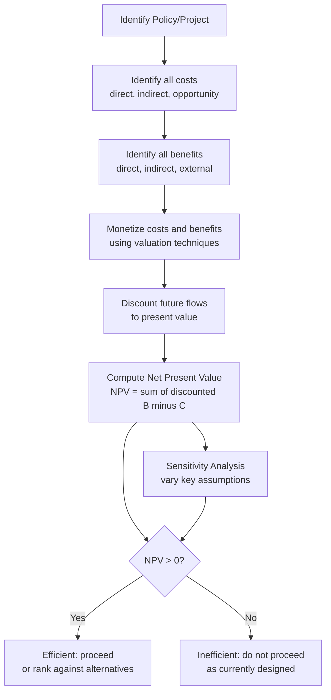

## Cost-Benefit Analysis for Policy Evaluation

### Definition and Core Concept

**Cost-benefit analysis (CBA)** is a systematic framework for evaluating a proposed policy, project, or regulation by identifying, quantifying (typically in monetary terms), and comparing all relevant social costs and social benefits over the life of the intervention, in order to determine whether it increases aggregate social welfare and, when comparing alternatives, which option generates the greatest net social value.

The core decision rule follows directly from the **potential Pareto improvement** (Kaldor-Hicks) criterion introduced in welfare economics: a policy is judged efficient if its total benefits exceed its total costs, regardless of *how* those costs and benefits are distributed across individuals — i.e., if winners could *in principle* compensate losers and still come out ahead, even if no actual compensation occurs.

$$NPV = \sum_{t=0}^{T} \frac{B_t - C_t}{(1+r)^t}$$

where $B_t$ and $C_t$ are the monetized benefits and costs in period $t$, $r$ is the discount rate, and $T$ is the project's time horizon. A project is judged efficient if $NPV > 0$; among mutually exclusive alternatives, the one with the highest $NPV$ is preferred.

### Relationship to Market Failure and Government Intervention

CBA is the standard applied tool economists and policymakers use to evaluate the specific interventions discussed elsewhere in this chapter: whether to build a particular public good, at what level to set a Pigouvian tax or subsidy, whether a proposed regulation addressing an externality or asymmetric-information problem is worth its compliance cost, or how to compare rival uses of scarce public funds. It operationalizes the abstract efficiency conditions (e.g., the Samuelson condition for public goods, $MB = MSC$ for externality correction) into a concrete, comparable numerical framework applicable to real-world project proposals.

### Steps in Conducting a Cost-Benefit Analysis

**1. Define the scope and perspective**: Specify whose costs and benefits count (a national CBA typically excludes purely domestic transfers between citizens, which net to zero in aggregate, while a narrower regional analysis might treat inflows/outflows across the region's border as real gains/losses).

**2. Identify all relevant costs and benefits**:

- **Direct costs**: construction, materials, labor, ongoing operation and maintenance.
- **Indirect/external costs and benefits**: spillover effects on third parties not captured in market transactions (connecting directly to the externality material earlier in this chapter) — e.g., a new highway's construction-phase air pollution, or a public park's positive effect on nearby property values.
- **Opportunity costs**: the value of the next-best alternative use of the resources committed to the project, including public funds that could have been spent on a different program or returned to taxpayers.
- **Intangible costs and benefits**: effects not naturally traded in markets, such as recreational value, aesthetic value, health and safety improvements, or environmental quality, requiring non-market valuation techniques (below).

**3. Monetize costs and benefits**: Convert all identified effects into a common monetary unit so they can be summed and compared, using the valuation techniques described in the next section.

**4. Discount future flows to present value**: Because costs and benefits occur at different points in time, and resources available today have a positive opportunity cost of waiting (they could be invested and earn a return), future flows must be converted to a common present-value basis using a chosen **discount rate** $r$.

**5. Compute and compare net present value(s)**: Sum discounted net benefits across the project's lifetime; compare $NPV$ across mutually exclusive alternatives, or check whether a single project's $NPV$ exceeds zero.

**6. Conduct sensitivity analysis**: Since many inputs (future demand, valuation of intangibles, discount rate) are uncertain, vary key assumptions across plausible ranges to see how robust the conclusion is — a standard and expected component of rigorous applied CBA rather than an optional add-on.

### Non-Market Valuation Techniques

Many policy-relevant benefits and costs (clean air, recreational access, statistical lives saved, biodiversity) are not directly priced in any market, requiring specialized valuation methods:

**Revealed preference methods** (inferring value from actual observed behavior):

- **Hedonic pricing**: Decomposing the price of a marketed good (typically housing) into implicit prices for its component characteristics, including environmental or locational attributes (e.g., estimating the value of clean air by comparing house prices across neighborhoods with different pollution levels, holding other housing characteristics constant).
- **Travel cost method**: Inferring the recreational value of a site (a park, lake, or wilderness area) from the time and money people actually spend traveling to visit it, on the logic that observed travel expenditure reveals a lower bound on the site's value to visitors.
- **Averting/defensive expenditure method**: Inferring the value people place on avoiding a harm from how much they actually spend on averting behaviors (e.g., spending on air filters or bottled water as an indicator of the value placed on avoiding pollution or contamination exposure).

**Stated preference methods** (directly asking individuals to value a good via surveys):

- **Contingent valuation**: Surveying individuals about their willingness to pay for a specified change in provision of a non-market good (e.g., "how much would you be willing to pay to preserve this wetland"), or their willingness to accept compensation for its loss.
- **Choice experiments (conjoint analysis)**: Presenting survey respondents with a series of hypothetical scenarios featuring different combinations of attributes and prices, and inferring implicit valuations for each attribute from respondents' choices across scenarios.

**Key Points**

- Stated preference methods can value goods that generate **existence value** or **non-use value** (e.g., a person may value the mere existence of a species or wilderness area they never plan to visit), which revealed preference methods cannot capture because there is no associated observable behavior.
- Stated preference methods face well-documented methodological challenges, including hypothetical bias (respondents may answer differently than they would with real money at stake), embedding effects (stated willingness to pay may not scale properly with the scope of the good being valued), and strategic response bias. [Inference: the magnitude and practical significance of these biases is an active area of debate within environmental and resource economics, and various survey-design refinements have been developed to mitigate them with varying degrees of documented success.]

### The Value of a Statistical Life (VSL)

Many public policies (health and safety regulation, transportation infrastructure, environmental standards) involve trade-offs against small changes in mortality risk, requiring some monetary valuation of reduced mortality risk to be included in a CBA. Economists do not attempt to value an *identified* individual life, but rather the **value of a statistical life (VSL)**: the aggregate willingness to pay by a large group of people for a small reduction in their own individual risk of death, divided by the resulting expected number of statistical lives saved.

**Illustrative construction**: If 100,000 people are each willing to pay $50 for a safety improvement that reduces each individual's annual risk of death by 1 in 100,000 (i.e., an expected 1 statistical life saved across the group), the implied VSL is:

$$VSL = \frac{100{,}000 \times \$50}{1} = \$5{,}000{,}000$$

VSL estimates are typically derived from revealed-preference studies of wage premiums workers require to accept riskier jobs (**compensating wage differentials**), or from stated-preference surveys about willingness to pay for risk reductions. [Unverified: specific VSL figures used by regulatory agencies vary by country, agency, and year, and are periodically updated; citing a specific current dollar figure would require verification against the relevant agency's most recent guidance rather than a general syllabus reference.]

### Discounting and the Choice of Discount Rate

The choice of discount rate $r$ is one of the most consequential and contested inputs in CBA, particularly for projects with very long time horizons (infrastructure, environmental policy, climate change mitigation), because even small differences in $r$ compound dramatically over long periods.

**Key rationales offered for a positive discount rate**:

- **Pure time preference**: individuals generally prefer consumption sooner rather than later, all else equal.
- **Opportunity cost of capital**: resources committed to a public project could otherwise earn a return if invested in the private sector, so the discount rate should reflect that foregone return.
- **Expected future income growth**: if future generations are expected to be wealthier, an additional dollar of benefit to them may be worth less in welfare terms than a dollar to the current generation (diminishing marginal utility of consumption).

**Formal decomposition (Ramsey rule)**: A commonly cited formula for the social discount rate combines pure time preference and the diminishing-marginal-utility effect of expected consumption growth:

$$r = \rho + \eta g$$

where $\rho$ is the pure rate of time preference, $\eta$ is the elasticity of marginal utility of consumption (how quickly marginal utility falls as consumption rises), and $g$ is the expected growth rate of per-capita consumption.

**Key Points**

- Very long-horizon policy analysis (notably climate change economics) is highly sensitive to the choice of $\rho$ and $\eta$: a low pure time preference $\rho$ (reflecting an ethical stance that future generations' welfare should not be discounted merely because they live later) implies a much lower discount rate and correspondingly much larger present-value weight on damages/benefits occurring decades or centuries in the future, while a higher $\rho$ sharply reduces the present-value weight of distant future outcomes.
- This sensitivity is at the center of a well-known economic debate (e.g., between the low-discount-rate approach associated with the 2006 Stern Review on climate change and the higher-discount-rate critique associated with economists such as William Nordhaus), illustrating that discount rate choice is partly a **normative/ethical judgment** about intergenerational weighting, not a purely technical or empirically settled parameter. [Inference: this remains a genuinely contested question among economists rather than one with a single "correct" resolution derivable from theory alone.]

### Distributional Considerations and Limitations of CBA

**The Kaldor-Hicks criterion does not require actual compensation**: A policy can satisfy the CBA efficiency test (aggregate benefits exceed aggregate costs) while making specific individuals or groups substantially worse off, if winners are not actually required to compensate losers. This is a genuine and widely acknowledged limitation: CBA speaks to aggregate efficiency, not to the fairness of the resulting distribution of gains and losses.

**Distributional weighting**: Some applied CBA frameworks attempt to address this by applying different weights to costs/benefits accruing to different income groups (e.g., weighting a dollar of benefit to a low-income household more heavily than a dollar to a high-income household, reflecting diminishing marginal utility of income across the population). [Inference: distributional weighting is used in some government CBA guidance documents but is not universally applied, and the choice of specific weights again involves a normative judgment rather than a purely technical calculation.]

**Other commonly cited limitations**:

- Difficulty and controversy in monetizing certain values (statistical lives, ecosystem services, cultural/historical value) can bias results toward whatever is more easily quantified, understating harder-to-measure effects.
- Optimism bias and strategic misrepresentation in project proponents' benefit/cost estimates (well documented in the transportation infrastructure literature, sometimes called "strategic misrepresentation" or the planning fallacy in project appraisal). [Unverified: the degree of bias varies substantially across sectors, countries, and time periods studied.]
- Uncertainty in long-run forecasts of demand, technology, and prices compounds with discounting choices to create wide plausible ranges around headline $NPV$ estimates, which sensitivity analysis is meant to expose rather than eliminate.

### Diagram: Present Value Sensitivity to Discount Rate

<svg xmlns="http://www.w3.org/2000/svg" viewBox="0 0 640 360" font-family="sans-serif">
<text x="320" y="24" text-anchor="middle" font-size="16" font-weight="bold">Present Value of \$1,000 Received in Year t, by Discount Rate (svg_diagram)</text>
<line x1="80" y1="310" x2="580" y2="310" stroke="black" stroke-width="2" />
<line x1="80" y1="310" x2="80" y2="50" stroke="black" stroke-width="2" />
<text x="560" y="330" font-size="13">Year (t)</text>
<text x="20" y="55" font-size="13">PV (\$)</text>
<path d="M80,70 L580,270" stroke="#16a34a" stroke-width="2.5" fill="none" />
<text x="420" y="230" font-size="12" fill="#16a34a">r = 1% (low discount rate)</text>
<path d="M80,70 Q 250,180 580,300" stroke="#2563eb" stroke-width="2.5" fill="none" />
<text x="380" y="288" font-size="12" fill="#2563eb">r = 3.5%</text>
<path d="M80,70 Q 150,250 580,308" stroke="#dc2626" stroke-width="2.5" fill="none" />
<text x="200" y="300" font-size="12" fill="#dc2626">r = 7% (high discount rate)</text>

<text x="90" y="66" font-size="11">$1,000</text>

</svg>

At higher discount rates, benefits or costs occurring decades in the future shrink toward negligible present value, which is precisely why the choice of $r$ becomes decisive for very long-horizon policies such as climate mitigation, nuclear waste management, or infrastructure with multi-generational service lives.

### Worked Numerical Example

A municipal government is evaluating whether to build a flood-control levee costing $10 million upfront (Year 0), which is expected to prevent $1.5 million in expected annual flood damage each year for 10 years, with a discount rate of 5%.

**Present value of benefits**:

$$PV_{benefits} = \sum_{t=1}^{10} \frac{\$1{,}500{,}000}{(1.05)^t}$$

Using the present-value annuity factor for 10 years at 5% ($\approx 7.7217$):

$$PV_{benefits} \approx \$1{,}500{,}000 \times 7.7217 \approx \$11{,}582{,}550$$

**Net present value**:

$$NPV = \$11{,}582{,}550 - \$10{,}000{,}000 = \$1{,}582{,}550$$

Since $NPV > 0$, the levee project passes the cost-benefit test at a 5% discount rate. **Sensitivity check**: if the discount rate were instead 8% (annuity factor $\approx 6.7101$), $PV_{benefits} \approx \$10{,}065{,}150$, giving $NPV \approx \$65{,}150$ — still marginally positive, but the conclusion becomes much more sensitive to any downward revision in the annual damage-prevention estimate, illustrating why sensitivity analysis is a required part of a complete CBA rather than an optional addendum, particularly for projects whose $NPV$ is not robustly positive across the plausible range of assumptions.

### Institutional Use of Cost-Benefit Analysis

Government agencies in many countries formally require CBA (or a related **Regulatory Impact Analysis**) for major proposed regulations above certain cost thresholds, intended to ensure that regulatory intervention is subject to the same efficiency scrutiny that public choice theory (covered earlier in this chapter) argues is otherwise too easily bypassed by concentrated-interest political pressure. [Unverified: the specific institutional requirements, thresholds, and review bodies vary by country and change over time; a general syllabus reference should not assert a specific current requirement without verification against the relevant jurisdiction's current guidance.]

**Related Topics**

- Externalities and Pigouvian Correction (CBA as the tool for setting corrective tax/subsidy levels)
- Public Goods and the Free-Rider Problem (CBA as the tool for public-good provision decisions)
- Public Choice Theory and Government Failure (CBA as a check on politically-driven, inefficient intervention)
- Welfare Economics: Pareto Efficiency and the Kaldor-Hicks Criterion
- Environmental Economics and Non-Market Valuation
- The Social Discount Rate Debate (Stern Review vs. Nordhaus)
- Regulatory Impact Analysis and Government Rulemaking Processes
- Behavioral Economics: Optimism Bias in Project Appraisal