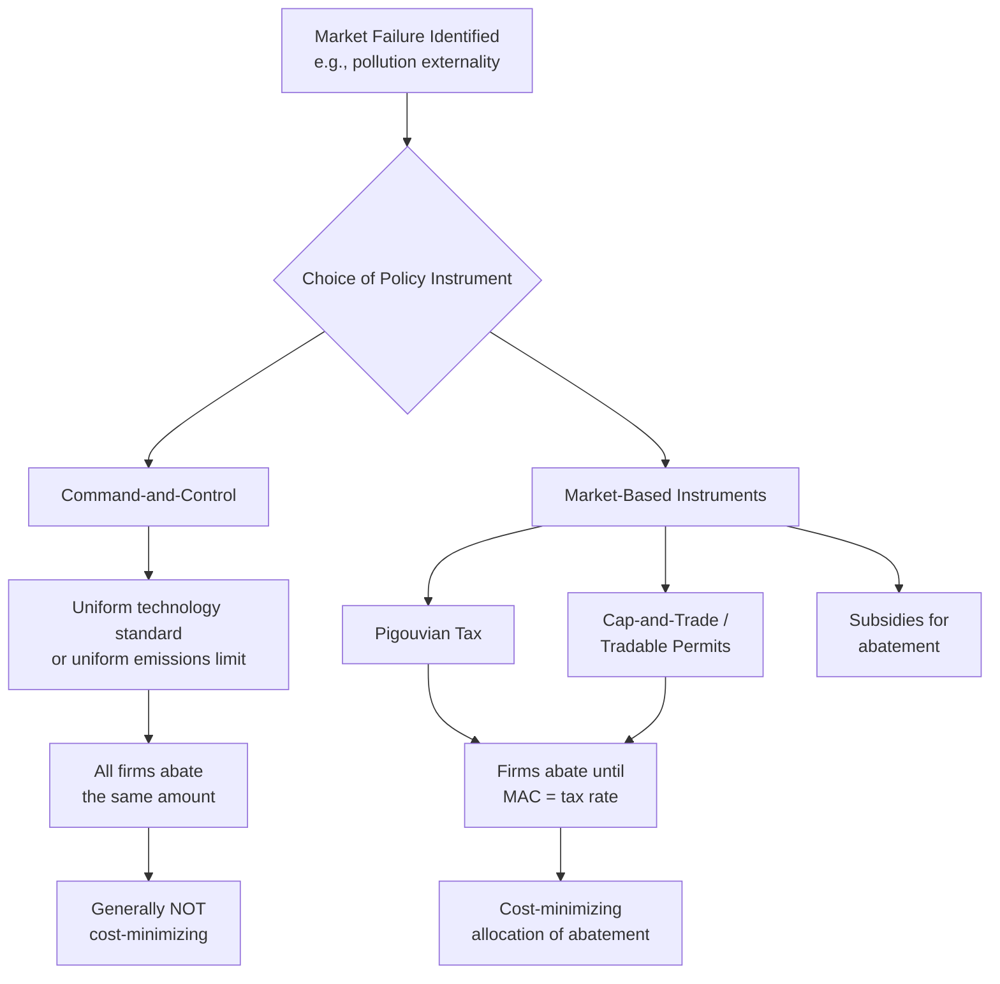

## Regulation versus Market-Based Instruments

### Definition and Core Concept

When government intervenes to correct a market failure — most commonly a negative externality such as pollution — it must choose an **instrument design**: the specific mechanism by which the intervention will change firm and household behavior. Economists broadly categorize these instruments into two families:

- **Command-and-control regulation**: Government directly mandates specific behaviors, technologies, or quantity limits (e.g., "install this scrubber technology," "emit no more than X tons of pollutant").
- **Market-based instruments (MBIs)**: Government alters the relative prices or creates tradable rights so that private actors, pursuing their own self-interest within the new price structure, are led toward the socially efficient outcome (e.g., Pigouvian taxes, cap-and-trade systems, tradable permits).

This distinction is central to environmental and regulatory economics because, while both approaches can in principle achieve the same environmental or social target, they generally differ substantially in their **cost-effectiveness** — the total resource cost of achieving a given level of pollution abatement or behavioral change.

### Command-and-Control Regulation

**Mechanism**: Government specifies either a required technology (**technology-based/design standards**, e.g., mandating scrubbers on smokestacks) or a required outcome applied uniformly to all regulated parties (**performance-based/uniform emissions standards**, e.g., every firm must reduce emissions by 20%, or every firm faces the same numeric emissions cap).

**Advantages**:

- Administrative and political simplicity: a uniform, easily verifiable rule ("install X" or "emit no more than Y") is often easier to monitor, explain to the public, and enforce than a price-based or trading system.
- Certainty of the environmental outcome under direct quantity caps, since the regulator directly sets the physical limit rather than relying on firms' price responses (though the same is true of a cap-and-trade quantity cap, discussed below).
- May be preferred when firm-specific abatement costs are difficult to observe or when swift, guaranteed compliance is a priority (e.g., in acute public health or safety emergencies).

**Key limitation — cost-inefficiency under heterogeneous abatement costs**: The central critique from environmental economics is that when different firms face different **marginal abatement costs (MAC)** — the cost of reducing one additional unit of pollution — a uniform standard applied to all firms is generally **not cost-minimizing** for the group as a whole.

**Formal logic**: Suppose two firms, A and B, must jointly reduce total emissions by 100 units. Firm A has a low marginal abatement cost (cheap to reduce pollution); Firm B has a high marginal abatement cost (expensive to reduce pollution). A uniform standard requiring each firm to cut 50 units ignores this cost asymmetry. The **cost-minimizing** allocation of the 100-unit total reduction instead requires:

$$MAC_A = MAC_B$$

i.e., abatement should be reallocated toward the low-cost firm (A does more of the cutting, B does less) until their marginal costs are equalized — at which point no further reallocation between firms can reduce total abatement cost while holding the total reduction fixed. A uniform quantity standard achieves the same total reduction (100 units) but at a **higher total cost**, because it does not exploit the cost differential between firms.

### Market-Based Instruments

**Pigouvian tax**: A per-unit tax on the polluting activity set (ideally) equal to the marginal external cost (marginal damage) at the socially efficient quantity, so that the polluter's private marginal cost, inclusive of the tax, equals the true marginal social cost:

$$MPC + t = MSC \quad \text{at} \quad Q^*$$

Under a Pigouvian tax, **each firm independently chooses its own abatement level** by comparing its own marginal abatement cost to the tax rate: a firm abates as long as its $MAC$ is less than the tax (cheaper to reduce pollution than to pay the tax) and pays the tax on any remaining emissions where $MAC$ exceeds the tax rate. Because every firm faces the *same* tax rate at the margin, every firm's cost-minimizing choice results in:

$$MAC_A = MAC_B = \ldots = t$$

which is exactly the cost-minimizing allocation condition described above — achieved automatically through decentralized, self-interested firm behavior, without the regulator needing to know each firm's specific abatement-cost function in advance.

**Cap-and-trade (tradable permit systems)**: The regulator sets a total quantity cap on aggregate emissions (achieving the same quantity certainty as a command-and-control cap) and issues (via free allocation or auction) tradable permits summing to that cap. Firms with low abatement costs find it profitable to abate more than their initial allocation and sell surplus permits; firms with high abatement costs find it cheaper to buy additional permits than to abate. Trading continues until, in equilibrium, all firms face the same permit price $p^*$, and:

$$MAC_A = MAC_B = \ldots = p^*$$

— again reaching the cost-minimizing allocation, but through market trading rather than a directly set tax rate. This result (that voluntary trading among heterogeneous cost firms achieves an efficient allocation regardless of the initial permit distribution, given low transaction costs) is closely related to the **Coase Theorem** discussed elsewhere in environmental economics.

**Key Points**

- **Taxes fix the price, let quantity adjust**: a Pigouvian tax sets $t$ directly; the resulting total emissions level depends on firms' aggregate response and is not perfectly predictable in advance.
- **Cap-and-trade fixes the quantity, lets price adjust**: the total emissions cap is set directly and known with certainty; the resulting permit price emerges from trading and is not perfectly predictable in advance.
- This **price vs. quantity** distinction (formalized by Martin Weitzman, 1974) matters most when there is genuine uncertainty about the marginal abatement cost curve: if marginal damages rise steeply with quantity (small increases in pollution cause large harm), quantity instruments (caps) are generally preferable because they guarantee the environmental outcome; if marginal abatement costs rise steeply and unpredictably (small errors in a quantity target could impose very large unexpected costs on firms), price instruments (taxes) are generally preferable because they cap the cost firms face per unit. [Inference: this is a widely taught theoretical result; the empirically correct choice for any specific pollutant depends on estimating the relative steepness of the marginal cost and marginal damage curves, which is itself uncertain in practice.]

### Diagram: Uniform Standard vs. Equalized Marginal Abatement Cost

<svg xmlns="http://www.w3.org/2000/svg" viewBox="0 0 640 380" font-family="sans-serif">
<text x="320" y="24" text-anchor="middle" font-size="15" font-weight="bold">Cost-Effectiveness: Uniform Standard vs. Market-Based Allocation (svg_diagram)</text>

<text x="160" y="55" text-anchor="middle" font-size="13" font-weight="bold">Firm A (low-cost abater)</text>

<line x1="60" y1="320" x2="300" y2="320" stroke="black" stroke-width="2" />

<line x1="60" y1="320" x2="60" y2="70" stroke="black" stroke-width="2" />

<path d="M60,90 L300,290" stroke="`#2563eb`" stroke-width="2.5" />

<text x="150" y="330" font-size="11">Abatement (units)</text>

<text x="20" y="80" font-size="11">MAC_A</text>

<line x1="60" y1="205" x2="180" y2="205" stroke="#dc2626" stroke-width="2" stroke-dasharray="5,3" />
<line x1="180" y1="205" x2="180" y2="320" stroke="#dc2626" stroke-width="2" stroke-dasharray="5,3" />
<text x="185" y="200" font-size="10" fill="#dc2626">tax/permit price = MAC_A here</text>
<text x="160" y="345" font-size="10">50 (uniform)</text>
<text x="230" y="345" font-size="10" font-weight="bold">70 (market-based)</text>

<text x="470" y="55" text-anchor="middle" font-size="13" font-weight="bold">Firm B (high-cost abater)</text>

<line x1="360" y1="320" x2="600" y2="320" stroke="black" stroke-width="2" />

<line x1="360" y1="320" x2="360" y2="70" stroke="black" stroke-width="2" />

<path d="M360,290 L600,90" stroke="`#16a34a`" stroke-width="2.5" />

<text x="470" y="330" font-size="11">Abatement (units)</text>

<line x1="360" y1="205" x2="480" y2="205" stroke="#dc2626" stroke-width="2" stroke-dasharray="5,3" />
<line x1="480" y1="205" x2="480" y2="320" stroke="#dc2626" stroke-width="2" stroke-dasharray="5,3" />
<text x="440" y="345" font-size="10">50 (uniform)</text>
<text x="370" y="345" font-size="10" font-weight="bold">30 (market-based)</text>
</svg>

Under a uniform standard, both firms abate 50 units each (100 total) regardless of cost differences. Under a tax or tradable permit system, the low-cost Firm A abates more (70 units) and the high-cost Firm B abates less (30 units), still achieving the same 100-unit total reduction, but at lower aggregate cost because abatement has shifted toward the firm that can do it more cheaply.

### Worked Numerical Example

Two firms must jointly reduce emissions by 100 tons. Marginal abatement cost functions (cost of the next ton abated, in dollars):

- Firm A: $MAC_A = 2a$ (where $a$ = tons abated by Firm A)
- Firm B: $MAC_B = 6b$ (where $b$ = tons abated by Firm B)

**Uniform standard** (each firm abates 50 tons):

- Firm A's total abatement cost: $\int_0^{50} 2a \, da = a^2 \Big|_0^{50} = 2{,}500$
- Firm B's total abatement cost: $\int_0^{50} 6b \, db = 3b^2 \Big|_0^{50} = 7{,}500$
- **Total cost under uniform standard** = $10,000

**Cost-minimizing allocation** (set $MAC_A = MAC_B$, subject to $a + b = 100$):

$$2a = 6b \quad \text{and} \quad a + b = 100 \implies a = 75, \, b = 25$$

- Firm A's total abatement cost: $\int_0^{75} 2a \, da = 75^2 = 5{,}625$
- Firm B's total abatement cost: $\int_0^{25} 6b \, db = 3 \times 25^2 = 1{,}875$
- **Total cost under market-based allocation** = $7,500

The market-based (tax or tradable-permit) allocation achieves the identical 100-ton total reduction at **$7,500 total cost versus $10,000 under the uniform standard** — a savings of $2,500, or 25%, purely from reallocating *who* does the abating, without changing the environmental outcome at all. This numerical illustration captures the general theoretical result that cost savings from market-based instruments tend to be larger the more heterogeneous firms' abatement costs are.

### Additional Considerations in Instrument Choice

**Dynamic incentives for innovation**: Market-based instruments generally provide continuous incentives to reduce pollution further, since every additional unit of abatement below the cap/tax threshold either avoids the tax or generates a saleable permit. Command-and-control standards, once met, typically provide little further incentive to innovate beyond the mandated level (a firm meeting a fixed technology standard has no direct financial reward for exceeding it). [Inference: the empirical magnitude of this dynamic-innovation advantage varies by industry, regulatory stringency, and how standards are updated over time; it is a widely cited theoretical advantage of market-based instruments rather than a universally quantified effect.]

**Revenue and double-dividend potential**: Pigouvian taxes (and auctioned, as opposed to freely allocated, tradable permits) generate government revenue that can be used to reduce other distortionary taxes (e.g., labor income taxes) or fund public priorities — sometimes referred to as the potential for a **"double dividend"** (environmental improvement plus efficiency gains from reduced distortionary taxation elsewhere). [Speculation: the existence and magnitude of a genuine "strong" double dividend (net efficiency gain beyond the environmental benefit itself) is contested in the public finance literature; a weaker version of the claim (revenue recycling is less costly than lump-sum rebating or no revenue use at all) is more broadly supported.]

**Distributional and political-economy considerations**: Freely allocated (grandfathered) permits can generate windfall profits for incumbent firms while achieving the same environmental outcome as auctioned permits, which is sometimes used as a politically expedient way to build support for a cap-and-trade program among regulated industries — directly connecting to the concentrated-benefits/rent-seeking dynamics discussed in the public choice section of this chapter.

**Monitoring and enforcement costs**: Market-based instruments generally require accurate, verifiable measurement of each firm's actual emissions (to correctly assess tax liability or permit compliance), which can be more administratively demanding than verifying compliance with a simple technology mandate (e.g., confirming a scrubber is installed is often easier than continuously metering exact emissions). [Inference: this trade-off's practical significance depends heavily on the specific pollutant and available monitoring technology; continuous emissions monitoring has become substantially more feasible and lower-cost for many pollutants over recent decades, though this general syllabus treatment should not be read as asserting the current state of any specific monitoring technology.]

**Non-uniformly-mixed pollutants and "hotspots"**: Market-based instruments that allow trading across locations can, in principle, permit localized pollution concentrations ("hotspots") near high-MAC firms that choose to buy permits rather than abate, even if the aggregate cap is met — a concern raised particularly in environmental justice contexts where the health impact of a pollutant depends on its exact geographic location of emission, not just its aggregate national or regional quantity. This is one of the more frequently cited real-world caveats to the textbook cost-effectiveness advantage of trading-based instruments.

### Comparative Summary Table

| Criterion | Command-and-Control | Pigouvian Tax | Cap-and-Trade |
| --- | --- | --- | --- |
| **Cost-effectiveness under heterogeneous firms** | Generally low | High | High |
| **Certainty of environmental outcome** | High (direct limit) | Lower (quantity response uncertain) | High (direct cap) |
| **Certainty of compliance cost to firms** | Variable by firm | High (fixed tax rate known in advance) | Lower (permit price emerges from market) |
| **Administrative simplicity** | Relatively simple to explain/enforce | Requires emissions measurement | Requires emissions measurement + market infrastructure |
| **Dynamic innovation incentive** | Weak beyond mandated level | Strong (continuous) | Strong (continuous) |
| **Revenue generation potential** | None | Yes (tax revenue) | Yes if auctioned; no if freely allocated |
| **Risk of localized "hotspots"** | Lower (often location-specific standards) | Possible | Possible, especially with unrestricted trading |

**Related Topics**

- Externalities and Pigouvian Taxation
- The Coase Theorem and Property-Rights-Based Solutions
- Common Resources and the Tragedy of the Commons (Individual Transferable Quotas)
- Cost-Benefit Analysis for Policy Evaluation
- Public Choice Theory and Government Failure (rent-seeking in permit allocation)
- Weitzman's Prices vs. Quantities Framework
- Environmental Economics and Emissions Trading Systems
- Double Dividend Hypothesis in Environmental Taxation