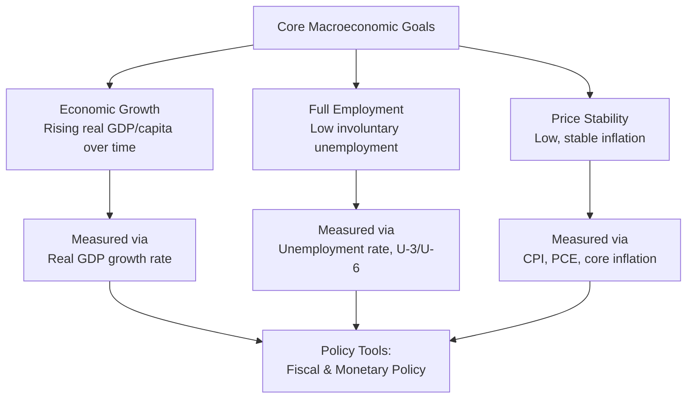

## Macroeconomic Goals: Growth, Employment, Price Stability

### Definition and Core Concept

Macroeconomics evaluates the performance of an economy as a whole, and policymakers typically organize this evaluation around a small set of core objectives that most economies pursue simultaneously, often summarized as the **macroeconomic trilemma of objectives** (distinct from the international-finance "impossible trinity," though both share the name): sustained **economic growth**, **full employment**, and **price stability**. A fourth goal, external balance (a sustainable balance of payments/exchange rate), is often added in open-economy contexts, and some frameworks include equitable income distribution as a fifth, but growth, employment, and price stability form the conventional core triad taught in introductory macroeconomics.

### Goal 1: Economic Growth

**Definition**: Economic growth refers to a sustained increase in an economy's productive capacity and output over time, typically measured as the percentage change in **real Gross Domestic Product (GDP)**, or more precisely for living-standard comparisons, **real GDP per capita**, since population growth alone can raise total GDP without raising average material well-being.

**Short-run vs. long-run growth**: A crucial distinction in macroeconomics:

- **Short-run fluctuations** (the business cycle) reflect output moving above or below the economy's existing productive capacity (potential GDP) due to changes in aggregate demand or temporary supply shocks.
- **Long-run growth** reflects expansion of the economy's productive capacity itself (potential GDP), driven by growth in the labor force, capital stock, and total factor productivity (technological progress, human capital accumulation, institutional quality).

**Measurement**: The growth rate between two periods is calculated as:

$$g = \frac{Y_t - Y_{t-1}}{Y_{t-1}} \times 100\%$$

where $Y_t$ is real GDP in the current period and $Y_{t-1}$ is real GDP in the prior period. Real (inflation-adjusted) rather than nominal GDP is used specifically to isolate genuine changes in output from changes purely due to rising prices.

**Why growth matters**: Sustained growth in real GDP per capita is the primary long-run determinant of rising average material living standards, and even small differences in annual growth rates compound into very large differences in living standards over decades — a point often illustrated via the **rule of 70**, which approximates the number of years for a quantity to double given a constant growth rate $g\%$:

$$\text{Years to double} \approx \frac{70}{g}$$

For example, an economy growing at 2% per year doubles its output roughly every 35 years, while an economy growing at 7% per year doubles roughly every 10 years — a difference with profound cumulative consequences for living standards across generations.

**Key Points**

- Real GDP growth is a *flow* measure of increased production over a period, distinct from a *stock* measure like total accumulated wealth or capital.
- GDP and GDP growth have well-known limitations as welfare measures: they do not directly capture leisure, non-market production (household work), income distribution, environmental quality/depletion, or subjective well-being — a widely acknowledged caveat in the literature on GDP as a welfare proxy, without a single agreed-upon alternative aggregate replacing it in standard macroeconomic reporting.

### Goal 2: Full Employment

**Definition**: Full employment does not mean zero unemployment; rather, it refers to a level of employment at which the economy is operating at its potential output with only the "unavoidable" categories of unemployment present, and cyclical unemployment (unemployment caused by insufficient aggregate demand during a downturn) is at or near zero.

**Categories of unemployment**:

- **Frictional unemployment**: short-term unemployment arising from normal labor market turnover — workers transitioning between jobs, new entrants searching for their first position. Considered a natural, even efficient, feature of a well-functioning labor market that allows better worker-job matches over time.
- **Structural unemployment**: longer-term unemployment arising from a mismatch between workers' skills/location and available job requirements/location, often due to technological change, shifts in industry composition, or geographic immobility.
- **Cyclical unemployment**: unemployment that rises and falls with the business cycle, driven by fluctuations in aggregate demand — the component that discretionary macroeconomic (fiscal and monetary) policy is primarily aimed at managing.

**Natural rate of unemployment ($u^*$)**: The sum of frictional and structural unemployment — the unemployment rate that prevails when cyclical unemployment is zero and the economy is producing at potential GDP. The natural rate is not a fixed constant; it can shift over time due to demographic change, labor market institutions (unemployment insurance generosity, minimum wage policy), and technological change. [Inference: economists' estimates of the current natural rate for any specific economy are model-dependent and subject to meaningful revision over time; citing a specific numerical estimate would require verification against current research rather than a general syllabus reference.]

**Measurement**: The standard **unemployment rate** is calculated as:

$$u = \frac{\text{Number Unemployed}}{\text{Labor Force}} \times 100\%$$

where the labor force consists of individuals who are either employed or actively seeking work; individuals who have stopped searching (**discouraged workers**) are excluded from the labor force and thus from the standard unemployment rate calculation — a well-known measurement limitation that broader supplementary measures (such as the U-6 measure used in the United States, which includes discouraged and marginally attached workers plus part-time workers wanting full-time work) are designed to partially address.

**Okun's Law**: An empirically observed relationship (not a strict structural law) between the unemployment rate and output relative to potential, generally stated as:

$$(u - u^*) \approx -c \, (\text{output gap as \% of potential GDP})$$

with the coefficient $c$ historically estimated around 2 in some studies of the U.S. economy, though the precise coefficient varies across countries, time periods, and estimation methods. [Unverified: specific numerical values of the Okun's Law coefficient should be treated as illustrative estimates from particular studies rather than a universal constant; the relationship itself is a well-documented empirical regularity rather than a theoretically derived exact law.]

**Key Points**

- Full employment is consistent with a positive, non-zero unemployment rate — the policy goal is minimizing cyclical unemployment, not driving measured unemployment to zero, which would be neither achievable nor necessarily desirable given normal labor market churn.
- The costs of unemployment extend beyond lost output (measured by the output gap) to include the personal and social costs to unemployed individuals — loss of income, skill atrophy, documented associations with adverse health and social outcomes in the broader social-science literature — which is part of why full employment is treated as an independent policy goal rather than something purely subsumed under the output/growth objective.

### Goal 3: Price Stability

**Definition**: Price stability refers to keeping the general price level's rate of change (inflation) low, stable, and predictable, rather than volatile or persistently high (or negative, in the case of deflation).

**Measurement**: Inflation is most commonly measured via:

- **Consumer Price Index (CPI)**: tracks the cost of a fixed basket of goods and services typically purchased by a representative household over time.
- **Personal Consumption Expenditures (PCE) price index**: a broader measure of consumer prices that allows the basket composition to adjust as consumers substitute between goods, used as the primary inflation gauge by some central banks.
- **Core inflation**: CPI or PCE excluding volatile food and energy prices, intended to better reflect underlying inflation trends by filtering out short-term price shocks unrelated to persistent inflationary pressure.

$$\pi_t = \frac{P_t - P_{t-1}}{P_{t-1}} \times 100\%$$

where $P_t$ is the price index level in the current period.

**Why price stability matters**: Both high/volatile inflation and deflation impose real economic costs:

- **Menu costs**: the real resource cost businesses incur in frequently updating posted prices, catalogs, and price-related systems.
- **Shoe-leather costs**: the time and inconvenience costs of holding less cash and making more frequent trips to convert other assets into cash to avoid inflation eroding cash holdings' real value.
- **Redistribution between borrowers and lenders**: unexpected inflation transfers real wealth from lenders to borrowers (fixed nominal debt becomes easier to repay in real terms); unexpected deflation does the reverse — this redistribution is generally viewed as an arbitrary, welfare-reducing side effect of unstable prices rather than a deliberate or efficient outcome.
- **Increased uncertainty and reduced planning horizons**: unpredictable inflation makes long-term contracts, investment planning, and wage-setting more difficult, potentially reducing investment and productive economic activity.
- **Deflationary spirals**: falling prices can, in severe cases, cause consumers to delay purchases anticipating further price declines, and can increase the real burden of existing debt (**debt deflation**, a mechanism associated with Irving Fisher's analysis of severe economic downturns), both of which can deepen and prolong an economic contraction.

**Key Points**

- Most central banks target a **low, positive** rate of inflation (rather than zero), commonly around 2% in many advanced-economy inflation-targeting frameworks, partly to maintain a buffer against the risk of deflation and to provide some flexibility for relative price adjustments across sectors without requiring nominal price cuts in any specific sector. [Unverified: specific numerical inflation targets and the precise economic reasoning applied by any given central bank should be verified against that institution's current stated policy framework rather than treated as a universal fixed rule; central banks have modified target frameworks over time.]
- **Hyperinflation** (extremely rapid, self-reinforcing price increases) represents the most extreme failure of price stability and is typically associated with a collapse in the credibility of the monetary authority and a breakdown of money's usefulness as a store of value, though this is a distinct and more severe phenomenon from the moderate inflation fluctuations that ordinary business-cycle stabilization policy addresses.

### The Phillips Curve: Interaction Between Employment and Price Stability Goals

A central and historically influential relationship in macroeconomics is the **Phillips curve**, which describes an observed inverse short-run relationship between the unemployment rate and the inflation rate, suggesting a potential short-run trade-off between the employment and price-stability goals:

$$\pi_t = \pi_t^e - \beta(u_t - u^*) + \varepsilon_t$$

where $\pi_t^e$ is expected inflation, $u_t - u^*$ is the unemployment gap (cyclical unemployment), $\beta > 0$ captures the sensitivity of inflation to labor market slack, and $\varepsilon_t$ represents supply shocks.

**Key Points**

- The **original Phillips curve** (based on Bill Phillips's 1958 empirical study of UK wage inflation and unemployment) suggested a stable long-run trade-off, but this was challenged theoretically by Milton Friedman and Edmund Phelps in the late 1960s, who argued that any such trade-off could only be temporary: once inflation expectations adjust to actual inflation, the trade-off dissipates, and the economy returns to the natural rate of unemployment regardless of the (correctly anticipated) inflation rate — the **expectations-augmented Phillips curve** and the associated **natural rate hypothesis**.
- The 1970s experience of **stagflation** (simultaneously high inflation and high unemployment in many advanced economies, notably following the 1973 and 1979 oil price shocks) is widely cited as an empirical episode that undermined confidence in a simple, stable short-run Phillips curve trade-off and reinforced the importance of supply shocks and inflation expectations in the relationship. [Inference: the precise causal weighting of oil shocks versus monetary policy versus expectations dynamics in explaining 1970s stagflation remains a subject of ongoing macroeconomic historical analysis rather than a single settled account.]
- In the long run, most mainstream macroeconomic models hold that there is **no long-run trade-off** between inflation and unemployment — the long-run Phillips curve is vertical at the natural rate of unemployment $u^*$, meaning sustained lower unemployment cannot be permanently "bought" with higher inflation once expectations adjust.

### Diagram: Short-Run vs. Long-Run Phillips Curve

<svg xmlns="http://www.w3.org/2000/svg" viewBox="0 0 640 380" font-family="sans-serif">
<text x="320" y="24" text-anchor="middle" font-size="15" font-weight="bold">Short-Run vs. Long-Run Phillips Curve (svg_diagram)</text>
<line x1="80" y1="330" x2="580" y2="330" stroke="black" stroke-width="2" />
<line x1="80" y1="330" x2="80" y2="50" stroke="black" stroke-width="2" />
<text x="560" y="350" font-size="13">Unemployment Rate (u)</text>
<text x="20" y="55" font-size="13">Inflation (π)</text>
<line x1="330" y1="50" x2="330" y2="330" stroke="#7c3aed" stroke-width="2.5" stroke-dasharray="6,3" />
<text x="335" y="65" font-size="12" fill="#7c3aed">LRPC (vertical at u*)</text>
<text x="315" y="345" font-size="12" font-weight="bold">u*</text>
<path d="M150,120 Q 330,200 480,290" stroke="#2563eb" stroke-width="2.5" fill="none" />
<text x="470" y="290" font-size="12" fill="#2563eb">SRPC (π_e low)</text>
<path d="M150,80 Q 330,160 480,250" stroke="#dc2626" stroke-width="2.5" fill="none" />
<text x="470" y="248" font-size="12" fill="#dc2626">SRPC (π_e high)</text>
<circle cx="330" cy="200" r="4" fill="black" />
<circle cx="330" cy="160" r="4" fill="black" />
</svg>

An increase in expected inflation shifts the entire short-run Phillips curve upward; the economy can only move along a given short-run curve temporarily, and settles back onto the vertical long-run curve at $u^*$ once expectations catch up to actual inflation — the standard diagrammatic summary of the natural rate hypothesis.

### Trade-offs and Policy Tension Among the Three Goals

**Key Points**

- In the **short run**, policymakers often face a genuine trade-off between accelerating growth/reducing unemployment and maintaining price stability, since stimulative demand-side policy (expansionary fiscal or monetary policy) that pushes output above potential and unemployment below the natural rate tends to generate rising inflationary pressure — the short-run Phillips curve relationship above.
- In the **long run**, most macroeconomic frameworks hold that growth is primarily determined by supply-side factors (labor force growth, capital accumulation, productivity), largely independent of the inflation rate, meaning there is no genuine long-run trade-off to exploit between price stability and growth/employment — attempting to sustain output above potential via persistently expansionary policy tends to generate accelerating inflation without a lasting gain in output or employment.
- This distinction between exploitable short-run trade-offs and the absence of long-run trade-offs is a foundational organizing principle for why macroeconomic policy is generally divided into **short-run stabilization policy** (managing the business cycle, addressing cyclical unemployment and demand-driven inflation) and **long-run growth policy** (addressing supply-side determinants of potential GDP, structural unemployment, and productivity growth) — a distinction that structures the remainder of most introductory macroeconomics courses.

**Related Topics**

- Real GDP, Nominal GDP, and the GDP Deflator
- Aggregate Demand and Aggregate Supply Model
- Types and Measurement of Unemployment
- Inflation, Deflation, and the Quantity Theory of Money
- Fiscal Policy and Monetary Policy Tools
- The Business Cycle and Its Phases
- Okun's Law and the Output Gap
- The Natural Rate Hypothesis and Expectations-Augmented Phillips Curve