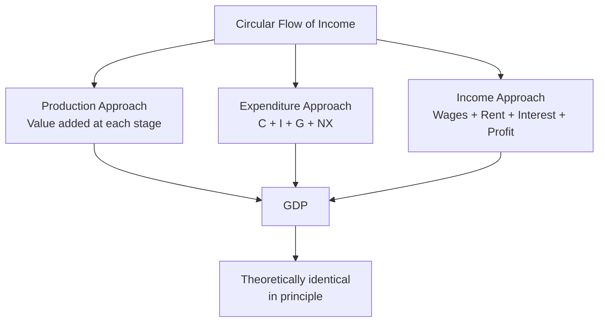

## Gross Domestic Product: Measurement Approaches

### Definition and Core Concept

**Gross Domestic Product (GDP)** is the total market value of all final goods and services produced within a country's borders during a specific time period (typically a quarter or a year). GDP is the central summary statistic of macroeconomic activity and can be measured using three theoretically equivalent approaches that, in principle, must yield identical totals because they represent three different vantage points on the same underlying flow of economic activity: what is **produced**, what is **spent**, and what is **earned**.

### Core Definitional Criteria

Before examining the three approaches, four defining criteria in the standard GDP definition matter for correctly classifying what counts:

- **Market value**: goods and services are valued at their market prices, which allows heterogeneous outputs (cars, haircuts, software) to be aggregated into a single monetary measure.
- **Final goods and services only**: GDP counts only goods and services purchased by their end user, explicitly excluding **intermediate goods** (inputs used up in producing other goods, such as steel purchased by a car manufacturer) to avoid **double-counting** — since the value of intermediate goods is already embedded in the final good's price.
- **Produced within a country's borders** (the "domestic" in GDP): GDP counts production occurring within the country's geographic territory regardless of who owns the producing factors of production — this is distinguished from **Gross National Product (GNP)**, which counts production by a country's nationally-owned factors of production regardless of geographic location (GDP + net income earned by domestic factors abroad − income earned domestically by foreign-owned factors = GNP).
- **Produced during the current period**: GDP measures a *flow* of new production during the specified time period; it excludes transactions involving goods produced in prior periods (e.g., the sale of a used car does not count in this period's GDP, though the dealer's *service/markup* on that resale transaction does count as newly produced value).

### Approach 1: The Production (Value-Added) Approach

**Mechanism**: Sums the **value added** at each stage of production across the entire economy, where value added at each stage equals the value of output at that stage minus the cost of intermediate inputs purchased from other producers.

$$\text{Value Added} = \text{Value of Output} - \text{Cost of Intermediate Inputs}$$

**Illustrative supply chain example**: A loaf of bread passes through several production stages:

| Stage | Sale Price | Cost of Inputs Purchased | Value Added |
| --- | --- | --- | --- |
| Wheat farmer | $0.50 | $0.00 | $0.50 |
| Flour mill | $1.00 | $0.50 | $0.50 |
| Bakery | $2.50 | $1.00 | $1.50 |
| Retail grocer | $4.00 | $2.50 | $1.50 |
| **Total value added** |  |  | **$4.00** |

Summing value added at each stage ($0.50 + $0.50 + $1.50 + $1.50 = $4.00) yields exactly the final retail price of the bread, illustrating why summing value added avoids double-counting the intermediate transactions while still arriving at the correct total contribution to GDP — summing the raw sale prices at each stage instead ($0.50 + $1.00 + $2.50 + $4.00 = $8.00) would overstate the good's true contribution to output by double-, triple-, and quadruple-counting the wheat and flour values embedded in each subsequent stage.

**Key Points**

- The value-added approach is closely tied to industry-level and sectoral GDP breakdowns (e.g., agriculture's share of GDP, manufacturing's share of GDP), since value added can be tracked and summed by industry as well as in aggregate.
- This approach is the natural complement to **input-output analysis**, used in national accounting to trace how value flows between industries in an economy.

### Approach 2: The Expenditure Approach

**Mechanism**: Sums total spending on final goods and services produced within the country during the period, broken into four standard components:

$$GDP = C + I + G + NX$$

**Consumption ($C$)**: Household spending on final goods and services, further divided into durable goods (cars, appliances — goods expected to last more than a year), nondurable goods (food, clothing), and services (healthcare, education, entertainment). Typically the largest component of GDP in most consumer-driven economies.

**Investment ($I$)**: In the national-accounts sense, this refers to spending on **new capital goods** that expand the economy's productive capacity — a distinct and narrower meaning than the everyday/financial use of "investment" to describe purchasing stocks or bonds (which are transfers of existing financial claims, not newly produced output, and therefore excluded from $I$ in GDP accounting). National-accounts investment includes:

- Business fixed investment (new machinery, equipment, structures)
- Residential investment (new home construction)
- Changes in business inventories (unsold goods produced during the period are counted as investment, since they represent current-period production even though not yet sold to a final user)

**Government purchases ($G$)**: Government spending on final goods and services (public school teacher salaries, military equipment, road construction). Crucially, $G$ excludes **transfer payments** (Social Security, unemployment benefits, welfare payments), since transfer payments are not payments for currently produced goods or services — they are simply a redistribution of purchasing power, not newly produced output.

**Net exports ($NX$)**: Exports minus imports ($NX = X - M$). Exports are added because they represent domestically produced output regardless of who ultimately consumes it; imports are subtracted because spending on imports is already embedded in the $C$, $I$, and $G$ totals above (a household's purchase of an imported car is counted in $C$) but does not represent domestic production, so it must be netted out to avoid overstating domestic output.

**Key Points**

- The expenditure approach is the most commonly cited and taught approach in introductory macroeconomics because its components map directly onto the standard **aggregate demand** framework used in short-run macroeconomic analysis (business cycles, fiscal policy multiplier effects).
- A negative $NX$ (a trade deficit, imports exceeding exports) reduces measured GDP relative to what domestic expenditure alone would suggest, correctly reflecting that some portion of domestic spending is being satisfied by foreign rather than domestic production.

### Approach 3: The Income Approach

**Mechanism**: Sums all forms of income earned by the factors of production (labor, capital, land, entrepreneurship) involved in producing the period's output, on the accounting logic that every dollar spent on final output (the expenditure side) ultimately becomes income to some factor of production (wages, rent, interest, or profit) somewhere in the production chain.

$$GDP = \text{Compensation of Employees} + \text{Rents} + \text{Interest} + \text{Proprietors' Income} + \text{Corporate Profits} + \text{Statistical Adjustments}$$

**Components**:

- **Compensation of employees**: wages, salaries, and employer-paid benefits — typically the largest component of national income.
- **Rents**: income earned by owners of property (land, buildings) leased to others.
- **Interest**: net interest income earned by owners of capital lent to businesses.
- **Proprietors' income**: income earned by unincorporated businesses (sole proprietorships, partnerships).
- **Corporate profits**: earnings of incorporated businesses, further divided into corporate taxes, dividends paid to shareholders, and retained earnings.

**Statistical adjustments required to reconcile national income with GDP**: Because national income (the sum of factor payments) and GDP (gross domestic product) are conceptually related but not automatically identical, several adjustments bridge the two:

- **Indirect business taxes** (sales taxes, excise taxes) and subsidies: these affect the market price of goods (embedded in GDP via the expenditure approach) but are not factor income, so they must be added back (taxes) or subtracted (subsidies) to reconcile the two measures.
- **Depreciation (consumption of fixed capital)**: GDP is a *gross* measure that does not subtract the wear-and-tear on existing capital during production; **Net Domestic Product (NDP)** subtracts depreciation to arrive at a measure more reflective of sustainable production net of capital consumption. $GDP - \text{Depreciation} = NDP$.
- **Net factor income from abroad**: as noted above, reconciling GDP (domestic production) with GNP/national income (income to nationally-owned factors) requires adding net income earned by domestic factors abroad and subtracting income earned domestically by foreign-owned factors.

**Key Points**

- The income approach is conceptually important for connecting GDP to national income accounting more broadly and for understanding how output translates into the payments that ultimately fund consumption, saving, and taxation across the economy.
- In practice, national statistical agencies compute the expenditure and income approaches from largely independent data sources (household/business surveys for expenditure; tax and payroll records for income), and the discrepancy between the two totals is reported as a **statistical discrepancy** — a routine feature of real-world national accounts reflecting inevitable measurement error across independently collected datasets, rather than a conceptual flaw in the underlying theory that the two approaches should be identical. [Unverified: the typical magnitude of the statistical discrepancy varies by country and year and should be checked against current national accounts data if a specific figure is needed.]

### Diagram: The Circular Flow and the Three GDP Measurement Approaches

<svg xmlns="http://www.w3.org/2000/svg" viewBox="0 0 640 420" font-family="sans-serif">
<text x="320" y="24" text-anchor="middle" font-size="15" font-weight="bold">Circular Flow of Income and Expenditure (svg_diagram)</text>
<rect x="60" y="70" width="180" height="80" rx="10" fill="#bfdbfe" stroke="#2563eb" stroke-width="2" />
<text x="150" y="115" text-anchor="middle" font-size="13" font-weight="bold">Households</text>
<rect x="400" y="70" width="180" height="80" rx="10" fill="#bbf7d0" stroke="#16a34a" stroke-width="2" />
<text x="490" y="115" text-anchor="middle" font-size="13" font-weight="bold">Firms</text>
<path d="M240,95 L400,95" stroke="#7c3aed" stroke-width="2.5" marker-end="url(#arrow1)" />
<text x="250" y="88" font-size="11" fill="#7c3aed">Factors of production (labor, capital)</text>
<path d="M400,125 L240,125" stroke="#dc2626" stroke-width="2.5" marker-end="url(#arrow1)" />
<text x="250" y="145" font-size="11" fill="#dc2626">Income Approach: wages, rent, interest, profit</text>
<rect x="60" y="270" width="180" height="80" rx="10" fill="#fde68a" stroke="#d97706" stroke-width="2" />
<text x="150" y="315" text-anchor="middle" font-size="12" font-weight="bold">Product Markets</text>
<path d="M150,150 L150,270" stroke="#2563eb" stroke-width="2.5" marker-end="url(#arrow1)" />
<text x="10" y="215" font-size="11" fill="#2563eb">Expenditure Approach:</text>
<text x="10" y="230" font-size="11" fill="#2563eb">C + I + G + NX</text>
<path d="M400,310 L240,310" stroke="#16a34a" stroke-width="2.5" marker-end="url(#arrow1)" />
<text x="250" y="300" font-size="11" fill="#16a34a">Production Approach: value added</text>
<path d="M490,150 L490,310" stroke="black" stroke-width="1.5" stroke-dasharray="4,3" />
</svg>

### Real GDP, Nominal GDP, and the GDP Deflator

**Nominal GDP** values current-period output at current-period prices. **Real GDP** values current-period output at constant (base-year) prices, isolating changes in actual physical output from changes purely due to price-level movements.

**GDP deflator**: An implicit price index derived from the ratio of nominal to real GDP, used to convert between the two and to measure economy-wide inflation across the entire basket of goods and services in GDP (broader than the CPI, which only covers a fixed household consumption basket):

$$\text{GDP Deflator} = \frac{\text{Nominal GDP}}{\text{Real GDP}} \times 100$$

$$\text{Real GDP} = \frac{\text{Nominal GDP}}{\text{GDP Deflator}} \times 100$$

**Key Points**

- Comparing GDP growth or GDP levels across years, or across countries with different price levels, requires using real GDP (or purchasing-power-parity-adjusted figures for cross-country comparison) rather than nominal GDP, since nominal comparisons conflate genuine output changes with price-level changes.
- Real GDP calculated using a fixed base year (fixed-weight index) can become progressively less accurate the further removed the current period is from the base year, because the relative prices and consumption patterns underlying the base-year weights become outdated; many national statistical agencies address this using **chain-weighted** real GDP measures that update weights more frequently. [Inference: the specific chain-weighting methodology and update frequency vary by national statistical agency and are subject to periodic methodological revision.]

### Worked Numerical Example

An economy produces only two goods: bicycles and umbrellas.

| Year | Bicycles (Qty, Price) | Umbrellas (Qty, Price) |
| --- | --- | --- |
| Base Year | 100 units @ $200 | 200 units @ $20 |
| Current Year | 120 units @ $220 | 180 units @ $25 |

**Nominal GDP (current year)**: $(120 \times \$220) + (180 \times \$25) = \$26{,}400 + \$4{,}500 = \$30{,}900$

**Real GDP (current year, valued at base-year prices)**: $(120 \times \$200) + (180 \times \$20) = \$24{,}000 + \$3{,}600 = \$27{,}600$

**Nominal GDP (base year)**: $(100 \times \$200) + (200 \times \$20) = \$20{,}000 + \$4{,}000 = \$24{,}000$

**GDP Deflator (current year)**: $\dfrac{\$30{,}900}{\$27{,}600} \times 100 \approx 111.96$

**Real GDP growth rate**: $\dfrac{\$27{,}600 - \$24{,}000}{\$24{,}000} \times 100\% = 15\%$

This example illustrates how real GDP growth (15%) can differ substantially from nominal GDP growth ($\frac{30{,}900 - 24{,}000}{24{,}000} \approx 28.75\%$), with the gap between the two attributable to the roughly 12% rise in the implicit price level captured by the GDP deflator.

### Limitations of GDP as a Measure

**Key Points**

- **Non-market production excluded**: household production (childcare, home cooking, unpaid caregiving) and informal/underground economic activity are excluded from official GDP, meaning GDP can understate total real economic activity, and comparisons across countries or time periods with different degrees of non-market/informal activity can be misleading if treated as directly comparable measures of total production. [Inference: the magnitude of this understatement varies substantially by country and is difficult to measure precisely by definition, since informal activity by nature is not comprehensively recorded.]
- **No direct adjustment for negative externalities or resource depletion**: GDP treats output produced with associated environmental damage or non-renewable resource depletion the same as equivalent output produced without such costs, a widely cited limitation motivating alternative or supplementary measures (e.g., "green GDP" adjustments), though no single alternative has achieved the same universal standardized reporting status as conventional GDP. [Unverified: adoption and methodology of green GDP or similar adjusted measures vary by country and are not uniformly standardized internationally.]
- **Does not capture income distribution**: aggregate or per-capita GDP can rise even while the distribution of that income becomes more unequal, meaning GDP growth does not by itself indicate how broadly rising living standards are shared across the population.
- **Does not directly capture leisure or subjective well-being**: an economy could increase measured GDP by having its population work more hours, even if aggregate well-being (accounting for foregone leisure) did not rise, or even fell.

**Related Topics**

- Real GDP, Nominal GDP, and the GDP Deflator
- Aggregate Demand and Aggregate Supply Model
- National Income Accounting and the Circular Flow Model
- Macroeconomic Goals: Growth, Employment, Price Stability
- GNP, National Income, and Net Domestic Product
- Purchasing Power Parity and Cross-Country GDP Comparisons
- Alternative Welfare Measures (Human Development Index, Genuine Progress Indicator)
- The Business Cycle and Output Gap Measurement