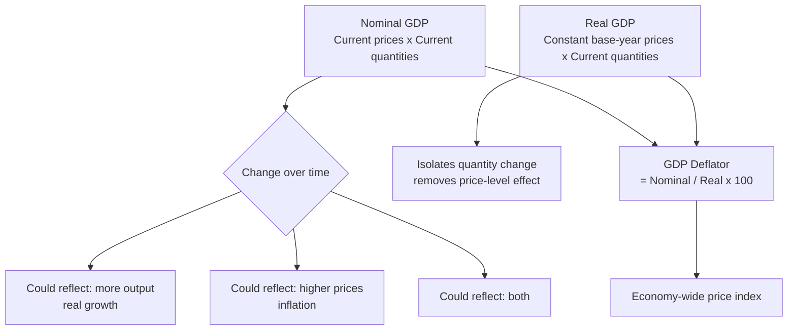

## Nominal versus Real GDP and GDP Deflator

### Definition and Core Concept

**Nominal GDP** measures the total market value of final goods and services produced in a period, valued at the **prices prevailing in that same period** (current-year prices). **Real GDP** measures the same physical output, but valued at the prices of a fixed **base year**, holding prices constant across time so that period-to-period changes reflect genuine changes in the *quantity* of output rather than changes in the *price level*.

This distinction matters because nominal GDP can rise for two entirely different reasons — more goods and services actually being produced, or the same goods and services simply costing more — and policymakers, economists, and the public generally care about the former (real production) when assessing genuine economic growth and living standards.

### Formal Definitions

**Nominal GDP** in year $t$:

$$\text{Nominal GDP}_t = \sum_i P_{i,t} \times Q_{i,t}$$

where $P_{i,t}$ and $Q_{i,t}$ are the price and quantity of good $i$ in year $t$.

**Real GDP** in year $t$, using base-year prices $P_{i,0}$:

$$\text{Real GDP}_t = \sum_i P_{i,0} \times Q_{i,t}$$

Note that both formulas sum over the *same* current-year quantities $Q_{i,t}$; the only difference is which year's prices are applied. This is precisely why the two measures diverge only due to price-level changes and not due to any difference in the underlying physical output being counted.

### The GDP Deflator

The **GDP deflator** is an implicit, economy-wide price index computed as the ratio of nominal to real GDP for a given period:

$$\text{GDP Deflator}_t = \frac{\text{Nominal GDP}_t}{\text{Real GDP}_t} \times 100$$

By construction, the GDP deflator equals exactly 100 in the base year (since nominal and real GDP are identical in the base year, both using base-year prices), and moves above or below 100 in other years to reflect how much the overall price level has risen or fallen relative to the base year.

Rearranging the deflator formula gives the standard method for converting a nominal figure to a real one:

$$\text{Real GDP}_t = \frac{\text{Nominal GDP}_t}{\text{GDP Deflator}_t} \times 100$$

This is the general **deflation formula** used throughout macroeconomics to strip out price-level effects from any nominal monetary series, not just GDP (the same logic applies to converting nominal wages to real wages, nominal interest rates to real interest rates, etc.).

**Key Points**

- The GDP deflator is a **broader** price measure than the Consumer Price Index (CPI): the deflator covers *all* goods and services included in GDP (consumer goods, capital goods, government purchases, exports), while the CPI covers only a fixed basket of goods and services purchased by a representative household.
- The GDP deflator is an **implicit** (Paasche-type, current-weighted) price index, since the basket of goods it implicitly weights is the *current* year's production mix, which changes each year — this differs from the CPI's fixed-basket (Laspeyres-type) approach, which uses a basket fixed at some earlier reference period and only periodically updated. [Inference: this Paasche/Laspeyres distinction is the standard textbook characterization; specific national statistical agencies may employ various formula refinements (e.g., chain-weighting) that blend features of both approaches in practice.]

### Why Real GDP Is Preferred for Growth Comparisons

**Key Points**

- Because nominal GDP conflates quantity changes and price changes, comparing nominal GDP across years can create a **misleading impression of growth** during periods of significant inflation — an economy could show substantial nominal GDP growth while producing the same or even a smaller quantity of actual goods and services, if prices rose fast enough.
- Real GDP growth is therefore the standard metric used for headline "economic growth" figures, business-cycle dating, and most macroeconomic policy discussion, precisely because it isolates the quantity dimension that growth and living-standards analysis is actually concerned with.
- Cross-country GDP comparisons face an analogous problem when converting between currencies: comparing nominal GDP figures converted at market exchange rates can be distorted by exchange-rate fluctuations unrelated to actual output differences, which is why cross-country comparisons often additionally adjust for **purchasing power parity (PPP)** — a related but distinct adjustment from the nominal/real distinction covered here.

### Worked Numerical Example

A simple two-good economy produces only pizzas and haircuts.

| Year | Pizzas (Qty, Price) | Haircuts (Qty, Price) |
| --- | --- | --- |
| Year 1 (base year) | 1,000 @ $10 | 500 @ $20 |
| Year 2 | 1,100 @ $12 | 550 @ $22 |
| Year 3 | 1,150 @ $13 | 520 @ $25 |

**Nominal GDP**:

- Year 1: $(1{,}000 \times \$10) + (500 \times \$20) = \$10{,}000 + \$10{,}000 = \$20{,}000$
- Year 2: $(1{,}100 \times \$12) + (550 \times \$22) = \$13{,}200 + \$12{,}100 = \$25{,}300$
- Year 3: $(1{,}150 \times \$13) + (520 \times \$25) = \$14{,}950 + \$13{,}000 = \$27{,}950$

**Real GDP** (valued at Year 1 base-year prices throughout):

- Year 1: $(1{,}000 \times \$10) + (500 \times \$20) = \$20{,}000$
- Year 2: $(1{,}100 \times \$10) + (550 \times \$20) = \$11{,}000 + \$11{,}000 = \$22{,}000$
- Year 3: $(1{,}150 \times \$10) + (520 \times \$20) = \$11{,}500 + \$10{,}400 = \$21{,}900$

**GDP Deflator**:

- Year 1: $\dfrac{20{,}000}{20{,}000} \times 100 = 100.0$ (base year, by construction)
- Year 2: $\dfrac{25{,}300}{22{,}000} \times 100 \approx 115.0$
- Year 3: $\dfrac{27{,}950}{21{,}900} \times 100 \approx 127.6$

**Growth rate comparison, Year 2 to Year 3**:

- Nominal GDP growth: $\dfrac{27{,}950 - 25{,}300}{25{,}300} \times 100\% \approx 10.5\%$
- Real GDP growth: $\dfrac{21{,}900 - 22{,}000}{22{,}000} \times 100\% \approx -0.45\%$

This example is deliberately constructed to make the key pedagogical point vivid: nominal GDP grew by roughly 10.5% from Year 2 to Year 3, which might naively suggest healthy economic growth, but real GDP actually **fell** slightly (haircut quantity dropped from 550 to 520, more than offsetting the pizza quantity increase), revealing that the entire nominal increase — and then some — was attributable to rising prices (the deflator rose from 115.0 to 127.6) rather than genuine output growth. This is precisely the kind of distortion the real/nominal distinction is designed to detect and correct for.

### Diagram: Divergence Between Nominal and Real GDP Over Time

<svg xmlns="http://www.w3.org/2000/svg" viewBox="0 0 640 380" font-family="sans-serif">
<text x="320" y="24" text-anchor="middle" font-size="15" font-weight="bold">Nominal vs. Real GDP Divergence During Inflation (svg_diagram)</text>
<line x1="80" y1="330" x2="580" y2="330" stroke="black" stroke-width="2" />
<line x1="80" y1="330" x2="80" y2="50" stroke="black" stroke-width="2" />
<text x="560" y="350" font-size="13">Year</text>
<text x="20" y="55" font-size="13">GDP (\$)</text>
<path d="M80,300 L230,220 L380,150 L530,80" stroke="#dc2626" stroke-width="2.5" fill="none" />
<text x="540" y="80" font-size="12" fill="#dc2626">Nominal GDP</text>
<path d="M80,300 L230,260 L380,240 L530,225" stroke="#2563eb" stroke-width="2.5" fill="none" />
<text x="540" y="225" font-size="12" fill="#2563eb">Real GDP</text>
<path d="M230,220 L230,260" stroke="#7c3aed" stroke-width="1.5" stroke-dasharray="4,3" />
<path d="M380,150 L380,240" stroke="#7c3aed" stroke-width="1.5" stroke-dasharray="4,3" />
<path d="M530,80 L530,225" stroke="#7c3aed" stroke-width="1.5" stroke-dasharray="4,3" />
<text x="390" y="130" font-size="11" fill="#7c3aed">Gap reflects rising</text>
<text x="390" y="143" font-size="11" fill="#7c3aed">GDP deflator (inflation)</text>
</svg>

The widening gap between the two lines over time visually represents the cumulative effect of inflation (a rising GDP deflator); the real GDP line's slope, not the nominal line's slope, is what economists interpret as the genuine economic growth rate.

### Fixed-Weight vs. Chain-Weighted Real GDP

**Key Points**

- Traditional **fixed-weight (fixed base-year)** real GDP calculations, as illustrated in the worked example, become progressively less accurate the further the current period is from the base year, because relative prices and the composition of output shift over time — a good that was relatively expensive in the base year but has since become cheap and more heavily consumed (a common pattern with rapidly improving technology goods) gets an outdated weight in the fixed calculation.
- Many national statistical agencies address this using **chain-weighted real GDP**, which updates the price weights used for calculating growth between each pair of adjacent years, then "chains" these year-to-year growth rates together into a continuous index, reducing the distortion associated with using an increasingly outdated single base year. [Inference: the specific chain-weighting formula (e.g., Fisher ideal index methods) and update frequency vary across national statistical agencies and are subject to periodic methodological revision by those agencies.]
- This distinction matters primarily for long time-series comparisons or historical analysis spanning many years or decades; for short-run comparisons (adjacent quarters or a few years), fixed-weight and chain-weighted measures typically produce very similar results. [Inference: the degree of similarity depends on how much relative prices and output composition have shifted over the specific period being compared.]

### Related Real vs. Nominal Distinctions Elsewhere in Macroeconomics

The same conceptual logic — stripping out price-level effects to isolate genuine quantity or purchasing-power changes — recurs throughout macroeconomics and is worth recognizing as a general pattern rather than a GDP-specific technique:

- **Nominal vs. real wages**: Real wage $= \dfrac{\text{Nominal wage}}{\text{Price index}} \times 100$, used to assess whether workers' actual purchasing power is rising or falling, independent of nominal pay increases that might simply track inflation.
- **Nominal vs. real interest rates**: The (approximate) **Fisher equation** relates the two: $r \approx i - \pi$, where $r$ is the real interest rate, $i$ is the nominal interest rate, and $\pi$ is the inflation rate — used to assess the true cost of borrowing or return on saving after accounting for inflation's erosion of purchasing power.
- **Nominal vs. real exchange rates**: analogous adjustments are used to assess a currency's true purchasing power and competitiveness relative to trading partners, beyond the raw nominal exchange rate quote.

**Related Topics**

- Gross Domestic Product: Measurement Approaches
- Inflation Measurement: CPI, PCE, and Core Inflation
- The Fisher Equation and Real vs. Nominal Interest Rates
- Chain-Weighted Price Indices and National Accounts Methodology
- Purchasing Power Parity and Cross-Country GDP Comparisons
- Macroeconomic Goals: Growth, Employment, Price Stability
- Business Cycle Dating and Recession Identification
- Real Wages and Living Standards Measurement