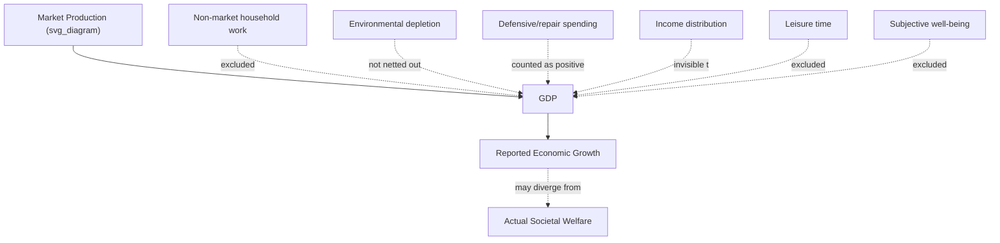

## Limitations of GDP as a Welfare Measure

### Overview

Gross Domestic Product (GDP) measures the total market value of final goods and services produced within a country's borders in a given period. It was designed as a measure of economic *production and activity*, not of societal *welfare* or *well-being*. Treating GDP as a proxy for welfare leads to systematic distortions in policy analysis, cross-country comparisons, and public discourse about living standards.

**Key Points**

- GDP is a flow measure of market production, not a stock measure of wealth or a direct measure of utility/happiness.
- Simon Kuznets, who helped develop national income accounting in the 1930s, explicitly warned Congress that "the welfare of a nation can scarcely be inferred from a measure of national income." [Unverified: exact phrasing varies slightly across secondary sources, though the substance of the warning is well documented]
- The gap between GDP and welfare arises from what GDP excludes, what it includes indiscriminately, and what it cannot capture distributionally.

### Why GDP and Welfare Diverge: Conceptual Foundation

GDP sums market transactions:

$$GDP = C + I + G + (X - M)$$

where $C$ is consumption, $I$ is investment, $G$ is government spending, and $(X - M)$ is net exports. Every term in this identity is a **monetary flow tied to market exchange**. Welfare, by contrast, is a broader normative concept encompassing health, leisure, security, environmental quality, distributional fairness, and subjective life satisfaction — most of which have no market price or are actively degraded by the very activity GDP counts as positive.

### Core Limitations

#### 1. Non-Market Production Is Excluded

GDP only counts goods and services that pass through a market transaction.

- **Household production**: Childcare, eldercare, cooking, and cleaning performed unpaid within a household are excluded. If a person hires a nanny, GDP rises; if a parent performs the identical childcare unpaid, GDP is unaffected — despite no change in the actual welfare-relevant output.
- **Volunteer work**: Community service, mutual aid, and charitable labor contribute to social welfare but add nothing to GDP.
- **Subsistence and informal production**: In developing economies, a large share of food and goods production occurs outside formal markets (subsistence farming, informal bartering), causing GDP to understate real output and welfare in these economies. [Inference: the *direction* of this bias — understatement — is well established in development economics literature, though the *magnitude* varies by country and is difficult to verify precisely]

**Example**: Two countries with identical GDP per capita, but Country A has extensive informal childcare networks and Country B relies entirely on paid daycare, will show different GDP compositions despite potentially similar actual welfare outcomes for children.

#### 2. The "Defensive Expenditure" Problem

GDP treats spending that merely *repairs* or *offsets* harm identically to spending that creates *new* well-being.

- Cleanup costs after an oil spill add to GDP (remediation services are purchased) but do not restore the environmental welfare lost in the spill itself.
- Rising healthcare spending due to increased illness (e.g., pollution-related respiratory disease) raises GDP even though the underlying welfare trend — a sicker population — is negative.
- Increased spending on security, locks, and private policing in response to rising crime raises GDP without indicating improved safety; it indicates the opposite.

This is sometimes called the **"broken windows" fallacy problem** applied to national accounts: repairing damage looks identical, in GDP terms, to building something new.

#### 3. Externalities and Environmental Depletion Are Not Netted Out

GDP is a gross figure — it does not subtract the depreciation of natural capital.

- Logging a forest for timber adds the sale value of the timber to GDP but does not deduct the lost ecosystem services (carbon sequestration, biodiversity, flood control, recreational value) that the standing forest provided.
- Extraction of non-renewable resources (oil, minerals) counts as current income in GDP, even though it draws down a finite stock, effectively borrowing from future output capacity.
- Pollution generated during production is not subtracted, even when it imposes real costs (health damage, reduced agricultural yield) on third parties.

Economists have proposed adjusted metrics such as **Green GDP** (subtracting environmental degradation) and **Genuine Progress Indicator (GPI)** to address this, though none has achieved GDP's status as the default headline statistic. [Inference: the claim about lack of widespread adoption reflects observed institutional practice, not a value judgment on the metrics' technical merit]

#### 4. No Information on Distribution

GDP and GDP per capita are aggregate and average measures, respectively:

$$\text{GDP per capita} = \frac{GDP}{\text{Population}}$$

This average can rise even while the majority of the population experiences stagnant or falling real income, if gains are concentrated among a small share of the population. GDP per capita is mathematically insensitive to inequality — a transfer of $1 million in income from the poorest household to the richest leaves GDP per capita completely unchanged.

**Example**: If national income grows 5% but 90% of that growth accrues to the top 1% of earners, GDP figures will report robust "average" growth while median household welfare may be flat or declining. Metrics like the Gini coefficient, median (rather than mean) income, or the Human Development Index (HDI) are often used alongside GDP to correct for this blind spot.

#### 5. Quality, Composition, and "Bads" Are Not Distinguished

GDP is agnostic about *what* is produced, so long as it is sold.

- A dollar spent on cigarettes, weapons, or gambling counts identically to a dollar spent on vaccines or education.
- Increased spending on prisons, litigation, or war production raises GDP without any plausible claim to raising welfare (and arguably reflects social dysfunction).
- GDP cannot capture improvements in *product quality* except indirectly through hedonic price adjustments, which are imperfect and lag actual innovation.

#### 6. Leisure and Work-Life Balance Are Ignored

GDP counts hours worked (via output) but not hours of leisure foregone.

- A country where citizens work 60-hour weeks and one where citizens work 35-hour weeks for the same total output are treated identically by GDP, despite an obvious welfare difference in favor of the second.
- Increases in labor force participation (e.g., more women entering paid work) raise GDP, but if this substitutes for unpaid domestic labor and reduces household leisure time, the net welfare effect is ambiguous, not obviously positive.

#### 7. Subjective Well-Being Is Absent

GDP has no mechanism to capture self-reported happiness, life satisfaction, mental health, sense of community, or trust in institutions. Cross-national surveys (e.g., the World Happiness Report) show that subjective well-being does not scale linearly with GDP per capita once basic needs are met — a pattern related to, but not identical to, the **Easterlin Paradox** (the finding that within a country, rising income does not straightforwardly translate to rising reported happiness over time, even though richer people within a country tend to report being happier than poorer people at a given point in time). [Unverified: the precise mechanisms behind the Easterlin Paradox remain debated among economists, and some later studies using different methodologies dispute the strength of the paradox]

#### 8. Health and Human Capital Are Only Partially Reflected

GDP counts healthcare spending as output but does not directly measure health outcomes.

- A country that spends heavily on healthcare but has poor outcomes (e.g., low life expectancy relative to spending) shows high GDP contribution from health services despite poor actual health welfare.
- Life expectancy, infant mortality, and educational attainment are welfare-relevant dimensions with no direct GDP counterpart, which is why the HDI was constructed to combine GDP with health and education indicators.

### Illustrative Diagram: GDP vs. Welfare Divergence

### Alternative and Supplementary Measures

| Measure | What It Adds | Key Limitation |
| --- | --- | --- |
| **Human Development Index (HDI)** | Combines income, life expectancy, education | Still relies on national averages; masks inequality |
| **Genuine Progress Indicator (GPI)** | Adjusts for environmental cost, inequality, non-market work | Data-intensive; not standardized internationally |
| **Green GDP** | Subtracts environmental depreciation | Valuing ecosystem services is methodologically contested |
| **Gini Coefficient** | Captures income/wealth inequality | Says nothing about absolute living standards |
| **Genuine Wealth / Inclusive Wealth Index** | Measures produced, human, and natural capital stocks | Requires estimating natural capital in monetary terms, which is contentious |
| **World Happiness Report metrics** | Captures subjective life satisfaction | Self-reported data raises cross-cultural comparability concerns |
| **Gross National Happiness (Bhutan)** | Explicit multidimensional welfare framework | Difficult to quantify and compare internationally |

### Worked Example: GDP Growth With Falling Welfare

Consider a simplified economy over two years:

- **Year 1**: GDP = $100 billion. Forest cover: 50,000 hectares. Gini coefficient: 0.35. Average work week: 40 hours.
- **Year 2**: GDP = $110 billion (10% growth). Forest cover: 40,000 hectares (logged for export revenue). Gini coefficient: 0.45 (income gains concentrated at the top). Average work week: 48 hours.

Standard reporting would describe Year 2 as an economic success (10% growth). A welfare-adjusted view would note:

- Natural capital loss (20% of forest cover) is not deducted from the $110 billion figure.
- Rising inequality (Gini 0.35 → 0.45) means the median household may not have benefited from the growth.
- Increased working hours represent a leisure cost not reflected anywhere in the $110 billion.

This illustrates why economists caution against using the GDP growth rate alone as a policy success metric.

### Conclusion

GDP remains valuable as a standardized, comparable, and timely measure of market economic activity, and it correlates positively with many welfare-relevant outcomes at low-to-middle income levels (basic nutrition, sanitation, infrastructure). However, its structural blindness to non-market production, environmental depletion, distribution, and subjective well-being means it should be treated as one input among several — not a sufficient statistic — when the analytical goal is assessing societal welfare rather than economic output.

**Next Steps**

- The Kuznets Critique and the historical origins of national income accounting
- Green Accounting and Natural Capital Valuation methods
- The Human Development Index (HDI): construction and criticisms
- The Easterlin Paradox and the economics of happiness
- Distributional National Accounts (measuring growth by income percentile)
- Beyond GDP initiatives (OECD Better Life Index, EU "Beyond GDP" project)
- Informal economy measurement and PPP adjustments in cross-country GDP comparisons