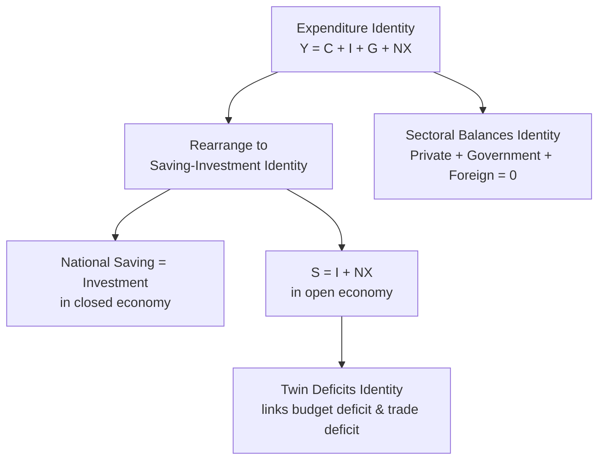

## National Income Accounting Identities

### Definition and Core Concept

National income accounting identities are equations that hold **true by definition** (by construction of the accounting framework), rather than by economic behavior or theory. They describe how output, income, spending, saving, and the various sectors of the economy (households, firms, government, foreign sector) mechanically relate to one another. Because they are identities rather than testable behavioral relationships, they are always true regardless of the state of the economy — but they carry substantial analytical power because they constrain what combinations of outcomes are even *possible*, and they form the structural backbone underlying the expenditure approach to GDP, the loanable funds market, and the balance of payments framework.

### The Core Expenditure Identity

The most fundamental national income identity, introduced via the expenditure approach to GDP, states that total output/income $Y$ equals the sum of spending by all sectors:

$$Y = C + I + G + NX$$

where $C$ is consumption, $I$ is (national-accounts) investment, $G$ is government purchases, and $NX = X - M$ is net exports (exports minus imports). This is an identity — true by the very definition of how GDP is constructed via the expenditure approach — not a theory about how these components interact (that behavioral analysis is the domain of the aggregate demand/aggregate supply model and consumption/investment theory covered elsewhere).

### Deriving the Saving-Investment Identity

**Step 1 — Define national saving**: Total income $Y$ is disposed of in exactly three ways: consumed ($C$), paid in net taxes ($T$, taxes minus transfer payments), or saved ($S$):

$$Y = C + S + T$$

**Step 2 — Combine with the expenditure identity**: Since both expressions equal $Y$:

$$C + S + T = C + I + G + NX$$

Subtracting $C$ from both sides:

$$S + T = I + G + NX$$

Rearranging:

$$S = I + (G - T) + NX \times(-1)...$$

More carefully, rearranging to isolate saving:

$$S - I = (G - T) + NX$$

Or, solving for national saving in the standard form:

$$S = I + (G - T)^{-} \; \Rightarrow \; \text{more precisely:} \quad S = I + \text{Budget Deficit} + NX$$

**Clean standard form**: Define **private saving** $S_{private} = Y - T - C$ and **public (government) saving** $S_{public} = T - G$ (government saving is positive when running a budget surplus, negative when running a deficit). Then **national saving** is:

$$S_{national} = S_{private} + S_{public}$$

And the full open-economy identity becomes:

$$S_{national} = I + NX$$

**Key Points**

- In a **closed economy** (no international trade, $NX = 0$), this identity simplifies to the familiar closed-economy result:

$$S = I$$

— aggregate saving must equal aggregate investment, a foundational identity underlying the closed-economy **loanable funds market** model, where the supply of loanable funds is national saving and the demand for loanable funds is investment.

- In an **open economy**, $S = I + NX$ shows that a country's national saving can differ from its domestic investment, with the gap corresponding exactly to net exports (or equivalently, net foreign lending/borrowing) — a country that saves more than it invests domestically ($S > I$) necessarily runs a trade surplus ($NX > 0$) and is a net lender to the rest of the world, while a country that invests more than it saves domestically ($S < I$) necessarily runs a trade deficit ($NX < 0$) and is a net borrower from the rest of the world. This is not a policy claim or empirical regularity — it is a direct algebraic consequence of the identity.

### The Twin Deficits Identity

Rearranging the private/public saving decomposition provides a widely used analytical lens connecting the government budget balance to the trade balance:

$$S_{private} - I = (G - T) + NX$$

Or equivalently, isolating net exports:

$$NX = S_{private} - I - (G - T) = S_{private} - I + (T - G)$$

**Interpretation**: Holding private saving ($S_{private}$) and investment ($I$) fixed, an increase in the government budget deficit (a fall in $T - G$, i.e., $G - T$ rising) must be matched by an equal and opposite move in $NX$ toward deficit (more negative) — this is the algebraic basis for the **"twin deficits" hypothesis**, which observes that government budget deficits and trade deficits often move together.

**Key Points**

- The twin deficits relationship is an **identity-based accounting linkage**, not proof of a specific causal direction — the identity is consistent with multiple different behavioral stories (e.g., a rising budget deficit could crowd out private investment instead of worsening the trade balance, or private saving could rise to offset the deficit, per the debated **Ricardian equivalence** hypothesis discussed in fiscal policy theory). [Inference: which channel actually absorbs a change in the government deficit in practice is an empirical and theoretical question that the accounting identity itself cannot resolve; economists have found varying empirical support for strict Ricardian equivalence versus partial or Keynesian-style crowding-out/twin-deficits responses across different studies and time periods.]
- The identity clarifies that a country cannot simultaneously reduce its budget deficit, increase domestic investment, and improve its trade balance without *some* offsetting change in private saving — all four variables are mechanically linked and cannot move arbitrarily independently of one another.

### The Sectoral Financial Balances Identity

An equivalent and increasingly widely used reformulation expresses the same underlying accounting relationship as a statement that the **net financial balances of the three major sectors of the economy must sum to zero**:

$$(S_{private} - I) + (T - G) + (M - X) = 0$$

or equivalently, using standard sector labels:

$$\text{Private Sector Balance} + \text{Government Sector Balance} + \text{Foreign Sector Balance} = 0$$

**Interpretation**: If the private sector is a net saver (spending less than its income, $S_{private} > I$) and the government runs a balanced budget ($T = G$), the foreign sector must be a net saver from the domestic economy's perspective (equivalently, the domestic economy runs a trade deficit, $M > X$) to absorb that private saving — because the three sector balances are constrained to sum to exactly zero as a matter of accounting, not economic behavior.

**Key Points**

- This framework (closely associated with **stock-flow consistent** macroeconomic modeling traditions and used extensively in Post-Keynesian and some central bank analytical work) is a useful tool precisely because it forces analysts to recognize that a change in one sector's balance necessarily implies an offsetting change somewhere else in the economy — there is no "free" way for one sector to become a larger net saver or net borrower without a corresponding change elsewhere. [Inference: while the identity itself is uncontroversial (it follows mechanically from the underlying accounting), the causal interpretation of *which* sector's behavior drives changes in the others in any specific historical episode is a matter of economic theory and empirical judgment, not something the identity alone determines.]

### Diagram: Sectoral Balances Must Sum to Zero

<svg xmlns="http://www.w3.org/2000/svg" viewBox="0 0 640 340" font-family="sans-serif">
<text x="320" y="24" text-anchor="middle" font-size="15" font-weight="bold">Sectoral Financial Balances (svg_diagram)</text>
<line x1="80" y1="180" x2="580" y2="180" stroke="black" stroke-width="2" />
<text x="30" y="184" font-size="12">0</text>
<rect x="130" y="80" width="90" height="100" fill="#bfdbfe" stroke="#2563eb" stroke-width="2" />
<text x="175" y="70" text-anchor="middle" font-size="12" font-weight="bold">Private</text>
<text x="175" y="135" text-anchor="middle" font-size="12">+ (surplus)</text>
<rect x="280" y="180" width="90" height="90" fill="#fecaca" stroke="#dc2626" stroke-width="2" />
<text x="325" y="288" text-anchor="middle" font-size="12" font-weight="bold">Government</text>
<text x="325" y="230" text-anchor="middle" font-size="12">− (deficit)</text>
<rect x="430" y="180" width="90" height="50" fill="#fde68a" stroke="#d97706" stroke-width="2" />
<text x="475" y="248" text-anchor="middle" font-size="12" font-weight="bold">Foreign</text>
<text x="475" y="200" text-anchor="middle" font-size="11">− (trade deficit</text>
<text x="475" y="213" text-anchor="middle" font-size="11">= foreign surplus)</text>

<text x="320" y="320" text-anchor="middle" font-size="12" font-weight="bold">Sum of all three balances = 0, always</text>

</svg>

### Worked Numerical Example

Consider an economy (all figures in $ billions) with the following national accounts data for a given year:

- $Y$ (GDP) = 20,000
- $C$ (Consumption) = 13,500
- $I$ (Investment) = 3,200
- $G$ (Government purchases) = 4,000
- $T$ (Net taxes) = 3,700

**Step 1 — Find net exports from the expenditure identity**:

$$Y = C + I + G + NX \implies 20{,}000 = 13{,}500 + 3{,}200 + 4{,}000 + NX$$

$$NX = 20{,}000 - 20{,}700 = -700$$

The economy runs a trade deficit of $700 billion.

**Step 2 — Compute private saving**:

$$S_{private} = Y - T - C = 20{,}000 - 3{,}700 - 13{,}500 = 2{,}800$$

**Step 3 — Compute government saving (budget balance)**:

$$S_{public} = T - G = 3{,}700 - 4{,}000 = -300 \quad (\text{a budget deficit of \$300 billion})$$

**Step 4 — Verify the national saving identity**: $S_{national} = S_{private} + S_{public} = 2{,}800 + (-300) = 2{,}500$

Check against $S = I + NX$: $I + NX = 3{,}200 + (-700) = 2{,}500$ ✓ — the identity holds exactly, as it must by construction.

**Step 5 — Verify the sectoral balances sum to zero**: Private sector balance $= S_{private} - I = 2{,}800 - 3{,}200 = -400$. Government sector balance $= S_{public} = -300$. Foreign sector balance (from the domestic economy's perspective, a trade deficit means the foreign sector holds a net *positive* claim, i.e., $-NX = +700$).

$$(-400) + (-300) + (700) = 0 \checkmark$$

The three sector balances sum to exactly zero, confirming the sectoral balances identity holds in this numerical example as it must by construction — a genuinely useful cross-check on the internal consistency of any set of national accounts figures.

### Distinguishing Accounting Identities from Economic Theory

**Key Points**

- A recurring point of confusion for students is treating an identity (true by definition, always holds) as though it were a **behavioral or causal claim** (a theory about how variables respond to each other, which may or may not hold depending on economic conditions and could in principle be empirically tested and rejected). $S = I$ in a closed economy is always true by construction; it does **not** imply, for example, that an increase in saving automatically or mechanically *causes* an equal increase in investment — the equality could instead be achieved via changes in income, interest rates, or output that separately affect both sides of the identity. [Inference: which variable adjusts to restore the identity following some initial shock is precisely the kind of question that requires a behavioral macroeconomic model (e.g., the loanable funds model, the Keynesian cross, or a full DSGE framework) to answer — the identity alone is silent on the adjustment mechanism.]
- This distinction is closely related to the classical economic debate over **Say's Law** ("supply creates its own demand") versus Keynesian concerns about inadequate aggregate demand — both perspectives are consistent with the *same* underlying accounting identities; they differ in their behavioral theories about *how* the economy adjusts to maintain those identities (e.g., via flexible prices and interest rates restoring equilibrium quickly, versus quantity/output adjustments occurring more prominently, particularly in the short run) [Inference: this is a long-standing and still-debated area of macroeconomic theory rather than a settled question resolved by the accounting framework itself].

**Related Topics**

- Gross Domestic Product: Measurement Approaches
- The Loanable Funds Market and Interest Rate Determination
- Government Budget Deficits and the Twin Deficits Hypothesis
- Balance of Payments and the Current/Capital Account
- Ricardian Equivalence and Fiscal Policy Theory
- Sectoral Financial Balances and Stock-Flow Consistent Modeling
- Say's Law and the Keynesian Critique of Aggregate Demand
- Crowding Out and Fiscal Policy Effectiveness