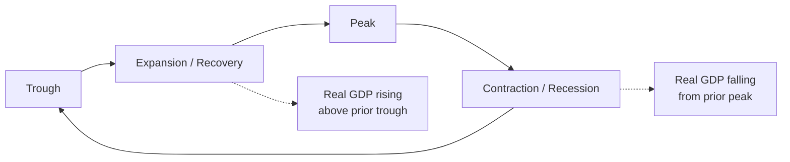
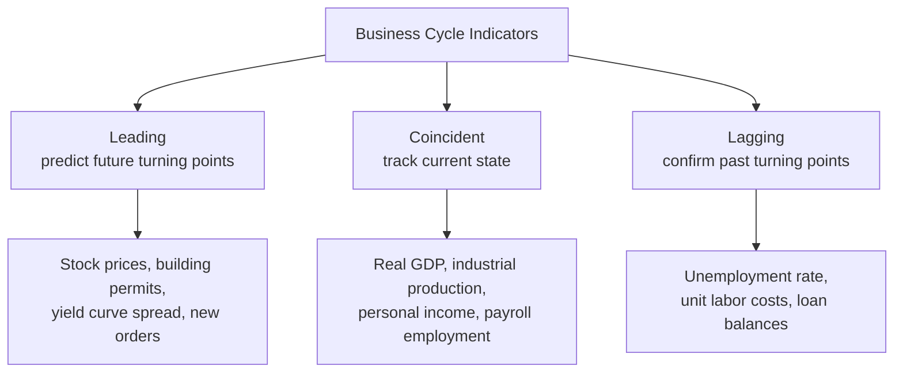

## Business Cycles: Phases and Indicators

### Definition and Core Concept

The **business cycle** refers to the recurring, though irregular, pattern of expansion and contraction in aggregate economic activity over time, typically measured via fluctuations in real GDP around its long-run trend (potential GDP), alongside co-movements in employment, income, production, and sales. Business cycles are a defining feature of short-run macroeconomic analysis, distinct from the long-run growth trend covered under macroeconomic growth theory — the business cycle describes fluctuations *around* that trend, not the trend itself.

### The Four Phases of the Business Cycle

**Expansion**: A period during which real GDP, employment, income, and production are generally rising. Expansions typically feature falling unemployment, rising business and consumer confidence, and increasing investment spending. An expansion that pushes output above potential GDP (a positive output gap) can generate rising inflationary pressure, connecting directly to the short-run Phillips curve trade-off discussed under macroeconomic goals.

**Peak**: The turning point marking the end of an expansion and the beginning of a contraction — the local maximum of economic activity in the cycle, after which output, employment, and related indicators begin to decline.

**Contraction (recession)**: A period during which real GDP, employment, income, and production are generally falling. A commonly cited (though not official or universally applied) rule of thumb defines a recession as **two or more consecutive quarters of negative real GDP growth**, though official recession-dating bodies (such as the NBER Business Cycle Dating Committee in the United States) typically use a broader, more qualitative assessment considering multiple indicators (employment, income, industrial production, sales) rather than relying on this single quantitative rule alone. [Unverified: the precise dating methodology and criteria used by any specific national business-cycle dating authority should be checked against that body's current published methodology rather than treated as fixed across time or universally standardized across countries.]

**Trough**: The turning point marking the end of a contraction and the beginning of a new expansion — the local minimum of economic activity in the cycle.

**Key Points**

- Business cycles are **irregular in both duration and amplitude** — no two cycles are identical in length or severity, which is part of why economists emphasize that the business cycle is a recurring *pattern*, not a predictable, mechanically periodic phenomenon with a fixed length. [Inference: historical cycle lengths and severities vary considerably across different economies and time periods; citing specific average duration figures would require verification against current data covering the relevant time period and country.]
- A **depression** is generally used informally to describe an unusually severe and prolonged contraction (such as the Great Depression of the 1930s), though there is no single universally agreed technical threshold distinguishing an ordinary recession from a depression in the same precise way that recession dating criteria are sometimes formalized.

### Diagram: Business Cycle Phases Relative to Potential GDP

<svg xmlns="http://www.w3.org/2000/svg" viewBox="0 0 640 380" font-family="sans-serif">
<text x="320" y="24" text-anchor="middle" font-size="15" font-weight="bold">Business Cycle Phases and the Output Gap (svg_diagram)</text>
<line x1="80" y1="330" x2="580" y2="330" stroke="black" stroke-width="2" />
<line x1="80" y1="330" x2="80" y2="60" stroke="black" stroke-width="2" />
<text x="560" y="350" font-size="13">Time</text>
<text x="20" y="65" font-size="13">Real GDP</text>
<line x1="80" y1="220" x2="580" y2="140" stroke="#7c3aed" stroke-width="2" stroke-dasharray="6,3" />
<text x="490" y="132" font-size="12" fill="#7c3aed">Potential GDP (long-run trend)</text>
<path d="M80,260 Q 150,150 220,140 Q 290,135 320,200 Q 350,260 420,270 Q 490,275 530,180 Q 550,140 570,120" stroke="#2563eb" stroke-width="2.5" fill="none" />
<text x="80" y="280" font-size="11" fill="#2563eb">Actual Real GDP</text>
<circle cx="220" cy="140" r="4" fill="#dc2626" />
<text x="200" y="120" font-size="12" font-weight="bold" fill="#dc2626">Peak</text>
<circle cx="420" cy="270" r="4" fill="#16a34a" />
<text x="395" y="295" font-size="12" font-weight="bold" fill="#16a34a">Trough</text>

<text x="120" y="200" font-size="11">Expansion</text>

<text x="330" y="230" font-size="11">Contraction</text>

<text x="450" y="230" font-size="11">Expansion</text>

</svg>

### Leading, Lagging, and Coincident Indicators

Economists classify macroeconomic indicators by their **timing relationship** to the overall business cycle, which is essential for forecasting turning points versus simply confirming what phase the economy is currently in or has already passed through.

**Leading indicators**: Variables that tend to change *before* the overall economy changes direction, useful for forecasting upcoming turning points. Commonly cited examples include:

- Stock market indices (equity prices often reflect forward-looking expectations about future corporate earnings and economic conditions)
- Building permits / new housing starts
- New orders for durable goods and capital equipment
- Average weekly hours in manufacturing (firms often adjust existing workers' hours before committing to new hires or layoffs)
- Consumer confidence/sentiment indices
- The yield curve slope (spread between long-term and short-term government bond yields), with an **inverted yield curve** (short-term rates exceeding long-term rates) historically cited as a signal frequently preceding recessions in some economies. [Unverified: the reliability, lead time, and false-positive rate of the inverted yield curve as a recession predictor vary across studies, time periods, and countries, and should not be treated as a guaranteed or mechanically precise forecasting rule.]

**Coincident indicators**: Variables that tend to move *in tandem* with the overall business cycle, useful for identifying the current state of the economy in close to real time. Commonly cited examples include:

- Real GDP itself (though it is reported with a lag and subject to revision)
- Industrial production
- Personal income (excluding transfer payments)
- Employment/nonfarm payrolls

**Lagging indicators**: Variables that tend to change *after* the overall economy has already changed direction, useful for confirming that a turning point has occurred rather than predicting it in advance. Commonly cited examples include:

- The unemployment rate (employers are often slow to hire during early recovery and slow to lay off workers during early contraction, so unemployment tends to peak after a trough and bottom out after a peak)
- Average duration of unemployment
- Outstanding commercial and industrial loan balances
- The prime interest rate charged by banks
- Labor cost per unit of output (unit labor costs)

**Key Points**

- Composite indices combining multiple leading indicators are used by economists and forecasters specifically because any single indicator can give false signals; combining several tends to improve (though never guarantee) forecasting reliability. [Unverified: the specific composition, weighting methodology, and current publisher of any such leading index should be verified against current sources rather than assumed static, as these indices are periodically revised.]
- The unemployment rate's status as a lagging indicator is directly connected to **Okun's Law** (covered under macroeconomic goals) and reflects real-world labor market frictions — firms face hiring and firing costs that make them cautious about immediately adjusting headcount in response to short-term demand fluctuations, a behavior sometimes described as **labor hoarding** during the early stages of a downturn.

### Sources of Business Cycle Fluctuations

**Aggregate demand shocks**: Sudden changes in consumption, investment, government spending, or net exports (e.g., a collapse in consumer confidence, a sharp decline in business investment, a foreign recession reducing export demand) that shift the aggregate demand curve and move output and employment in the same direction (both rising together in a demand-driven expansion, both falling together in a demand-driven contraction), typically with an ambiguous or muted effect on inflation in the very short run depending on the shock's size relative to existing slack.

**Aggregate supply shocks**: Sudden changes in production costs or productive capacity (e.g., a sharp oil price spike raising input costs economy-wide, a major technological breakthrough, a natural disaster disrupting production, a pandemic disrupting supply chains) that shift the aggregate supply curve. Negative supply shocks are notable for potentially producing **stagflation** — simultaneously falling output and rising inflation — since they raise costs (inflationary pressure) while reducing firms' willingness/ability to produce (contractionary pressure on output), a combination that a pure demand-shock framework alone would not straightforwardly generate.

**Financial and credit cycle dynamics**: Fluctuations in credit availability, asset prices, and balance-sheet conditions across households, firms, and financial institutions can amplify or independently drive business cycle fluctuations — a mechanism given particular prominence in analyses of the 2007–2009 global financial crisis, where a collapse in a specific asset class (mortgage-backed securities) and the resulting credit contraction are widely cited as central drivers of that particular downturn. [Inference: the relative weight of financial/credit factors versus more traditional demand or supply shocks in explaining any specific historical recession is a matter of ongoing macroeconomic and macro-financial research rather than a single settled account applicable to all cycles.]

**Key Points**

- Distinguishing whether a given downturn is primarily demand-driven or supply-driven has significant implications for appropriate policy response: demand-driven contractions are the classic case for countercyclical expansionary fiscal or monetary policy (stimulating aggregate demand back toward potential), while supply-driven contractions (especially stagflationary episodes) present a much harder policy trade-off, since standard demand-stimulus tools risk worsening inflation without necessarily restoring lost output, a tension highlighted by the 1970s stagflation experience discussed under macroeconomic goals.

### Theoretical Perspectives on Business Cycle Causes

**Key Points** (brief overview; each is a substantial theoretical tradition in its own right)

- **Keynesian perspective**: emphasizes that prices and wages can be "sticky" (slow to adjust) in the short run, meaning demand shocks can cause prolonged deviations of output from potential rather than being quickly self-correcting, providing a rationale for active countercyclical stabilization policy.
- **Real Business Cycle (RBC) theory**: associated with Finn Kydland and Edward Prescott (awarded the 2004 Nobel Memorial Prize in Economic Sciences for related work), emphasizes that business cycles can arise primarily from real (non-monetary) shocks to productivity/technology propagating through an economy with flexible prices, implying a more limited role for demand-management stabilization policy in this framework.
- **Monetarist perspective**: associated with Milton Friedman, emphasizes the role of unstable or poorly managed monetary policy and money supply fluctuations as a primary driver of business cycle volatility, with a corresponding policy prescription favoring stable, rules-based monetary policy over discretionary intervention.
- **New Keynesian synthesis**: incorporates rational expectations and micro-founded price/wage stickiness into models that retain a meaningful short-run role for both monetary and fiscal stabilization policy, representing the dominant modeling framework in much contemporary central bank and academic macroeconomic analysis. [Inference: characterizing any framework as "dominant" reflects a general characterization of mainstream academic and central-bank modeling practice as commonly taught, rather than a claim that these theoretical debates are fully resolved or that alternative frameworks lack ongoing scholarly development and application.]

### Worked Illustrative Example: Reading a Simple Business Cycle Indicator Panel

Suppose an economist observes the following changes over the most recent quarter:

| Indicator | Type | Recent Change |
| --- | --- | --- |
| Building permits | Leading | Down 8% |
| Stock market index | Leading | Down 12% |
| Yield curve spread | Leading | Inverted (negative) |
| Real GDP | Coincident | Flat (0.1% growth) |
| Industrial production | Coincident | Down 0.5% |
| Unemployment rate | Lagging | Unchanged |

**Interpretation**: The cluster of declining leading indicators (permits, stocks, an inverted yield curve) alongside weak-to-slightly-negative coincident indicators (flat GDP, falling industrial production) would typically be read by economists as a signal that the economy may be approaching a peak or entering an early contraction, even though the lagging indicator (unemployment) has not yet moved — consistent with the general pattern that unemployment tends to respond only after the turning point has already begun. This illustrates why relying on lagging indicators alone would mean recognizing a downturn only well after it started, while over-relying on any single leading indicator risks false signals — the standard rationale for examining indicators as a *panel* rather than in isolation.

**Related Topics**

- Macroeconomic Goals: Growth, Employment, Price Stability
- Aggregate Demand and Aggregate Supply Model
- Okun's Law and the Output Gap
- Fiscal Policy and Automatic Stabilizers
- Monetary Policy Transmission Mechanisms
- Real Business Cycle Theory vs. New Keynesian Economics
- The Yield Curve and Recession Forecasting
- Financial Crises and Credit Cycle Dynamics