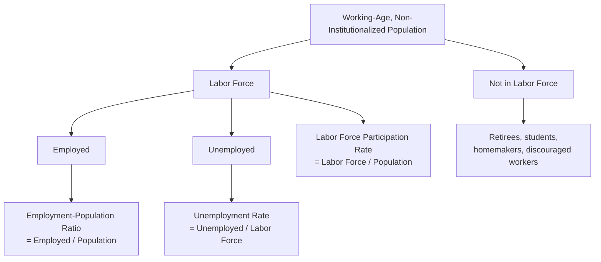

## Measuring Unemployment: Labor Force Participation and Rates

### Definition and Core Concept

Measuring unemployment requires first defining who counts as part of the **labor force**, since the unemployment rate is calculated as a share of that specific population, not the entire population. National statistical agencies (such as the Bureau of Labor Statistics in the United States, via its Current Population Survey) classify the working-age, non-institutionalized population into three mutually exclusive categories: **employed**, **unemployed**, and **not in the labor force**.

### Population Classification Criteria

**Employed**: Individuals who, during the survey reference period, did any work at all for pay or profit, or worked without pay for at least a specified minimum number of hours in a family business, or were temporarily absent from a job (due to illness, vacation, labor dispute, etc.) but retained formal job attachment.

**Unemployed**: Individuals who did not work during the reference period but were (a) available for work and (b) actively searched for work within a specified recent period (e.g., the prior four weeks in the U.S. framework), or were on temporary layoff awaiting recall. The **active job search** requirement is the critical, often underappreciated criterion distinguishing "unemployed" from simply "not working."

**Not in the labor force**: Individuals who are neither employed nor actively searching for work, including retirees, full-time students not seeking work, individuals with a disability preventing work, homemakers, and — critically — **discouraged workers**, who want a job and are available to work but have stopped actively searching because they believe no suitable jobs are available to them.

**Key Points**

- The exclusion of discouraged workers and other "marginally attached" individuals from the official unemployment rate's denominator (the labor force) is a well-known and widely discussed measurement limitation: during and after severe downturns, some individuals who would otherwise be counted as unemployed may exit the labor force entirely out of discouragement, which can cause the official unemployment rate to understate the true degree of labor market slack. This is precisely why broader supplementary measures exist (below).

### Core Formulas

**Unemployment rate**:

$$u = \frac{\text{Number Unemployed}}{\text{Labor Force}} \times 100\% = \frac{U}{L} \times 100\%$$

where $L = E + U$ (labor force equals employed plus unemployed).

**Labor force participation rate (LFPR)**:

$$LFPR = \frac{\text{Labor Force}}{\text{Working-Age Population}} \times 100\% = \frac{L}{POP} \times 100\%$$

**Employment-population ratio (EPOP)**:

$$EPOP = \frac{\text{Number Employed}}{\text{Working-Age Population}} \times 100\% = \frac{E}{POP} \times 100\%$$

**Key relationship**: These three measures are mathematically linked:

$$EPOP = LFPR \times (1 - u/100)$$

This identity shows that the employment-population ratio can change either because the participation rate changes (people entering or leaving the labor force) or because the unemployment rate changes (people within the labor force finding or losing jobs) — a distinction that matters substantially for correctly interpreting labor market trends.

### Why the Distinction Between These Three Measures Matters

**Key Points**

- The **unemployment rate** alone can be a misleading single-number summary of labor market health, because it says nothing about the size of the labor force relative to the population — a falling unemployment rate driven by discouraged workers *leaving* the labor force (and thus dropping out of the denominator entirely) represents a very different, and generally less favorable, labor market story than a falling unemployment rate driven by unemployed individuals actually *finding jobs* while the labor force stays the same or grows.
- The **labor force participation rate** captures a distinct and important dimension: the share of the working-age population choosing to engage with the labor market at all. Changes in LFPR can reflect long-run structural/demographic trends (population aging, generational shifts in female labor force participation, changing retirement patterns) as well as shorter-run discouraged-worker effects tied to the business cycle — disentangling these two sources of LFPR movement is a recurring analytical challenge in applied labor economics. [Inference: the specific relative contribution of structural versus cyclical factors to any particular period's LFPR movement is a matter of empirical estimation and is often debated among labor economists analyzing the same data.]
- The **employment-population ratio** is sometimes preferred by economists as a single summary statistic precisely because it is *not* affected by the ambiguity of who counts as "in the labor force" — it simply asks what share of the working-age population is actually employed, sidestepping the discouraged-worker classification issue entirely, though it introduces its own limitation of not distinguishing between people who are out of work involuntarily versus by choice (e.g., a full-time student or retiree lowers EPOP without representing labor market weakness).

### Worked Numerical Example

Consider a hypothetical economy with a working-age, non-institutionalized population of 300 million people, broken down as follows:

- Employed: 155 million
- Unemployed (actively seeking work): 10 million
- Not in labor force: 135 million

**Labor force**: $L = E + U = 155 + 10 = 165$ million

**Unemployment rate**:

$$u = \frac{10}{165} \times 100\% \approx 6.06\%$$

**Labor force participation rate**:

$$LFPR = \frac{165}{300} \times 100\% = 55.0\%$$

**Employment-population ratio**:

$$EPOP = \frac{155}{300} \times 100\% \approx 51.67\%$$

**Verification of the identity**: $LFPR \times (1 - u/100) = 55.0\% \times (1 - 0.0606) = 55.0\% \times 0.9394 \approx 51.67\%$ ✓, matching the directly calculated EPOP.

**Illustrating the discouraged-worker distortion**: Suppose in the following period, 3 million previously unemployed people become discouraged and stop searching for work (exiting the labor force) while employment stays unchanged at 155 million.

- New unemployed: $10 - 3 = 7$ million
- New labor force: $165 - 3 = 162$ million
- New unemployment rate: $\dfrac{7}{162} \times 100\% \approx 4.32\%$

The unemployment rate *fell* from roughly 6.06% to 4.32% — an apparent improvement — purely because discouraged workers exited the labor force, with **no actual change in the number of people employed**. This numerical illustration is the standard textbook demonstration of why the unemployment rate alone should not be interpreted as a complete measure of labor market health, and why analysts typically examine it alongside the labor force participation rate and employment-population ratio together.

### Diagram: Decomposing Changes in the Unemployment Rate

<svg xmlns="http://www.w3.org/2000/svg" viewBox="0 0 640 320" font-family="sans-serif">
<text x="320" y="24" text-anchor="middle" font-size="15" font-weight="bold">Two Paths to a Falling Unemployment Rate (svg_diagram)</text>
<rect x="230" y="50" width="180" height="50" fill="#e5e7eb" stroke="black" stroke-width="1.5" />
<text x="320" y="80" text-anchor="middle" font-size="13" font-weight="bold">Unemployment Rate Falls</text>
<rect x="60" y="160" width="220" height="90" rx="8" fill="#bbf7d0" stroke="#16a34a" stroke-width="2" />
<text x="170" y="185" text-anchor="middle" font-size="12" font-weight="bold">Path A: Genuine Improvement</text>
<text x="170" y="205" text-anchor="middle" font-size="11">Unemployed find jobs</text>
<text x="170" y="220" text-anchor="middle" font-size="11">Employment rises</text>
<text x="170" y="235" text-anchor="middle" font-size="11">EPOP rises</text>
<rect x="360" y="160" width="220" height="90" rx="8" fill="#fecaca" stroke="#dc2626" stroke-width="2" />
<text x="470" y="185" text-anchor="middle" font-size="12" font-weight="bold">Path B: Discouragement</text>
<text x="470" y="205" text-anchor="middle" font-size="11">Unemployed give up searching</text>
<text x="470" y="220" text-anchor="middle" font-size="11">Labor force shrinks</text>
<text x="470" y="235" text-anchor="middle" font-size="11">EPOP stagnant or falls</text>
<path d="M280,100 L170,160" stroke="black" stroke-width="1.5" marker-end="url(#a2)" />
<path d="M360,100 L470,160" stroke="black" stroke-width="1.5" marker-end="url(#a2)" />
</svg>

### Broader (Alternative) Measures of Labor Underutilization

Because the official unemployment rate has known limitations, statistical agencies typically also publish broader supplementary measures capturing additional forms of labor market slack:

- **Marginally attached workers**: individuals who are not currently in the labor force (not actively searching within the recent reference period) but who want a job, are available for work, and have searched for work at some point in the more recent past (e.g., within the last 12 months) — a broader category than the strict "discouraged worker" subset (discouraged workers are marginally attached individuals who cite job-market-related reasons for not currently searching).
- **Involuntary part-time workers ("time-related underemployment")**: individuals working part-time hours who would prefer and are available for full-time work but cannot find it, often because of economic conditions rather than personal preference.
- **Broader unemployment/underutilization measures** (such as the U-6 measure used in the United States): typically constructed by adding marginally attached workers (including discouraged workers) and involuntary part-time workers, adjusted appropriately, to the standard unemployed count and labor force denominator, producing a rate that is generally higher than and more comprehensive than the standard headline unemployment rate. [Unverified: the exact construction formula and range of supplementary measures published vary by country and statistical agency, and specific current numerical relationships between the standard rate and broader measures should be checked against current published data rather than assumed to be fixed.]

**Key Points**

- These broader measures are particularly informative during and after severe recessions, when both discouragement effects and involuntary part-time employment tend to be more prevalent, and the gap between the standard unemployment rate and the broader measures tends to widen — making the broader measures a useful cross-check on whether the headline unemployment rate is fully capturing the true state of labor market slack in a given period. [Inference: the degree to which this gap widens in any specific downturn is an empirical matter dependent on that recession's particular characteristics.]

### Demographic and Structural Considerations in Interpreting These Measures

**Key Points**

- Labor force participation rates vary systematically across demographic groups (by age, sex, and other characteristics) and have shifted over long historical periods due to structural social and economic changes (e.g., long-run trends in female labor force participation over recent decades, and gradually shifting patterns in participation among older workers connected to retirement-system design and life-expectancy trends). [Inference: the specific magnitude and current direction of these demographic trends should be verified against current labor force survey data rather than assumed to follow historical patterns indefinitely, since these trends can shift.]
- Population aging in many advanced economies is frequently cited as a structural factor exerting downward pressure on the aggregate labor force participation rate over time, independent of the business cycle, since older individuals have systematically lower participation rates than prime-working-age individuals — a distinction economists must account for when trying to separate cyclical labor market weakness from ongoing demographic-driven trend changes in LFPR. [Inference: quantifying the precise demographic-versus-cyclical decomposition for any specific country and time period requires dedicated empirical analysis rather than a general syllabus-level assertion.]

**Related Topics**

- Types and Measurement of Unemployment (frictional, structural, cyclical)
- The Natural Rate of Unemployment and Okun's Law
- Macroeconomic Goals: Growth, Employment, Price Stability
- Discouraged Workers and Labor Market Slack Measures (U-6 and related indices)
- Demographic Trends in Labor Force Participation
- Business Cycles: Phases and Indicators
- The Phillips Curve and the Unemployment-Inflation Relationship
- Labor Market Frictions and Search Theory