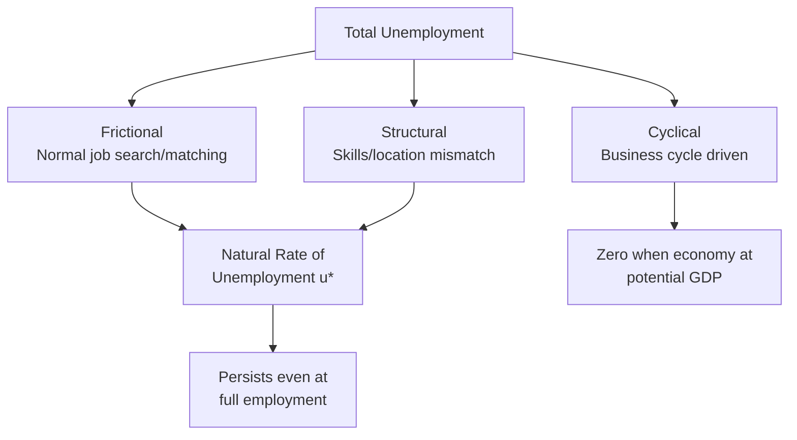

## Types of Unemployment: Frictional, Structural, Cyclical

### Definition and Core Concept

Total measured unemployment can be decomposed into three conceptually distinct categories based on their **underlying cause**: frictional, structural, and cyclical unemployment. This decomposition matters because each type responds to different economic forces and calls for different (or no) policy responses — treating all unemployment as though it stemmed from a single cause risks applying the wrong remedy.

$$u_{total} = u_{frictional} + u_{structural} + u_{cyclical}$$

The sum of frictional and structural unemployment together is defined as the **natural rate of unemployment** ($u^*$), the rate that prevails when the economy is producing at potential GDP and cyclical unemployment is zero.

### Frictional Unemployment

**Definition**: Short-term unemployment arising from the normal, ongoing process of workers and employers searching for good matches in the labor market — new graduates entering the workforce, workers voluntarily quitting to search for better opportunities, workers between jobs after being laid off from one position while searching for another, and seasonal or temporary job transitions.

**Underlying cause**: Frictional unemployment exists even when the number of job openings equals the number of job seekers economy-wide, because information is imperfect and matching workers to appropriate jobs takes time — employers cannot instantly identify the best candidate, and workers cannot instantly identify the best available opportunity.

**Key Points**

- Frictional unemployment is generally viewed as a **normal, even efficient**, feature of a well-functioning labor market: allowing time for search and matching tends to produce better long-run worker-job fit than would result if workers were forced to accept the very first available position, which likely improves productivity and job satisfaction in aggregate over time. [Inference: this efficiency framing is the standard treatment in labor economics; it does not imply that individual periods of frictional unemployment are costless or pleasant for the specific workers experiencing them.]
- Policies that primarily affect frictional unemployment include **job-matching and information services** (public employment agencies, job boards, career centers) intended to reduce the time and information costs of searching, thereby shortening frictional unemployment spells without necessarily eliminating the underlying phenomenon.
- Unemployment insurance and severance benefits are sometimes discussed in connection with frictional unemployment, since more generous benefits could, in principle, extend the duration of a worker's job search by reducing the urgency of accepting the first available offer — a trade-off between allowing better matches versus prolonging unemployment spells that is examined in applied labor economics research. [Inference: the empirical magnitude of this effect (sometimes called a "moral hazard" effect of unemployment insurance, connecting to the asymmetric information material elsewhere in this course) varies across studies, benefit designs, and labor market conditions, and is a genuinely contested empirical question rather than a settled, universally-sized effect.]

### Structural Unemployment

**Definition**: Longer-term unemployment arising from a persistent mismatch between the skills, qualifications, or geographic location of available workers and the requirements or location of available job openings.

**Common sources**:

- **Technological change**: automation or new production technologies reducing demand for certain occupational skill sets (e.g., historical shifts away from manual assembly-line roles toward technical/programming roles) faster than displaced workers can retrain or relocate.
- **Structural shifts in industry composition**: long-run declines in specific sectors (e.g., historical declines in certain manufacturing or extractive industries in some regions) leaving workers with sector-specific skills that do not transfer easily to growing sectors.
- **Geographic mismatch**: job openings concentrated in different regions than where unemployed workers reside, with relocation costs (financial, family, housing market conditions) preventing workers from moving to available opportunities.
- **Labor market institutions and rigidities**: some economists argue that certain labor market institutions (highly restrictive occupational licensing, rigid union work rules, minimum wage levels set well above market-clearing levels in specific local labor markets) can contribute to persistent mismatches by preventing wages and employment conditions from adjusting to clear the market in affected sectors. [Speculation: the extent to which any specific institutional feature meaningfully contributes to structural unemployment, versus other explanations, is genuinely contested among labor economists and is sensitive to the specific institution, country, and time period studied.]

**Key Points**

- Structural unemployment tends to be **longer-lasting** than frictional unemployment, since it typically requires retraining, education, or geographic relocation to resolve, rather than simply a normal, relatively short job-search process.
- Policies aimed at structural unemployment differ substantially from those aimed at frictional unemployment: **retraining and education programs**, relocation assistance, and policies supporting regional economic diversification are the standard categories of intervention, reflecting the different, more deeply rooted underlying cause. [Inference: the empirically demonstrated effectiveness of specific retraining program designs varies considerably across studies and program types, and is an active area of applied labor and public economics research rather than a settled matter with a single confirmed "best" program design.]

### Cyclical Unemployment

**Definition**: Unemployment that rises during economic contractions and falls during expansions, driven by fluctuations in aggregate demand relative to the economy's productive capacity — the component of total unemployment tied directly to the business cycle phases discussed elsewhere in this chapter.

**Underlying cause**: When aggregate demand falls short of what is needed to purchase output at potential GDP, firms reduce production and, correspondingly, reduce their demand for labor, laying off workers or reducing hiring — cyclical unemployment is essentially the labor-market manifestation of a negative output gap.

$$u_{cyclical} = u_{actual} - u^*$$

By definition, cyclical unemployment is positive during recessions (actual unemployment exceeds the natural rate), negative during periods when the economy is running above potential (an unusually "hot" or tight labor market, sometimes associated with rising inflationary pressure per the short-run Phillips curve), and zero when the economy is exactly at potential GDP.

**Key Points**

- Cyclical unemployment is the component that discretionary **countercyclical macroeconomic policy** (expansionary fiscal or monetary policy during downturns) is primarily intended to address, since it stems from an aggregate demand shortfall that policy tools can, in principle, help close — a fundamentally different intervention logic than the retraining/relocation policies relevant to structural unemployment or the job-matching services relevant to frictional unemployment.
- Attempting to use demand-stimulus policy to reduce frictional or structural unemployment (rather than cyclical unemployment) is generally viewed in mainstream macroeconomic theory as ineffective at best and potentially inflationary at worst, since stimulating aggregate demand does not directly resolve a skills mismatch or speed up voluntary job search — this is precisely the logic underlying the natural rate hypothesis and the vertical long-run Phillips curve discussed under macroeconomic goals: pushing unemployment below $u^*$ via demand stimulus alone tends to generate accelerating inflation rather than a sustainable reduction in structural/frictional unemployment.

### Diagram: Decomposing the Unemployment Rate Over the Business Cycle

<svg xmlns="http://www.w3.org/2000/svg" viewBox="0 0 640 360" font-family="sans-serif">
<text x="320" y="24" text-anchor="middle" font-size="15" font-weight="bold">Cyclical Unemployment Around the Natural Rate (svg_diagram)</text>
<line x1="80" y1="320" x2="580" y2="320" stroke="black" stroke-width="2" />
<line x1="80" y1="320" x2="80" y2="60" stroke="black" stroke-width="2" />
<text x="560" y="340" font-size="13">Time</text>
<text x="20" y="65" font-size="13">Unemployment Rate</text>
<line x1="80" y1="200" x2="580" y2="200" stroke="#7c3aed" stroke-width="2.5" stroke-dasharray="6,3" />
<text x="440" y="192" font-size="12" fill="#7c3aed" font-weight="bold">Natural Rate u* (frictional + structural)</text>
<path d="M80,210 Q 150,290 220,300 Q 290,305 320,180 Q 350,100 420,90 Q 490,85 530,180 Q 550,220 570,205" stroke="#dc2626" stroke-width="2.5" fill="none" />
<text x="90" y="230" font-size="11" fill="#dc2626">Actual unemployment rate</text>
<path d="M220,300 L220,200" stroke="#16a34a" stroke-width="1.5" stroke-dasharray="3,3" />
<text x="150" y="270" font-size="11" fill="#16a34a">Positive cyclical</text>
<text x="150" y="283" font-size="11" fill="#16a34a">unemployment (recession)</text>
<path d="M420,90 L420,200" stroke="#2563eb" stroke-width="1.5" stroke-dasharray="3,3" />
<text x="430" y="140" font-size="11" fill="#2563eb">Negative cyclical</text>
<text x="430" y="153" font-size="11" fill="#2563eb">unemployment (boom)</text>
</svg>

### Worked Numerical Example

Suppose an economy's natural rate of unemployment (frictional + structural combined) is estimated at $u^* = 4.5\%$.

**Scenario A — Recession**: Actual unemployment rate = 8.0%. Cyclical unemployment $= 8.0\% - 4.5\% = 3.5$ percentage points. This entire 3.5-point excess represents workers unemployed due to insufficient aggregate demand, and would be the appropriate target for countercyclical stabilization policy.

**Scenario B — Economic boom**: Actual unemployment rate = 3.2%. Cyclical unemployment $= 3.2\% - 4.5\% = -1.3$ percentage points (negative), indicating the economy is operating with less unemployment than the natural rate — a historically tight labor market, potentially generating upward pressure on wages and prices per the short-run Phillips curve relationship.

**Illustrating the frictional/structural split**: Suppose further analysis of the 4.5% natural rate estimates that 2.8 percentage points reflect frictional unemployment (normal job-search turnover) and 1.7 percentage points reflect structural unemployment (skills/geographic mismatches in specific sectors). A policymaker observing this breakdown would recognize that job-matching services and information platforms are the more relevant tool for the 2.8-point frictional component, while retraining programs targeted at mismatched sectors are more relevant for the 1.7-point structural component — and that neither component would be expected to respond meaningfully to interest-rate cuts or fiscal stimulus aimed at closing an output gap, since by construction there is no output gap contributing to either of these two components.

### Distinguishing the Three Types in Practice

**Key Points**

- In practice, distinguishing frictional, structural, and cyclical unemployment within *observed* unemployment data is genuinely difficult, since the classification depends on the *underlying cause* of an individual's unemployment spell, which is not directly observable in standard labor force survey data — economists must infer the breakdown using statistical and structural modeling techniques (e.g., examining unemployment duration distributions, sectoral/geographic mismatch indicators such as vacancy-unemployment matching efficiency, or estimating the natural rate via econometric models incorporating the Phillips curve relationship). [Inference: different estimation methodologies can and do produce different natural-rate and decomposition estimates for the same underlying economy and time period, meaning the frictional/structural/cyclical split reported by any given source should be understood as a model-dependent estimate rather than a directly measured quantity.]
- The natural rate of unemployment itself is **not a fixed constant over time** — it can shift due to demographic change (e.g., a changing age composition of the labor force, since younger workers typically experience higher frictional unemployment due to more frequent job transitions), changes in labor market institutions (unemployment insurance generosity, minimum wage levels, occupational licensing extent), and structural economic shifts (major technological transitions affecting the pace of structural mismatch) — meaning economists periodically revise their natural-rate estimates as new evidence and modeling approaches become available. [Unverified: any specific current numerical estimate of the natural rate for a given economy should be checked against current research and central bank publications rather than treated as a fixed historical value.]

**Related Topics**

- Measuring Unemployment: Labor Force Participation and Rates
- The Natural Rate of Unemployment and Okun's Law
- Macroeconomic Goals: Growth, Employment, Price Stability
- The Phillips Curve and the Unemployment-Inflation Relationship
- Business Cycles: Phases and Indicators
- Labor Market Search and Matching Theory
- Unemployment Insurance Design and Labor Market Incentives
- Regional Economic Diversification and Structural Adjustment Policy