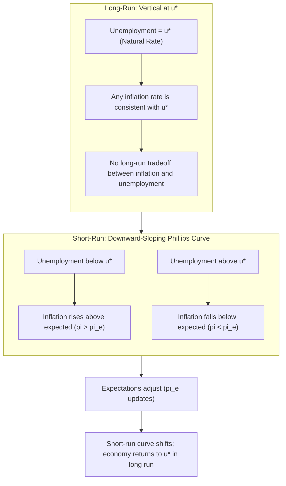

## Natural Rate of Unemployment and Full Employment

### Definition and Conceptual Foundation

The **natural rate of unemployment** ($u^*$ or $U_n$) is the rate of unemployment that exists when the labor market is in equilibrium — that is, when the economy is neither in a boom nor a recession, and actual output equals potential output. At this rate, unemployment persists not because of a shortage of jobs relative to aggregate demand, but because of structural and frictional characteristics inherent to any dynamic labor market.

The natural rate is composed of two non-cyclical categories of unemployment:

- **Frictional unemployment**: Short-term unemployment arising from the normal process of workers searching for jobs and firms searching for workers. It reflects time lags in matching job seekers to vacancies (e.g., a new graduate searching for a first job, or a worker between jobs after relocating).
- **Structural unemployment**: Longer-term unemployment arising from a mismatch between the skills workers have and the skills employers demand, or from geographic mismatches, technological change, or institutional rigidities (e.g., minimum wage laws, occupational licensing).

$$u^* = u_{frictional} + u_{structural}$$

Cyclical unemployment, by contrast, is excluded from the natural rate by definition — it arises from deficient aggregate demand during recessions and disappears during expansions.

### Full Employment

**Full employment** is the macroeconomic state in which the economy is operating at the natural rate of unemployment — i.e., $u = u^*$. This does not mean zero unemployment. Full employment is consistent with a positive unemployment rate because frictional and structural unemployment cannot be eliminated by demand-side policy.

$$U_{full\ employment} = u^* > 0$$

At full employment:

- The economy produces at (or very near) **potential output** (also called potential GDP, $Y^*$).
- Cyclical unemployment is zero: $u_{cyclical} = u - u^* = 0$.
- There is no persistent upward or downward pressure on inflation stemming from labor market slack or tightness.

**Key Points**

- Full employment ≠ 0% unemployment.
- The natural rate is a benchmark, not a fixed constant — it changes over time with demographics, institutions, and policy.
- Operating below $u^*$ (unemployment lower than natural rate) is associated with an overheating economy and accelerating inflation.
- Operating above $u^*$ indicates the presence of cyclical unemployment and an output gap.

### The NAIRU: Non-Accelerating Inflation Rate of Unemployment

The natural rate is often operationalized in modern macroeconomics as the **NAIRU** (Non-Accelerating Inflation Rate of Unemployment) — the unemployment rate consistent with stable, non-accelerating inflation. The NAIRU concept emerged from the expectations-augmented Phillips Curve framework developed by Milton Friedman and Edmund Phelps in the late 1960s.

The expectations-augmented Phillips Curve is expressed as:

$$\pi = \pi^e - \alpha(u - u^*)$$

Where:

- $\pi$ = actual inflation rate
- $\pi^e$ = expected inflation rate
- $u$ = actual unemployment rate
- $u^*$ = natural rate of unemployment (NAIRU)
- $\alpha$ = a positive parameter capturing the sensitivity of inflation to the unemployment gap

**Interpretation:**

- If $u = u^*$, then $\pi = \pi^e$ — inflation is stable at whatever level is expected, with no tendency to accelerate or decelerate.
- If $u < u^*$ (unemployment below natural rate), labor markets are tight, wage pressures build, and $\pi > \pi^e$ — inflation accelerates.
- If $u > u^*$ (unemployment above natural rate), labor markets are slack, and $\pi < \pi^e$ — inflation decelerates (disinflation).

This relationship implies there is **no long-run tradeoff** between inflation and unemployment: policymakers cannot permanently push $u$ below $u^*$ without triggering ever-accelerating inflation, since $\pi^e$ eventually adjusts upward to match sustained actual inflation.

### Diagram: Short-Run vs. Long-Run Phillips Curve

### Determinants of the Natural Rate

The natural rate is not fixed; it responds to structural features of the economy:

1. **Labor market institutions**
   - Unemployment insurance generosity and duration (longer/higher benefits can raise $u^*$ by reducing urgency to accept job offers)
   - Minimum wage laws (can raise structural unemployment among low-skill workers if set above market-clearing wage)
   - Unionization and collective bargaining power
   - Employment protection legislation (hiring/firing costs)
2. **Demographics**
   - Age composition of the labor force (younger workers historically have higher frictional unemployment due to more frequent job transitions)
   - Labor force participation trends
3. **Technological change and structural shifts**
   - Automation and skill-biased technological change can raise structural unemployment if worker retraining lags job displacement
   - Sectoral shifts (e.g., manufacturing decline, service-sector growth)
4. **Search and matching efficiency**
   - Information availability (job boards, recruiting platforms) can lower frictional unemployment
   - Geographic mobility and housing market constraints affect matching efficiency
5. **Hysteresis effects**
   - [Inference] Some economists argue that prolonged periods of high cyclical unemployment can raise the natural rate itself, as long-term unemployed workers lose skills, networks, and labor force attachment — a phenomenon known as **hysteresis**. This remains a debated extension to the standard NAIRU framework rather than a universally accepted mechanical relationship.

### Measuring and Estimating the Natural Rate

The natural rate is **not directly observable** — it must be estimated statistically. Common approaches include:

- **Congressional Budget Office (CBO) / Federal Reserve estimates**: Use structural models incorporating demographic trends, historical Phillips Curve relationships, and labor market survey data.
- **Statistical filtering methods**: Techniques such as the Hodrick-Prescott (HP) filter or Kalman filter smooth actual unemployment data to extract a trend component interpreted as the natural rate.
- **Phillips Curve estimation**: Econometrically estimating $u^*$ as the unemployment rate at which inflation is stable, using historical inflation-unemployment data.

[Unverified] Point estimates of the U.S. natural rate vary across institutions and time periods; historically, estimates have ranged roughly between 4% and 6%, though these figures shift with each data revision and model specification. Because $u^*$ is a latent (unobserved) variable, all such estimates carry meaningful uncertainty bands, and economists frequently revise past estimates using updated data.

### Full Employment, Output Gap, and Okun's Law

Full employment connects directly to the **output gap** concept via **Okun's Law**, an empirical relationship between cyclical unemployment and the deviation of actual GDP from potential GDP:

$$\frac{Y - Y^*}{Y^*} = -\beta(u - u^*)$$

Where:

- $Y$ = actual real GDP
- $Y^*$ = potential real GDP (output at full employment)
- $\beta$ = Okun's coefficient (empirically often cited [Unverified] around 2 for the U.S., though estimates vary by period and methodology)

This equation shows that each percentage point unemployment rises above $u^*$ is associated with a multiple-percentage-point shortfall of actual GDP below potential GDP, reflecting underutilized labor and capital, discouraged workers exiting the labor force, and reduced hours for underemployed workers.

### Example

Suppose an economy has:

- Natural rate of unemployment $u^* = 5\%$
- Current actual unemployment $u = 7\%$
- Okun's coefficient $\beta = 2$

The output gap is:

$$\frac{Y - Y^*}{Y^*} = -2(7\% - 5\%) = -4\%$$

This implies actual output is approximately 4% below potential output — the economy has a **recessionary (negative) output gap**, consistent with the 2-percentage-point excess of cyclical unemployment above the natural rate.

If instead $u = 3\%$ (below the natural rate), the output gap would be:

$$\frac{Y - Y^*}{Y^*} = -2(3\% - 5\%) = +4\%$$

A positive output gap of this kind signals an **overheating economy**, operating beyond sustainable capacity, typically accompanied by rising inflationary pressure as firms bid up wages to attract scarce workers.

### Policy Implications

- **Monetary policy**: Central banks (e.g., the Federal Reserve under its dual mandate) use estimates of $u^*$ to calibrate policy. If actual unemployment is believed to be below $u^*$, tightening (raising interest rates) may be used to cool demand and prevent accelerating inflation. If above $u^*$, easing may be used to stimulate demand.
- **Fiscal policy**: Government spending and taxation aimed at closing a negative output gap (stimulus) are generally considered appropriate only when unemployment exceeds the natural rate; stimulus applied when $u < u^*$ risks fueling inflation rather than raising real output.
- **Policy uncertainty**: [Inference] Because $u^*$ is estimated with uncertainty, real-time policy decisions based on the natural rate carry the risk of misjudging the true amount of labor market slack — a limitation frequently acknowledged in central bank communications and academic critiques of Phillips Curve-based policy rules. Actual central bank frameworks and the weight placed on NAIRU estimates may vary by institution and over time.

### Distinguishing Natural Rate from Related Concepts

| Concept | Definition | Relation to $u^*$ |
| --- | --- | --- |
| Cyclical unemployment | Unemployment due to deficient aggregate demand | Zero at $u^*$; positive above it |
| Frictional unemployment | Short-term search/matching unemployment | Component of $u^*$ |
| Structural unemployment | Skill/geographic mismatch unemployment | Component of $u^*$ |
| NAIRU | Unemployment rate consistent with stable inflation | Operational proxy for $u^*$ |
| Actual unemployment rate | Observed unemployment at a point in time | Can be above, below, or equal to $u^*$ |

### Common Misconceptions

- **Misconception**: Full employment means 0% unemployment.

  **Correction**: Full employment is compatible with a positive rate of unemployment equal to $u^*$, since frictional and structural unemployment are structurally unavoidable.
- **Misconception**: The natural rate is a fixed, universal constant.

  **Correction**: $u^*$ varies across countries and time periods, shifting with demographics, institutions, and technology.
- **Misconception**: Policymakers can permanently reduce unemployment below $u^*$ through demand stimulus.

  **Correction**: According to the expectations-augmented Phillips Curve, attempts to hold $u < u^*$ indefinitely lead to ever-accelerating inflation, not a permanent reduction in unemployment, once inflation expectations adjust.

### Conclusion

The natural rate of unemployment represents the frictional and structural "floor" of unemployment consistent with a labor market in equilibrium and stable inflation, while full employment describes the corresponding macroeconomic state in which the economy operates at that rate with no cyclical unemployment. Together, these concepts anchor the modern understanding of the inflation-unemployment relationship, replacing the naive belief in a stable, exploitable long-run Phillips Curve tradeoff with the expectations-augmented framework in which only the short-run tradeoff exists, and the long-run relationship is vertical at $u^*$.

**Related Topics**

- Phillips Curve (short-run vs. long-run) and its historical evolution
- Okun's Law and the output gap
- Hysteresis in labor markets
- Inflation expectations formation (adaptive vs. rational expectations)
- Labor force participation rate and discouraged worker effect
- Minimum wage and structural unemployment
- Central bank dual mandate and monetary policy rules (e.g., Taylor Rule)
- Unemployment insurance design and search theory
- Sahm Rule and real-time recession indicators