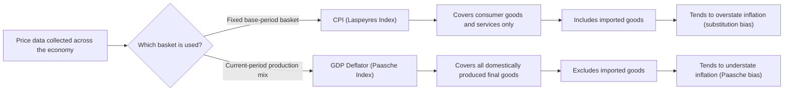

## Measuring Inflation: Consumer Price Index and GDP Deflator

### Definition of Inflation

**Inflation** is a sustained increase in the general price level of goods and services in an economy over time, resulting in a decline in the purchasing power of a unit of currency. Inflation is measured as the percentage change in a price index between two periods:

$$\pi_t = \frac{P_t - P_{t-1}}{P_{t-1}} \times 100$$

Where $P_t$ is the value of a price index in period $t$. Because prices for different goods do not move uniformly, economists rely on constructed price indices that aggregate price changes across a basket of goods and services into a single summary statistic.

The two most prominent price indices are the **Consumer Price Index (CPI)** and the **GDP Deflator**, each built on different methodologies and each capturing a different scope of the economy's price changes.

### Consumer Price Index (CPI)

#### Definition and Construction

The CPI measures the average change over time in the prices paid by urban consumers for a fixed **market basket** of consumer goods and services (e.g., food, housing, apparel, transportation, medical care, recreation, education). It is a **Laspeyres-type index**, meaning it uses a fixed base-period basket of goods and reprices that same basket each period.

$$CPI_t = \frac{\text{Cost of base-period basket at period } t \text{ prices}}{\text{Cost of base-period basket at base-period prices}} \times 100$$

Formally, with base-period quantities $q_0$ and prices $p_t$:

$$CPI_t = \frac{\sum_i p_{i,t} \cdot q_{i,0}}{\sum_i p_{i,0} \cdot q_{i,0}} \times 100$$

#### Construction Steps

1. **Survey consumer spending** to determine the basket's composition and expenditure weights (e.g., via household expenditure surveys).
2. **Fix the basket** of goods and quantities at base-period levels.
3. **Collect prices** for each item in the basket every period from a sample of retail outlets and service providers.
4. **Compute the weighted cost** of the fixed basket at current prices.
5. **Index the result** relative to a base period (base period conventionally set to 100).
6. **Calculate the inflation rate** as the percentage change in the index across periods.

#### Example

Assume a simplified two-good basket: bread and gasoline, fixed at base-year (Year 1) quantities.

| Good | Base Qty | Base Price | Base Cost | Year 2 Price | Year 2 Cost |
| --- | --- | --- | --- | --- | --- |
| Bread | 100 loaves | $2.00 | $200 | $2.20 | $220 |
| Gasoline | 50 gallons | $3.00 | $150 | $3.60 | $180 |
| **Total** |  |  | **$350** |  | **$400** |

$$CPI_{Year\ 2} = \frac{400}{350} \times 100 \approx 114.3$$

$$\pi = \frac{114.3 - 100}{100} \times 100 = 14.3\%$$

Consumer prices for this basket rose approximately 14.3% between Year 1 and Year 2.

#### Variants of the CPI

- **Headline CPI**: Includes all items in the basket, including volatile categories.
- **Core CPI**: Excludes food and energy prices, which are typically more volatile due to supply shocks (e.g., weather, geopolitical events), providing a smoother measure of underlying inflation trends.
- **CPI-U**: Consumer Price Index for All Urban Consumers.
- **CPI-W**: Consumer Price Index for Urban Wage Earners and Clerical Workers (used for indexing certain benefit programs in the U.S.).
- **Chained CPI (C-CPI-U)**: Adjusts the basket periodically to account for consumer substitution behavior, addressing one of the key biases of the standard fixed-basket CPI.

### GDP Deflator

#### Definition and Construction

The **GDP Deflator** (also called the implicit price deflator) measures the average price level of **all goods and services produced domestically** within an economy — not just consumer goods, but also capital goods, government purchases, and exports (net of imports). It is a **Paasche-type index**, meaning it uses current-period quantities rather than a fixed base-period basket.

$$\text{GDP Deflator}_t = \frac{\text{Nominal GDP}_t}{\text{Real GDP}_t} \times 100$$

Where:

- **Nominal GDP** = value of all final goods and services produced, measured at current-period prices
- **Real GDP** = value of all final goods and services produced, measured at constant base-period prices

Formally:

$$\text{GDP Deflator}_t = \frac{\sum_i p_{i,t} \cdot q_{i,t}}{\sum_i p_{i,0} \cdot q_{i,t}} \times 100$$

Because the GDP deflator uses **current-period quantities** ($q_t$) rather than fixed base-period quantities, it automatically adjusts its "basket" composition every period to reflect what was actually produced, capturing shifts in the structure of output.

#### Example

Assume an economy produces only two goods: computers and haircuts.

**Base Year (Year 1):**

| Good | Quantity | Price |
| --- | --- | --- |
| Computers | 10 | $1,000 |
| Haircuts | 200 | $20 |

Nominal GDP (Year 1) = $(10 \times 1000) + (200 \times 20) = 10{,}000 + 4{,}000 = \$14{,}000$

Real GDP (Year 1, base year) = $14,000 (same as nominal in base year)

**Year 2:**

| Good | Quantity | Price |
| --- | --- | --- |
| Computers | 12 | $900 |
| Haircuts | 220 | $25 |

Nominal GDP (Year 2) = $(12 \times 900) + (220 \times 25) = 10{,}800 + 5{,}500 = \$16{,}300$

Real GDP (Year 2, using base-year prices) = $(12 \times 1000) + (220 \times 20) = 12{,}000 + 4{,}400 = \$16{,}400$

$$\text{GDP Deflator}_{Year\ 2} = \frac{16{,}300}{16{,}400} \times 100 \approx 99.4$$

In this example, the GDP deflator falls slightly below 100, indicating that, weighted by Year 2's production mix, the average price level fell marginally relative to the base year — driven by the sharp fall in computer prices, even though haircut prices rose.

### Key Differences: CPI vs. GDP Deflator

| Feature | CPI | GDP Deflator |
| --- | --- | --- |
| **Scope** | Consumer goods and services only (fixed basket) | All domestically produced final goods and services |
| **Imports** | Included (consumers buy imported goods) | Excluded (only domestic production counted) |
| **Basket weights** | Fixed at base-period quantities (Laspeyres index) | Current-period quantities (Paasche index) |
| **Government/capital goods** | Not included | Included |
| **Substitution bias** | Present (overstates inflation, since it ignores consumer substitution toward relatively cheaper goods) | Absent (basket automatically updates to current consumption/production patterns) |
| **New goods/quality bias** | Present until basket revisions occur | Reflected more quickly since weights update every period |
| **Update frequency of basket** | Periodically revised (e.g., every 1-2 years in the U.S.) [Unverified — revision schedules vary by country and time period] | Effectively every period |

### Index Number Bias

#### Laspeyres Index Bias (CPI)

Because the CPI holds the basket fixed at base-period quantities, it does not account for consumer **substitution** toward goods that become relatively cheaper. This causes the CPI to systematically **overstate** the true cost-of-living increase, a phenomenon known as **substitution bias**.

Other recognized biases in the standard CPI include:

- **Quality change bias**: Price increases that reflect quality improvements (e.g., a more powerful laptop) may be misclassified as pure inflation if not properly adjusted for.
- **New product bias**: New goods entering the market are not immediately incorporated into the fixed basket, delaying capture of price declines that often accompany a product's maturation (e.g., electronics).
- **Outlet substitution bias**: Consumers shifting purchases toward discount retailers are not immediately reflected in the fixed sampling of outlets.

#### Paasche Index Bias (GDP Deflator)

Because the GDP deflator uses current-period quantities, it tends to **understate** the true cost-of-living increase, since it implicitly assumes consumers/producers have already fully substituted toward relatively cheaper goods — even though such substitution involves trade-offs (e.g., reduced satisfaction or utility) not captured in the index.

$$\text{Laspeyres Index} \geq \text{True Cost-of-Living Index} \geq \text{Paasche Index}$$

[Inference] This ordering is a general theoretical property of the two index formulas under standard consumer substitution behavior; the magnitude of the gap between them is empirical and varies by period and economy.

### Diagram: CPI vs. GDP Deflator Construction Logic

### Relationship to Real Variables

Both indices are used to convert nominal values into real (inflation-adjusted) values:

$$\text{Real GDP} = \frac{\text{Nominal GDP}}{\text{GDP Deflator} / 100}$$

$$\text{Real Wage} = \frac{\text{Nominal Wage}}{\text{CPI} / 100}$$

The choice of deflator matters: since the CPI includes imported consumer goods and the GDP deflator does not, a country experiencing a sharp rise in imported oil prices, for instance, would see this reflected more strongly in CPI-based inflation measures than in GDP-deflator-based measures — a distinction with real consequences for how "inflation" is reported depending on which index is cited.

**Key Points**

- CPI measures cost of living for a **fixed consumer basket**, including imports; tends to **overstate** inflation due to substitution, quality, and new-product biases.
- GDP deflator measures prices of **all domestically produced output**, using **current-period weights**; tends to **understate** the true cost-of-living increase due to Paasche bias.
- Core CPI (excluding food and energy) is often used by policymakers to track underlying inflation trends, filtering out short-term volatility.
- Real variables (real GDP, real wages) require deflating nominal values by an appropriate price index, and the choice of index affects the resulting real value.

### Policy and Practical Use

- **CPI** is the primary index used for indexing wages, Social Security and other benefit payments, tax brackets, and consumer contracts (cost-of-living adjustments, or COLAs) in many countries, because it directly reflects the cost of a representative consumer's purchases.
- **GDP Deflator** is preferred by macroeconomists for deflating national output measures (nominal to real GDP conversion) because its scope matches the full production boundary of the economy, avoiding the mismatch that would occur from applying a consumer-focused index to investment or government spending components of GDP.
- Central banks often examine **multiple inflation measures** (CPI, core CPI, GDP deflator, and other indices such as the Personal Consumption Expenditures (PCE) price index in the U.S.) to cross-validate underlying inflationary pressure and account for the known biases of any single measure. [Unverified] The specific index weighted most heavily in policy decisions varies by central bank and monetary policy framework.

### Common Misconceptions

- **Misconception**: CPI and GDP deflator should always report the same inflation rate.

  **Correction**: They can diverge meaningfully because they cover different baskets of goods (consumer-only vs. all domestic production), include/exclude imports differently, and use different weighting methodologies (fixed vs. current-period).
- **Misconception**: A rising CPI always means the average consumer's cost of living has risen by exactly the reported percentage.

  **Correction**: Due to substitution bias and quality-adjustment issues, the CPI is generally understood to somewhat overstate the true increase in the cost of living for the average consumer.
- **Misconception**: The GDP deflator is a better all-purpose "inflation rate" for households.

  **Correction**: Because it excludes imported consumer goods and includes capital/government goods irrelevant to household budgets, the GDP deflator is less representative of a typical household's experienced inflation than the CPI.

### Conclusion

The CPI and GDP deflator are the two foundational tools for measuring inflation, each built on a different index methodology and covering a different scope of economic activity. The CPI, a Laspeyres-type fixed-basket index focused on consumer goods and services (including imports), is the standard reference for cost-of-living adjustments but tends to overstate true inflation due to substitution and quality biases. The GDP deflator, a Paasche-type index covering all domestically produced final goods and services with current-period weights, is the standard tool for converting nominal GDP into real GDP but tends to understate the true cost-of-living increase. Understanding both — along with their respective biases — is essential for correctly interpreting reported inflation figures and their implications for real income, monetary policy, and economic welfare.

**Related Topics**

- Laspeyres, Paasche, and Fisher (ideal) index number theory
- Core inflation vs. headline inflation
- Personal Consumption Expenditures (PCE) price index
- Purchasing Power Parity (PPP) and international price comparisons
- Real vs. nominal variables (wages, interest rates, GDP)
- Hedonic pricing and quality adjustment methods
- Cost-of-living adjustments (COLAs) and indexed contracts
- Producer Price Index (PPI) as an upstream inflation indicator