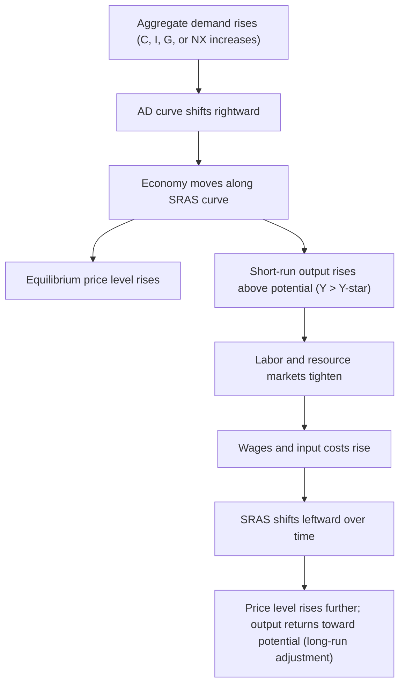
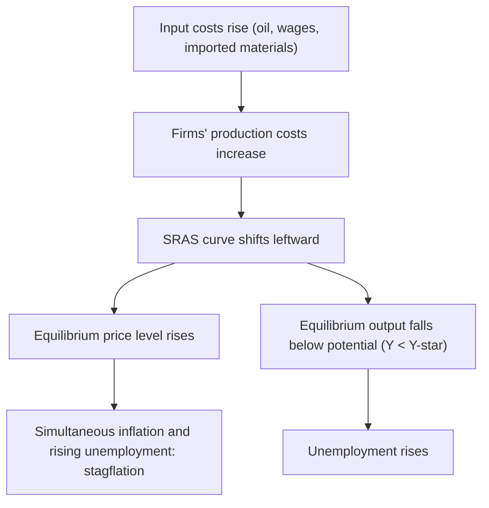
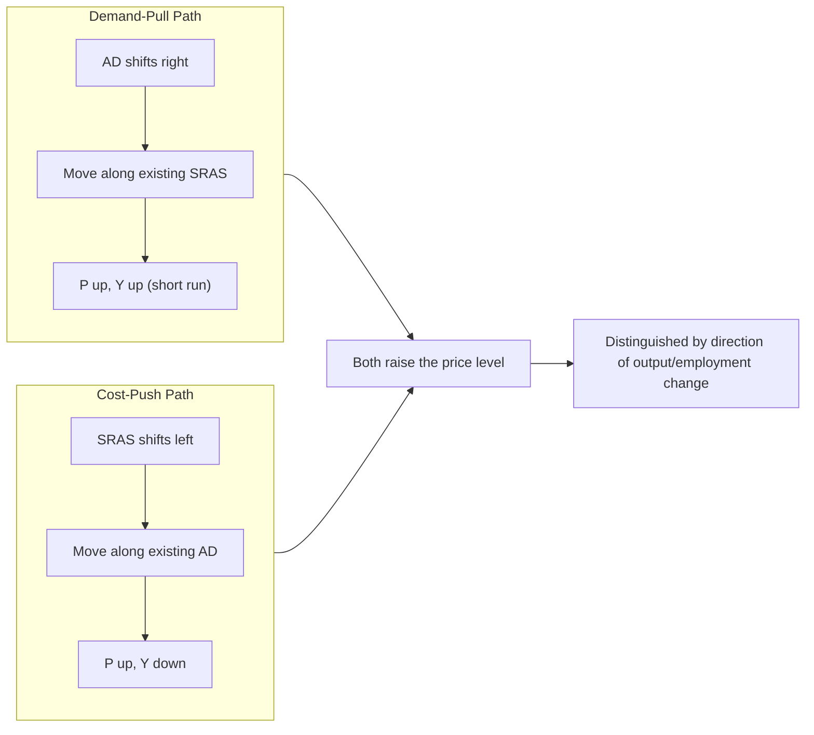

## Causes of Inflation: Demand-Pull and Cost-Push

### Overview

Sustained increases in the general price level can arise from two broad categories of macroeconomic disturbance, distinguished by which side of the market initiates the price pressure: **demand-pull inflation**, originating from excess aggregate demand relative to the economy's productive capacity, and **cost-push inflation**, originating from rising production costs that reduce aggregate supply. Both are typically analyzed using the **Aggregate Demand–Aggregate Supply (AD-AS) model**, in which inflation corresponds to a rise in the equilibrium price level.

### Demand-Pull Inflation

#### Definition

**Demand-pull inflation** occurs when aggregate demand (AD) grows faster than the economy's productive capacity (aggregate supply), pulling the price level upward as "too much money chases too few goods." It is most commonly associated with the economy operating at or beyond full employment, where output cannot expand much further to absorb additional demand.

#### Mechanism

In the AD-AS framework, an outward shift of the aggregate demand curve — with the short-run aggregate supply (SRAS) curve unchanged — raises both the equilibrium price level and, in the short run, real output above potential output ($Y > Y^*$).

$$AD \uparrow \Rightarrow P \uparrow \text{ and } Y \uparrow \text{ (short run)}$$

Common sources of aggregate demand shifts include:

1. **Consumption (C)**: Rising consumer confidence, wealth effects (e.g., asset price booms), or falling household saving rates.
2. **Investment (I)**: Lower interest rates, optimistic business expectations, or expansionary credit conditions boosting business and residential investment.
3. **Government spending (G)**: Expansionary fiscal policy — increased government purchases funded by borrowing or money creation.
4. **Net exports (NX)**: A depreciating currency or rising foreign income boosting export demand.
5. **Monetary expansion**: Increases in the money supply, particularly when growth in the money supply outpaces growth in real output, consistent with the quantity theory of money:

$$M \cdot V = P \cdot Y$$

Where $M$ = money supply, $V$ = velocity of money, $P$ = price level, $Y$ = real output. [Inference] Holding $V$ and $Y$ roughly constant, an increase in $M$ implies a proportional increase in $P$ — this is a long-run classical relationship and does not necessarily hold precisely in the short run, when velocity and output can also adjust.

#### Diagram: Demand-Pull Inflation in the AD-AS Framework

#### Example

Suppose a central bank pursues an expansionary monetary policy, lowering interest rates significantly. Cheaper credit encourages a surge in mortgage borrowing and business investment. Simultaneously, government spending on infrastructure rises. If these demand increases occur while the economy is already near full employment, firms — facing limited spare capacity — respond primarily by raising prices rather than substantially increasing output, since labor and capital are already largely utilized. The result is a rise in the general price level: demand-pull inflation.

### Cost-Push Inflation

#### Definition

**Cost-push inflation** occurs when the costs of production rise independently of demand conditions, shifting the short-run aggregate supply (SRAS) curve leftward (or upward) and pushing the price level up while typically reducing real output — a combination often referred to as **stagflation** when it involves both rising inflation and rising unemployment simultaneously.

#### Mechanism

$$SRAS \downarrow (\text{shifts left}) \Rightarrow P \uparrow \text{ and } Y \downarrow$$

Common sources of cost-push shocks include:

1. **Supply shocks to key inputs**: Sudden increases in the price of oil, energy, or other critical raw materials (e.g., OPEC supply restrictions, geopolitical conflict disrupting commodity flows).
2. **Wage-push pressures**: Rapid nominal wage increases that outpace productivity growth, often driven by strong union bargaining power or labor shortages, raising unit labor costs for firms.
3. **Supply chain disruptions**: Logistics bottlenecks, shipping constraints, or input shortages that raise firms' input costs (e.g., semiconductor shortages affecting downstream manufacturing).
4. **Exchange rate depreciation**: A weaker domestic currency raises the cost of imported inputs and intermediate goods, feeding into higher production costs (imported inflation).
5. **Regulatory or tax changes**: New taxes on production inputs, increased compliance costs, or regulatory burdens that raise the marginal cost of production.
6. **Natural disasters or supply disruptions**: Events that destroy productive capacity or disrupt harvests/production (e.g., droughts affecting agricultural output).

#### Diagram: Cost-Push Inflation in the AD-AS Framework

#### Example

Consider an economy heavily reliant on imported oil. A geopolitical conflict disrupts oil supply routes, causing global oil prices to spike sharply. Firms across transportation, manufacturing, and energy-intensive industries face higher input costs and pass these on to consumers via higher prices for goods and services. Simultaneously, higher costs lead some firms to cut production and reduce hiring. The economy experiences both rising prices and rising unemployment — the classic cost-push, stagflationary pattern, historically associated with the 1973 and 1979 oil price shocks.

### Comparing Demand-Pull and Cost-Push Inflation

| Feature | Demand-Pull Inflation | Cost-Push Inflation |
| --- | --- | --- |
| **Initiating shift** | Aggregate demand (AD) shifts right | Aggregate supply (SRAS) shifts left |
| **Effect on price level** | Rises | Rises |
| **Effect on output/employment (short run)** | Rises (above potential) | Falls (below potential) |
| **Underlying driver** | Excess spending relative to capacity | Rising production costs |
| **Typical triggers** | Expansionary monetary/fiscal policy, credit booms, rising confidence | Commodity price shocks, wage-push, supply chain disruption, currency depreciation |
| **Associated labor market condition** | Tight labor market, falling unemployment | Can coincide with rising unemployment (stagflation) |
| **Policy tension** | Demand-side tools (tightening) directly address the cause | Demand-side tightening reduces inflation but worsens unemployment; supply-side responses are also relevant |

### The Wage-Price Spiral

A related dynamic that can perpetuate cost-push inflation is the **wage-price spiral**: rising prices erode real wages, prompting workers (particularly where collective bargaining is strong) to demand higher nominal wages to restore purchasing power; firms facing higher labor costs raise prices further to protect profit margins; the cycle repeats.

$$P \uparrow \Rightarrow W \uparrow \Rightarrow \text{Unit Costs} \uparrow \Rightarrow P \uparrow \Rightarrow \ldots$$

[Inference] Whether a wage-price spiral becomes self-sustaining depends heavily on the degree to which inflation expectations become de-anchored; if expectations remain anchored to a central bank's target, the spiral is more likely to be dampened, whereas de-anchored expectations can prolong and intensify the cycle. The empirical strength of this mechanism varies by country, labor market institutions, and time period.

### Policy Responses

**For demand-pull inflation:**

- **Contractionary monetary policy**: Raising interest rates to reduce borrowing, investment, and consumption, cooling aggregate demand.
- **Contractionary fiscal policy**: Reducing government spending or raising taxes to reduce aggregate demand directly.
- These tools directly target the root cause (excess demand) and are generally considered more straightforwardly effective against demand-pull inflation, though at the cost of slower growth or higher unemployment in the short run.

**For cost-push inflation:**

- **Monetary tightening** can reduce inflation but does so by suppressing aggregate demand further — worsening the output and employment losses already caused by the supply shock, creating a difficult policy tradeoff.
- **Supply-side policies**: Measures aimed at increasing productive capacity or resilience (e.g., diversifying energy sources, investment in productivity-enhancing infrastructure, easing supply bottlenecks) address the root cause more directly but often operate with long implementation lags.
- **Targeted subsidies or price controls**: [Speculation] Sometimes proposed as short-term relief measures (e.g., fuel subsidies), though these carry well-documented risks of distorting incentives, creating shortages, or being fiscally costly, and their appropriateness is a matter of ongoing policy debate rather than settled consensus.
- Because tightening monetary policy in response to cost-push inflation risks deepening a growth slowdown, central banks facing supply shocks often confront a more difficult tradeoff than in the pure demand-pull case.

### Diagram: Combined AD-AS View of Both Inflation Types

**Key Points**

- Demand-pull inflation: "too much spending chasing too few goods" — AD shifts right, price level and (short-run) output both rise.
- Cost-push inflation: rising input costs reduce supply — SRAS shifts left, price level rises while output and employment fall.
- Cost-push inflation can generate stagflation (simultaneous inflation and unemployment), a combination the basic demand-pull model does not produce.
- The wage-price spiral can transform a one-time cost shock into a more persistent inflationary process, particularly if inflation expectations become unanchored.
- Policy tradeoffs differ sharply: demand-side tightening cleanly addresses demand-pull inflation but exacerbates the output/employment costs of cost-push inflation.

### Common Misconceptions

- **Misconception**: All inflation has the same policy remedy.

  **Correction**: Demand-pull and cost-push inflation call for different (and sometimes conflicting) policy responses, since one stems from excess demand and the other from restricted supply.
- **Misconception**: Cost-push inflation always leads to falling output.

  **Correction**: While textbook cost-push shocks reduce short-run output (stagflation), the ultimate output effect also depends on how aggregate demand and policy respond concurrently; the pure supply-shock case assumes AD is held constant.
- **Misconception**: Rising prices are always demand-driven.

  **Correction**: A price increase alone does not reveal its cause; distinguishing demand-pull from cost-push requires examining whether output/employment are rising (demand-pull) or falling (cost-push) alongside the price increase.

### Conclusion

Demand-pull and cost-push inflation represent the two principal analytical categories for explaining sustained increases in the price level, distinguished by whether the disturbance originates on the demand side (excess aggregate spending relative to capacity) or the supply side (rising production costs restricting output). The AD-AS framework clarifies this distinction: demand-pull inflation is characterized by a rightward AD shift producing higher prices alongside higher short-run output, while cost-push inflation is characterized by a leftward SRAS shift producing higher prices alongside lower output — potentially resulting in stagflation. Because the two types of inflation have different underlying causes, they also imply different and sometimes conflicting appropriate policy responses, making accurate diagnosis of the inflationary source a critical first step in macroeconomic policymaking.

**Related Topics**

- Aggregate Demand–Aggregate Supply (AD-AS) model in depth
- Stagflation and the 1970s oil shocks
- Phillips Curve and the inflation-unemployment relationship
- Quantity theory of money and monetarism
- Inflation expectations and expectations anchoring
- Supply chain disruptions and modern inflation dynamics (e.g., post-pandemic inflation)
- Monetary policy transmission mechanisms
- Built-in (expectations-driven) inflation as a third inflation category