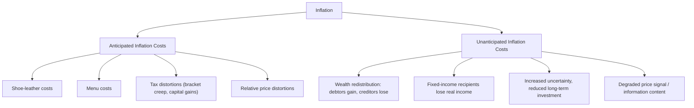
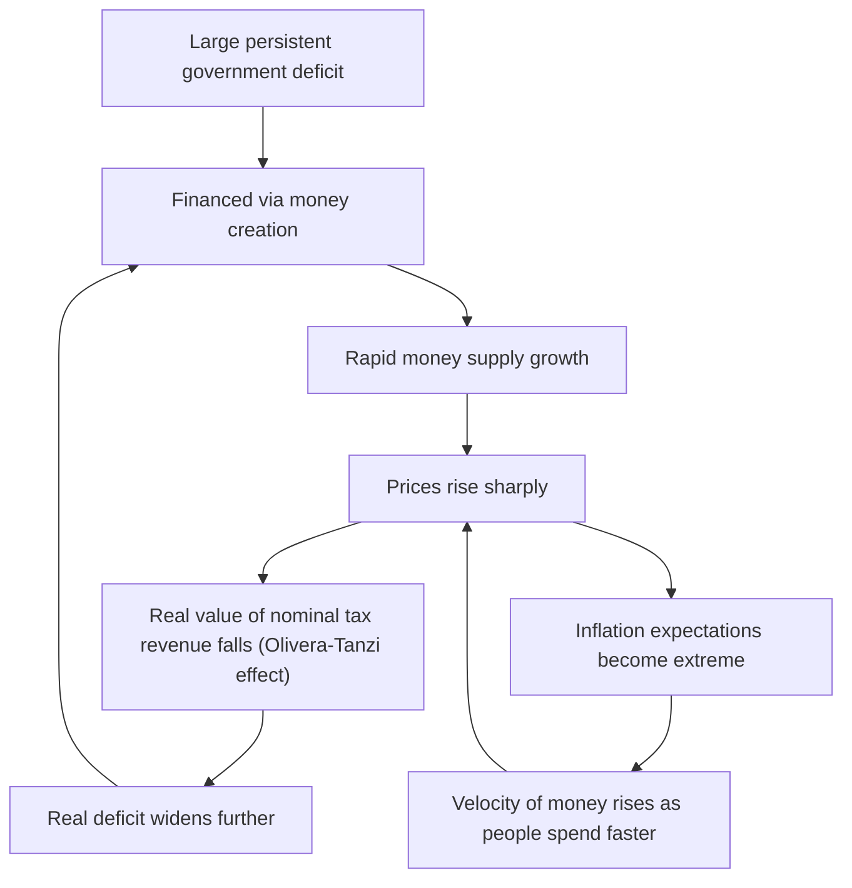

## Costs of Inflation and Hyperinflation Case Studies

### Overview

Inflation, even at moderate rates, imposes real economic costs on individuals, firms, and the broader economy. These costs arise regardless of whether inflation is fully anticipated or comes as a surprise, though the nature and severity of the costs differ across the two cases. At extreme levels, inflation can escalate into **hyperinflation**, a distinct macroeconomic phenomenon with its own causes, dynamics, and historical case studies that illustrate the costs of inflation in their most severe form.

### Costs of Anticipated Inflation

When inflation is fully expected and incorporated into economic decision-making (e.g., through indexed contracts, wage negotiations, and interest rate setting), it still imposes costs:

#### 1. Shoe-Leather Costs

The costs associated with reducing money holdings to avoid the erosion of purchasing power — named for the wear on shoes from more frequent trips to the bank or ATM. In modern terms, this includes the time and resources spent economizing on cash holdings, managing more frequent transfers between interest-bearing and non-interest-bearing accounts, and other transaction-cost-increasing behaviors.

$$\text{Real value of money holdings} = \frac{M}{P}$$

As $P$ rises, individuals hold less real money balances to avoid loss of purchasing power, incurring the transaction costs of more frequent financial management.

#### 2. Menu Costs

The real resource costs firms incur when changing prices — reprinting menus, catalogs, price tags, updating computer systems, and renegotiating contracts. Higher and more variable inflation forces firms to update prices more frequently, raising these costs.

[Inference] In modern economies with digital pricing (e.g., e-commerce, electronic shelf labels), menu costs are generally considered to have declined relative to historical estimates, though they have not been eliminated entirely, particularly for printed materials, contracts, and certain regulated pricing structures.

#### 3. Tax Distortions

Many tax systems are not fully indexed to inflation, causing inflation to interact with the tax code in distortionary ways:

- **Bracket creep**: Nominal income growth (even without real income growth) can push taxpayers into higher marginal tax brackets if brackets are not inflation-indexed.
- **Capital gains taxation**: Taxes on nominal capital gains can effectively tax illusory gains that merely reflect inflation rather than real increases in asset value.
- **Depreciation allowances**: Historical-cost-based depreciation deductions lose real value under inflation, effectively raising the real tax burden on capital investment.

#### 4. Relative Price Distortions and Resource Misallocation

Because not all prices adjust simultaneously or at the same rate, inflation can distort relative prices in the short run, leading firms and consumers to make decisions based on distorted price signals rather than genuine changes in scarcity or demand — a misallocation of resources that reduces overall economic efficiency.

#### 5. Money Illusion

[Inference] Behavioral economics literature suggests that individuals sometimes confuse nominal and real changes in value — a phenomenon known as **money illusion** — which can lead to suboptimal financial decisions even under fully anticipated inflation. The prevalence and magnitude of this effect is a matter of ongoing empirical study rather than a precisely quantified constant.

### Costs of Unanticipated Inflation

Unanticipated (or unexpectedly high/low) inflation imposes additional costs beyond those of anticipated inflation, primarily through unplanned redistribution of wealth:

#### 1. Redistribution Between Creditors and Debtors

Fixed nominal interest rate contracts do not adjust for unexpected inflation. If inflation turns out higher than expected:

$$r_{real} = r_{nominal} - \pi$$

Unexpectedly high $\pi$ lowers the realized real interest rate, **benefiting borrowers** (who repay in currency worth less than anticipated) and **harming lenders/creditors** (who receive repayment with diminished real purchasing power). Unexpectedly low inflation (or deflation) produces the opposite redistribution.

#### 2. Redistribution Between Fixed-Income Recipients and Others

Individuals relying on fixed nominal incomes (e.g., pensions not indexed to inflation, long-term fixed-wage contracts) suffer real income losses when inflation is higher than anticipated at the time the fixed payment was set.

#### 3. Increased Uncertainty and Reduced Investment

High and variable (unpredictable) inflation raises uncertainty about future costs and revenues, which [Inference] tends to discourage long-term investment and long-term contracting, as businesses find it harder to forecast real returns — an effect widely discussed in the macroeconomic literature, though its precise magnitude varies by study and economic context.

#### 4. Erosion of the Information Content of Prices

In a well-functioning market economy, relative prices communicate information about scarcity and demand. High inflation makes it harder to distinguish a genuine relative price change (signaling a shift in supply or demand for a specific good) from a general inflationary increase affecting all prices, degrading the market's price-signaling function.

### Diagram: Costs of Inflation Overview

### Hyperinflation: Definition and Causes

**Hyperinflation** is commonly defined (following economist Phillip Cagan's classic 1956 threshold) as inflation exceeding **50% per month**, which compounds to an annualized rate of over 12,000%. [Unverified] While the 50%-per-month threshold is the most widely cited definitional benchmark in the economics literature, some institutions and researchers apply different or looser thresholds when classifying episodes as hyperinflationary.

#### Root Cause

Virtually all major historical hyperinflations share a common underlying mechanism: **monetization of large, persistent government fiscal deficits** — a government finances its spending by printing money (or the equivalent, borrowing from a central bank that expands the money supply) rather than through taxation or sustainable debt issuance, typically because taxation capacity is limited, war or crisis has disrupted normal fiscal capacity, or political constraints prevent spending cuts.

This connects directly to the quantity theory of money:

$$M \cdot V = P \cdot Y$$

When $M$ grows extremely rapidly while $Y$ (real output) cannot keep pace, $P$ must rise sharply to maintain the identity — and as inflation accelerates, $V$ (velocity of money) often rises further as people rush to spend money before it loses value, compounding the price spiral.

#### Self-Reinforcing Dynamics

1. Government runs large deficit → finances via money creation
2. Money supply grows rapidly → prices rise
3. Rising prices erode real value of tax revenue collected in nominal terms (collection lags mean real tax revenue falls even as nominal deficits are financed by printing more money) — a dynamic known as the **Olivera-Tanzi effect**
4. Larger real deficit requires even more money creation to finance
5. Inflation expectations become extreme; the public accelerates spending and abandons the currency, further raising velocity
6. Cycle repeats, often ending only through fundamental fiscal and monetary reform (e.g., currency reform, spending cuts, or international stabilization support)

### Diagram: Hyperinflation Feedback Loop

### Hyperinflation Case Studies

#### Weimar Germany (1921–1923)

Following World War I, Germany faced enormous war reparations obligations under the Treaty of Versailles alongside a weakened industrial base. The German government financed both reparations and domestic spending largely through printing money.

[Unverified] Commonly cited figures describe prices roughly doubling every few days at the hyperinflation's peak in late 1923, with the currency becoming so devalued that banknotes were reportedly used as wallpaper or fuel, and workers were paid multiple times per day so they could spend wages before further devaluation. The episode ended with the introduction of the *Rentenmark*, a new currency backed by land and industrial assets, alongside fiscal and monetary reforms that restored confidence.

#### Hungary (1945–1946)

[Unverified] Post-World War II Hungary is frequently cited in the economics literature as the most extreme hyperinflation episode on record, with reported daily inflation rates and price-doubling times measured in hours rather than days at the peak. The hyperinflation resulted from war destruction, reparations obligations, and extensive deficit monetization, and was resolved through the introduction of a new currency (the forint) alongside stabilization measures.

#### Zimbabwe (2007–2009)

Zimbabwe experienced one of the most severe hyperinflations of the 21st century, driven by a combination of large fiscal deficits, extensive money creation by the central bank, and a collapse in productive capacity (partly linked to land reform policies that disrupted agricultural output). [Unverified] Widely cited estimates place peak monthly inflation in the hundreds of billions of percent range, with the government eventually issuing extremely high-denomination banknotes before abandoning the Zimbabwean dollar entirely in 2009 in favor of foreign currencies (primarily the U.S. dollar).

#### Venezuela (2016–present, peak c. 2018–2019)

Venezuela's hyperinflation emerged from a combination of collapsing oil revenues (the country's primary export and fiscal revenue source), extensive central bank financing of government deficits, capital flight, and a contracting real economy. [Unverified] Estimates from external organizations placed peak annual inflation in the millions of percent range around 2018, prompting a series of currency redenominations. As of periods described in reporting through Claude's knowledge cutoff, Venezuela's inflation rate had substantially decelerated from its hyperinflationary peak but [Unverified] remained elevated by international standards; current figures should be verified against up-to-date sources given the fast-evolving nature of the situation.

#### Comparative Table

| Episode | Approximate Period | Primary Driver | Resolution Mechanism |
| --- | --- | --- | --- |
| Weimar Germany | 1921–1923 | War reparations financed by money printing | New currency (Rentenmark), fiscal reform |
| Hungary | 1945–1946 | Post-war reconstruction deficits | New currency (forint), stabilization program |
| Zimbabwe | 2007–2009 | Fiscal deficits, collapse in output | Abandonment of domestic currency; dollarization |
| Venezuela | 2016–2019 peak | Oil revenue collapse, deficit monetization | Currency redenominations, partial dollarization |

[Unverified] Specific numerical figures cited across all these episodes (peak monthly/annual inflation rates, price-doubling times) vary somewhat across sources depending on measurement methodology and data availability during periods of economic chaos; figures above should be treated as commonly cited approximations rather than precise, universally agreed statistics.

### Costs of Hyperinflation

Hyperinflation magnifies every cost of ordinary inflation to an extreme degree, and introduces additional costs:

- **Collapse of the medium-of-exchange function**: Money becomes so unstable that barter or foreign currency substitution ("dollarization") often emerges as the domestic currency fails to reliably store value even over hours or days.
- **Wealth destruction**: Savings held in the domestic currency, and fixed nominal claims (pensions, bonds, bank deposits), can be wiped out in real terms.
- **Breakdown of long-term contracting**: Long-term contracts, credit markets, and investment planning become effectively impossible under extreme price instability.
- **Social and political instability**: [Inference] Historical episodes such as Weimar Germany are frequently linked in the historical and economic literature to broader social and political upheaval, though the precise causal weight of hyperinflation relative to other contemporaneous factors is a matter of historical interpretation rather than a settled, singular causal claim.
- **Extreme shoe-leather and menu costs**: Prices may need to be updated multiple times per day; individuals spend enormous time and effort minimizing cash holdings.

### Ending Hyperinflation: Stabilization Requirements

[Inference] Historical hyperinflation episodes are generally understood in the economics literature to require a credible, comprehensive stabilization program combining:

1. **Fiscal reform**: Closing the underlying deficit that necessitated money creation, often through spending cuts, tax reform, or external support.
2. **Monetary reform**: Ending central bank financing of the deficit, often via new central bank independence rules or currency board arrangements.
3. **Currency reform**: Introducing a new currency (sometimes pegged to a stable foreign currency or backed by real assets) to restore confidence and reset inflation expectations.
4. **Credibility mechanisms**: Visible institutional commitments (e.g., international monitoring, fixed exchange rate pegs, legal independence of the central bank) to convince the public that the new policy regime will not simply repeat the prior deficit-monetization cycle.

**Key Points**

- Even fully anticipated inflation imposes real costs: shoe-leather costs, menu costs, tax distortions, and relative price distortions.
- Unanticipated inflation adds redistributive costs between creditors/debtors and fixed-income recipients, plus increased uncertainty.
- Hyperinflation (conventionally, above 50% per month) arises almost universally from monetization of large, persistent fiscal deficits.
- The Olivera-Tanzi effect describes how inflation itself erodes real tax revenue, worsening the deficit that caused the inflation — a key self-reinforcing mechanism.
- Historical case studies (Weimar Germany, Hungary, Zimbabwe, Venezuela) share the common root cause of deficit monetization despite differing in political and economic context.
- Ending hyperinflation generally requires a credible, combined fiscal, monetary, and currency reform program.

### Common Misconceptions

- **Misconception**: Inflation only harms people if it is unexpected.

  **Correction**: Even fully anticipated inflation imposes real costs (shoe-leather costs, menu costs, tax distortions); unanticipated inflation adds further redistributive costs on top.
- **Misconception**: Hyperinflation is just "very high inflation" caused by the same mechanisms as moderate inflation.

  **Correction**: While both stem from monetary/demand-side dynamics in a broad sense, hyperinflation is specifically and almost universally linked to large-scale monetization of government deficits, a distinct causal mechanism from typical demand-pull or cost-push inflation.
- **Misconception**: Hyperinflation is resolved simply by "printing less money."

  **Correction**: Sustainable resolution generally requires addressing the underlying fiscal deficit that necessitated money printing in the first place, alongside credible institutional reforms to anchor expectations — halting money growth alone without fiscal reform is generally understood to be insufficient for a durable stabilization.

### Conclusion

Inflation imposes a range of real economic costs even when fully anticipated — including shoe-leather costs, menu costs, and tax-code distortions — and imposes additional redistributive and uncertainty-related costs when unanticipated. At the extreme, hyperinflation represents a qualitatively distinct phenomenon rooted in the monetization of unsustainable government deficits, generating a self-reinforcing spiral through mechanisms like the Olivera-Tanzi effect and rising monetary velocity. Historical case studies — from Weimar Germany and post-war Hungary to Zimbabwe and Venezuela — illustrate a consistent underlying pattern despite differing political contexts, and consistently show that credible, comprehensive fiscal and monetary reform is required to restore price stability once hyperinflation takes hold.

**Related Topics**

- Quantity theory of money and monetarist inflation theory
- Olivera-Tanzi effect and fiscal-monetary interactions
- Currency reform and dollarization
- Central bank independence and credibility
- Inflation targeting frameworks
- Sovereign debt crises and default
- Exchange rate regimes and currency pegs
- Behavioral economics of money illusion