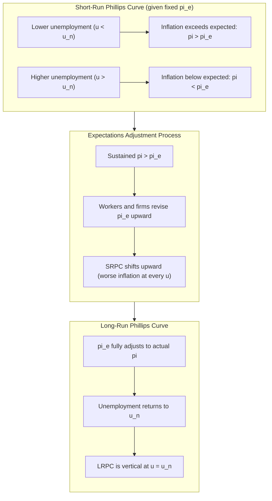
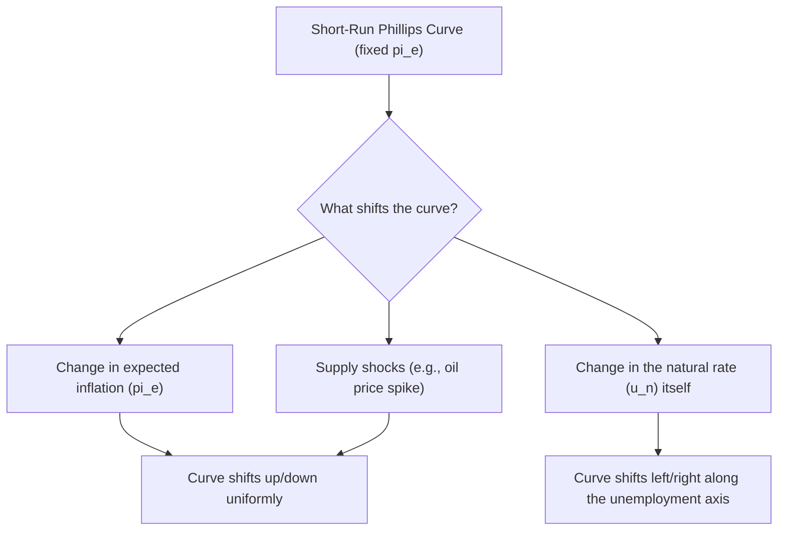

## The Phillips Curve: Short-Run and Long-Run

### Historical Origin

The **Phillips Curve** originates from a 1958 empirical study by economist A.W. Phillips, who documented an inverse relationship between the rate of nominal wage inflation and the unemployment rate in the United Kingdom over roughly a century of data. The relationship was subsequently adapted by economists Paul Samuelson and Robert Solow into a version relating **price inflation** (rather than wage inflation) to unemployment, popularizing it as a tool for macroeconomic policy analysis in the 1960s.

The original empirical Phillips Curve suggested policymakers faced a stable, exploitable **tradeoff**: lower unemployment could be achieved at the cost of higher inflation, and vice versa — a proposition that shaped macroeconomic policy debates through the 1960s before being fundamentally revised in subsequent decades.

### The Original (Simple) Phillips Curve

The basic Phillips Curve depicts a downward-sloping relationship between the inflation rate and the unemployment rate:

$$\pi = -\alpha(u - u_n)$$

Or in its earlier wage-based form:

$$\%\Delta W = -\alpha(u - u_n)$$

Where $\pi$ is the inflation rate, $u$ is the unemployment rate, $u_n$ is a reference unemployment level, and $\alpha > 0$ measures the sensitivity of inflation to labor market slack.

**Key Points**

- Lower unemployment (tighter labor markets) is associated with higher wage/price inflation, as workers gain bargaining power and firms compete more intensely for scarce labor.
- Higher unemployment (slacker labor markets) is associated with lower inflation, as reduced bargaining power and excess labor supply hold down wage growth.
- This simple version implies a **stable, downward-sloping curve** that policymakers could move along by adjusting aggregate demand.

### The Breakdown of the Simple Phillips Curve: Stagflation

The stable tradeoff implied by the simple Phillips Curve broke down empirically during the 1970s, when many economies experienced **stagflation** — simultaneous high inflation and high unemployment — a combination the simple model could not explain, since it predicted these two variables should move in opposite directions.

[Unverified] The 1970s oil price shocks (1973 and 1979) are widely cited as key contributing events to this breakdown, as they generated cost-push inflation alongside falling output and rising unemployment, a pattern inconsistent with a stable downward-sloping curve traced out purely by demand-side movements.

### The Expectations-Augmented Phillips Curve

Economists Milton Friedman and Edmund Phelps independently proposed a resolution in the late 1960s: the simple Phillips Curve omitted a crucial variable — **expected inflation**. Their **expectations-augmented Phillips Curve** (also called the **accelerationist Phillips Curve**) is expressed as:

$$\pi = \pi^e - \alpha(u - u_n)$$

Where:

- $\pi$ = actual inflation
- $\pi^e$ = expected inflation
- $u$ = actual unemployment rate
- $u_n$ = natural rate of unemployment (NAIRU)
- $\alpha$ = sensitivity parameter

**Interpretation:**

- The tradeoff between inflation and unemployment exists only in the **short run**, and only for a given, fixed level of expected inflation $\pi^e$.
- If policymakers attempt to hold $u$ below $u_n$ persistently, $\pi$ will exceed $\pi^e$, and over time, economic agents will revise their expectations upward, shifting the entire short-run curve.
- This process implies that, in the long run, there is **no tradeoff** between inflation and unemployment: any sustained attempt to keep unemployment below the natural rate results only in ever-accelerating inflation, not permanently lower unemployment.

### Short-Run vs. Long-Run Phillips Curve

#### Short-Run Phillips Curve (SRPC)

For a given, fixed expected inflation rate $\pi^e$, the SRPC is downward-sloping in $(u, \pi)$ space: lower unemployment is associated with higher inflation, and vice versa, along that specific curve.

#### Long-Run Phillips Curve (LRPC)

In the long run, expected inflation adjusts to match actual inflation ($\pi^e = \pi$), so the unemployment-inflation relationship collapses:

$$\pi = \pi^e - \alpha(u - u_n) \Rightarrow 0 = -\alpha(u - u_n) \Rightarrow u = u_n$$

The LRPC is therefore a **vertical line** at $u = u_n$ (the natural rate of unemployment), for any level of inflation. This means that, in the long run, monetary policy cannot permanently reduce unemployment below its natural rate — it can only influence the long-run rate of inflation.

### Diagram: Short-Run vs. Long-Run Phillips Curve

### The Accelerationist Hypothesis

The expectations-augmented framework gives rise to the **accelerationist hypothesis**: to keep unemployment permanently below the natural rate, policymakers would need inflation not merely to be high, but to continually **accelerate**, since each round of higher-than-expected inflation eventually gets built into expectations, eroding the short-run stimulus effect.

$$u < u_n \text{ sustained} \Rightarrow \pi \text{ must keep rising, not just stay high}$$

This hypothesis explains why the 1960s-style Phillips Curve tradeoff was not exploitable indefinitely: attempts to hold unemployment low via persistent demand stimulus in the late 1960s and 1970s [Unverified] are widely cited in the macroeconomic literature as contributing to the rising and eventually accelerating inflation observed during that period, consistent with the theory, though the precise decomposition of causes for that era's inflation remains a subject of some historical and empirical debate.

### Role of Expectations Formation

How $\pi^e$ is formed matters significantly for how quickly the economy moves from the short-run to the long-run outcome:

- **Adaptive expectations**: Economic agents form expectations based on recently observed past inflation (e.g., $\pi^e_t = \pi_{t-1}$, or a weighted average of past inflation rates). Under adaptive expectations, expectational adjustment is gradual, meaning the short-run tradeoff can persist for some time before eroding.
- **Rational expectations**: Economic agents use all available information, including understanding of policy rules and the structure of the economy, to form expectations. Under fully rational expectations combined with credible, anticipated policy, [Inference] some theoretical models (associated with the New Classical school, e.g., work by Robert Lucas and Thomas Sargent) suggest that anticipated demand-side policy changes could have little to no short-run real effect at all, with adjustment to the long-run vertical outcome occurring very quickly. This is a strong theoretical result whose empirical applicability is a subject of ongoing debate, particularly regarding unanticipated or partially credible policy actions, which most models agree can still have short-run real effects.

### Example

Suppose the natural rate of unemployment is $u_n = 5\%$, expected inflation is initially $\pi^e = 2\%$, and $\alpha = 0.5$.

**Period 1**: Policymakers stimulate demand, pushing $u$ down to 3%.

$$\pi = 2\% - 0.5(3\% - 5\%) = 2\% + 1\% = 3\%$$

Inflation rises to 3%, above the previously expected 2%, while unemployment falls below the natural rate — consistent with moving along the short-run curve.

**Period 2**: Workers and firms observe the higher inflation and revise expectations upward to $\pi^e = 3\%$. If policymakers again try to hold $u$ at 3%:

$$\pi = 3\% - 0.5(3\% - 5\%) = 3\% + 1\% = 4\%$$

Inflation must rise again, to 4%, simply to maintain the same unemployment rate — illustrating the accelerationist dynamic. If policymakers instead allow unemployment to return to $u_n = 5\%$:

$$\pi = 3\% - 0.5(5\% - 5\%) = 3\%$$

Inflation stabilizes at the new expected rate of 3%, with unemployment back at its natural rate — the long-run outcome.

### Supply Shocks and Phillips Curve Shifts

Beyond expectations, the short-run Phillips Curve can also shift due to **supply shocks** (e.g., oil price spikes), which independently raise inflation at every level of unemployment, worsening the short-run tradeoff temporarily without requiring any change in expected inflation. This is the Phillips-Curve counterpart to cost-push inflation shifting the SRAS curve leftward in the AD-AS framework.

$$\pi = \pi^e - \alpha(u - u_n) + \text{supply shock term}$$

### Diagram: Sources of Phillips Curve Shifts

### Policy Implications

- **No permanent tradeoff**: Central banks cannot use demand stimulus to permanently lower unemployment below the natural rate; attempts to do so only raise inflation (and, per the accelerationist hypothesis, require ever-accelerating inflation to sustain).
- **Short-run tradeoff still relevant**: Because expectations adjust gradually (particularly under adaptive expectations or imperfectly credible policy), a genuine short-run tradeoff exists, and demand-side policy can influence real output and unemployment temporarily — this is the basis for using monetary policy to smooth business cycles.
- **Importance of credibility and expectations anchoring**: A central bank with high credibility (i.e., the public trusts it will maintain low, stable inflation) can influence $\pi^e$ directly, which affects where the short-run curve sits and how costly it is to reduce inflation (disinflation) if needed.
- **Sacrifice ratio**: The output/unemployment cost of reducing inflation is often summarized by the **sacrifice ratio** — the cumulative percentage-point-years of output loss (or unemployment above natural rate) required to reduce inflation by one percentage point. [Unverified] Estimated sacrifice ratios vary considerably across studies, countries, and time periods, and are also lower when disinflation is credible and expectations adjust quickly.

### Key Differences: Short-Run vs. Long-Run Phillips Curve

| Feature | Short-Run Phillips Curve | Long-Run Phillips Curve |
| --- | --- | --- |
| **Shape** | Downward-sloping | Vertical at $u_n$ |
| **Expected inflation** | Fixed at a given level | Fully adjusted; $\pi^e = \pi$ |
| **Policy tradeoff** | Exists (can move along the curve) | Does not exist |
| **What determines position** | Level of $\pi^e$ and supply shocks | Determined solely by $u_n$ |
| **Effect of demand stimulus** | Lowers $u$, raises $\pi$ temporarily | No effect on $u$; only raises $\pi$ |

### Common Misconceptions

- **Misconception**: The Phillips Curve proves that inflation and unemployment always move in opposite directions.

  **Correction**: This holds only along a given short-run curve with fixed expectations; supply shocks and shifts in expected inflation can cause inflation and unemployment to rise or fall together (as in stagflation).
- **Misconception**: Central banks can permanently choose any point on the Phillips Curve.

  **Correction**: Only points on the short-run curve are reachable temporarily; sustained attempts to hold $u$ below $u_n$ shift the curve itself via rising expected inflation, and the economy returns to $u_n$ in the long run regardless of the inflation rate chosen.
- **Misconception**: The 1970s stagflation disproved the Phillips Curve concept entirely.

  **Correction**: Stagflation disproved the *simple, expectations-free* version of the Phillips Curve; the expectations-augmented version explicitly accounts for supply shocks and shifting expectations, and remains a standard modern macroeconomic framework (often now formalized as the **New Keynesian Phillips Curve** in more recent literature).

### Conclusion

The Phillips Curve evolved from an empirically observed inverse relationship between wage/price inflation and unemployment into a more theoretically grounded framework distinguishing short-run and long-run dynamics. The expectations-augmented Phillips Curve, developed by Friedman and Phelps, resolved the apparent contradiction posed by 1970s stagflation by showing that the inflation-unemployment tradeoff exists only in the short run, for a given level of expected inflation, while the long-run Phillips Curve is vertical at the natural rate of unemployment — implying no permanent tradeoff is available to policymakers. This distinction remains a cornerstone of modern macroeconomic theory, informing the understanding that monetary policy can influence real variables (output, unemployment) only temporarily, while its lasting effect is on the inflation rate itself.

**Related Topics**

- Natural rate of unemployment and NAIRU estimation
- Adaptive vs. rational expectations formation
- Sacrifice ratio and disinflation costs
- New Keynesian Phillips Curve and modern formulations
- Central bank credibility and inflation targeting
- Stagflation and supply-shock-driven inflation
- Lucas critique and policy ineffectiveness propositions
- Hysteresis and long-run shifts in the natural rate