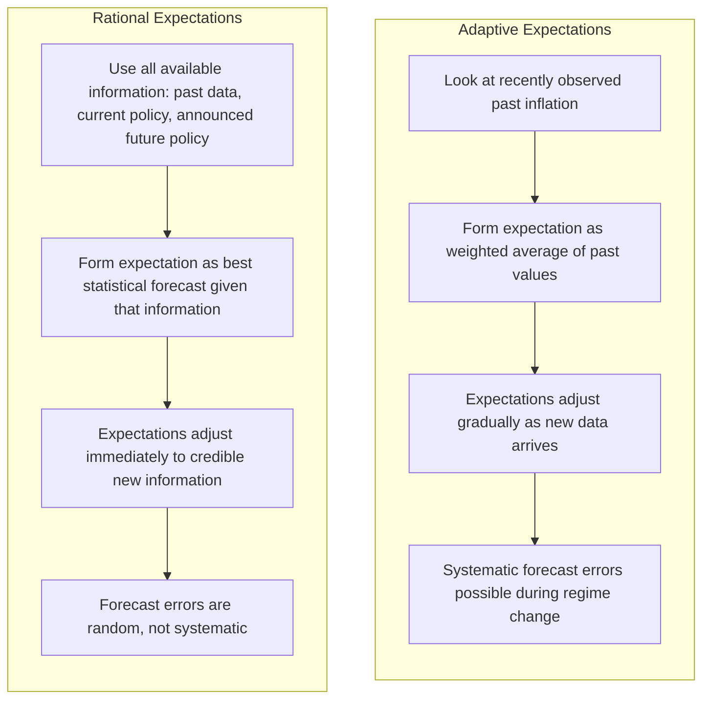

## Inflation Expectations and Adaptive versus Rational Expectations

### Why Expectations Matter

Inflation expectations — beliefs held by households, firms, workers, and investors about future inflation — play a central role in modern macroeconomic theory because they directly influence current economic behavior and, through that behavior, actual future inflation itself. Wage-setting, price-setting, borrowing and lending decisions, and wage negotiations are all forward-looking activities: agents attempt to set nominal terms today based on what they expect the price level to do tomorrow.

This creates a **self-referential** dynamic: expected inflation ($\pi^e$) feeds into actual inflation ($\pi$), which in turn shapes future expectations. This feedback loop is the foundation of the expectations-augmented Phillips Curve:

$$\pi = \pi^e - \alpha(u - u_n)$$

Because $\pi^e$ appears directly in this relationship, **how** expectations are formed — the underlying model of expectation formation — has significant implications for how the economy responds to policy actions and shocks.

### Why Expectations Matter for Behavior

1. **Wage bargaining**: Workers and unions negotiate nominal wage increases based partly on expected future inflation, to protect anticipated real wages.
2. **Price-setting by firms**: Firms set prices for future periods based on expected costs and expected competitor pricing behavior, both of which depend on expected inflation.
3. **Nominal interest rates**: Lenders demand compensation for expected erosion of purchasing power, captured in the **Fisher equation**:

$$i = r + \pi^e$$

Where $i$ is the nominal interest rate, $r$ is the real interest rate, and $\pi^e$ is expected inflation. A rise in expected inflation, holding the real interest rate constant, raises the nominal interest rate one-for-one — a relationship known as the **Fisher effect**.

4. **Investment and saving decisions**: Long-term contracts, investment planning, and saving behavior all depend on expected future purchasing power.
5. **Central bank credibility**: A central bank's ability to influence actual inflation, and to do so with minimal output/employment cost, depends heavily on its ability to shape and anchor inflation expectations.

### Adaptive Expectations

#### Definition

**Adaptive expectations** assume that economic agents form their expectations of future inflation based primarily on **recently observed past inflation**, adjusting expectations gradually as new information becomes available. The simplest version sets:

$$\pi^e_t = \pi_{t-1}$$

A more general and commonly used formulation is a partial-adjustment (error-correction) rule:

$$\pi^e_t = \pi^e_{t-1} + \lambda(\pi_{t-1} - \pi^e_{t-1})$$

Where $\lambda \in (0, 1]$ is the speed-of-adjustment parameter. This can also be expressed as a weighted average of past inflation rates, with geometrically declining weights on more distant past observations:

$$\pi^e_t = \lambda \pi_{t-1} + \lambda(1-\lambda)\pi_{t-2} + \lambda(1-\lambda)^2\pi_{t-3} + \ldots$$

#### Characteristics

- Expectations adjust **gradually** and **backward-lookingly**, relying purely on the historical time series of inflation.
- Agents are assumed not to use information about current policy actions, announced future policy, or structural knowledge of the economy — only past outcomes.
- Under adaptive expectations, sustained deviations of actual inflation from expected inflation will eventually be incorporated into expectations, but with a **lag** — meaning agents can be **systematically and predictably wrong** for extended periods, particularly during periods of changing policy or economic structure.

#### Implication for the Phillips Curve

Adaptive expectations imply that the short-run Phillips Curve tradeoff can persist for a meaningful period, since expectations only catch up to actual inflation gradually. This gives demand-management policy real, if temporary, traction over unemployment — but also implies that reducing entrenched inflation (disinflation) is costly, since expectations only fall gradually even after policy tightens, producing a period of higher unemployment (captured in the "sacrifice ratio") before inflation and expectations converge to a lower level.

### Rational Expectations

#### Definition

**Rational expectations**, a concept developed by John Muth (1961) and extensively applied to macroeconomics by Robert Lucas, Thomas Sargent, and others in the 1970s, assumes that economic agents form expectations using **all available relevant information**, including:

- The true underlying structure of the economy (as best understood)
- Current and announced future government and central bank policy
- All historical data (not just recent inflation)

Formally, rational expectations means that an agent's subjective expectation of a variable equals the mathematically expected value of that variable conditional on all available information $\Omega_t$:

$$\pi^e_t = E[\pi_t \mid \Omega_t]$$

This does not mean agents predict inflation perfectly every period — random, unpredictable shocks still occur — but it does mean that expectational **errors** are not systematic; they are random and average to zero over time, since any predictable pattern in past forecast errors would itself be information agents should have already incorporated.

#### Characteristics

- Expectations are **forward-looking**, incorporating information about policy announcements and structural changes immediately (or very quickly), rather than only reacting to past outcomes.
- If a policy change is **credible and fully anticipated**, agents adjust their expectations immediately upon announcement, potentially before the policy even takes effect.
- Forecast errors under rational expectations are unpredictable (white noise), not systematically biased in one direction over time.

#### Implication for the Phillips Curve: The Policy Ineffectiveness Proposition

Combining rational expectations with the assumption that markets clear quickly (a hallmark of the **New Classical** school associated with Lucas and Sargent) produces the **policy ineffectiveness proposition**: if a change in monetary policy is **fully anticipated and credible**, it will be immediately incorporated into inflation expectations, leaving the $(u - u_n)$ term unaffected — meaning **anticipated** policy changes have no real short-run effect on unemployment or output, only on the price level.

$$\pi = \pi^e - \alpha(u - u_n)$$

If $\pi^e$ adjusts instantly and fully to match the actual policy-induced $\pi$, then $u = u_n$ throughout — anticipated demand stimulus raises prices with no unemployment reduction, even in the short run.

[Inference] This is a strong theoretical proposition that depends on the joint assumptions of rational expectations **and** flexible price/wage adjustment. Only **unanticipated** or **surprise** policy actions are generally understood, even within this framework, to have real short-run effects — a distinction that significantly limited the scope of the policy ineffectiveness result relative to how it is sometimes informally summarized, and its empirical validity remains a subject of debate, particularly given evidence of price and wage stickiness in many markets.

### Diagram: Adaptive vs. Rational Expectations Formation

### Comparing the Two Frameworks

| Feature | Adaptive Expectations | Rational Expectations |
| --- | --- | --- |
| **Information used** | Past inflation only | All available information, including policy |
| **Speed of adjustment** | Gradual, backward-looking | Immediate (for anticipated/credible changes) |
| **Forecast errors** | Can be systematic and persistent | Random, unpredictable (on average zero) |
| **Effect of anticipated policy** | Can still have short-run real effects, since expectations lag | No real short-run effect if fully credible (policy ineffectiveness) |
| **Effect of unanticipated policy** | Real effects, as expectations have not adjusted | Real effects, since the shock was not incorporated in advance |
| **Cost of disinflation** | Gradual; involves a sustained sacrifice ratio period | Potentially lower if disinflation is credible and announced in advance |
| **Associated school of thought** | Traditional Keynesian/monetarist modeling | New Classical economics (Lucas, Sargent, Barro) |

### Example: Disinflation Under Each Framework

Suppose an economy has entrenched inflation of 8% and the central bank announces it will tighten policy to bring inflation down to 3%.

**Under adaptive expectations**: Since $\pi^e_t$ is based on recently observed inflation (still around 8% at the time of announcement), workers and firms continue setting wages and prices as if 8% inflation will persist, even after the policy change takes effect. As actual inflation falls due to tighter policy, the resulting gap between actual and (still-high) expected inflation pushes unemployment above the natural rate for a period, generating real output losses (the sacrifice ratio) before expectations gradually converge to the new lower inflation rate.

**Under rational expectations with full credibility**: If workers and firms believe the central bank's announcement and understand the policy mechanism, they may immediately revise $\pi^e$ down toward 3% upon the announcement, before the policy even takes full effect. If this expectational adjustment is complete and prices/wages can adjust quickly, disinflation could in principle occur with a much smaller (or theoretically zero) unemployment cost, since $\pi^e$ falls in step with the policy-induced fall in $\pi$, keeping $(u - u_n)$ close to zero throughout.

[Inference] In practice, most economists recognize that full, immediate credibility is difficult to achieve, and that price and wage stickiness limit how quickly expectations translate into actual pricing behavior — meaning real-world disinflation episodes typically involve **some** unemployment cost even when policy is reasonably credible, falling between the two theoretical extremes described above.

### Central Bank Credibility and Expectations Anchoring

A key practical implication of this theoretical distinction is the importance central banks place on **credibility** and **expectations anchoring**:

- **Anchored expectations**: When the public firmly believes a central bank will achieve and maintain its inflation target over the medium-to-long term, temporary shocks (e.g., an oil price spike) are less likely to translate into persistent, self-reinforcing inflation, since $\pi^e$ remains tied to the target rather than drifting with each shock.
- **De-anchored expectations**: If credibility is damaged (e.g., through a history of missed targets or fiscal dominance concerns), $\pi^e$ can become more sensitive to recent actual inflation (behaving more adaptively) or to shocks, making inflation control more difficult and costly.

Modern **inflation targeting** frameworks, in which central banks announce explicit numerical inflation targets and communicate policy intentions transparently, are largely designed [Inference] with the goal of pushing expectations formation closer to the rational, forward-looking end of the spectrum and anchoring $\pi^e$ near the announced target — an approach broadly supported in the monetary policy literature, though the degree of success varies across countries and periods and is difficult to measure precisely.

### Hybrid and Modern Approaches

[Inference] Contemporary macroeconomic modeling (e.g., New Keynesian models) frequently blends elements of both frameworks, incorporating **sticky prices/wages** (limiting how fast actual prices adjust, similar in spirit to adaptive frictions) together with **forward-looking, rational expectations** about future policy and economic conditions. This hybrid approach is widely used in modern central bank forecasting models, though the specific formulation and weighting of backward- vs. forward-looking elements varies across institutions and models, and remains an active area of applied macroeconomic research.

Empirical survey-based measures of inflation expectations (e.g., consumer surveys, professional forecaster surveys, market-based measures derived from inflation-indexed bonds) are used by central banks and researchers to assess in practice whether expectations appear closer to adaptive, rational, or some hybrid pattern in real time — findings that [Unverified] have varied across countries, time periods, and the specific survey or market-based measure used.

### Common Misconceptions

- **Misconception**: Rational expectations means people predict inflation perfectly.

  **Correction**: Rational expectations means forecast errors are unbiased and unpredictable on average, not that forecasts are always accurate — random shocks still cause actual inflation to deviate from expectations.
- **Misconception**: The policy ineffectiveness proposition means monetary policy never affects output or unemployment.

  **Correction**: The proposition applies specifically to **fully anticipated and credible** policy changes under rational expectations and flexible prices; unanticipated policy shocks, and policy operating in the presence of price/wage stickiness, can still have real short-run effects even within frameworks that incorporate rational expectations.
- **Misconception**: Adaptive and rational expectations are mutually exclusive, and real-world behavior must fit one model exactly.

  **Correction**: Many modern models treat these as stylized theoretical benchmarks; actual expectation formation in survey and market data often exhibits characteristics of both, and researchers continue to study which framework (or hybrid) best fits observed behavior in different contexts.

### Conclusion

Inflation expectations are central to modern macroeconomic theory because they feed directly into the wage- and price-setting behavior that determines actual inflation, creating a feedback loop formalized in the expectations-augmented Phillips Curve. Adaptive expectations model this process as a gradual, backward-looking adjustment based on recently observed inflation, implying that policy can have real short-run effects but that reducing entrenched inflation carries a real output/unemployment cost. Rational expectations model the process as forward-looking and information-efficient, implying that fully anticipated and credible policy changes have no real short-run effect (the policy ineffectiveness proposition), while unanticipated shocks retain real effects. This distinction underlies much of modern monetary policy design, particularly the emphasis central banks place on transparency, credibility, and anchoring expectations near an explicit inflation target.

**Related Topics**

- Expectations-augmented Phillips Curve and the accelerationist hypothesis
- Policy ineffectiveness proposition and the Lucas critique
- Fisher equation and the Fisher effect
- Central bank credibility and inflation targeting frameworks
- Sacrifice ratio and disinflation costs
- New Keynesian models and price/wage stickiness
- Survey-based and market-based measures of inflation expectations
- Time inconsistency problem in monetary policy