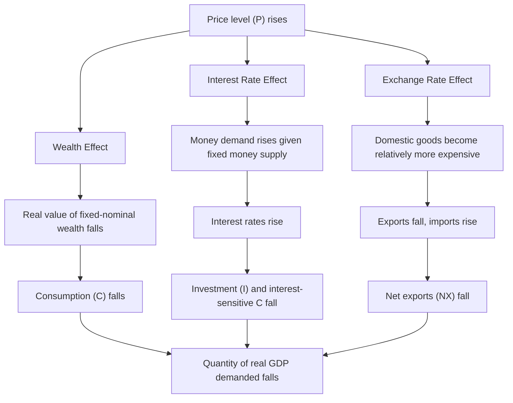
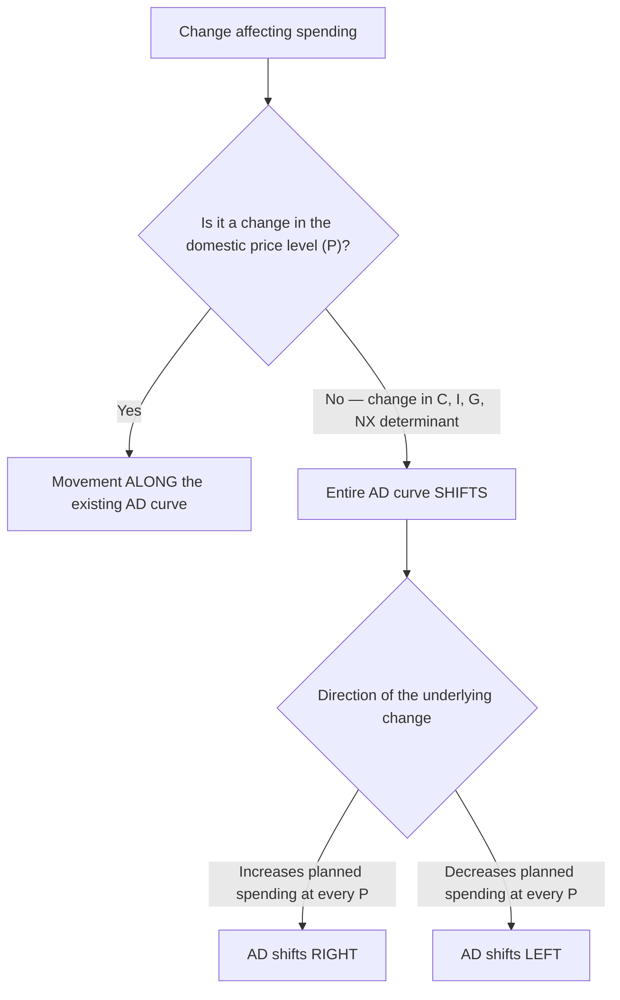

## Aggregate Demand Curve and Its Components

### Definition

The **Aggregate Demand (AD) curve** represents the total quantity of domestically produced final goods and services that all sectors of the economy — households, businesses, government, and the foreign sector — are willing and able to purchase at each possible price level, holding all other determinants of spending constant. It plots the relationship between the overall price level ($P$) and the quantity of real GDP demanded ($Y$), and is downward-sloping in $(Y, P)$ space.

$$AD: \quad Y^d = C + I + G + NX$$

Where:

- $C$ = Consumption spending by households
- $I$ = Investment spending by businesses
- $G$ = Government spending on goods and services
- $NX$ = Net exports (Exports $-$ Imports)

This expression is identical in form to the expenditure-approach identity for GDP, but as an **aggregate demand relationship**, it represents planned/desired spending at each price level rather than a realized accounting identity.

### Why the AD Curve Slopes Downward

Unlike a standard microeconomic demand curve (which slopes downward due to substitution and income effects for a single good), the AD curve's downward slope arises from three distinct macroeconomic mechanisms that connect the overall price level to total spending:

#### 1. The Wealth Effect (Pigou Effect)

A higher price level reduces the real value of household wealth held in fixed-nominal-value assets (e.g., cash, savings account balances, bonds).

$$\text{Real wealth} = \frac{\text{Nominal wealth}}{P}$$

As $P$ rises, real wealth falls, making households feel poorer, which reduces consumption spending ($C \downarrow$). A falling price level has the opposite effect, increasing real wealth and consumption.

#### 2. The Interest Rate Effect (Keynes Effect)

A higher price level increases the amount of money needed for everyday transactions, raising the transactions demand for money. Given a fixed money supply, this increased demand for money bids up interest rates in the money market.

$$P \uparrow \Rightarrow \text{Money demand} \uparrow \Rightarrow \text{Interest rates} \uparrow \Rightarrow I \downarrow \text{ (and interest-sensitive } C \downarrow \text{)}$$

Higher interest rates raise the cost of borrowing for both business investment and household purchases of interest-sensitive durable goods (e.g., housing, automobiles), reducing $I$ and interest-sensitive components of $C$.

#### 3. The Exchange Rate Effect (International Trade Effect)

A higher domestic price level (relative to foreign price levels, at a given exchange rate) makes domestic goods relatively more expensive compared to foreign goods.

$$P_{domestic} \uparrow \text{ (relative to } P_{foreign}) \Rightarrow \text{Exports} \downarrow, \text{Imports} \uparrow \Rightarrow NX \downarrow$$

[Inference] This mechanism also interacts with the interest rate effect: higher domestic interest rates (from the Keynes effect) can attract foreign capital inflows, appreciating the domestic currency and further reducing net exports — an additional channel reinforcing the downward slope, though its strength depends on the degree of capital mobility and the exchange rate regime in place.

### Diagram: Three Reasons the AD Curve Slopes Downward

### Components of Aggregate Demand

#### 1. Consumption (C)

The largest component of AD in most economies, consumption represents household spending on final goods and services (durable goods, non-durable goods, and services). Key determinants of consumption (beyond the price level, which is captured by movement *along* the AD curve) include:

- **Disposable income**: Higher after-tax income raises consumption (per the consumption function, $C = a + b \cdot Y_d$, where $b$ is the marginal propensity to consume).
- **Household wealth**: Independent of the price-level-driven wealth effect, changes in asset prices (stocks, housing) shift consumption at every price level.
- **Consumer confidence and expectations**: Optimism about future income raises current consumption; pessimism reduces it.
- **Interest rates**: Affects consumption of durable goods and willingness to save versus spend.
- **Taxation**: Changes in income tax rates alter disposable income directly.

#### 2. Investment (I)

Business spending on capital goods (machinery, equipment, structures), residential construction, and changes in inventories. Investment is the most **volatile** component of aggregate demand, historically. Key determinants include:

- **Interest rates**: The cost of borrowing to finance investment projects; lower rates encourage more investment (captured partly within the AD curve's own downward slope via the interest rate effect, but also shifted by monetary policy).
- **Business expectations and confidence**: Optimism about future profitability raises investment (animal spirits).
- **Technological change**: New technology can create profitable investment opportunities.
- **Capacity utilization**: Firms operating near full capacity are more likely to invest in expansion.
- **Corporate taxation and investment incentives**: Tax credits, depreciation allowances, and corporate tax rates affect the after-tax return on investment.

#### 3. Government Spending (G)

Government purchases of goods and services (excluding transfer payments, which are not part of GDP directly since they are not payments for current production). Determinants include:

- **Fiscal policy decisions**: Discretionary changes in spending on defense, infrastructure, education, healthcare, etc.
- **Automatic stabilizers**: Certain government spending (e.g., unemployment benefits, though technically transfers) rises automatically during downturns, though this operates more through disposable income effects on $C$ than directly through $G$.
- **Political and budgetary constraints**: Legislative processes, debt ceilings, and budget rules affect the pace and magnitude of spending changes.

#### 4. Net Exports (NX = Exports − Imports)

The difference between the value of goods and services sold to foreigners (exports) and the value of foreign goods and services purchased domestically (imports). Determinants include:

- **Foreign income**: Higher income abroad raises demand for domestic exports.
- **Exchange rates**: A weaker domestic currency makes exports cheaper and imports more expensive, raising NX (and vice versa for a stronger currency).
- **Relative price levels and inflation rates**: Domestic inflation relative to trading partners affects competitiveness.
- **Trade policy**: Tariffs, quotas, and trade agreements directly affect the volume of exports and imports.
- **Foreign economic conditions**: Recessions or booms in major trading-partner economies affect export demand.

### Movements Along vs. Shifts of the AD Curve

A critical analytical distinction:

- **Movement along the AD curve**: Caused only by a change in the **price level** itself, operating through the wealth, interest rate, and exchange rate effects described above. The curve itself does not move; the economy moves to a different point on the same curve.
- **Shift of the entire AD curve**: Caused by a change in any determinant of $C$, $I$, $G$, or $NX$ **other than the domestic price level** — these are often called the "non-price determinants of aggregate demand."

$$\Delta P \Rightarrow \text{movement along AD}$$

$$\Delta (\text{non-price determinant of } C, I, G, NX) \Rightarrow \text{shift of AD}$$

#### Rightward Shift Examples (AD increases at every price level)

- Increase in consumer or business confidence
- Expansionary fiscal policy (higher $G$, lower taxes)
- Expansionary monetary policy (lower interest rates, increasing $I$ and durable-goods $C$)
- Rise in foreign income (raising exports)
- Currency depreciation (raising net exports, holding other factors constant)
- Rising asset prices/wealth (housing or stock market booms)

#### Leftward Shift Examples (AD decreases at every price level)

- Falling consumer or business confidence
- Contractionary fiscal policy (lower $G$, higher taxes)
- Contractionary monetary policy (higher interest rates)
- Recession among major trading partners (falling exports)
- Currency appreciation (reducing net exports)
- Falling asset prices/wealth

### Diagram: AD Curve — Movement Along vs. Shift

### The Multiplier Effect on Aggregate Demand

An initial change in any AD component (particularly $I$ or $G$) triggers a chain of secondary spending, because one person's spending becomes another person's income, part of which is re-spent. This is captured by the **spending multiplier**:

$$k = \frac{1}{1 - MPC}$$

Where $MPC$ is the marginal propensity to consume (the fraction of each additional dollar of income spent on consumption rather than saved). The total change in aggregate demand/equilibrium output from an initial autonomous spending change $\Delta A$ is:

$$\Delta Y = k \times \Delta A$$

#### Example

Suppose $MPC = 0.8$ (households spend 80 cents of each additional dollar of income), and the government increases spending by $100 billion.

$$k = \frac{1}{1 - 0.8} = \frac{1}{0.2} = 5$$

$$\Delta Y = 5 \times \$100\text{ billion} = \$500\text{ billion}$$

The initial $100 billion government spending increase generates a total increase in aggregate demand of $500 billion once the full multiplier process (rounds of re-spending by income recipients) works through the economy. [Inference] This simple multiplier formula abstracts from important real-world complications such as taxes, imports (leakages that reduce the multiplier below this simple value), and crowding-out effects from rising interest rates, all of which are incorporated in more complete macroeconomic models.

### Example: Constructing the AD Curve Conceptually

Consider an economy where, at a price level of $P = 100$:

$$C = 6{,}000,\quad I = 2{,}000,\quad G = 2{,}500,\quad NX = -500$$

$$Y^d = 6{,}000 + 2{,}000 + 2{,}500 + (-500) = 10{,}000$$

If the price level rises to $P = 110$, the wealth, interest rate, and exchange rate effects reduce $C$, $I$, and $NX$ somewhat (say, by a combined 300), giving:

$$Y^d = 10{,}000 - 300 = 9{,}700$$

Plotting these two $(Y^d, P)$ combinations — $(10{,}000, 100)$ and $(9{,}700, 110)$ — and additional such points at other price levels traces out the downward-sloping AD curve.

### Key Points

**Key Points**

- The AD curve slopes downward due to three distinct mechanisms: the wealth effect, the interest rate effect, and the exchange rate effect — not ordinary microeconomic substitution/income effects.
- AD = C + I + G + NX, mirroring the expenditure approach to GDP, but representing planned spending at each price level.
- A change in the price level causes **movement along** the AD curve; a change in any non-price determinant of C, I, G, or NX causes the **entire curve to shift**.
- Investment is typically the most volatile AD component, driven strongly by business confidence and interest rates.
- The multiplier effect means an initial change in spending (especially $G$ or $I$) produces a larger total change in aggregate demand and output.

### Common Misconceptions

- **Misconception**: The AD curve slopes downward for the same reason as a microeconomic demand curve (substituting toward relatively cheaper goods).

  **Correction**: The AD curve's downward slope reflects economy-wide wealth, interest rate, and exchange rate mechanisms, since there is no "other good" to substitute toward when the overall price level changes — all domestic goods and services are covered by $P$.
- **Misconception**: Any change in consumption or investment causes movement along the AD curve.

  **Correction**: Only price-level-driven changes in $C$, $I$, or $NX$ (via the three effects) cause movement along the curve; changes in $C$, $I$, $G$, or $NX$ caused by anything else (confidence, taxes, foreign income, etc.) shift the entire curve.
- **Misconception**: Government spending increases translate one-for-one into equivalent GDP increases.

  **Correction**: Due to the multiplier effect, the ultimate change in aggregate demand/output is typically larger than the initial spending change, though the exact multiplier value depends on the marginal propensity to consume, tax rates, import propensities, and potential crowding-out effects — the simple multiplier formula represents an upper-bound abstraction rather than a precise real-world prediction.

### Conclusion

The Aggregate Demand curve summarizes the total planned spending on domestically produced goods and services across households, businesses, government, and the foreign sector, at each possible price level. Its downward slope arises from the wealth effect, interest rate effect, and exchange rate effect — mechanisms distinct from standard microeconomic demand theory — while its position is determined by the non-price determinants of consumption, investment, government spending, and net exports. Understanding the distinction between movements along the curve (driven only by price-level changes) and shifts of the curve (driven by changes in underlying spending determinants) is essential for analyzing how fiscal policy, monetary policy, and external economic conditions affect an economy's equilibrium output and price level within the broader AD-AS framework.

**Related Topics**

- Aggregate Supply curve (short-run and long-run) and AD-AS equilibrium
- Spending multiplier and the marginal propensity to consume/import
- Fiscal policy transmission through government spending and taxation
- Monetary policy transmission through interest rates and the Keynes effect
- Exchange rate determination and its effect on net exports
- Wealth effects and asset price cycles
- Crowding-out effect of government borrowing
- IS-LM model as a microfoundation for the AD curve