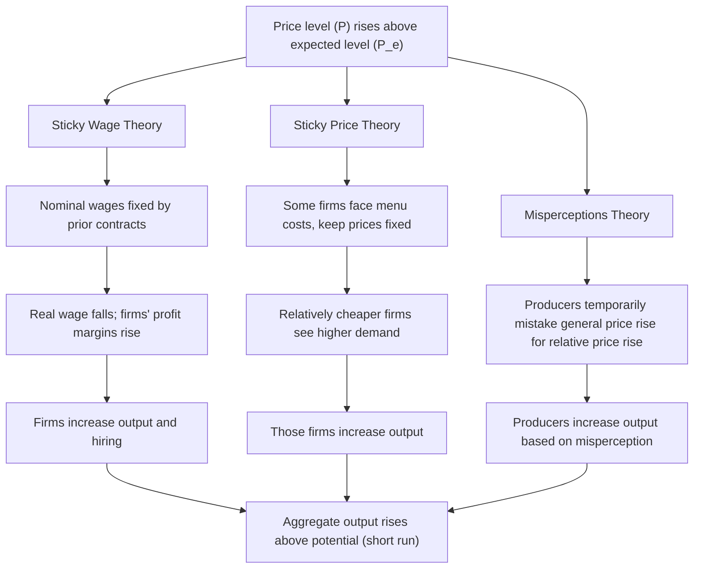
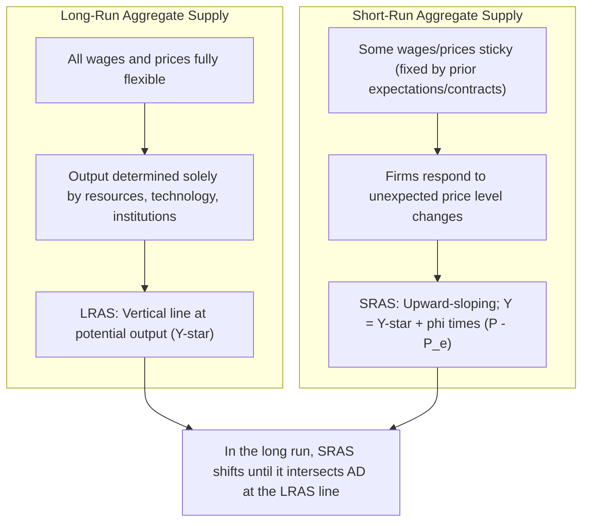
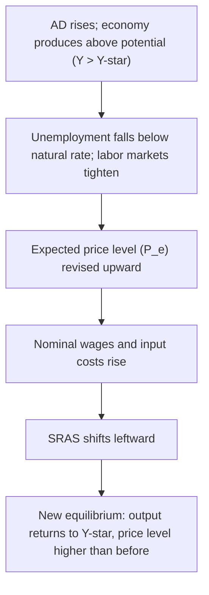

## Aggregate Supply: Short-Run and Long-Run

### Definition

The **Aggregate Supply (AS) curve** represents the total quantity of final goods and services that firms in an economy are willing and able to produce and sell at each possible price level, holding all other determinants of production constant. Unlike aggregate demand, aggregate supply behaves fundamentally differently depending on the time horizon considered, giving rise to two distinct curves: the **Short-Run Aggregate Supply (SRAS)** curve and the **Long-Run Aggregate Supply (LRAS)** curve.

### Long-Run Aggregate Supply (LRAS)

#### Definition and Shape

The LRAS curve represents the economy's productive capacity when all prices — including wages and input costs — are fully flexible and have completely adjusted to any change in the price level. In the long run, real output is determined entirely by the economy's available resources (labor, capital, technology, and institutions), independent of the price level.

$$LRAS: \quad Y = Y^* \quad \text{(vertical line at potential output, for any } P\text{)}$$

The LRAS curve is a **vertical line** at potential output ($Y^*$), also called **full-employment output** or **natural real GDP**. This vertical shape reflects the classical economic principle of **monetary neutrality** in the long run: changes in the price level (driven by changes in the money supply or nominal demand) do not affect real output once all wages and prices have fully adjusted — they affect only the price level itself.

#### Determinants of LRAS (Shifters)

Since the LRAS curve represents potential output, it shifts only in response to changes in the underlying determinants of an economy's productive capacity:

1. **Labor supply and quality**: Changes in the size of the labor force, labor force participation rates, immigration, or workforce education/skill levels.
2. **Physical capital stock**: Investment in machinery, equipment, infrastructure, and buildings that raises the economy's productive capacity over time.
3. **Natural resources**: Discovery of new resources or depletion of existing ones.
4. **Technology**: Innovations that raise productivity (output per unit of input).
5. **Institutional factors**: Property rights, rule of law, regulatory quality, and market efficiency, which affect how effectively resources are converted into output.

A rightward shift of the LRAS curve represents long-run **economic growth** (a higher potential output); a leftward shift represents a reduction in productive capacity (e.g., from a natural disaster destroying capital stock, or a sustained negative demographic shock).

### Short-Run Aggregate Supply (SRAS)

#### Definition and Shape

The SRAS curve represents the relationship between the price level and the quantity of output firms are willing to supply in the short run — a period during which **some prices, particularly nominal wages and other input costs, are "sticky"** (slow to adjust) even as output prices can change more readily. The SRAS curve is **upward-sloping**: a higher price level, with input costs temporarily fixed, raises firms' profit margins and induces them to increase output.

$$SRAS: \quad Y = Y^* + \phi(P - P^e)$$

Where:

- $Y$ = short-run real output
- $Y^*$ = potential (long-run) output
- $P$ = actual price level
- $P^e$ = expected price level
- $\phi > 0$ = a parameter capturing the sensitivity of output to unexpected price level changes

This formulation shows that short-run output deviates from potential output only when the actual price level diverges from the **expected** price level — a structure that parallels the expectations-augmented Phillips Curve.

### Why the SRAS Curve Slopes Upward: Competing Theoretical Explanations

Several theoretical models explain the upward slope of the SRAS curve, all sharing the common feature that **some frictions or informational limitations prevent full and instantaneous price/wage adjustment** in the short run:

#### 1. Sticky Wage Theory

Nominal wages are often set in advance through contracts or informal agreements based on the price level firms and workers *expected* to prevail. If the actual price level turns out higher than expected, firms' output prices rise while wage costs remain temporarily fixed at the pre-negotiated (lower real) level, raising real profit margins and incentivizing firms to increase output and employment.

$$P > P^e \Rightarrow \text{Real wage} = \frac{W}{P} \text{ falls (since } W \text{ fixed)} \Rightarrow \text{Firms hire more, output rises}$$

#### 2. Sticky Price Theory (Menu Cost Models)

Some firms face costs of changing their own posted prices (menu costs) and therefore do not adjust prices immediately in response to changes in overall demand conditions. Firms that keep prices temporarily fixed while overall demand and the price level rise experience increased demand for their relatively cheaper output, raising their production.

#### 3. Misperceptions Theory (Lucas Supply Function)

Individual producers may temporarily confuse a rise in the general price level with a rise in the *relative* price of their own specific good, since it takes time to distinguish general inflation from a genuine increase in relative demand for one's own product. Believing their relative price has risen, producers increase output, only later realizing (as the general price rise becomes evident) that their relative price is unchanged. [Inference] This theory, associated with Robert Lucas, formed part of the New Classical approach to macroeconomics and is generally considered less central to mainstream SRAS explanations today relative to sticky-wage and sticky-price theories, which are more prominent in New Keynesian frameworks, though it remains historically significant in the development of macroeconomic thought.

### Diagram: Theories of the Upward-Sloping SRAS Curve

### Shifters of the SRAS Curve

The SRAS curve shifts in response to changes in production costs and supply conditions that are separate from the current price level:

1. **Input prices**: Changes in the price of key inputs (oil, raw materials, wages) shift SRAS — rising input costs shift SRAS left (reducing supply at every price level); falling input costs shift SRAS right.
2. **Productivity**: Improvements in productivity lower per-unit production costs, shifting SRAS right; productivity declines shift SRAS left.
3. **Expected price level ($P^e$)**: A rise in the expected price level shifts SRAS left (since $Y = Y^* + \phi(P - P^e)$, a higher $P^e$ for any given actual $P$ reduces the term $(P - P^e)$, lowering $Y$ at that price level); a fall in expected price level shifts SRAS right.
4. **Supply shocks**: Sudden disruptions (natural disasters, geopolitical conflict affecting commodity supply, pandemics disrupting supply chains) shift SRAS left; positive supply shocks (e.g., a bumper harvest, a sudden fall in oil prices) shift SRAS right.
5. **Business taxes and regulation**: Higher taxes or regulatory compliance costs on production shift SRAS left; deregulation or tax relief shifts SRAS right.

### Diagram: Short-Run and Long-Run Aggregate Supply Together

### The Short-Run to Long-Run Adjustment Process

A central feature of the AS framework is the **self-correcting mechanism** by which the economy transitions from a short-run equilibrium (potentially away from potential output) back to long-run equilibrium at $Y^*$:

1. Suppose aggregate demand rises, pushing the economy's short-run equilibrium output above potential ($Y > Y^*$), with unemployment below the natural rate.
2. Tight labor markets cause workers and firms to revise their expected price level ($P^e$) upward, since actual inflation has exceeded what was previously expected.
3. As $P^e$ rises, workers negotiate higher nominal wages, and firms' costs rise, shifting the SRAS curve **leftward**.
4. This process continues until the SRAS curve has shifted enough that the new short-run equilibrium coincides with the vertical LRAS curve — that is, until $Y$ returns to $Y^*$, but now at a permanently higher price level.

This adjustment process explains why demand-side stimulus can raise output only **temporarily**: in the long run, the economy self-corrects back to potential output, with the lasting effect being a higher price level rather than higher output — mirroring the "no long-run tradeoff" result of the vertical Long-Run Phillips Curve, since these two vertical-in-the-long-run concepts are directly related expressions of the same underlying classical/monetarist logic.

### Diagram: Self-Correction from Above Potential Output

### Example

Suppose an economy is initially at long-run equilibrium: $Y = Y^* = 10{,}000$, $P = 100$, and $P^e = 100$.

**Step 1**: A surge in government spending and consumer confidence shifts AD rightward. In the short run (with $P^e$ still at 100), the new equilibrium is $Y = 10{,}300$ and $P = 105$. Since $P > P^e$, output has risen above potential — consistent with the SRAS relationship $Y = Y^* + \phi(P - P^e)$.

**Step 2**: Over time, workers and firms observe that actual inflation (5%) exceeded what they expected (0%). They revise $P^e$ upward to 105 for the next round of wage and price contracts.

**Step 3**: With $P^e$ now at 105, the SRAS curve shifts left. If AD remains unchanged at its new higher level, the new equilibrium settles at $Y = Y^* = 10{,}000$ (output back to potential) but at an even higher price level, say $P = 108$, since the leftward SRAS shift raises the price level further while returning output to its long-run sustainable level.

This illustrates the complete short-run boom followed by the self-correction back to potential output, with a permanently higher price level as the lasting legacy of the initial demand shock.

### Comparing SRAS and LRAS

| Feature | Short-Run Aggregate Supply (SRAS) | Long-Run Aggregate Supply (LRAS) |
| --- | --- | --- |
| **Shape** | Upward-sloping | Vertical at potential output ($Y^*$) |
| **Wage/price flexibility** | Some wages/prices sticky (fixed in short run) | All wages and prices fully flexible |
| **Key driver of position** | Expected price level, input costs, productivity, supply shocks | Labor, capital, technology, institutions (real factors only) |
| **Effect of AD shifts** | Can move output above or below potential temporarily | No effect on output; only affects price level |
| **Underlying economic principle** | Wage/price stickiness, informational frictions | Monetary neutrality; classical dichotomy |

### Common Misconceptions

- **Misconception**: The LRAS curve can shift due to changes in aggregate demand or the price level.

  **Correction**: The LRAS curve shifts only due to changes in real determinants of productive capacity (labor, capital, technology, institutions); it is invariant to the price level or nominal demand changes, reflecting long-run monetary neutrality.
- **Misconception**: The SRAS curve's upward slope arises from the same substitution logic as a microeconomic supply curve.

  **Correction**: The SRAS curve's upward slope arises specifically from short-run stickiness in wages, prices, or perceptions relative to the *expected* price level — not from ordinary marginal-cost-based supply logic applied economy-wide, since all prices (including input prices) are part of the same general price level in the long run.
- **Misconception**: An economy can remain above potential output ($Y > Y^*$) indefinitely through continued demand stimulus.

  **Correction**: Sustained output above potential triggers rising expected prices and wages, causing SRAS to shift left until output returns to $Y^*$ — the self-correction mechanism implies such gaps are temporary, not permanent, absent continuous acceleration of demand growth (mirroring the accelerationist Phillips Curve dynamic).

### Conclusion

Aggregate supply is best understood through two complementary curves operating over different time horizons: the vertical Long-Run Aggregate Supply curve, anchored at potential output and determined solely by an economy's real productive resources under full price/wage flexibility, and the upward-sloping Short-Run Aggregate Supply curve, which reflects temporary wage and price stickiness (or informational frictions) that allow output to deviate from potential when the actual price level differs from what was expected. The self-correcting adjustment process — in which persistent output gaps drive revisions to expected prices and shift the SRAS curve until output returns to potential — is a foundational mechanism in classical and New Keynesian macroeconomic theory alike, explaining why demand-side policy can influence real output only temporarily while its lasting legacy operates primarily through the price level.

**Related Topics**

- AD-AS equilibrium and business cycle analysis
- Sticky wage and sticky price (New Keynesian) models
- Lucas misperceptions model and rational expectations
- Long-run Phillips Curve and the natural rate of unemployment
- Monetary neutrality and the classical dichotomy
- Supply shocks and stagflation
- Potential output (Y*) estimation methods
- Economic growth theory and long-run LRAS shifters