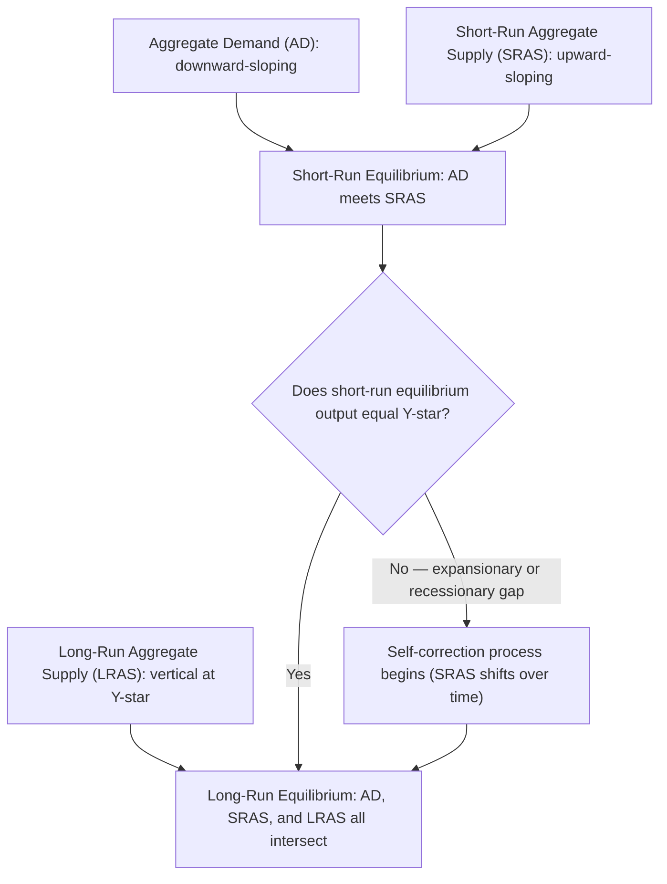
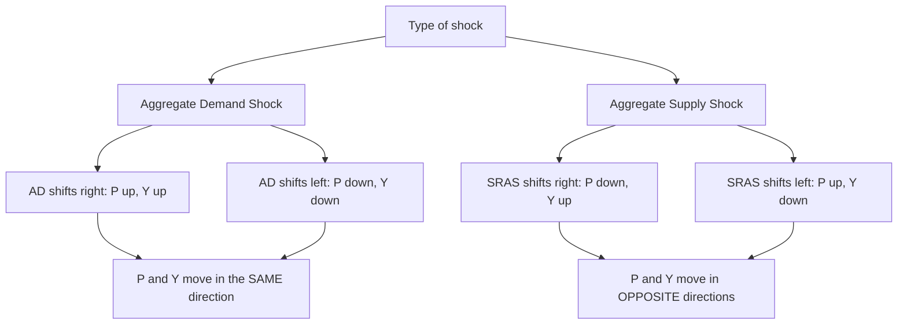
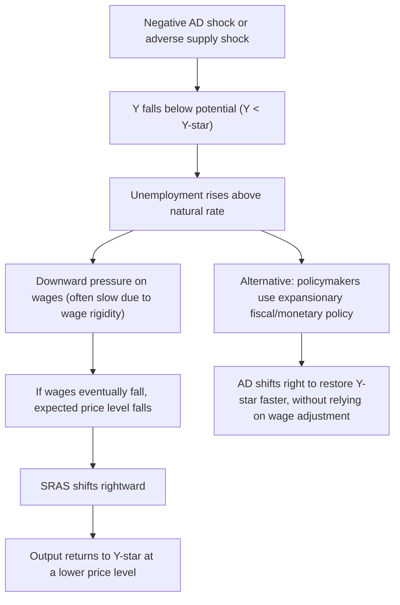

## Equilibrium in the AD-AS Model

### Definition of Macroeconomic Equilibrium

**Equilibrium in the AD-AS model** occurs at the price level and output level where the Aggregate Demand (AD) curve intersects the relevant Aggregate Supply curve — the point at which the total quantity of goods and services demanded across all sectors of the economy exactly equals the total quantity firms are willing to supply. Because the model incorporates both a Short-Run Aggregate Supply (SRAS) curve and a Long-Run Aggregate Supply (LRAS) curve, the AD-AS model distinguishes between **short-run equilibrium** and **long-run equilibrium**.

$$\text{Equilibrium: } \quad Y^d(P) = Y^s(P)$$

### Short-Run Equilibrium

Short-run equilibrium occurs where the AD curve intersects the SRAS curve. At this point, the price level ($P_{SR}$) and output level ($Y_{SR}$) are simultaneously consistent with the desired spending of households, firms, government, and the foreign sector, and with firms' willingness to supply output given their currently sticky wage/price commitments and expectations.

Short-run equilibrium output can fall into three possible configurations relative to potential output ($Y^*$):

1. **Expansionary gap** ($Y_{SR} > Y^*$): The economy is producing beyond its sustainable long-run capacity; unemployment is below the natural rate.
2. **Long-run equilibrium** ($Y_{SR} = Y^*$): The economy is producing exactly at potential output; unemployment equals the natural rate.
3. **Recessionary gap** ($Y_{SR} < Y^*$): The economy is producing below its sustainable capacity; unemployment exceeds the natural rate.

### Long-Run Equilibrium

**Long-run equilibrium** occurs specifically where **all three curves** — AD, SRAS, and LRAS — intersect at a single point. At long-run equilibrium:

$$Y_{SR} = Y^* \quad \text{and} \quad P = P^e$$

This means the actual price level matches what was previously expected, and short-run output equals potential output. Long-run equilibrium is a "resting point" of the model: absent any new shock to AD or AS, the economy has no further tendency to adjust, since expectations are correct and no unexpected profit or wage-cost incentives remain to drive output away from potential.

### Diagram: The Three-Curve AD-AS Equilibrium Framework

### Types of Equilibrium Disturbances (Shocks)

The AD-AS model is used primarily to analyze how the economy responds to various types of shocks, each producing a distinct short-run outcome before the self-correction mechanism (if any) restores long-run equilibrium.

#### 1. Aggregate Demand Shocks

**Positive AD shock** (AD shifts right — e.g., a surge in consumer confidence, expansionary fiscal/monetary policy, rising foreign income):

$$AD \uparrow \Rightarrow P \uparrow \text{ and } Y \uparrow \text{ (short run, moving along existing SRAS)}$$

This produces an **expansionary gap** in the short run: output rises above potential, and unemployment falls below the natural rate.

**Negative AD shock** (AD shifts left — e.g., collapse in consumer/business confidence, contractionary policy, recession in trading partners):

$$AD \downarrow \Rightarrow P \downarrow \text{ and } Y \downarrow \text{ (short run)}$$

This produces a **recessionary gap**: output falls below potential, and unemployment rises above the natural rate.

#### 2. Aggregate Supply Shocks

**Positive (favorable) supply shock** (SRAS shifts right — e.g., falling input/commodity prices, productivity improvements, favorable weather for agriculture):

$$SRAS \uparrow \text{(shifts right)} \Rightarrow P \downarrow \text{ and } Y \uparrow$$

This produces a simultaneous rise in output and fall in the price level — an especially favorable combination for policymakers, sometimes associated with periods of technology-driven productivity growth.

**Negative (adverse) supply shock** (SRAS shifts left — e.g., oil price spikes, supply chain disruptions, natural disasters):

$$SRAS \downarrow \text{(shifts left)} \Rightarrow P \uparrow \text{ and } Y \downarrow$$

This produces **stagflation**: simultaneous inflation and falling output/rising unemployment — a combination not explainable by demand shocks alone, since demand shocks move $P$ and $Y$ in the *same* direction, while supply shocks move them in *opposite* directions.

### Diagram: Demand Shocks vs. Supply Shocks — Direction of P and Y

### The Self-Correction Mechanism

A defining feature of the standard AD-AS model (particularly in its classical/monetarist formulation) is that the economy possesses a built-in **self-correcting mechanism** that returns short-run equilibrium to long-run equilibrium over time, without requiring any policy intervention — operating entirely through the adjustment of expectations and wages/prices.

#### Self-Correction from an Expansionary Gap

1. Positive AD shock pushes $Y_{SR} > Y^*$; unemployment falls below the natural rate.
2. Tight labor markets put upward pressure on nominal wages as workers gain bargaining leverage.
3. Rising wages and expected prices ($P^e$) shift the SRAS curve **leftward**.
4. The new short-run equilibrium features a higher price level and output moving back toward $Y^*$.
5. This process continues until $Y$ returns to $Y^*$ (now at a permanently higher price level than before the shock) — restoring long-run equilibrium.

#### Self-Correction from a Recessionary Gap

1. Negative AD shock (or adverse supply shock) pushes $Y_{SR} < Y^*$; unemployment rises above the natural rate.
2. Slack labor markets put downward pressure on nominal wages, though this adjustment is often **asymmetric and slow** in practice due to **downward wage rigidity** (workers and institutions — minimum wage laws, union contracts, psychological resistance to nominal wage cuts — resist nominal wage reductions).
3. If wages/prices do eventually fall, expected prices ($P^e$) fall, shifting the SRAS curve **rightward** over time.
4. The new short-run equilibrium features a lower price level and output moving back toward $Y^*$, restoring long-run equilibrium — but potentially only after a prolonged and painful adjustment period.

[Inference] The asymmetry between these two self-correction processes — nominal wages generally being more flexible upward than downward — is a widely cited reason in Keynesian-influenced macroeconomics for why recessionary gaps may persist longer than expansionary gaps, and why many economists and policymakers advocate for active demand-side stabilization policy during recessions rather than relying solely on the slow self-correction mechanism. The empirical speed and completeness of this self-correction process is a matter of ongoing debate and varies by economy, time period, and the specific labor market institutions in place.

### Diagram: Self-Correction from a Recessionary Gap

### Example: Full Cycle Through an AD Shock

Suppose an economy begins at long-run equilibrium: $Y^* = 12{,}000$, $P = 100$, $P^e = 100$.

**Step 1 — Shock**: A stock market boom raises household wealth, shifting AD rightward. Short-run equilibrium moves to $Y_{SR} = 12{,}400$, $P = 104$. Since $Y_{SR} > Y^*$, the economy has an expansionary gap of 400, and since $P > P^e$ (104 > 100), this is consistent with the upward-sloping SRAS relationship.

**Step 2 — Expectations adjust**: Observing that actual inflation (4%) exceeded expected inflation (0%), workers and firms revise $P^e$ upward for the next contract cycle to 104.

**Step 3 — SRAS shifts left**: With $P^e$ now higher, the SRAS curve shifts left. If AD remains at its new elevated position, the new short-run equilibrium settles at $Y = Y^* = 12{,}000$ (output back to potential) but at a further elevated price level, say $P = 107$.

**Step 4 — New long-run equilibrium**: The economy has returned to potential output, but permanently at a higher price level (107 instead of the original 100) — illustrating that the demand shock's lasting legacy is inflation, not a permanent output gain.

### Policy Intervention vs. Self-Correction

Given the potentially slow and asymmetric nature of self-correction (particularly from recessionary gaps due to downward wage/price rigidity), the AD-AS framework provides the theoretical basis for **stabilization policy** — the use of fiscal and monetary policy to actively shift the AD curve, accelerating the return to potential output rather than waiting for the slower wage/price adjustment mechanism:

- **During a recessionary gap**: Expansionary fiscal policy (increased $G$, tax cuts) or expansionary monetary policy (lower interest rates) can shift AD rightward, restoring $Y^*$ more quickly than waiting for wages to fall.
- **During an expansionary gap**: Contractionary fiscal policy or contractionary monetary policy can shift AD leftward, reducing inflationary pressure and preventing the economy from relying on the (also potentially costly) natural self-correction process of rising wages and prices.

[Inference] The choice between allowing self-correction and using active stabilization policy involves tradeoffs regarding policy lags, forecasting uncertainty, and the risk of policy errors (over- or under-correcting) — a subject of substantial debate between different schools of macroeconomic thought (e.g., New Keynesian advocates of active stabilization versus more classical/monetarist perspectives emphasizing the risks and lags of discretionary policy), rather than a settled matter with a single universally endorsed approach.

### Comparing Short-Run and Long-Run Equilibrium

| Feature | Short-Run Equilibrium | Long-Run Equilibrium |
| --- | --- | --- |
| **Curves intersecting** | AD and SRAS | AD, SRAS, and LRAS (all three) |
| **Output level** | Can be above, below, or equal to $Y^*$ | Exactly equal to $Y^*$ |
| **Price level vs. expectations** | Can differ from $P^e$ | $P = P^e$ (expectations fully realized) |
| **Unemployment** | Can be above, below, or equal to natural rate | Equal to the natural rate |
| **Stability** | Temporary; subject to self-correction pressure if $Y \neq Y^*$ | Stable resting point absent new shocks |

### Common Misconceptions

- **Misconception**: The economy is always in long-run equilibrium.

  **Correction**: Short-run equilibrium (where AD meets SRAS) can persist away from potential output for extended periods, particularly given wage/price stickiness and slow expectation adjustment; long-run equilibrium is a theoretical resting point reached only after full adjustment.
- **Misconception**: Any change in the price level indicates a demand-side shock.

  **Correction**: Distinguishing demand shocks from supply shocks requires observing the direction of the *output* response alongside the price change: demand shocks move $P$ and $Y$ in the same direction, while supply shocks move them in opposite directions.
- **Misconception**: Self-correction happens quickly and symmetrically regardless of whether the gap is expansionary or recessionary.

  **Correction**: Due to downward wage/price rigidity, self-correction from a recessionary gap is often considered slower than self-correction from an expansionary gap, which is a key argument used to justify active demand-side stabilization policy during downturns.

### Conclusion

Equilibrium in the AD-AS model is determined by the intersection of the Aggregate Demand curve with the relevant Aggregate Supply curve, distinguishing between a short-run equilibrium (AD meets SRAS, potentially away from potential output) and a long-run equilibrium (AD, SRAS, and LRAS all intersect at potential output with realized expectations). The model's self-correction mechanism — driven by the adjustment of wages and price expectations — explains how the economy tends to return to potential output following a demand or supply shock, though this process may be slow and asymmetric due to downward wage rigidity, particularly following recessionary shocks. This framework provides the essential theoretical foundation for understanding business cycle fluctuations, distinguishing demand-driven from supply-driven disturbances, and evaluating the rationale for active fiscal and monetary stabilization policy versus reliance on the economy's own adjustment mechanisms.

**Related Topics**

- Aggregate Demand curve and its components
- Short-run and long-run Aggregate Supply curves
- Fiscal policy and its transmission through the AD-AS model
- Monetary policy and its transmission through the AD-AS model
- Downward wage/price rigidity and Keynesian economics
- Output gaps and Okun's Law
- Stagflation and supply-shock-driven business cycles
- Business cycle theory and stabilization policy debates