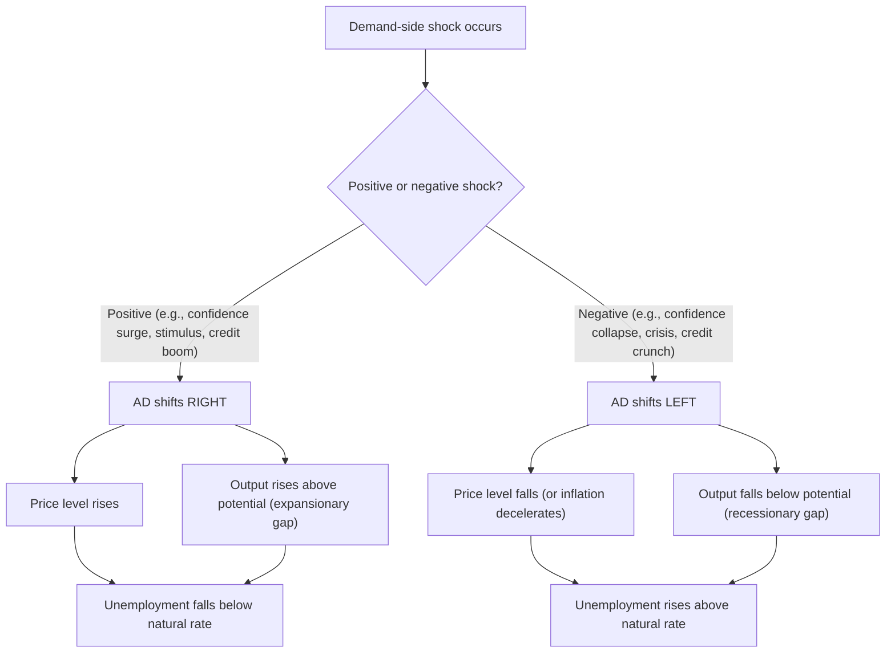
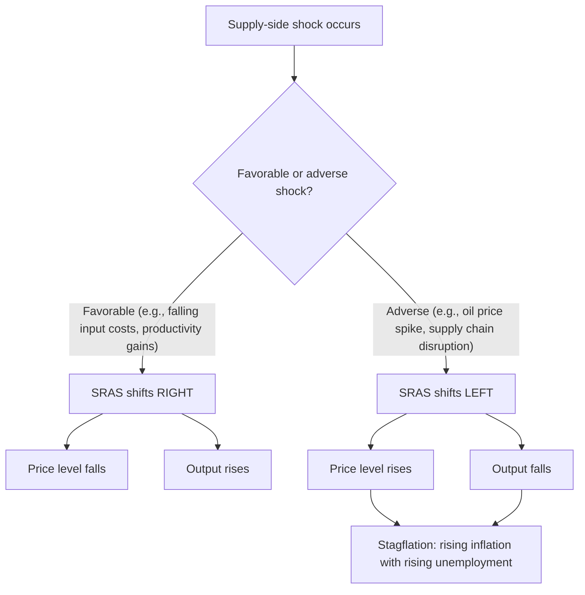
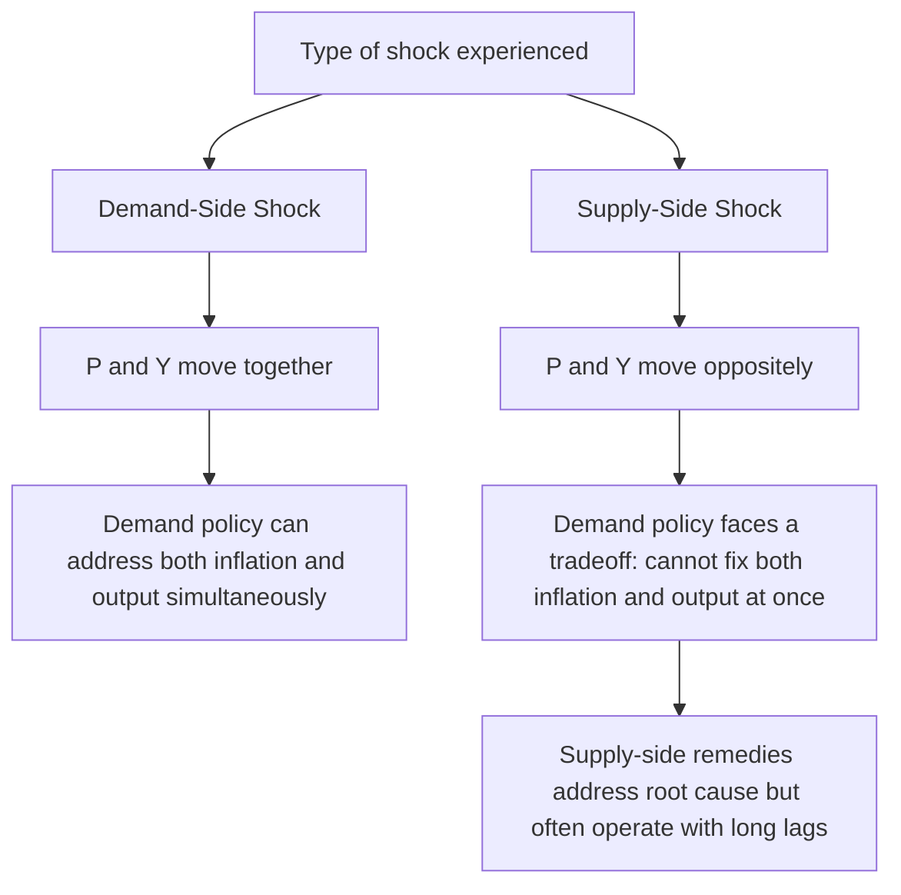

## Demand-Side and Supply-Side Shocks

### Definition of an Economic Shock

An **economic shock** is an unexpected event or disturbance that shifts either the Aggregate Demand (AD) curve or one of the Aggregate Supply curves (SRAS or, less commonly in short-run analysis, LRAS), causing the economy's equilibrium price level and/or output to move away from its prior position. Shocks are classified by which curve they primarily affect — **demand-side shocks** shift the AD curve, while **supply-side shocks** shift the SRAS curve (and in some cases the LRAS curve, for shocks affecting long-run productive capacity).

Distinguishing between these two shock types is essential because they produce **opposite** relationships between the price level and output, and because they call for different, sometimes conflicting, policy responses.

### Demand-Side Shocks

#### Definition

A **demand-side shock** is a sudden, often unanticipated change in one of the components of aggregate demand ($C$, $I$, $G$, or $NX$) that shifts the entire AD curve, rather than merely reflecting a price-level-driven movement along it.

$$AD \text{ shifts} \Rightarrow P \text{ and } Y \text{ move in the SAME direction}$$

#### Positive Demand Shocks (AD shifts right)

$$AD \uparrow \Rightarrow P \uparrow, \ Y \uparrow \text{ (short run)}$$

Common sources:

- Sudden surge in consumer or business confidence (e.g., following resolution of political uncertainty)
- Asset price booms raising household wealth (housing or stock market rallies), boosting consumption via the wealth effect
- Expansionary fiscal policy (sharp increase in government spending, or broad tax cuts)
- Expansionary monetary policy (significant, unexpected interest rate cuts or large-scale asset purchases)
- A surge in foreign demand for exports (e.g., a major trading partner's economic boom)
- Sudden credit expansion (loosening of lending standards increasing borrowing-financed spending)

#### Negative Demand Shocks (AD shifts left)

$$AD \downarrow \Rightarrow P \downarrow, \ Y \downarrow \text{ (short run)}$$

Common sources:

- Sudden collapse in consumer or business confidence (e.g., a financial crisis or major geopolitical shock)
- Asset price crashes reducing household wealth (stock market crash, housing market collapse)
- Contractionary fiscal policy (sharp spending cuts, tax increases)
- Contractionary monetary policy (rapid, unexpected interest rate hikes)
- Recession in major trading-partner economies, reducing export demand
- Sudden credit contraction / banking crisis (a "credit crunch" restricting borrowing-financed spending)
- Pandemic-driven collapse in consumer spending due to lockdowns or voluntary social distancing [Unverified — the scale and composition of pandemic-era demand shocks varied significantly by country and by sector, with some sectors experiencing demand collapses and others experiencing demand surges simultaneously]

### Diagram: Demand-Side Shock Transmission

### Supply-Side Shocks

#### Definition

A **supply-side shock** is a sudden, often unanticipated change in production costs, input availability, or productivity that shifts the SRAS curve (or, for shocks affecting an economy's underlying productive capacity, the LRAS curve).

$$SRAS \text{ shifts} \Rightarrow P \text{ and } Y \text{ move in OPPOSITE directions}$$

#### Positive (Favorable) Supply Shocks (SRAS shifts right)

$$SRAS \uparrow \text{(right)} \Rightarrow P \downarrow, \ Y \uparrow$$

Common sources:

- Sudden decline in commodity/input prices (e.g., oil price collapse)
- Technological breakthroughs raising productivity across the economy
- Favorable weather boosting agricultural yields
- Deregulation reducing compliance costs for firms
- A positive labor supply shock (e.g., increased immigration expanding the workforce, all else equal) [Note: this can also be classified as an LRAS-shifting supply-side change if it affects long-run productive capacity rather than only short-run costs]

#### Negative (Adverse) Supply Shocks (SRAS shifts left)

$$SRAS \downarrow \text{(left)} \Rightarrow P \uparrow, \ Y \downarrow$$

Common sources:

- Sudden spike in commodity/input prices (e.g., oil price shocks, such as those associated with OPEC supply actions or geopolitical conflict disrupting energy markets)
- Supply chain disruptions (e.g., shipping bottlenecks, semiconductor shortages, port closures)
- Natural disasters destroying productive capacity or disrupting harvests
- Pandemics disrupting labor supply and production processes
- Sudden regulatory or tax increases raising compliance costs
- Extreme weather events or geopolitical conflict disrupting critical input supply chains

This combination — rising prices alongside falling output — produces **stagflation**, a hallmark signature of negative supply shocks that distinguishes them clearly from demand-side disturbances.

### Diagram: Supply-Side Shock Transmission

### Diagnosing Shock Type from Observed Data

A key analytical skill is inferring, from observed movements in the price level and output (or unemployment), which type of shock has occurred:

| Observed Pattern | Likely Shock Type | Direction |
| --- | --- | --- |
| $P \uparrow$, $Y \uparrow$ | Demand-side shock | Positive (AD right) |
| $P \downarrow$, $Y \downarrow$ | Demand-side shock | Negative (AD left) |
| $P \uparrow$, $Y \downarrow$ | Supply-side shock | Negative (SRAS left) |
| $P \downarrow$, $Y \uparrow$ | Supply-side shock | Positive (SRAS right) |

[Inference] In practice, real-world economic episodes frequently involve **simultaneous** demand-side and supply-side shocks (of potentially differing magnitudes and directions), making the diagnosis more complex than the clean, isolated-shock cases described above; econometric methods (e.g., structural vector autoregressions) are often used by researchers to attempt to decompose observed price and output movements into distinct demand and supply components, though such decompositions carry model-dependent uncertainty.

### Historical Examples

#### Demand-Side Shock Example: 2008 Global Financial Crisis

[Unverified] The 2008 financial crisis is widely characterized in the macroeconomic literature as primarily a large negative demand shock: a collapse in asset prices (housing and financial markets), a severe credit crunch restricting both consumer and business borrowing, and a sharp decline in consumer and business confidence combined to shift AD substantially leftward across many economies simultaneously, producing a synchronized global recession with falling output and, in many economies, disinflationary pressure.

#### Supply-Side Shock Example: 1973 and 1979 Oil Price Shocks

The OPEC oil embargo of 1973 and the Iranian Revolution-linked oil price surge of 1979 are classic examples of negative supply shocks: sharp increases in a critical input price (oil) raised production costs broadly across the economy, shifting SRAS leftward and producing the simultaneous high inflation and high unemployment (stagflation) that famously challenged the simple Phillips Curve model of that era.

#### Mixed Shock Example: COVID-19 Pandemic (2020–2022)

[Unverified] The COVID-19 pandemic period is frequently described in the economic literature as involving **both** significant demand-side and supply-side shocks occurring in close succession or simultaneously: an initial sharp negative demand shock (lockdowns and voluntary social distancing collapsing spending on many services) was followed by a combination of demand-side stimulus (large government transfer payments and monetary easing in many economies) and substantial negative supply-side shocks (global supply chain disruptions, labor market disruptions, and later, energy price spikes linked to geopolitical events). This combination is commonly cited as a contributing factor to the subsequent global inflation surge observed in 2021–2022, though the relative quantitative contribution of demand versus supply factors to that inflation episode remains a subject of ongoing empirical research and some disagreement among economists.

### Policy Response Implications

#### Responding to Demand-Side Shocks

Because demand shocks move $P$ and $Y$ in the same direction, standard demand-management tools (monetary and fiscal policy) can directly counteract them without an inherent tradeoff:

- **Negative demand shock** → expansionary monetary/fiscal policy shifts AD back rightward, restoring both output and price stability simultaneously.
- **Positive demand shock** (overheating) → contractionary monetary/fiscal policy shifts AD back leftward, cooling both inflation and excess output simultaneously.

#### Responding to Supply-Side Shocks

Because supply shocks move $P$ and $Y$ in opposite directions, demand-management tools face an inherent **tradeoff** when responding to them:

- **Negative supply shock** (stagflation) → Using expansionary policy to restore output worsens inflation further; using contractionary policy to control inflation worsens the output/unemployment decline further. There is no single demand-side policy action that improves both problems simultaneously.
- [Inference] For this reason, policy responses to adverse supply shocks often involve either accepting a temporary combination of above-target inflation and below-potential output while the shock dissipates naturally, or pursuing supply-side remedies (increasing productive capacity, diversifying input sources, addressing specific bottlenecks) that address the root cause directly — though such supply-side remedies often operate with substantial implementation lags compared to the more immediate (if imperfect) tools available for demand-side shocks.

### Diagram: Policy Tradeoff Comparison

**Key Points**

- Demand-side shocks shift the AD curve, moving the price level and output in the **same** direction.
- Supply-side shocks shift the SRAS (or LRAS) curve, moving the price level and output in **opposite** directions.
- Adverse supply shocks are the primary source of stagflation, a pattern demand shocks alone cannot generate.
- The direction of the joint price-output movement is the key diagnostic tool for distinguishing shock type from observed macroeconomic data.
- Demand-side shocks can generally be addressed by demand-management policy without an inherent tradeoff; supply-side shocks force policymakers to choose between prioritizing inflation control or output/employment stabilization in the short run.

### Common Misconceptions

- **Misconception**: All recessions are caused by the same type of shock (falling demand).

  **Correction**: Recessions can originate from negative demand shocks (falling AD) or negative supply shocks (falling SRAS); the accompanying behavior of the price level (falling under a demand shock, rising under a supply shock) is the key distinguishing signal.
- **Misconception**: Monetary and fiscal policy can always restore both price stability and full output simultaneously.

  **Correction**: This is generally true only for demand-side shocks; for supply-side shocks, demand-management policy faces an inherent tradeoff between addressing inflation and addressing the output/unemployment shortfall, since it cannot shift the underlying SRAS curve back on its own.
- **Misconception**: A single economic event can only ever be classified as purely a demand shock or purely a supply shock.

  **Correction**: Many real-world episodes (e.g., the COVID-19 pandemic period) involve simultaneous or sequential demand- and supply-side shocks, requiring more complex analysis to disentangle their respective contributions to observed inflation and output movements.

### Conclusion

Demand-side and supply-side shocks represent the two fundamental categories of disturbance in the AD-AS framework, distinguished by which curve they shift and by the resulting relationship between the price level and output: demand shocks move both in the same direction, while supply shocks move them in opposite directions, with adverse supply shocks specifically capable of generating stagflation. This distinction is not merely academic — it directly determines whether demand-management policy can address a given economic disturbance cleanly (as with demand shocks) or whether policymakers face an unavoidable short-run tradeoff between inflation control and output stabilization (as with supply shocks). Correctly diagnosing the source of an observed economic disturbance, using the joint behavior of prices and output as the primary diagnostic signal, is therefore a critical first step in formulating an appropriate policy response.

**Related Topics**

- Aggregate Demand curve and its components
- Short-run and long-run Aggregate Supply curves
- Stagflation and the 1970s oil shocks
- Structural vector autoregression (SVAR) methods for shock identification
- Monetary policy tradeoffs under supply shocks
- COVID-19 pandemic macroeconomic effects
- Global financial crisis of 2008 as a demand-shock case study
- Business cycle theory and shock propagation mechanisms