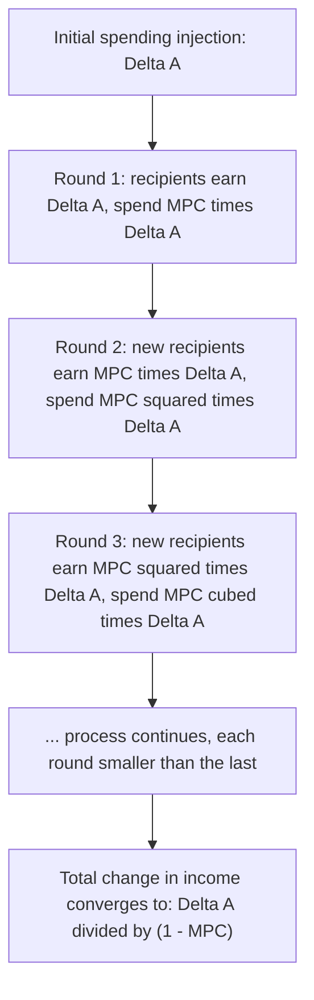
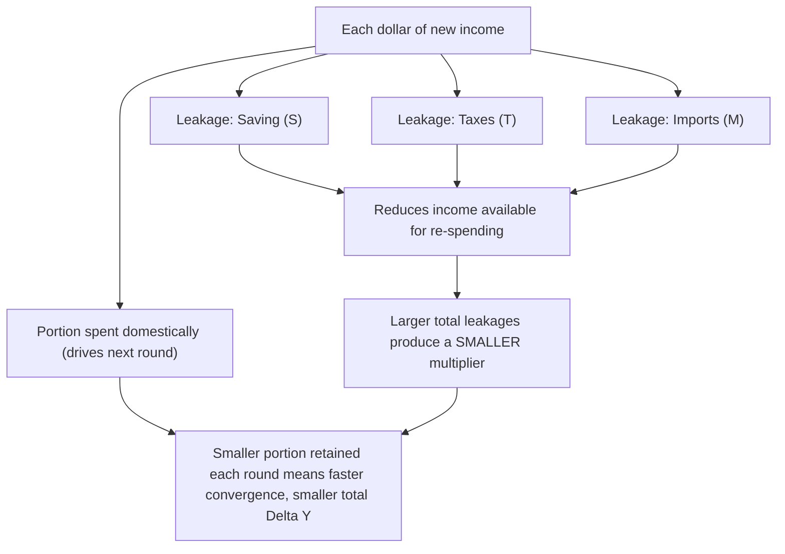
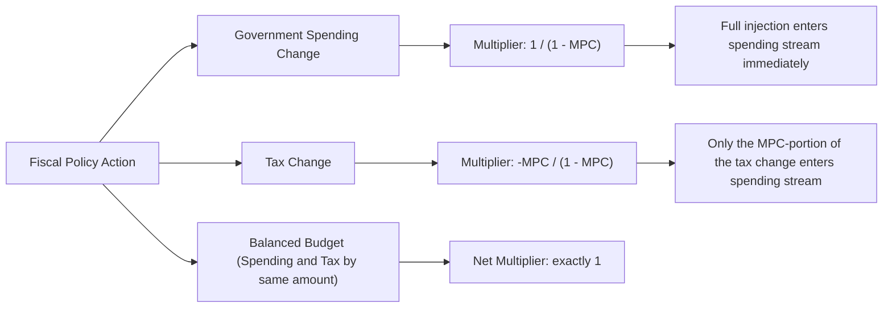

## The Multiplier Effect

### Definition

The **multiplier effect** describes how an initial change in autonomous spending (spending that does not depend on the current level of income) produces a **larger** total change in equilibrium national income or output. This amplification occurs because spending by one economic agent becomes income for another, a portion of which is then re-spent, generating further rounds of income and spending throughout the economy.

$$\Delta Y = k \times \Delta A$$

Where $\Delta Y$ is the total change in equilibrium output/income, $\Delta A$ is the initial change in autonomous spending, and $k$ is the **multiplier**, a value generally greater than 1.

### Conceptual Mechanism: Rounds of Spending

The multiplier process can be understood as a sequence of successive spending rounds:

1. An initial injection of spending (e.g., government spending, investment, or an autonomous rise in consumption) directly raises the income of those who receive that spending as revenue or wages.
2. Recipients of this new income spend a portion of it (determined by the **marginal propensity to consume**, $MPC$) on further goods and services, generating income for a new set of recipients.
3. Those second-round recipients, in turn, spend a portion of their new income, generating a third round of income and spending.
4. This process continues indefinitely, with each successive round smaller than the last (since only a fraction of each round's income is re-spent), converging to a finite total increase in income.

### The Marginal Propensity to Consume and Save

The size of the multiplier depends critically on the **marginal propensity to consume (MPC)** — the fraction of each additional dollar of income that households spend on consumption — and its complement, the **marginal propensity to save (MPS)**:

$$MPC + MPS = 1$$

$$MPC = \frac{\Delta C}{\Delta Y_d}, \quad MPS = \frac{\Delta S}{\Delta Y_d}$$

Where $\Delta Y_d$ is the change in disposable income. A higher $MPC$ (households spend a larger share of additional income) implies a larger multiplier, since more of each round of income is re-spent rather than saved (leaked out of the spending stream).

### The Simple Spending Multiplier

In the simplest Keynesian model (a closed economy with no government, or one where taxes and imports are ignored), the multiplier is:

$$k = \frac{1}{1 - MPC} = \frac{1}{MPS}$$

#### Derivation

The total change in income from an initial autonomous spending increase $\Delta A$ is the sum of the geometric series of successive spending rounds:

$$\Delta Y = \Delta A + MPC \cdot \Delta A + MPC^2 \cdot \Delta A + MPC^3 \cdot \Delta A + \ldots$$

$$\Delta Y = \Delta A (1 + MPC + MPC^2 + MPC^3 + \ldots) = \Delta A \times \frac{1}{1 - MPC}$$

Since $0 < MPC < 1$, this infinite geometric series converges to a finite sum, $\frac{1}{1-MPC}$.

#### Example

Suppose $MPC = 0.75$ and the government increases spending by $200 billion.

$$k = \frac{1}{1 - 0.75} = \frac{1}{0.25} = 4$$

$$\Delta Y = 4 \times \$200\text{ billion} = \$800\text{ billion}$$

The initial $200 billion injection generates a total increase in equilibrium income of $800 billion once all rounds of re-spending are accounted for.

### Diagram: The Multiplier Process as Successive Spending Rounds

### Leakages: Extending the Simple Multiplier

The simple multiplier formula assumes households are the only economic agents and that all income not consumed is saved (the only "leakage" from the spending stream). In more realistic models, additional **leakages** reduce the size of the multiplier, since each round of spending loses more than just the saved portion:

1. **Saving (S)**: Portion of income not spent, as in the simple model.
2. **Taxes (T)**: Governments typically tax income, reducing the disposable income available for re-spending in each round. This is captured by the **marginal tax rate** ($t$).
3. **Imports (M)**: Some portion of spending goes toward foreign-produced goods, which does not generate domestic income in subsequent rounds. This is captured by the **marginal propensity to import** ($MPM$).

The more general multiplier, incorporating these additional leakages, is:

$$k = \frac{1}{1 - MPC(1-t) + MPM}$$

Or, more simply expressed in terms of the total marginal leakage rate ($MPS + MPT + MPM$, where these fractions sum with $MPC$ portion retained for domestic re-spending to account for the full income dollar):

$$k = \frac{1}{MPS + MPT + MPM}$$

[Inference] The precise algebraic form varies slightly depending on how taxes are modeled (e.g., lump-sum vs. proportional to income) and other model specifics; different textbook treatments present marginally different but conceptually equivalent formulations of this extended multiplier. The key economic principle — that additional leakages reduce the multiplier below the simple $1/(1-MPC)$ value — holds across these variations.

#### Example with Leakages

Suppose $MPC = 0.8$, the marginal tax rate $t = 0.25$, and the marginal propensity to import $MPM = 0.1$.

Disposable income retained and spent domestically per additional dollar of income: $MPC \times (1-t) - MPM = 0.8 \times 0.75 - 0.1 = 0.6 - 0.1 = 0.5$

$$k = \frac{1}{1 - 0.5} = 2$$

Compare this to the simple multiplier ignoring taxes and imports: $k_{simple} = \frac{1}{1-0.8} = 5$. The presence of taxation and import leakages substantially reduces the multiplier from 5 to 2, illustrating why real-world multipliers are typically much smaller than the simple closed-economy formula would suggest.

### Diagram: Leakages Reducing the Multiplier

### The Tax Multiplier

A related but distinct concept is the **tax multiplier**, which measures the change in equilibrium income resulting from a change in taxes (rather than a direct change in government spending). Because a tax cut does not directly inject spending — households first decide how much of the additional disposable income to spend versus save — the tax multiplier is smaller in absolute value than the spending multiplier of the same nominal size:

$$k_{tax} = \frac{-MPC}{1 - MPC}$$

The negative sign reflects that a tax **increase** reduces disposable income and thus reduces spending/output, while a tax **cut** raises disposable income and thus raises spending/output. Comparing magnitudes:

$$|k_{tax}| = \frac{MPC}{1-MPC} < \frac{1}{1-MPC} = k_{spending}$$

#### Example

With $MPC = 0.8$:

$$k_{spending} = \frac{1}{1-0.8} = 5, \qquad k_{tax} = \frac{-0.8}{1-0.8} = -4$$

A $100 billion increase in government spending raises equilibrium income by $500 billion, while a $100 billion tax cut raises equilibrium income by only $400 billion (since the first round of the tax cut is partly saved rather than fully spent, unlike direct government spending, which enters the spending stream immediately and fully in the first round).

### The Balanced Budget Multiplier

A special case arises when government spending and taxes are increased by the **same** amount, keeping the budget balanced. Combining the spending multiplier and tax multiplier of equal magnitude:

$$k_{balanced} = k_{spending} + k_{tax} = \frac{1}{1-MPC} + \frac{-MPC}{1-MPC} = \frac{1-MPC}{1-MPC} = 1$$

The **balanced budget multiplier equals 1** (in the simple model): an equal increase in government spending and taxes raises equilibrium output by exactly the amount of the spending/tax increase, because the direct spending injection (full multiplier effect) outweighs the smaller, partially-offsetting contractionary effect of the tax increase (partial multiplier effect, since some of the tax burden would have been saved rather than spent anyway).

### Diagram: Comparing Multiplier Types

### Factors That Reduce the Real-World Multiplier

Beyond the leakages already discussed (saving, taxes, imports), several additional factors can reduce the effective real-world multiplier below the values implied by the simple formulas:

1. **Crowding out**: Increased government borrowing to finance spending can raise interest rates, reducing private investment and interest-sensitive consumption, partially offsetting the initial stimulus.
2. **Supply constraints**: If the economy is already near full capacity (potential output), a portion of the demand increase may translate into higher prices (as illustrated by the SRAS curve) rather than higher real output, reducing the *real* multiplier effect even if the nominal spending multiplier remains as calculated.
3. **Exchange rate effects**: In an open economy with flexible exchange rates, expansionary fiscal policy can lead to currency appreciation (if it raises domestic interest rates, attracting foreign capital), which reduces net exports and partially offsets the fiscal stimulus.
4. **Expectations of future taxation**: [Inference] Some economic models (associated with Ricardian equivalence) suggest that if households anticipate that current deficit-financed spending will require future tax increases, they may increase saving in anticipation, muting the consumption response and reducing the effective multiplier. The empirical validity and magnitude of this effect is a subject of ongoing debate among economists, with mixed empirical support across different studies and contexts.

### Empirical Estimates of the Multiplier

[Unverified] Empirical estimates of fiscal multipliers vary considerably across studies, countries, and economic conditions — with research suggesting multipliers tend to be larger during recessions (when resources are more likely to be idle and monetary policy may be constrained, e.g., at the zero lower bound on interest rates) than during economic expansions (when crowding-out effects and supply constraints are more binding). Because multiplier estimates depend heavily on model specification, time period, and country-specific institutional factors, cited numerical values should be treated as context-dependent estimates rather than universal constants.

**Key Points**

- The multiplier effect amplifies an initial change in autonomous spending into a larger total change in equilibrium income, through successive rounds of re-spending.
- The simple multiplier, $k = 1/(1-MPC)$, applies in a model without taxes or imports; a higher MPC produces a larger multiplier.
- Leakages — saving, taxes, and imports — reduce the multiplier below the simple formula's value in more realistic, open-economy models with government taxation.
- The tax multiplier is smaller in magnitude than the spending multiplier of equal size, because a tax change only indirectly affects spending via the change in disposable income.
- The balanced budget multiplier equals exactly 1 in the simple model, since a spending increase enters the economy fully while an equal tax increase only partially reduces spending.
- Real-world multipliers are affected by crowding out, supply constraints, exchange rate effects, and potentially by expectations of future taxation, and are generally understood to be smaller and more context-dependent than the simple textbook formulas suggest.

### Common Misconceptions

- **Misconception**: The multiplier for a tax cut equals the multiplier for an equivalent government spending increase.

  **Correction**: The tax multiplier is smaller in absolute value than the spending multiplier, because a tax cut first passes through the household saving/consumption decision (only the $MPC$ portion is spent), whereas direct government spending enters the spending stream immediately and completely.
- **Misconception**: A larger multiplier is always better for the economy.

  **Correction**: While a larger multiplier means a given stimulus generates a larger increase in output, it does not by itself indicate whether that increase is toward or beyond potential output; if the economy is near full capacity, a large multiplier effect on nominal spending can translate substantially into inflation (via the SRAS curve) rather than sustainable real output gains.
- **Misconception**: The multiplier is a fixed, universal number that applies identically regardless of economic conditions.

  **Correction**: The effective multiplier depends on the state of the economy (e.g., degree of slack), the presence of leakages (taxes, imports, saving), potential crowding-out and exchange rate effects, and the specific fiscal instrument used — meaning empirical multiplier values vary considerably across contexts rather than being a single constant figure.

### Conclusion

The multiplier effect captures the amplification of an initial change in autonomous spending into a larger total change in equilibrium output, driven by successive rounds of income and re-spending throughout the economy. While the simple formula $k = 1/(1-MPC)$ illustrates the core mechanism, real-world multipliers are generally smaller once leakages such as taxation and imports are incorporated, and are further influenced by crowding-out effects, supply-side capacity constraints, exchange rate dynamics, and potentially by forward-looking household behavior regarding future taxation. Understanding the multiplier — and the factors that determine its size — is essential for evaluating the likely macroeconomic impact of fiscal policy actions such as changes in government spending or taxation.

**Related Topics**

- Marginal propensity to consume, save, and import
- Fiscal policy and government spending/taxation tools
- Crowding-out effect and interest rate transmission
- Ricardian equivalence and forward-looking household behavior
- Aggregate Demand curve and its components
- Balanced budget multiplier in open-economy contexts
- Automatic stabilizers and discretionary fiscal policy
- Empirical estimation of fiscal multipliers across business cycle conditions