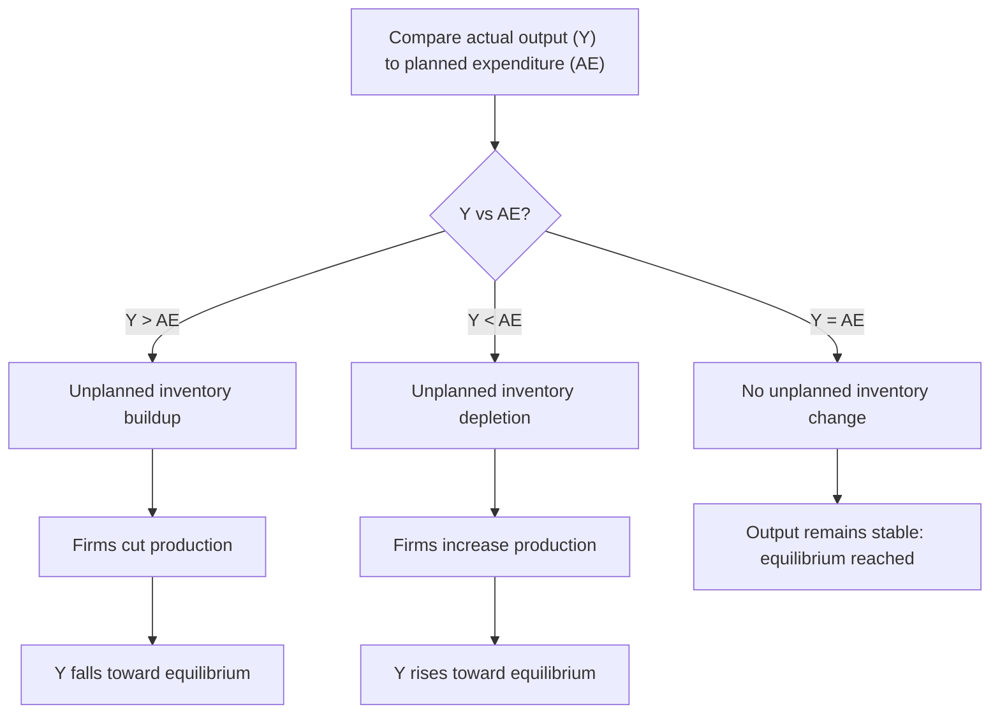
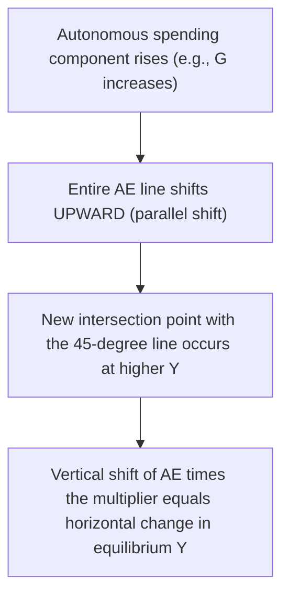

## The Keynesian Cross Model

### Definition and Purpose

The **Keynesian Cross model** (also called the **income-expenditure model**) is a graphical framework, developed from the work of John Maynard Keynes, that determines the equilibrium level of national income/output by finding the point at which total **planned aggregate expenditure** equals actual output (income). Unlike the AD-AS model, the Keynesian Cross holds the **price level fixed**, focusing purely on how spending decisions determine short-run output — making it a useful simplified tool for understanding the mechanics of the multiplier and demand-driven output fluctuations before introducing price-level effects.

### Core Components

#### Planned Aggregate Expenditure (AE)

Planned aggregate expenditure is the total amount that households, businesses, government, and the foreign sector plan to spend on domestically produced goods and services, at each level of income:

$$AE = C + I + G + NX$$

Where each component is defined analogously to its role in the AD-AS framework, but here as a function of the **level of income ($Y$)** at a fixed price level, rather than as a function of the price level itself.

#### The Consumption Function

The foundation of the model is the **consumption function**, which relates household consumption spending to disposable income:

$$C = a + b(Y - T)$$

Where:

- $a$ = autonomous consumption (consumption that occurs even at zero income, financed by borrowing or drawing down savings)
- $b$ = marginal propensity to consume ($MPC$), the fraction of each additional dollar of disposable income spent on consumption
- $Y - T$ = disposable income (income after taxes)

#### Other Expenditure Components (Simplified as Autonomous)

In the basic Keynesian Cross model, investment ($I$), government spending ($G$), and net exports ($NX$) are typically treated as **autonomous** — that is, independent of the current level of income — for simplicity, though more advanced versions can incorporate income-dependent investment or import behavior.

$$AE = a + b(Y-T) + I + G + NX$$

### The 45-Degree Line

The model's defining graphical feature is the **45-degree line**, which represents every point where **planned aggregate expenditure equals actual income/output** ($AE = Y$). Since the horizontal and vertical axes of the diagram both measure the same units (income/expenditure), this line has a slope of exactly 1, passing through the origin.

The equilibrium level of income occurs where the **AE line** (the planned expenditure function, plotted against income) intersects the 45-degree line:

$$Y_{eq} = AE(Y_{eq})$$

### Diagram: The Keynesian Cross

(svg_diagram)

<svg xmlns="http://www.w3.org/2000/svg" viewBox="0 0 600 500">
<rect width="600" height="500" fill="var(--bg-color, #ffffff)" />
<line x1="60" y1="450" x2="580" y2="450" stroke="var(--axis-color, #333)" stroke-width="2" />
<line x1="60" y1="450" x2="60" y2="30" stroke="var(--axis-color, #333)" stroke-width="2" />
<text x="580" y="475" font-size="14" text-anchor="end" fill="var(--text-color, #333)">Income / Output (Y)</text>
<text x="30" y="30" font-size="14" text-anchor="middle" fill="var(--text-color, #333)" transform="rotate(-90 30 30)">Planned Expenditure (AE)</text>
<line x1="60" y1="450" x2="540" y2="30" stroke="#888" stroke-width="1.5" stroke-dasharray="4,4" />
<text x="500" y="60" font-size="13" fill="#888">45-degree line (AE = Y)</text>
<line x1="60" y1="330" x2="540" y2="130" stroke="#2166ac" stroke-width="2.5" />
<text x="480" y="145" font-size="13" fill="#2166ac">AE = a + b(Y-T) + I + G + NX (svg_diagram)</text>
<circle cx="300" cy="230" r="5" fill="#d6604d" />
<line x1="300" y1="230" x2="300" y2="450" stroke="#d6604d" stroke-width="1" stroke-dasharray="3,3" />
<line x1="60" y1="230" x2="300" y2="230" stroke="#d6604d" stroke-width="1" stroke-dasharray="3,3" />
<text x="305" y="220" font-size="13" fill="#d6604d">Equilibrium (Y*)</text>
<text x="65" y="225" font-size="12" fill="#d6604d">AE*</text>
<text x="290" y="470" font-size="12" fill="#d6604d">Y*</text>
<text x="150" y="470" font-size="12" fill="var(--text-color, #333)">Below Y*: AE &gt; Y (inventories fall, output rises)</text>
<text x="330" y="490" font-size="12" fill="var(--text-color, #333)">Above Y*: AE &lt; Y (inventories rise, output falls)</text>
</svg>

### The Role of Inventories in Reaching Equilibrium

A key mechanism explaining why the economy gravitates toward the intersection point involves **unplanned inventory changes**:

- **If actual output ($Y$) exceeds planned expenditure ($AE$)**: Firms produce more than is being purchased, causing **unplanned inventory accumulation**. Firms respond by cutting production in subsequent periods, causing $Y$ to fall toward equilibrium.
- **If planned expenditure ($AE$) exceeds actual output ($Y$)**: Purchases exceed current production, causing **unplanned inventory depletion**. Firms respond by increasing production to replenish inventories and meet demand, causing $Y$ to rise toward equilibrium.
- **At equilibrium ($AE = Y$)**: Planned expenditure exactly matches production, inventories remain at their planned level, and firms have no incentive to change output — the economy is at rest.

$$\text{Unplanned inventory investment} = Y - AE$$

This inventory adjustment mechanism is the microfoundation for why the intersection of the AE line and the 45-degree line represents a genuine, stable equilibrium rather than an arbitrary reference point.

### Diagram: Inventory Adjustment Toward Equilibrium

### Algebraic Solution for Equilibrium Income

Setting $Y = AE$ and solving for $Y$:

$$Y = a + b(Y - T) + I + G + NX$$

$$Y - bY = a - bT + I + G + NX$$

$$Y(1-b) = a - bT + I + G + NX$$

$$Y_{eq} = \frac{a - bT + I + G + NX}{1 - b}$$

This confirms the multiplier relationship: the term $\frac{1}{1-b} = \frac{1}{1-MPC}$ is exactly the spending multiplier derived independently in multiplier analysis, and equilibrium income is the multiplier applied to the sum of all autonomous spending components (net of the autonomous tax-driven reduction in consumption, $-bT$).

### Example

Suppose:

$$a = 500, \quad b = MPC = 0.75, \quad T = 400, \quad I = 900, \quad G = 1{,}200, \quad NX = -100$$

$$Y_{eq} = \frac{500 - (0.75)(400) + 900 + 1{,}200 + (-100)}{1 - 0.75}$$

$$Y_{eq} = \frac{500 - 300 + 900 + 1{,}200 - 100}{0.25} = \frac{2{,}200}{0.25} = 8{,}800$$

Equilibrium income/output is 8,800. If, for example, government spending rises by 200 (to $G = 1{,}400$), holding everything else constant:

$$\Delta Y = \frac{\Delta G}{1-b} = \frac{200}{0.25} = 800$$

New equilibrium income becomes $8{,}800 + 800 = 9{,}600$, illustrating the multiplier effect directly through the Keynesian Cross framework: a 200-unit increase in autonomous spending produces an 800-unit increase in equilibrium income, consistent with a multiplier of 4.

### Diagram: Shift of the AE Line and New Equilibrium

### The Recessionary Gap and Inflationary Gap in the Keynesian Cross

The Keynesian Cross model can be used to illustrate deviations of equilibrium income from **full-employment output** ($Y_F$), by comparing the AE-line-determined equilibrium ($Y_{eq}$) to $Y_F$:

- **Recessionary gap**: If $Y_{eq} < Y_F$, planned expenditure at full-employment output falls short of what would be needed to sustain that output level; the vertical distance between the AE line and the 45-degree line at $Y_F$ (multiplied by the appropriate scaling) represents the additional autonomous spending needed to close the gap.
- **Inflationary gap**: If $Y_{eq} > Y_F$, planned expenditure at full-employment output exceeds what is sustainable without generating inflationary pressure (a concept that requires moving beyond the fixed-price-level Keynesian Cross into the full AD-AS framework to properly capture, since the Keynesian Cross by construction holds prices fixed and does not itself generate rising prices as output is pushed higher).

[Inference] Because the basic Keynesian Cross model holds the price level fixed by assumption, it is best understood as a simplified pedagogical tool for illustrating the expenditure-multiplier mechanism in isolation; translating a Keynesian Cross equilibrium gap into implications for inflation requires moving to the full AD-AS framework, where the price level is allowed to adjust and where the SRAS curve introduces the price-level feedback the Keynesian Cross deliberately abstracts away.

### Diagram: Recessionary Gap in the Keynesian Cross

(svg_diagram)

<svg xmlns="http://www.w3.org/2000/svg" viewBox="0 0 600 480">
<rect width="600" height="480" fill="var(--bg-color, #ffffff)" />
<line x1="60" y1="430" x2="580" y2="430" stroke="var(--axis-color, #333)" stroke-width="2" />
<line x1="60" y1="430" x2="60" y2="30" stroke="var(--axis-color, #333)" stroke-width="2" />
<text x="580" y="455" font-size="14" text-anchor="end" fill="var(--text-color, #333)">Income / Output (Y) (svg_diagram)</text>
<line x1="60" y1="430" x2="540" y2="30" stroke="#888" stroke-width="1.5" stroke-dasharray="4,4" />
<line x1="60" y1="380" x2="540" y2="200" stroke="#2166ac" stroke-width="2.5" />
<text x="470" y="215" font-size="13" fill="#2166ac">AE line</text>
<circle cx="260" cy="300" r="5" fill="#d6604d" />
<text x="265" y="295" font-size="12" fill="#d6604d">Y_eq</text>
<line x1="400" y1="430" x2="400" y2="60" stroke="#4d9221" stroke-width="1.5" stroke-dasharray="5,3" />
<text x="405" y="55" font-size="13" fill="#4d9221">Y_F (full-employment output)</text>
<line x1="400" y1="240" x2="400" y2="240" stroke="#d6604d" />
<line x1="400" y1="240" x2="400" y2="152" stroke="#d6604d" stroke-width="2" />
<text x="410" y="200" font-size="12" fill="#d6604d">Recessionary gap:</text>
<text x="410" y="216" font-size="12" fill="#d6604d">AE line lies below</text>
<text x="410" y="232" font-size="12" fill="#d6604d">the 45-degree line at Y_F</text>
</svg>

### Relationship to the AD-AS Model

The Keynesian Cross model can be understood as the underlying **microfoundation** for the AD curve at a fixed price level: each equilibrium income level derived from the Keynesian Cross, for a given assumed price level, corresponds to one point on the AD curve. Deriving the full AD curve involves repeating the Keynesian Cross exercise at different assumed price levels (since a higher price level reduces $C$, $I$, and $NX$ via the wealth, interest rate, and exchange rate effects), tracing out the downward-sloping relationship between the price level and the resulting equilibrium income.

$$\text{Keynesian Cross equilibrium at each } P \Rightarrow \text{one point on the AD curve}$$

| Feature | Keynesian Cross Model | Full AD-AS Model |
| --- | --- | --- |
| **Price level** | Fixed | Variable |
| **What is determined** | Equilibrium income/output only | Equilibrium price level AND output |
| **Supply side** | Not explicitly modeled (implicitly assumes firms supply whatever is demanded at fixed prices) | Explicitly modeled via SRAS/LRAS |
| **Primary use** | Illustrating the expenditure-multiplier mechanism | Full macroeconomic equilibrium analysis, including inflation dynamics |

**Key Points**

- The Keynesian Cross determines equilibrium income where planned aggregate expenditure equals actual output, at a fixed price level.
- The 45-degree line represents all points where $AE = Y$; equilibrium occurs where the AE line crosses this line.
- Unplanned inventory changes are the adjustment mechanism that pushes the economy toward equilibrium: excess output relative to spending causes inventory buildup and production cuts, while excess spending relative to output causes inventory depletion and production increases.
- The model's algebraic solution reproduces the same multiplier ($1/(1-MPC)$) derived independently in multiplier analysis.
- Because the model holds prices fixed, it serves primarily as a simplified tool for understanding demand-driven output determination, and forms a microfoundation for deriving the downward-sloping AD curve at varying price levels.

### Common Misconceptions

- **Misconception**: The Keynesian Cross model determines both output and the price level simultaneously.

  **Correction**: The Keynesian Cross fixes the price level by assumption and determines only the equilibrium level of income/output; the price level is introduced only when the model is extended into the full AD-AS framework.
- **Misconception**: The 45-degree line represents the actual expenditure function.

  **Correction**: The 45-degree line is simply a reference line showing where planned expenditure would equal income at every point; the actual expenditure function is the separately plotted AE line, whose intersection with the 45-degree line determines equilibrium.
- **Misconception**: An inflationary gap in the Keynesian Cross model directly shows rising prices.

  **Correction**: Since the model holds prices fixed, an "inflationary gap" (equilibrium income exceeding full-employment output) signals unsustainable demand pressure that would, in the full AD-AS framework, translate into upward pressure on the price level — but the Keynesian Cross diagram itself does not depict that price adjustment.

### Conclusion

The Keynesian Cross model provides a clear, mechanically transparent illustration of how planned aggregate expenditure determines equilibrium output at a fixed price level, using the intersection of the AE line and the 45-degree line, with unplanned inventory adjustments serving as the economic mechanism driving the economy toward that equilibrium. Its algebraic solution reproduces the fundamental multiplier relationship central to Keynesian macroeconomics, and its extension across varying price levels provides the theoretical microfoundation for the downward-sloping Aggregate Demand curve used in the broader AD-AS framework. As a pedagogical tool, it isolates the demand-side, expenditure-driven mechanics of short-run output determination before the complexity of price-level adjustment and aggregate supply considerations are introduced.

**Related Topics**

- The multiplier effect and marginal propensity to consume
- Aggregate Demand curve derivation from fixed-price equilibrium models
- Inventory investment and business cycle dynamics
- Recessionary and inflationary output gaps
- Fiscal policy analysis using the income-expenditure framework
- IS-LM model as an extension incorporating the money market
- Autonomous vs. induced expenditure components
- Full-employment output and potential GDP