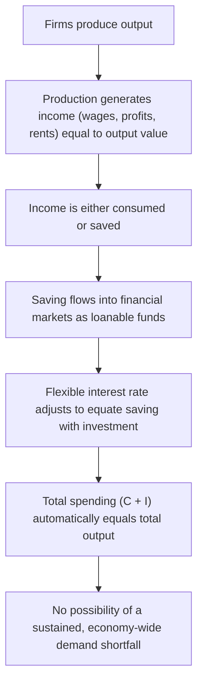
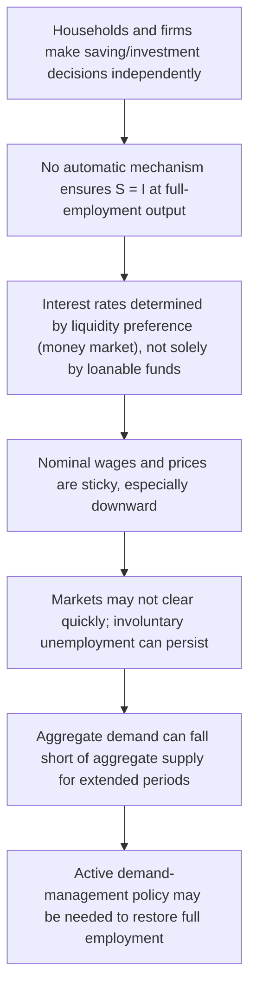
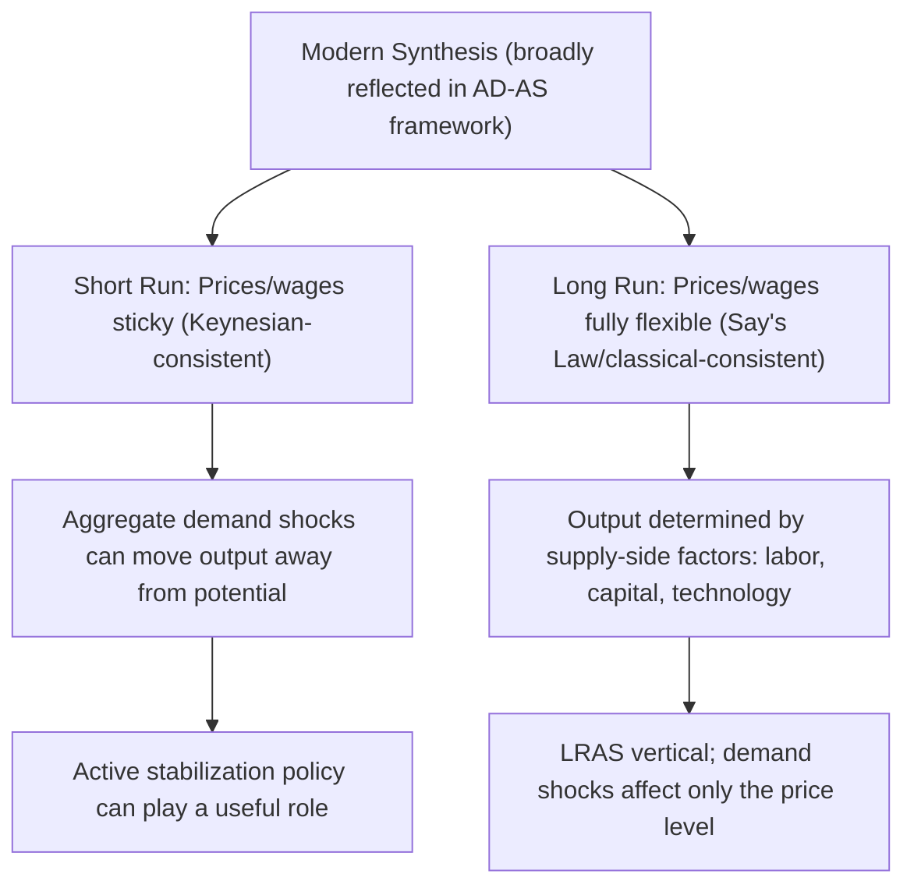

## Say's Law versus Keynesian Demand-Side Theory

### Overview

The debate between **Say's Law** and **Keynesian demand-side theory** represents one of the most foundational methodological divides in macroeconomics, concerning whether an economy is naturally self-regulating (with supply automatically generating its own demand) or whether it can experience prolonged periods of deficient demand requiring active policy intervention. This debate underlies much of the disagreement between classical/neoclassical economics and Keynesian economics regarding the causes of recessions and the appropriate role of government in stabilizing the economy.

### Say's Law

#### Definition and Origin

**Say's Law**, attributed to French economist Jean-Baptiste Say (early 19th century), is often summarized by the phrase "**supply creates its own demand**." The underlying logic is that the very act of producing goods and services generates income (wages, profits, rents) equal in value to what was produced, and that this income, in turn, provides exactly the purchasing power needed to buy that output.

$$\text{Total Value of Output Produced} = \text{Total Income Generated} = \text{Total Potential Demand}$$

#### Underlying Logic

1. Firms produce goods and services, paying wages, rents, interest, and profits to the factors of production involved.
2. This payment constitutes income for households and other economic agents.
3. Assuming this income is either spent (on consumption) or saved (which, in classical theory, flows through financial markets into investment via flexible interest rates), total spending in the economy should automatically equal total output.
4. Therefore, **general** overproduction (a persistent economy-wide glut of unsold goods) is theoretically impossible; any excess supply of a *specific* good would be corrected by relative price adjustments, but there could be no economy-wide, sustained shortfall of aggregate demand relative to aggregate supply.

#### The Role of Flexible Prices and Interest Rates

Say's Law relies critically on the classical assumption that **prices, wages, and interest rates are fully flexible**, ensuring markets clear continuously:

- If households choose to save more (spend less on current consumption), the increased supply of loanable funds in financial markets would, in classical theory, drive down the interest rate, which would then stimulate investment spending by an equivalent amount — ensuring that saving always translates into an equal amount of investment spending, so aggregate demand never falls short of aggregate supply.
- If any specific market experiences a temporary imbalance (e.g., unsold inventory), a fall in that good's relative price would restore equilibrium in that market without necessitating a change in the *overall* level of output or income.

#### Diagram: The Say's Law Mechanism

### Policy Implications of Say's Law

If Say's Law holds, several important policy conclusions follow within the classical framework:

- **Recessions, if they occur, are self-correcting and temporary**: Any output gap arises only from temporary price/wage misadjustment, which flexible markets will quickly resolve without government intervention.
- **Government demand-management policy is unnecessary (and potentially harmful)**: Since aggregate demand is not an independent constraint on output, using fiscal or monetary policy to "boost demand" cannot raise output beyond what supply-side factors (labor, capital, technology) already determine; at best, it might only affect the price level or crowd out private spending.
- **Unemployment is primarily voluntary or frictional/structural**: Persistent involuntary unemployment (workers willing to work at the prevailing wage but unable to find jobs) should not exist for long, since flexible wages would adjust to clear the labor market.

### Keynesian Demand-Side Theory

#### Definition and Origin

**Keynesian economics**, developed principally by John Maynard Keynes in his 1936 work *The General Theory of Employment, Interest and Money*, directly challenged Say's Law, arguing that aggregate demand can be **persistently deficient** relative to the economy's productive capacity, resulting in prolonged periods of underemployment and output below potential — a phenomenon Keynes argued was clearly evident during the Great Depression of the 1930s.

#### Core Critique of Say's Law

Keynes's central argument was that the mechanisms Say's Law relies upon to automatically equate saving and investment — and thus to guarantee that aggregate demand equals aggregate supply — do not operate reliably or quickly in practice:

1. **Saving and investment decisions are made by different agents for different reasons**: Households save based on considerations like precautionary motives, life-cycle planning, and habit, while firms invest based on expected future profitability (Keynes's famous "animal spirits") — there is no automatic mechanism ensuring these two independently-determined flows match at full-employment output.
2. **Interest rates may not adjust sufficiently or quickly**: [Inference] Keynes argued that interest rates are determined primarily by the supply and demand for money (liquidity preference theory) rather than purely by the balance of saving and investment in loanable funds markets, meaning there is no guarantee that the interest rate will adjust to whatever level is needed to equate saving and investment at full employment — a key theoretical departure from the classical loanable funds framework underlying Say's Law.
3. **Wages and prices are sticky, not fully flexible**: Nominal wages, in particular, tend to resist downward adjustment (due to contracts, minimum wage laws, and worker/union resistance to nominal wage cuts), meaning labor markets may not clear quickly even when there is excess labor supply (involuntary unemployment).
4. **The paradox of thrift**: If households collectively attempt to save more during a downturn (a reasonable individual response to uncertainty), but investment does not rise correspondingly, the resulting fall in aggregate consumption spending can reduce aggregate income and output — potentially even reducing total saving in the economy despite the higher saving *rate*, since $S = Y \times MPS$ and $Y$ itself falls. This is a direct challenge to the idea that saving automatically and painlessly translates into investment.

#### Diagram: The Keynesian Critique

### Policy Implications of Keynesian Theory

- **Recessions can be prolonged and severe without intervention**: Absent active policy, an economy can become "stuck" in an equilibrium at output below potential for an extended period, since the self-correction mechanisms are slow or unreliable.
- **Active fiscal and monetary policy can restore full employment**: Government spending, tax policy, and monetary policy can be used to directly shift aggregate demand, closing recessionary gaps more quickly than waiting for wage/price adjustment.
- **Involuntary unemployment is a genuine, persistent phenomenon**: Workers can be willing to work at the prevailing (or even lower) wage but unable to find employment due to deficient aggregate demand, not merely due to frictional search time or voluntary choice.

### Historical Context: The Great Depression

[Unverified] The Great Depression of the 1930s, featuring prolonged mass unemployment lasting many years across major economies, is widely cited in the history of economic thought as the empirical challenge that motivated Keynes's break from classical theory: the depth and persistence of the downturn appeared difficult to reconcile with the classical view that flexible wages and prices would quickly restore full employment, lending significant influence to the Keynesian view that aggregate demand deficiency could be a genuine, persistent macroeconomic problem requiring active policy response. The precise causal weight of demand-side factors versus other contributing causes (e.g., monetary policy failures, banking crises, international gold standard constraints) in the Great Depression remains a subject of extensive historical and economic research and debate.

### Comparing Say's Law and Keynesian Theory

| Feature | Say's Law | Keynesian Theory |
| --- | --- | --- |
| **Core claim** | Supply creates its own demand | Demand can be persistently deficient relative to supply |
| **Price/wage flexibility assumption** | Fully flexible, ensuring continuous market clearing | Sticky, particularly nominal wages (downward rigidity) |
| **Saving-investment link** | Automatically equated via flexible interest rates (loanable funds market) | Not automatically equated; determined by independent decisions and liquidity preference |
| **Unemployment** | Primarily voluntary, frictional, or structural; involuntary unemployment is temporary | Involuntary unemployment can be genuine and persistent |
| **Role of government** | Minimal; intervention is unnecessary or counterproductive | Active fiscal/monetary policy can be necessary to restore full employment |
| **View of recessions** | Self-correcting and temporary | Can be prolonged without active intervention |
| **Associated school** | Classical economics | Keynesian economics |

### Modern Synthesis and Ongoing Relevance

[Inference] Contemporary mainstream macroeconomics generally does not treat this as a strict either/or choice between the two positions. Most modern macroeconomic models (particularly New Keynesian models) incorporate elements of both traditions: they generally accept that prices and wages exhibit some degree of stickiness in the short run (consistent with the Keynesian critique), allowing for temporary demand-driven output fluctuations and a meaningful role for stabilization policy, while also incorporating the classical/Say's Law-consistent idea that in the **long run**, once all prices and wages fully adjust, output is determined by supply-side factors (labor, capital, technology) — reflected in the vertical Long-Run Aggregate Supply curve. This synthesis broadly maps onto the short-run (Keynesian, demand-driven, sticky prices) versus long-run (classical, supply-driven, flexible prices) distinction embedded in the modern AD-AS framework itself.

The degree to which any given economist or policymaker emphasizes demand-side stabilization tools versus reliance on markets' self-correcting tendencies continues to be an area of genuine debate and differing schools of thought within macroeconomics, rather than a fully settled question.

### Diagram: Reconciling the Debate in the Modern AD-AS Framework

**Key Points**

- Say's Law holds that supply automatically generates sufficient demand through the income created in production, relying on fully flexible prices, wages, and interest rates to continuously clear all markets.
- Keynesian theory challenges this by arguing that saving and investment are independently determined, interest rates are governed by liquidity preference rather than only loanable funds, and wages/prices are sticky — allowing aggregate demand to fall persistently short of aggregate supply.
- The debate has direct policy implications: Say's Law implies minimal need for government demand-management, while Keynesian theory provides the theoretical justification for active fiscal and monetary stabilization policy.
- The Great Depression is widely cited as the historical episode that most directly challenged the classical, Say's-Law-consistent view and catalyzed the development of Keynesian economics.
- Modern mainstream macroeconomics broadly synthesizes both traditions: short-run stickiness (Keynesian) alongside long-run supply-side determination of output (classical/Say's Law-consistent), as reflected in the standard AD-AS framework's distinction between SRAS and LRAS.

### Common Misconceptions

- **Misconception**: Say's Law means that any individual good that is produced will always find a buyer at its current price.

  **Correction**: Say's Law is a claim about the impossibility of a *general*, economy-wide glut of all goods simultaneously; it explicitly allows for temporary imbalances in *specific* markets, which are corrected through relative price adjustments rather than being ruled out entirely.
- **Misconception**: Keynesian theory claims that supply-side factors never matter for output.

  **Correction**: Keynesian theory primarily addresses short-run output determination under sticky prices; most Keynesian-influenced modern models still accept that in the long run, supply-side factors (captured by the LRAS curve) determine potential output, consistent with the classical view over a longer time horizon.
- **Misconception**: This debate has been definitively resolved in favor of one side.

  **Correction**: While modern mainstream macroeconomics generally incorporates short-run price stickiness (a Keynesian-influenced feature) into otherwise classical-influenced long-run models, the appropriate degree of reliance on active stabilization policy versus market self-correction remains a genuine area of ongoing debate among economists and across different schools of macroeconomic thought.

### Conclusion

The debate between Say's Law and Keynesian demand-side theory addresses a foundational question in macroeconomics: whether an economy's own supply-side production automatically generates sufficient demand to sustain full employment, or whether aggregate demand can fall persistently short of the economy's productive capacity, creating genuine involuntary unemployment. Say's Law, resting on the assumption of fully flexible prices, wages, and interest rates, implies that markets self-correct and that active government demand-management is unnecessary. Keynesian theory, developed in direct response to the prolonged unemployment of the Great Depression, challenges this by highlighting the independence of saving and investment decisions, the role of liquidity preference in determining interest rates, and the empirical reality of sticky wages and prices — providing the theoretical foundation for active fiscal and monetary stabilization policy. Modern macroeconomics broadly reconciles these positions by treating the short run as Keynesian-influenced (sticky prices, demand can affect output) and the long run as classical/Say's-Law-consistent (output determined by supply-side factors), a synthesis embedded directly in the structure of the modern AD-AS model.

**Related Topics**

- The Keynesian Cross model and expenditure-driven equilibrium
- Liquidity preference theory and interest rate determination
- Loanable funds theory (classical saving-investment framework)
- Downward wage/price rigidity and its causes
- The Great Depression as a case study in macroeconomic history
- Long-Run Aggregate Supply and monetary neutrality
- New Keynesian economics and modern synthesis models
- Paradox of thrift and the saving-investment relationship