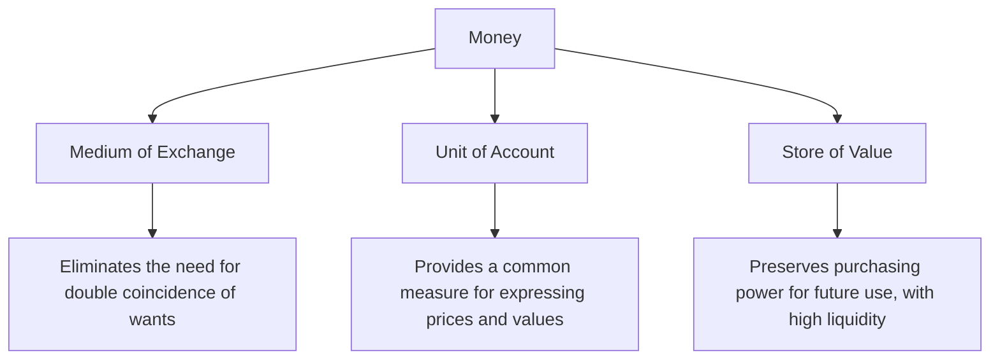
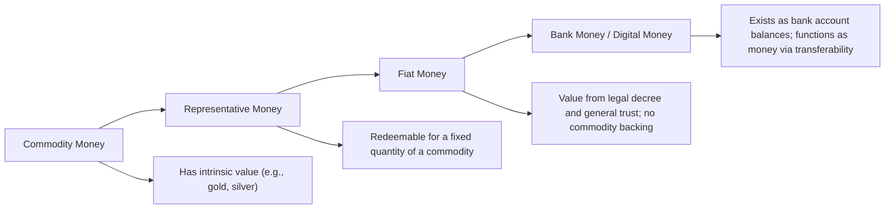

## Functions and Types of Money

### Definition of Money

**Money** is any object or record generally accepted as payment for goods and services and repayment of debts within a given economy or socio-economic context. Economists define money not by its physical form but by the **functions** it performs — any asset that fulfills these functions can be classified as money, regardless of whether it takes the form of metal coins, paper notes, bank deposits, or digital records.

### The Three Functions of Money

#### 1. Medium of Exchange

Money's primary function is to serve as a **medium of exchange** — an intermediary asset used to facilitate transactions, eliminating the need for a **double coincidence of wants** that would otherwise be required under pure barter.

**Barter problem**: In a barter economy, a trade can only occur if each party happens to want exactly what the other party is offering, at the same time and place. A farmer with wheat who wants shoes must find a shoemaker who simultaneously wants wheat — a highly restrictive condition that severely limits the volume and efficiency of trade.

**Money's solution**: With a generally accepted medium of exchange, the farmer can sell wheat for money to anyone, then use that money to buy shoes from a shoemaker, regardless of what the shoemaker currently wants. This dramatically reduces transaction costs and expands the potential scope of trade.

#### 2. Unit of Account

Money serves as a common **unit of account** — a standard measure used to express and compare the value of different goods, services, debts, and financial obligations. Instead of expressing the exchange rate between every possible pair of goods (a wheat-to-shoes ratio, a shoes-to-milk ratio, a milk-to-wheat ratio, and so on, which grows combinatorially with the number of goods), all values can be expressed in a single common unit (e.g., dollars, euros, pesos), dramatically simplifying price comparisons, accounting, and contracts.

$$\text{Number of exchange rates needed under barter} = \binom{n}{2} = \frac{n(n-1)}{2}$$

For an economy with $n$ distinct goods. With a common unit of account (money), only $n$ prices are needed (the price of each good in terms of money), rather than the much larger number of pairwise exchange rates required under pure barter.

#### 3. Store of Value

Money serves as a **store of value** — a means of preserving purchasing power over time, allowing individuals to save current income for future consumption without the good itself deteriorating, being costly to store, or being illiquid.

[Inference] Money is generally recognized as an *imperfect* store of value compared to some other assets, since its real value erodes over time under inflation; however, its high liquidity (ease of being used directly in transactions without conversion cost) is what particularly distinguishes it from other stores of value like real estate, stocks, or bonds, which may hold value well (or better, depending on returns) but cannot be used directly as a medium of exchange without first being converted into money.

### Diagram: The Three Functions of Money

### Additional Desirable Characteristics of Money

Beyond its three core functions, economists identify several practical characteristics that make an asset well-suited to serve as money:

1. **Durability**: Money must not deteriorate quickly with physical use or the passage of time.
2. **Portability**: Money should be easy to carry and transport for transactions.
3. **Divisibility**: Money should be divisible into smaller units to accommodate transactions of varying sizes.
4. **Uniformity**: Each unit of money should be identical to every other unit of the same denomination, so that any unit is accepted interchangeably.
5. **Limited supply (scarcity)**: The supply of money must be limited relative to demand to maintain its value; an unlimited or easily counterfeited supply undermines its usefulness as a store of value and medium of exchange.
6. **Acceptability**: The asset must be widely accepted by others as payment, which is often reinforced by legal tender laws designating it as acceptable for settling debts.

### Types of Money

#### 1. Commodity Money

**Commodity money** is money that has intrinsic value derived from the material it is made of, independent of its use as money — meaning the item would retain value even if it stopped being used as currency. Historical examples include gold, silver, salt, cattle, and tobacco.

**Advantages**: Intrinsically valuable, difficult to arbitrarily inflate (supply is tied to physical availability of the commodity).

**Disadvantages**: Often bulky, difficult to divide precisely (e.g., cattle), variable in quality (e.g., agricultural commodities), and the value can fluctuate based on the commodity's own market conditions (e.g., a new gold discovery affecting gold-based currency value).

#### 2. Representative Money

**Representative money** consists of certificates or tokens that can be exchanged, on demand, for a fixed quantity of an underlying commodity (typically a precious metal such as gold or silver) held in reserve by the issuer. Historical examples include gold certificates and silver certificates, which were redeemable for a fixed amount of the corresponding metal.

$$\text{Value of representative money} = \text{Value of the underlying commodity it represents}$$

Representative money combines the practical convenience of paper currency (portability, divisibility) with the value backing of an underlying commodity.

#### 3. Fiat Money

**Fiat money** has value primarily because a government has decreed it to be legal tender and because it is widely accepted for transactions and debt settlement — it is not backed by, nor redeemable for, a fixed quantity of any physical commodity. Most modern national currencies (the U.S. dollar, the euro, the Japanese yen, and others) are fiat money.

**Basis for value**:

- **Legal tender status**: Governments require or strongly incentivize the acceptance of fiat currency for tax payments and debt settlement.
- **General acceptance and trust**: Because others accept it, individuals are willing to accept it themselves — a self-reinforcing social convention.
- **Relative scarcity, managed by monetary authorities**: Central banks control the money supply, and confidence in that management (avoiding excessive money creation) underpins the currency's stability and purchasing power.

[Inference] Because fiat money's value rests on trust and institutional credibility rather than a physical commodity backing, its long-run value is particularly sensitive to the monetary policy credibility of the issuing central bank or government — a key reason central bank independence and credible commitment to low, stable inflation are widely emphasized in modern monetary policy design.

#### 4. Bank Money (Deposit Money / Demand Deposits)

**Bank money** refers to the balances held in checking accounts and other demand deposits at commercial banks, which can be transferred between parties via checks, debit cards, or electronic transfers. Although this money exists only as an accounting entry (a bank's liability to the depositor) rather than as physical currency, it functions as money because it is widely accepted for transactions and is convertible to physical currency on demand.

[Unverified] In most modern developed economies, bank money (demand deposits) constitutes a substantial majority of the total money supply as measured by broader monetary aggregates, though the precise proportion varies by country, time period, and the specific monetary aggregate definition used.

### Diagram: Types of Money Along the Spectrum of Intrinsic Value

### Measuring the Money Supply: Monetary Aggregates

Economists and central banks typically classify money into different **monetary aggregates** based on liquidity — how readily an asset can be used in transactions:

- **M1**: The most liquid measure, generally including physical currency in circulation plus demand deposits (checking accounts) and other highly liquid deposits.
- **M2**: A broader measure, generally including everything in M1 plus less liquid assets such as savings deposits, small-denomination time deposits, and retail money market mutual fund balances.

[Unverified] The precise components included in M1 and M2 (and other aggregates such as M3, used by some central banks) have varied over time and differ by country and central bank definition; for example, the U.S. Federal Reserve revised its definition of M1 in 2020 to incorporate savings deposits previously classified separately. Given that these definitions are subject to periodic revision, current official definitions should be verified against the relevant central bank's published methodology.

### Example: Illustrating the Functions of Money

Consider an economy transitioning from barter to a money-based system:

**Under barter**: A dentist who wants a haircut must find a barber who happens to need dental work at that exact time — an inefficient search process (the double coincidence of wants problem) that severely restricts trade.

**With money introduced**: The dentist can charge patients in the common currency (fulfilling the **unit of account** function, since all dental services are priced in that currency), receive payment in that currency (fulfilling the **medium of exchange** function, allowing the dentist to transact with anyone, not just people who want dental work), and hold unspent earnings in a bank account for future use (fulfilling the **store of value** function, preserving purchasing power for later purchases such as the haircut, groceries, or larger purchases).

### Common Misconceptions

- **Misconception**: Money must have intrinsic value to function as money.

  **Correction**: While commodity money has intrinsic value, fiat money — which comprises the large majority of modern national currencies — has no intrinsic commodity backing and derives its value instead from legal tender status, general acceptance, and trust in the issuing authority's monetary policy.
- **Misconception**: Only physical cash counts as "real" money.

  **Correction**: Bank money (demand deposit balances) functions fully as money in modern economies, since it is directly usable for transactions via checks, debit cards, and electronic transfers, and is included in standard monetary aggregate measures like M1.
- **Misconception**: Money is a perfect store of value.

  **Correction**: Money is generally considered an imperfect store of value because inflation erodes its real purchasing power over time; its defining advantage as a store of value is its high liquidity (ease of use in transactions) rather than a guarantee of preserved real value.

### Conclusion

Money is defined functionally, not by its physical form, through its roles as a medium of exchange (eliminating the need for a double coincidence of wants), a unit of account (providing a common standard for expressing value), and a store of value (preserving purchasing power, albeit imperfectly, due to liquidity advantages over other assets). Historically, money has evolved from commodity money (with intrinsic value) through representative money (backed by a redeemable commodity) to the fiat money and bank money that dominate modern economies, whose value rests on legal tender status, institutional trust, and monetary policy credibility rather than physical commodity backing. Understanding these functions and forms provides the conceptual foundation for analyzing monetary policy, the banking system, and the broader financial system's role in the macroeconomy.

**Related Topics**

- The money supply and monetary aggregates (M1, M2)
- Central bank monetary policy tools
- The banking system and fractional reserve banking
- The gold standard and historical monetary regimes
- Cryptocurrency and digital currency as emerging monetary forms
- Inflation and the erosion of money's store-of-value function
- The quantity theory of money
- Central bank independence and credibility