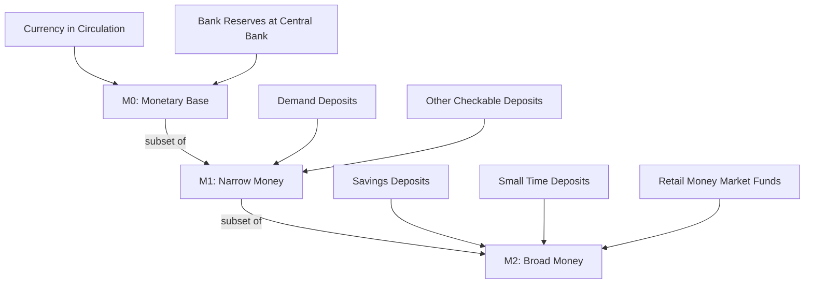

## Money Supply Definitions: M0, M1, M2

### Overview

Money supply measures classify the liquid assets circulating in an economy into monetary aggregates, ordered by decreasing liquidity. Each aggregate (M0, M1, M2) nests the narrower ones inside it, forming concentric layers rather than distinct, non-overlapping categories. Central banks track these aggregates to gauge liquidity conditions, forecast inflation, and calibrate monetary policy.

The core logic behind the layering is the **moneyness spectrum**: assets are ranked by how readily they function as a medium of exchange versus a store of value. Currency in circulation sits at the most liquid end; savings deposits and near-money instruments sit further along the spectrum, retaining value but requiring conversion before use in transactions.

### The Moneyness Spectrum (svg_diagram)

<svg xmlns="http://www.w3.org/2000/svg" viewBox="0 0 720 260" font-family="Arial, sans-serif">
<text x="360" y="24" text-anchor="middle" font-size="16" font-weight="bold" fill="#1a1a1a">Moneyness Spectrum (svg_diagram)</text>

<line x1="60" y1="220" x2="660" y2="220" stroke="#333" stroke-width="2" />
<polygon points="660,220 650,215 650,225" fill="#333" />
<text x="660" y="245" text-anchor="end" font-size="12" fill="#333">Decreasing Liquidity →</text>
<text x="60" y="245" text-anchor="start" font-size="12" fill="#333">← Highest Liquidity</text>

<rect x="60" y="80" width="150" height="120" fill="#2563eb" fill-opacity="0.85" stroke="#1e3a8a" stroke-width="1.5" />
<text x="135" y="105" text-anchor="middle" font-size="14" font-weight="bold" fill="#ffffff">M0</text>
<text x="135" y="125" text-anchor="middle" font-size="11" fill="#ffffff">Currency in</text>
<text x="135" y="140" text-anchor="middle" font-size="11" fill="#ffffff">circulation +</text>
<text x="135" y="155" text-anchor="middle" font-size="11" fill="#ffffff">bank reserves</text>
<text x="135" y="175" text-anchor="middle" font-size="10" fill="#dbeafe">(Monetary Base)</text>

<rect x="220" y="60" width="200" height="140" fill="#3b82f6" fill-opacity="0.7" stroke="#1e3a8a" stroke-width="1.5" />
<text x="320" y="80" text-anchor="middle" font-size="14" font-weight="bold" fill="#ffffff">M1</text>
<text x="320" y="145" text-anchor="middle" font-size="11" fill="#ffffff">M0 (currency held</text>
<text x="320" y="160" text-anchor="middle" font-size="11" fill="#ffffff">by public) + demand</text>
<text x="320" y="175" text-anchor="middle" font-size="11" fill="#ffffff">deposits + checkable</text>
<text x="320" y="190" text-anchor="middle" font-size="11" fill="#ffffff">accounts</text>

<rect x="430" y="40" width="230" height="160" fill="#60a5fa" fill-opacity="0.55" stroke="#1e3a8a" stroke-width="1.5" />
<text x="545" y="60" text-anchor="middle" font-size="14" font-weight="bold" fill="#1e3a8a">M2</text>
<text x="545" y="150" text-anchor="middle" font-size="11" fill="#1e3a8a">M1 + savings deposits</text>
<text x="545" y="165" text-anchor="middle" font-size="11" fill="#1e3a8a">+ small time deposits</text>
<text x="545" y="180" text-anchor="middle" font-size="11" fill="#1e3a8a">+ retail money</text>
<text x="545" y="195" text-anchor="middle" font-size="11" fill="#1e3a8a">market funds</text>
</svg>

### M0 — The Monetary Base

**Definition**

M0, also called the **monetary base** or **narrow money**, represents the most liquid form of money. Its components are:

- Physical currency (banknotes and coins) in circulation, held by the public and by banks outside the central bank
- Commercial banks' reserves held at the central bank (both required and excess reserves)

$$M0 = \text{Currency in circulation} + \text{Bank reserves at the central bank}$$

**Key Points**

- M0 is directly controlled by the central bank through open market operations, reserve requirement changes, and standing facilities.
- It is the base from which broader money is created through fractional-reserve banking and the money multiplier.
- M0 is sometimes used interchangeably with "high-powered money" because each unit can support a multiple of deposit creation in the wider banking system.
- Definitions of M0 vary slightly by jurisdiction. Some central banks (e.g., the Bank of England historically) define M0 narrowly as currency plus banks' operational balances only, while others fold in different reserve categories. [Unverified: exact composition depends on the specific central bank's published methodology at any given time.]

**Example**

If a central bank reports $2.1 trillion in currency circulating in the economy and commercial banks hold $3.4 trillion in reserve balances at the central bank, then:

$$M0 = \$2.1\text{T} + \$3.4\text{T} = \$5.5\text{T}$$

### M1 — Narrow Money

**Definition**

M1 captures assets usable directly for transactions without conversion. It includes:

- Currency held by the *public* (excludes currency sitting in bank vaults, which is already captured differently to avoid double counting)
- Demand deposits (checking accounts) at commercial banks
- Other checkable deposits (e.g., negotiable order of withdrawal accounts)
- Traveler's checks (largely negligible in modern reporting)

$$M1 = \text{Currency held by public} + \text{Demand deposits} + \text{Other checkable deposits}$$

**Key Points**

- M1 measures the money stock that is immediately spendable — the medium-of-exchange function of money is dominant here.
- The U.S. Federal Reserve redefined M1 in May 2020 to include savings deposits (reclassified from M2) after removing regulatory transfer limits (Regulation D) on savings accounts. This caused a large, mechanical jump in reported M1 that does not reflect actual new money creation. [Fact, but flagged because it materially changes cross-period comparisons: pre-2020 and post-2020 U.S. M1 series are not directly comparable without adjustment.]
- Velocity of M1 (how many times a unit of M1 turns over in transactions per year) is a commonly watched macroeconomic indicator:

$$V_1 = \frac{P \times Y}{M1}$$

where $P$ is the price level and $Y$ is real output (from the equation of exchange, $MV = PY$).

**Example**

A household's checking account balance of $3,000 and $200 in physical cash both count in M1. A $5,000 balance in a savings account, however, is excluded from the traditional (pre-2020 U.S.) definition of M1 but included in M2.

### M2 — Broad Money

**Definition**

M2 extends M1 by adding "near-money" assets — instruments that store value effectively and can be converted to spendable money quickly, but are not directly used to make payments. Typical components:

- All of M1
- Savings deposits
- Small-denomination time deposits (e.g., certificates of deposit under $100,000 in the U.S. context)
- Retail money market mutual fund shares

$$M2 = M1 + \text{Savings deposits} + \text{Small time deposits} + \text{Retail MMMFs}$$

**Key Points**

- M2 is the aggregate most commonly cited in monetary policy discussions and inflation debates because it balances breadth (capturing near-money) with data availability and timeliness.
- M2 growth rates are frequently compared against nominal GDP growth to assess whether monetary expansion is outpacing real economic activity — a rough proxy tied to the quantity theory of money.
- Some jurisdictions define an even broader aggregate, M3 or M4, adding large time deposits, institutional money market funds, and repurchase agreements. The U.S. Federal Reserve discontinued official M3 reporting in 2006, citing that it added little predictive value over M2 while being costly to collect. [Fact; the Fed's stated rationale, not an independent assessment of predictive value.]

**Example**

Continuing the household example: the $3,000 checking balance + $200 cash (in M1) plus the $5,000 savings deposit together contribute $8,200 to M2.

### Comparative Summary Table

| Aggregate | Includes | Liquidity | Primary Function |
| --- | --- | --- | --- |
| M0 | Currency in circulation + bank reserves | Highest | Base for credit creation; central bank policy lever |
| M1 | Currency (public) + demand/checkable deposits | Very high | Medium of exchange |
| M2 | M1 + savings deposits + small time deposits + retail MMMFs | High but lower than M1 | Store of value + near-transactional |

### Nesting Structure

### The Money Multiplier and Link to M0

The relationship between the monetary base (M0) and broader aggregates (M1, M2) operates through fractional-reserve banking. Each dollar of reserves can support a multiple of deposit money, governed conceptually by:

$$m = \frac{1}{rr}$$

where $m$ is the simple money multiplier and $rr$ is the required reserve ratio. In practice, the observed multiplier ($M1/M0$ or $M2/M0$) diverges from this simple formula because it also depends on the public's currency-to-deposit preferences and banks' holdings of excess reserves.

$$M1 = m_1 \times M0, \quad M2 = m_2 \times M0$$

**Key Points**

- During periods of financial stress (e.g., 2008–2009, 2020), banks often hold large excess reserves rather than lending them out, causing the observed multiplier to fall well below $1/rr$. [Inference from standard macroeconomic behavior during those episodes; magnitude varies by country and period.]
- Quantitative easing programs expand M0 substantially by crediting bank reserve accounts, but this does not mechanically produce a proportional expansion in M1/M2 if banks do not extend new loans.

### Policy Relevance

- **Monetarist framework**: Historically, some central banks (e.g., the Bundesbank, and the Fed under certain regimes) used M2 or M3 growth targets as intermediate policy instruments, based on the quantity theory relationship $MV = PY$.
- **Modern practice**: Most major central banks (Federal Reserve, ECB, Bank of Japan) have shifted primary focus toward interest rate targeting rather than strict monetary aggregate targeting, though M2 data is still published and monitored as a supplementary indicator. [Fact, though the degree of emphasis on monetary aggregates varies by central bank and has shifted over time.]
- Sharp M2 growth surges, such as those observed in the U.S. during 2020–2021 pandemic-era stimulus, are often cited in debates over subsequent inflation, though economists disagree on the strength and lag structure of the M2–inflation relationship. [Speculation/contested: the causal strength of this relationship is actively debated among economists and is not settled empirically.]

### Common Pitfalls

- Treating M0, M1, and M2 as mutually exclusive categories rather than nested aggregates.
- Assuming a mechanical, fixed relationship between central bank reserve creation (M0 expansion via QE) and broad money (M2) growth — the transmission depends on bank lending behavior.
- Comparing M1 data across the 2020 U.S. Regulation D reclassification without adjusting for the definitional break in the series.
- Confusing "money supply" (a stock, measured at a point in time) with "money flow" or "spending" (a flow, measured over a period).

**Related Topics**

- Quantity Theory of Money and the Equation of Exchange ($MV = PY$)
- Fractional Reserve Banking and the Money Multiplier
- Central Bank Balance Sheets and Quantitative Easing
- Velocity of Money and Its Determinants
- Reserve Requirements and Regulation D (historical U.S. context)
- M3/M4 and Shadow Banking Liquidity Measures
- Interest Rate Targeting vs. Monetary Aggregate Targeting
- Inflation Theory: Monetarist vs. Keynesian Perspectives