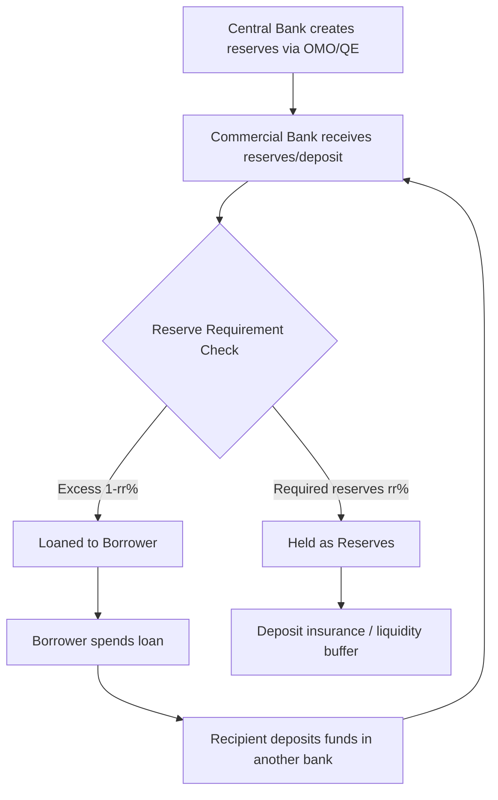

## The Banking System and Fractional Reserve Banking

### Overview

Fractional reserve banking is the system in which commercial banks hold only a fraction of depositors' funds as reserves, lending out the remainder. This practice underlies the modern banking system's capacity to create money, allocate credit, and transform short-term liquid deposits into longer-term illiquid loans. It is the mechanism connecting central bank policy (via the monetary base) to the broader money supply (M1, M2).

### Structure of the Banking System

**Key Points**

- **Two-tier system**: A central bank (monetary authority) sits atop a network of commercial banks. The central bank issues the monetary base and regulates the system; commercial banks accept deposits and extend credit to households, firms, and governments.
- **Central bank functions**: Banker to the government, lender of last resort, issuer of currency, regulator/supervisor, and setter of monetary policy (interest rates, reserve requirements, open market operations).
- **Commercial bank functions**: Financial intermediation (channeling savings to borrowers), maturity transformation (short-term deposits into long-term loans), payment services, and liquidity provision.
- **Shadow banking**: Non-bank financial intermediaries (money market funds, hedge funds, certain finance companies) that perform bank-like credit intermediation without being subject to the same reserve/capital requirements. [Note: regulatory treatment of shadow banking entities varies significantly by jurisdiction and has evolved considerably since 2008.]

### Two-Tier Banking Structure (svg_diagram)

<svg xmlns="http://www.w3.org/2000/svg" viewBox="0 0 720 300" font-family="Arial, sans-serif">
<text x="360" y="24" text-anchor="middle" font-size="16" font-weight="bold" fill="#1a1a1a">Two-Tier Banking Structure (svg_diagram)</text>
<rect x="260" y="45" width="200" height="60" rx="6" fill="#1e3a8a" />
<text x="360" y="70" text-anchor="middle" font-size="13" font-weight="bold" fill="#ffffff">Central Bank</text>
<text x="360" y="90" text-anchor="middle" font-size="10" fill="#dbeafe">Issues base money, sets policy rate</text>
<line x1="360" y1="105" x2="140" y2="150" stroke="#333" stroke-width="1.5" />
<line x1="360" y1="105" x2="360" y2="150" stroke="#333" stroke-width="1.5" />
<line x1="360" y1="105" x2="580" y2="150" stroke="#333" stroke-width="1.5" />
<rect x="60" y="150" width="160" height="55" rx="6" fill="#2563eb" />
<text x="140" y="172" text-anchor="middle" font-size="12" font-weight="bold" fill="#ffffff">Commercial Bank A</text>
<text x="140" y="190" text-anchor="middle" font-size="10" fill="#dbeafe">Reserves held at CB</text>
<rect x="280" y="150" width="160" height="55" rx="6" fill="#2563eb" />
<text x="360" y="172" text-anchor="middle" font-size="12" font-weight="bold" fill="#ffffff">Commercial Bank B</text>
<text x="360" y="190" text-anchor="middle" font-size="10" fill="#dbeafe">Reserves held at CB</text>
<rect x="500" y="150" width="160" height="55" rx="6" fill="#2563eb" />
<text x="580" y="172" text-anchor="middle" font-size="12" font-weight="bold" fill="#ffffff">Commercial Bank C</text>
<text x="580" y="190" text-anchor="middle" font-size="10" fill="#dbeafe">Reserves held at CB</text>
<line x1="140" y1="205" x2="140" y2="245" stroke="#333" stroke-width="1.5" />
<line x1="360" y1="205" x2="360" y2="245" stroke="#333" stroke-width="1.5" />
<line x1="580" y1="205" x2="580" y2="245" stroke="#333" stroke-width="1.5" />
<rect x="60" y="245" width="160" height="40" rx="6" fill="#93c5fd" />
<text x="140" y="270" text-anchor="middle" font-size="11" fill="#1e3a8a">Households / Firms</text>
<rect x="280" y="245" width="160" height="40" rx="6" fill="#93c5fd" />
<text x="360" y="270" text-anchor="middle" font-size="11" fill="#1e3a8a">Households / Firms</text>
<rect x="500" y="245" width="160" height="40" rx="6" fill="#93c5fd" />
<text x="580" y="270" text-anchor="middle" font-size="11" fill="#1e3a8a">Households / Firms</text>
</svg>

### Fractional Reserve Mechanics

**Definition**

Under fractional reserve banking, a bank receiving a deposit is required (or chooses) to hold only a fraction of it as reserves, lending out the rest. The **reserve ratio** ($rr$) is the proportion of deposits held back:

$$rr = \frac{\text{Reserves}}{\text{Deposits}}$$

**Balance Sheet Mechanics**

A bank's simplified balance sheet:

| Assets | Liabilities |
| --- | --- |
| Reserves | Deposits |
| Loans | Equity/Capital |
| Securities |  |

When a bank receives a new deposit, reserves and deposits both rise by that amount. The bank then lends out $(1 - rr)$ of the deposit, and that loan — once spent and redeposited elsewhere in the banking system — becomes a new deposit subject to the same process.

### The Deposit Expansion Process

**Example**

Assume a reserve ratio of 10% ($rr = 0.10$) and an initial deposit of $1,000 into Bank A.

| Round | New Deposit | Reserves Held (10%) | Amount Loaned Out |
| --- | --- | --- | --- |
| 1 (Bank A) | $1,000.00 | $100.00 | $900.00 |
| 2 (Bank B) | $900.00 | $90.00 | $810.00 |
| 3 (Bank C) | $810.00 | $81.00 | $729.00 |
| 4 (Bank D) | $729.00 | $72.90 | $656.10 |
| ... | ... | ... | ... |

Summing the infinite geometric series of deposits created:

$$\text{Total Deposits} = \text{Initial Deposit} \times \sum_{n=0}^{\infty}(1-rr)^n = \text{Initial Deposit} \times \frac{1}{rr}$$

$$\text{Total Deposits} = \$1,000 \times \frac{1}{0.10} = \$10,000$$

### The Money Multiplier

**Definition**

The simple money multiplier expresses the maximum expansion of the money supply per unit of new reserves:

$$m = \frac{1}{rr}$$

A more realistic multiplier incorporates the public's cash-holding behavior (currency drain) and banks' excess reserve holdings:

$$m = \frac{1 + c}{rr + c + e}$$

where:

- $c$ = currency-to-deposit ratio (public's preference for holding cash vs. deposits)
- $rr$ = required reserve ratio
- $e$ = excess-reserves-to-deposit ratio (banks' voluntary reserve holdings beyond the requirement)

**Key Points**

- Higher currency drain ($c$) reduces the multiplier, since cash withdrawn from the banking system cannot be relent.
- Higher excess reserves ($e$) — common during financial crises or periods of low loan demand — also reduce the multiplier, since idle reserves sit unlent.
- The realized (empirical) multiplier is $M1/M0$ or $M2/M0$ and is frequently well below the simple $1/rr$ formula in practice, especially post-2008 and post-2020 when many central banks held reserve ratios near zero or paid interest on excess reserves. [Fact regarding divergence; specific multiplier values are time- and jurisdiction-dependent and should be verified against current central bank data.]

### Money Creation Flow

### Bank Runs and Systemic Risk

**Key Points**

- Because banks hold only a fraction of deposits as liquid reserves, a sudden, large-scale withdrawal demand (a **bank run**) can render an otherwise solvent bank unable to meet obligations, since most assets are tied up in illiquid loans.
- Historical bank runs (e.g., U.S. banking panics of the 1930s, Northern Rock in 2007, Silicon Valley Bank in March 2023) illustrate how liquidity mismatches can trigger failures even absent underlying insolvency, particularly when depositor confidence deteriorates rapidly. [Fact: these are documented historical events; the SVB case in particular involved a mix of liquidity mismatch and unrealized securities losses.]
- **Contagion risk**: A run on one bank can spread to others through interbank lending exposure, correlated asset holdings, or generalized loss of depositor confidence.

**Mitigating Mechanisms**

- **Deposit insurance** (e.g., FDIC in the U.S., PDIC in the Philippines): Guarantees deposits up to a statutory limit, reducing incentive for panic withdrawals.
- **Lender of last resort**: Central banks provide emergency liquidity to solvent-but-illiquid banks (e.g., the Federal Reserve's discount window).
- **Capital and liquidity requirements**: Basel III framework requirements such as the Liquidity Coverage Ratio (LCR) and Net Stable Funding Ratio (NSFR) require banks to hold sufficient high-quality liquid assets against short-term outflows.
- **Reserve requirements**: Mandate a minimum reserve ratio, though several major central banks (including the U.S. Federal Reserve, which reduced reserve requirement ratios to zero in March 2020) have moved away from binding reserve requirements toward other supervisory tools. [Fact, specific to the Fed's 2020 policy change; other central banks retain varying reserve requirement regimes.]

### Regulatory Framework

**Key Points**

- **Capital adequacy**: Basel III requires banks to maintain minimum capital ratios (e.g., Common Equity Tier 1 capital ≥ 4.5% of risk-weighted assets, with additional buffers) to absorb losses before depositors or the deposit insurer bear costs.
- **Reserve requirements**: Set by central banks or monetary authorities; can be a binding policy tool or largely vestigial depending on jurisdiction and era.
- **Supervision**: Ongoing monitoring of bank solvency, asset quality, and risk management by central banks or dedicated supervisory agencies.
- **Interest on reserves**: Many central banks now pay interest on reserve balances (including excess reserves), which serves as a floor for short-term interest rates and reduces the incentive for banks to lend out reserves purely to avoid holding idle non-interest-bearing balances.

### Fractional Reserve Banking vs. Full Reserve Banking (Comparative)

| Feature | Fractional Reserve Banking | Full Reserve Banking (theoretical/proposed) |
| --- | --- | --- |
| Reserve ratio | Less than 100% of deposits | 100% of demand deposits |
| Money creation | Banks create money via lending | No bank-driven money creation |
| Liquidity risk | Bank runs possible | Bank runs largely eliminated for demand deposits |
| Credit availability | Ample; supports economic growth | Constrained; credit intermediation shifts elsewhere |
| Real-world adoption | Dominant global model | Not currently implemented at national scale; proposed under frameworks like the "Chicago Plan" |

[Note: full reserve banking remains a largely academic/policy proposal rather than an implemented system in any major economy; comparisons here describe the theoretical model, not observed practice.]

### Worked Problem

**Example**

A bank receives a $50,000 deposit. The required reserve ratio is 8%. Assume no currency drain and no excess reserves held voluntarily.

1. Required reserves: $50,000 \times 0.08 = \$4,000$
2. Excess reserves available to lend: $50,000 - 4,000 = \$46,000$
3. Simple money multiplier: $m = 1/0.08 = 12.5$
4. Maximum total deposit expansion supported by this initial deposit:

$$\$50,000 \times 12.5 = \$625,000$$

This figure represents the theoretical ceiling; actual expansion will be lower if any bank in the chain holds excess reserves or if borrowers withdraw cash rather than redepositing it.

### Common Pitfalls

- Assuming the simple multiplier ($1/rr$) is always achieved in practice — currency drain and excess reserves routinely suppress the realized multiplier.
- Confusing bank *illiquidity* (inability to meet withdrawal demand at a point in time) with bank *insolvency* (liabilities exceeding assets) — these are distinct conditions, though one can trigger the other.
- Treating reserve requirements as the primary lever of modern monetary policy in jurisdictions where interest rate policy (and interest on reserves) has become the dominant tool.
- Overlooking shadow banking entities when assessing systemic credit creation, since they can expand credit outside traditional reserve-based constraints.

**Related Topics**

- Money Supply Definitions: M0, M1, M2
- The Money Multiplier Formula and Its Real-World Limitations
- Central Bank Tools: Open Market Operations, Discount Rate, Reserve Requirements
- Basel III Capital and Liquidity Standards
- Deposit Insurance Schemes and Moral Hazard
- Lender of Last Resort Function
- Bank Runs: Historical Case Studies (1930s, 2007–08, 2023)
- Shadow Banking and Non-Bank Financial Intermediation
- The Chicago Plan and Full Reserve Banking Proposals