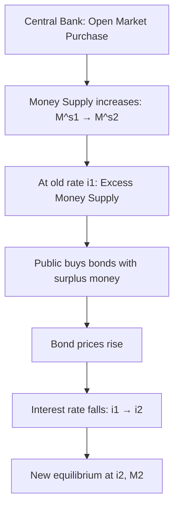

## The Money Market and Interest Rate Determination

### Overview

The money market model explains how the equilibrium (short-term, nominal) interest rate is determined by the interaction of the supply of money and the demand for money. This is distinct from the market for loanable funds (which determines real interest rates through savings and investment) and from bond markets (though the two are closely linked, since bond prices and interest rates move inversely). The money market framework is central to understanding how central bank policy actions transmit into the broader economy.

### Money Demand

**Definition**

Money demand ($M^d$) represents the desire of households and firms to hold their wealth in the form of liquid money balances rather than interest-bearing assets. Keynesian liquidity preference theory identifies three motives for holding money:

- **Transactions motive**: Money held to conduct everyday purchases; increases with real income/output ($Y$).
- **Precautionary motive**: Money held as a buffer against unexpected expenses or income shortfalls; also increases with income and economic uncertainty.
- **Speculative motive**: Money held instead of interest-bearing assets (like bonds) when interest rates are expected to rise (and bond prices to fall), avoiding capital losses; this motive drives the inverse relationship between money demand and the interest rate.

**Money Demand Function**

$$M^d = P \times L(i, Y)$$

or, in real terms (dividing by the price level $P$):

$$\frac{M^d}{P} = L(i, Y)$$

where:

- $i$ = nominal interest rate (opportunity cost of holding money)
- $Y$ = real income/output
- $L(\cdot)$ = liquidity preference function, decreasing in $i$, increasing in $Y$

**Key Points**

- The demand curve for real money balances slopes **downward** with respect to the interest rate: as $i$ rises, the opportunity cost of holding non-interest-bearing money increases, so the public shifts wealth toward interest-bearing assets, reducing money demand.
- An increase in real income ($Y$) shifts the entire money demand curve to the **right**, since higher income raises transactions and precautionary demand for money at every interest rate.
- Money demand is also affected by price level changes, financial innovation (e.g., availability of near-money substitutes, digital payment systems), and expectations about future interest rates.

### Money Supply

**Key Points**

- In the standard money market model, the money supply curve is typically drawn as a **vertical line** at the level set by the central bank, reflecting the assumption that the central bank directly controls the money stock through its policy instruments (open market operations, reserve requirements, standing facilities).
- This vertical-supply assumption is a simplifying convention for the introductory model. In practice, especially under an interest-rate-targeting regime (used by most major central banks today, including the Federal Reserve and the ECB), the central bank sets a target interest rate and supplies whatever quantity of reserves is needed to hit that target — implying the money supply curve is better thought of as **horizontal (perfectly elastic) at the target rate** in that operational context. [Fact: the operational framework used by most modern central banks targets an interest rate rather than a money supply quantity; the vertical-supply textbook diagram represents an older or simplified quantity-targeting framework, not the typical current operating procedure.]
- Money supply shifts occur through central bank actions: open market purchases (increase supply), open market sales (decrease supply), changes in reserve requirements, and changes in standing facility rates.

### Money Market Equilibrium

**Definition**

Equilibrium in the money market occurs where money demand equals money supply, determining the equilibrium nominal interest rate $i^*$:

$$M^s = M^d = P \times L(i^*, Y)$$

### Money Market Equilibrium Diagram (svg_diagram)

<svg xmlns="http://www.w3.org/2000/svg" viewBox="0 0 700 420" font-family="Arial, sans-serif">

<text x="350" y="24" text-anchor="middle" font-size="16" font-weight="bold" fill="#1a1a1a">Money Market Equilibrium (svg_diagram)</text>

<line x1="80" y1="360" x2="620" y2="360" stroke="#333" stroke-width="2" />

<line x1="80" y1="360" x2="80" y2="50" stroke="#333" stroke-width="2" />

<polygon points="620,360 610,355 610,365" fill="#333" />

<polygon points="80,50 75,60 85,60" fill="#333" />

<text x="630" y="365" font-size="12" fill="#333">Quantity of Money</text>

<text x="50" y="45" font-size="12" fill="#333" transform="rotate(0)">Interest</text>

<text x="30" y="60" font-size="12" fill="#333">Rate (i)</text>

<line x1="350" y1="70" x2="350" y2="360" stroke="#dc2626" stroke-width="2.5" />

<text x="358" y="85" font-size="12" fill="#dc2626" font-weight="bold">M^s</text>

<path d="M 140 90 Q 300 200 560 330" stroke="#2563eb" stroke-width="2.5" fill="none" />

<text x="565" y="335" font-size="12" fill="#2563eb" font-weight="bold">M^d</text>

<circle cx="350" cy="196" r="5" fill="#1a1a1a" />

<line x1="80" y1="196" x2="350" y2="196" stroke="#666" stroke-width="1" stroke-dasharray="4,3" />

<line x1="350" y1="196" x2="350" y2="360" stroke="#666" stroke-width="1" stroke-dasharray="4,3" />

<text x="60" y="200" text-anchor="end" font-size="12" fill="#1a1a1a">i*</text>

<text x="350" y="378" text-anchor="middle" font-size="12" fill="#1a1a1a">M*</text>

<text x="350" y="400" text-anchor="middle" font-size="11" fill="#555">Equilibrium: M^s = M^d at rate i*</text>

</svg>

### Adjustment to Disequilibrium

**Key Points**

- If the interest rate is **above** equilibrium ($i > i^*$): quantity of money supplied exceeds quantity demanded (excess money supply). The public holds more money than desired and uses the surplus to purchase interest-bearing bonds, bidding up bond prices and pushing the interest rate **down** toward $i^*$.
- If the interest rate is **below** equilibrium ($i < i^*$): quantity demanded exceeds quantity supplied (excess money demand). The public sells bonds to obtain more money, driving bond prices **down** and the interest rate **up** toward $i^*$.
- This adjustment mechanism relies on the inverse relationship between bond prices and yields:

$$i \approx \frac{\text{Coupon or Fixed Payment}}{\text{Bond Price}}$$

As bond prices fall, this implied yield/rate rises, and vice versa.

### Effects of Shifts in Money Supply

**Example**

Suppose the central bank conducts an open market purchase, increasing the money supply from $M^s_1$ to $M^s_2$. At the original equilibrium rate $i_1$, there is now an excess supply of money. The public rebalances portfolios toward bonds, bond prices rise, and the interest rate falls to a new equilibrium $i_2 < i_1$.

### Effects of Shifts in Money Demand

**Example**

Suppose real income $Y$ rises due to economic expansion, shifting money demand rightward (from $M^d_1$ to $M^d_2$) at every interest rate. With money supply fixed by the central bank, the excess demand for money at the original rate $i_1$ causes the public to sell bonds, bond prices fall, and the interest rate rises to a new equilibrium $i_2 > i_1$.

**Key Points**

- This illustrates a standard business-cycle result: interest rates tend to rise during economic expansions (holding money supply constant), as transactions demand for money increases.
- Conversely, a recession (falling $Y$) shifts money demand leftward, putting downward pressure on interest rates, all else equal.

### Interest Rate Targeting in Practice

**Key Points**

- Rather than fixing the money supply and letting the interest rate adjust passively (the textbook vertical-supply model), most central banks today announce a target for a specific short-term interest rate (e.g., the U.S. federal funds rate, the ECB's deposit facility rate) and then adjust the supply of reserves through daily/regular open market operations to hit that target.
- Under this regime, if money demand shifts (e.g., due to a change in $Y$), the central bank passively adjusts the money supply to keep the interest rate at its announced target, rather than allowing the rate to fluctuate with demand shocks. This reframes the money supply curve as horizontal at the target rate within this operational framework, rather than vertical.
- The **corridor/floor system** used by many central banks (setting an interest rate on excess reserves and/or a standing lending facility) creates a band within which the market rate is expected to trade, reducing the need for constant fine-tuning of reserve quantities. [Fact regarding the general design of corridor and floor systems; specific corridor widths and instruments vary by central bank and change over time — verify current parameters against the relevant central bank's official publications.]

### Money Market vs. Loanable Funds Market (Comparative)

| Feature | Money Market Model | Loanable Funds Model |
| --- | --- | --- |
| Price determined | Nominal interest rate | Real interest rate |
| Supply side | Central bank / banking system | Savers (households, foreign capital) |
| Demand side | Liquidity preference (transactions, precautionary, speculative) | Borrowers (investment demand) |
| Time horizon | Short-run, monetary phenomenon | Long-run, real/structural phenomenon |
| Primary use | Explaining short-term rate movements, monetary policy transmission | Explaining long-run capital allocation, savings-investment balance |

### Transmission to the Real Economy

**Key Points**

- Changes in the money-market-determined short-term interest rate transmit to the broader economy through several channels: the cost of borrowing for investment and consumption, asset price effects (equities, real estate), exchange rate effects (interest rate differentials affecting capital flows), and expectations about future policy (forward guidance).
- This transmission process is central to how monetary policy actions (e.g., a rate cut) are expected to stimulate aggregate demand, though the strength, timing, and reliability of these channels vary across economic conditions and are subject to ongoing empirical debate. [Speculation/contested for magnitude and lag: while the qualitative direction of these channels is well established in mainstream macroeconomics, the precise size and timing of effects (the "monetary policy transmission lag") is not settled and varies by study, country, and period.]

### Common Pitfalls

- Confusing the money market's nominal interest rate determination with the loanable funds market's real interest rate determination — these are related but analytically distinct frameworks.
- Assuming the money supply curve is always vertical, without recognizing that most contemporary central banks operate under interest-rate-targeting frameworks where supply adjusts to accommodate demand at the target rate.
- Forgetting that bond prices and interest rates move inversely, which is the mechanism underlying money market adjustment toward equilibrium.
- Treating the speculative motive as the primary driver of everyday money demand, when transactions and precautionary motives are typically the larger determinants of money holding by income level.

**Related Topics**

- Money Supply Definitions: M0, M1, M2
- The Banking System and Fractional Reserve Banking
- Money Creation and the Money Multiplier
- The Loanable Funds Market and Real Interest Rate Determination
- Central Bank Interest Rate Targeting and Open Market Operations
- Bond Pricing and the Yield-Price Relationship
- Monetary Policy Transmission Mechanisms
- Liquidity Preference Theory (Keynesian Framework)