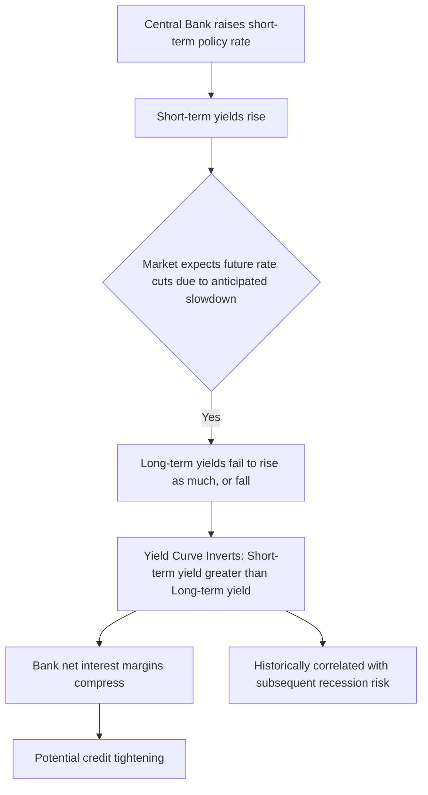

## Bond Markets and the Yield Curve

### Overview

Bonds are fixed-income securities representing a loan from an investor to an issuer (government, corporation, or municipality). The bond market is where these debt instruments are issued and traded, and it plays a central role in determining interest rates across the economy. The **yield curve** — a plot of yields against maturities for bonds of similar credit quality — is one of the most closely watched indicators in macroeconomics and finance, used for interest rate forecasting, recession prediction, and monetary policy assessment.

### Bond Fundamentals

**Definition**

A bond is a debt security with the following core characteristics:

- **Face value (par value)**: The amount repaid to the bondholder at maturity.
- **Coupon rate**: The stated annual interest rate paid on the face value, typically in periodic installments.
- **Maturity date**: The date on which the principal is repaid.
- **Yield to maturity (YTM)**: The total return anticipated on a bond if held until maturity, accounting for coupon payments and any difference between purchase price and face value.

**Bond Pricing Formula**

The price of a bond equals the present value of its future cash flows (coupon payments plus face value at maturity):

$$P = \sum_{t=1}^{n} \frac{C}{(1+y)^t} + \frac{F}{(1+y)^n}$$

where:

- $P$ = bond price
- $C$ = periodic coupon payment
- $F$ = face value
- $y$ = yield to maturity (per period)
- $n$ = number of periods to maturity

**Key Points**

- Bond prices and yields move **inversely**: when market interest rates rise, existing bonds with lower fixed coupons become less attractive, so their prices fall until their yield matches the new market rate (and vice versa).
- A bond trading at exactly its face value has a coupon rate equal to its yield (a "par bond"). A bond priced above face value ("premium") has a yield below its coupon rate; a bond priced below face value ("discount") has a yield above its coupon rate.

### Price-Yield Inverse Relationship

**Example**

Consider a bond with a $1,000 face value, a 5% annual coupon ($50/year), and 1 year to maturity.

$$P = \frac{50}{(1+y)} + \frac{1000}{(1+y)}$$

- If $y = 5\%$: $P = \dfrac{1050}{1.05} = \$1{,}000$ (par)
- If $y = 7\%$: $P = \dfrac{1050}{1.07} \approx \$981.31$ (discount — price fell as yield rose)
- If $y = 3\%$: $P = \dfrac{1050}{1.03} \approx \$1{,}019.42$ (premium — price rose as yield fell)

### Bond Market Participants and Instruments

**Key Points**

- **Issuers**: National governments (sovereign/Treasury bonds), municipalities (municipal bonds), corporations (corporate bonds), and supranational institutions.
- **Investors**: Institutional investors (pension funds, insurance companies, mutual funds), central banks, foreign governments, and retail investors.
- **Primary market**: Where new bonds are issued (e.g., Treasury auctions).
- **Secondary market**: Where existing bonds are traded among investors, providing liquidity and continuous price discovery.
- **Credit ratings**: Agencies (Moody's, S&P, Fitch) assess issuer creditworthiness, influencing required yields — lower-rated ("junk" or high-yield) bonds must offer higher yields to compensate for greater default risk.

### The Yield Curve

**Definition**

The yield curve plots the yields of bonds of comparable credit quality (typically government securities) against their time to maturity, at a given point in time.

**Common Shapes**

- **Normal (upward-sloping)**: Longer-maturity bonds yield more than shorter-maturity bonds. This is the most historically common shape, reflecting compensation demanded by investors for greater interest rate risk and inflation uncertainty over longer horizons.
- **Inverted (downward-sloping)**: Short-term yields exceed long-term yields. Historically associated with markets anticipating future rate cuts, often linked with expectations of economic slowdown.
- **Flat**: Little difference between short- and long-term yields, often observed during transitional periods between normal and inverted curves.
- **Humped**: Medium-term yields exceed both short- and long-term yields — a less common shape.

### Yield Curve Shapes (svg_diagram)

<svg xmlns="http://www.w3.org/2000/svg" viewBox="0 0 720 380" font-family="Arial, sans-serif">
<text x="360" y="24" text-anchor="middle" font-size="16" font-weight="bold" fill="#1a1a1a">Yield Curve Shapes (svg_diagram)</text>

<line x1="70" y1="330" x2="670" y2="330" stroke="#333" stroke-width="2" />
<line x1="70" y1="330" x2="70" y2="60" stroke="#333" stroke-width="2" />
<text x="675" y="335" font-size="11" fill="#333">Maturity</text>
<text x="30" y="55" font-size="11" fill="#333">Yield</text>

<path d="M 90 290 Q 300 200 620 100" stroke="#2563eb" stroke-width="2.5" fill="none" />
<text x="630" y="100" font-size="11" fill="#2563eb" font-weight="bold">Normal</text>

<path d="M 90 200 L 620 195" stroke="#16a34a" stroke-width="2.5" fill="none" />
<text x="630" y="198" font-size="11" fill="#16a34a" font-weight="bold">Flat</text>

<path d="M 90 110 Q 300 200 620 290" stroke="#dc2626" stroke-width="2.5" fill="none" />
<text x="630" y="293" font-size="11" fill="#dc2626" font-weight="bold">Inverted</text>

<path d="M 90 260 Q 300 90 620 260" stroke="#9333ea" stroke-width="2.5" fill="none" stroke-dasharray="6,3" />
<text x="300" y="80" text-anchor="middle" font-size="11" fill="#9333ea" font-weight="bold">Humped</text>

<text x="90" y="345" font-size="10" fill="#555">Short</text>

<text x="600" y="345" font-size="10" fill="#555">Long</text>

</svg>

### Theories of the Term Structure of Interest Rates

**Key Points**

- **Expectations theory**: Long-term rates are an average of expected future short-term rates. An upward-sloping curve implies markets expect short-term rates to rise; an inverted curve implies expectations of future rate declines.

$$i_{n} = \frac{i_t + i^e_{t+1} + i^e_{t+2} + ... + i^e_{t+n-1}}{n}$$

- **Liquidity premium theory**: Investors demand a premium for holding longer-maturity bonds due to greater interest rate risk and reduced liquidity, meaning long-term rates equal the average of expected future short-term rates *plus* a positive, maturity-increasing liquidity premium. This explains why the yield curve is normally upward-sloping even when short-term rates are expected to remain flat.
- **Market segmentation theory**: Bonds of different maturities are viewed as distinct, largely non-substitutable markets, each with its own supply and demand determined by the preferences of specific investor clienteles (e.g., pension funds preferring long maturities to match long-dated liabilities). Under this view, the yield curve shape reflects relative supply and demand conditions within each maturity segment independently.
- **Preferred habitat theory**: A hybrid of expectations and segmentation theories — investors have a preferred maturity range but will move outside it if compensated with a sufficient risk premium, allowing for some substitutability between maturities.

### The Yield Curve as a Recession Predictor

**Key Points**

- An inverted yield curve — particularly the spread between the 10-year and 2-year (or 3-month) U.S. Treasury yields — has historically preceded U.S. recessions, a relationship extensively studied by researchers including those at the Federal Reserve Bank of New York and elsewhere. [Fact: this historical correlation is well documented across multiple past U.S. business cycles; however, the lead time between inversion and recession onset has varied considerably (ranging from several months to roughly two years across historical episodes), and not every inversion has been followed by a recession within a similarly short window. Treat any specific "X months ahead" figure as approximate and period-dependent.]
- Explanations for why inversion predicts recession include: it signals markets expect the central bank to cut rates in response to a future slowdown, and it can directly harm the banking sector's profitability (since banks typically borrow short-term and lend long-term, an inverted curve compresses this net interest margin, potentially reducing credit supply). [The banking-margin channel is a commonly cited causal mechanism in economic literature; the correlation itself is empirical, while the precise causal weight of each proposed mechanism remains a subject of ongoing research and is not fully settled.]
- The relationship is a statistical/historical regularity, not a guaranteed mechanical law — it should be treated as one indicator among many rather than a deterministic forecasting tool. [Speculation/caution flagged deliberately: predictive relationships derived from historical data carry inherent uncertainty when applied to future, potentially structurally different, economic conditions.]

### Yield Curve Inversion and the Business Cycle

### Bond Market Risks

**Key Points**

- **Interest rate risk**: The risk that bond prices fall due to rising market interest rates; longer-duration bonds are more sensitive to rate changes.
- **Duration**: A measure of a bond's price sensitivity to interest rate changes, approximated by:

$$\%\Delta P \approx -\text{Duration} \times \Delta y$$

- **Credit/default risk**: The risk that the issuer fails to make scheduled payments; reflected in credit ratings and credit spreads (the yield difference between a risky bond and a comparable-maturity government benchmark).
- **Inflation risk**: Fixed coupon payments lose real purchasing power if inflation rises unexpectedly; addressed partly by inflation-indexed bonds (e.g., U.S. TIPS).
- **Liquidity risk**: The risk that a bond cannot be sold quickly without a significant price concession, more pronounced for less-traded issues (e.g., smaller corporate or municipal bonds).
- **Reinvestment risk**: The risk that coupon payments must be reinvested at lower prevailing rates than originally anticipated.

### Yield Curve and Monetary Policy

**Key Points**

- Central banks directly influence the **short end** of the yield curve through policy rate decisions (e.g., the federal funds rate, the ECB deposit facility rate).
- The **long end** of the curve is more influenced by market expectations of future growth, inflation, and policy, as well as global capital flows and term/liquidity premiums — meaning central banks have less direct control over long-term yields under normal conditions.
- **Quantitative easing** represents an attempt to influence the long end more directly, by having the central bank purchase longer-maturity securities to push their prices up and yields down — a tool used when short-term policy rates are already near their effective lower bound.
- **Yield curve control (YCC)**: A more direct policy tool in which a central bank commits to purchasing whatever quantity of bonds is necessary to cap yields at a specific target for a chosen maturity, as practiced by the Bank of Japan for extended periods. [Fact regarding the general existence and design of YCC as a policy tool; specific parameters, target maturities, and whether any given central bank is currently employing YCC change over time and should be verified against current central bank announcements if precision is required.]

### Bond Market vs. Money Market (Comparative)

| Feature | Money Market | Bond Market |
| --- | --- | --- |
| Maturity | Short-term (typically under 1 year) | Medium- to long-term (1 year to 30+ years) |
| Instruments | Treasury bills, commercial paper, repos, CDs | Treasury notes/bonds, corporate bonds, municipal bonds |
| Primary rate determined | Short-term nominal interest rate | Term structure of interest rates (yield curve) |
| Risk profile | Generally lower risk, high liquidity | Varies widely by issuer credit quality and duration |
| Typical investors | Banks, money market funds, corporations managing liquidity | Pension funds, insurers, governments, retail/institutional investors seeking income |

### Common Pitfalls

- Confusing coupon rate with yield to maturity — they are only equal when a bond trades exactly at par.
- Assuming the yield curve directly *causes* recessions, rather than reflecting market expectations that are correlated with (and may partly contribute to) future economic conditions.
- Treating central banks as having equal control over both the short and long ends of the yield curve under normal (non-QE, non-YCC) policy conditions.
- Overlooking credit spread differences when comparing yields across bonds of different issuers — a naive maturity-only comparison ignores default risk premiums embedded in corporate or lower-rated sovereign yields.

**Related Topics**

- The Money Market and Interest Rate Determination
- Money Supply Definitions: M0, M1, M2
- Central Bank Tools: Open Market Operations, Quantitative Easing, Yield Curve Control
- Bond Duration and Convexity
- Credit Ratings and Default Risk Premiums
- Inflation-Indexed Bonds (e.g., TIPS)
- The Expectations, Liquidity Premium, and Market Segmentation Theories of the Term Structure
- Using the Yield Curve as a Macroeconomic Leading Indicator