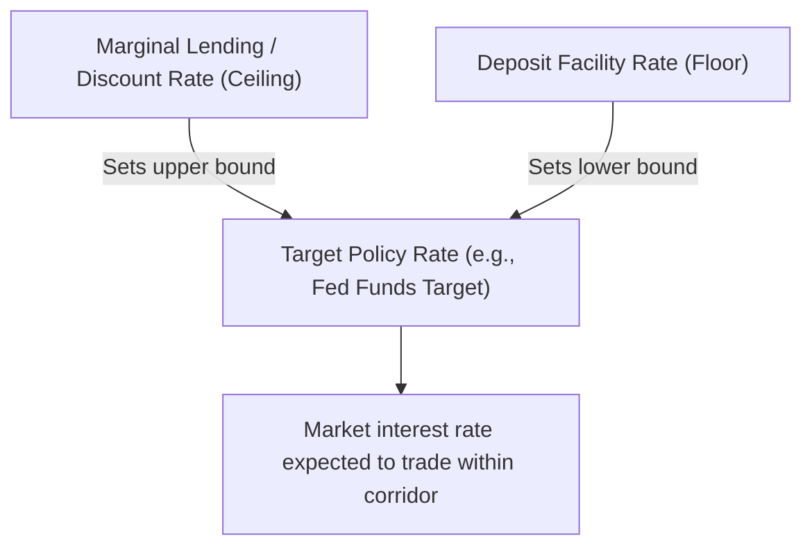

## Tools of Monetary Policy: Open Market Operations, Reserve Requirements, Discount Rate

### Overview

Central banks pursue their statutory mandates (price stability, employment, financial stability) primarily through a set of conventional policy instruments: **open market operations**, **reserve requirements**, and the **discount rate** (and analogous standing lending facilities). These three tools operate by influencing the quantity and cost of reserves in the banking system, which in turn affects short-term interest rates, credit conditions, and ultimately broader economic activity.

### Open Market Operations (OMOs)

**Definition**

Open market operations are the purchase or sale of government securities (and, in some frameworks, other eligible assets) by the central bank in the open market, used to adjust the level of bank reserves and influence short-term interest rates.

**Key Points**

- **Expansionary OMO (open market purchase)**: The central bank buys securities from banks or the public, crediting reserve accounts in exchange. This increases the supply of reserves in the banking system, putting downward pressure on short-term interest rates and expanding the base for money creation.
- **Contractionary OMO (open market sale)**: The central bank sells securities, draining reserves from the banking system as buyers pay for the securities out of their reserve balances. This reduces reserve supply, putting upward pressure on short-term interest rates.
- **Temporary vs. permanent operations**: Central banks conduct both temporary operations (e.g., repurchase agreements/repos, which are reversed after a set period) for fine-tuning day-to-day reserve levels, and permanent (outright) purchases or sales for longer-lasting adjustments to the reserve supply.
- **Primary conventional tool**: In most modern operating frameworks, OMOs are the main instrument used on a frequent (often daily) basis to keep the actual market interest rate close to the central bank's announced target rate.

**Mechanics of an Open Market Purchase**

$$\text{Central Bank buys securities} \Rightarrow \text{Reserves} \uparrow \Rightarrow \text{Money Supply} \uparrow \Rightarrow \text{Short-term interest rate} \downarrow$$

### Open Market Operations Transmission (svg_diagram)

<svg xmlns="http://www.w3.org/2000/svg" viewBox="0 0 720 260" font-family="Arial, sans-serif">
<text x="360" y="24" text-anchor="middle" font-size="16" font-weight="bold" fill="#1a1a1a">Open Market Purchase Transmission (svg_diagram)</text>
<rect x="30" y="80" width="150" height="60" rx="6" fill="#1e3a8a" />
<text x="105" y="105" text-anchor="middle" font-size="11" font-weight="bold" fill="#ffffff">Central Bank</text>
<text x="105" y="122" text-anchor="middle" font-size="10" fill="#dbeafe">Buys securities</text>
<line x1="180" y1="110" x2="240" y2="110" stroke="#333" stroke-width="1.5" />
<polygon points="240,110 230,105 230,115" fill="#333" />
<rect x="240" y="80" width="150" height="60" rx="6" fill="#2563eb" />
<text x="315" y="105" text-anchor="middle" font-size="11" font-weight="bold" fill="#ffffff">Bank Reserves</text>
<text x="315" y="122" text-anchor="middle" font-size="10" fill="#dbeafe">↑ Increase</text>
<line x1="390" y1="110" x2="450" y2="110" stroke="#333" stroke-width="1.5" />
<polygon points="450,110 440,105 440,115" fill="#333" />
<rect x="450" y="80" width="130" height="60" rx="6" fill="#60a5fa" />
<text x="515" y="105" text-anchor="middle" font-size="11" font-weight="bold" fill="#1e3a8a">Fed Funds Rate</text>
<text x="515" y="122" text-anchor="middle" font-size="10" fill="#1e3a8a">↓ Falls</text>
<line x1="580" y1="110" x2="630" y2="110" stroke="#333" stroke-width="1.5" />
<polygon points="630,110 620,105 620,115" fill="#333" />
<rect x="630" y="80" width="70" height="60" rx="6" fill="#93c5fd" />
<text x="665" y="105" text-anchor="middle" font-size="10" font-weight="bold" fill="#1e3a8a">Credit</text>
<text x="665" y="122" text-anchor="middle" font-size="10" fill="#1e3a8a">↑ expands</text>

<text x="360" y="190" text-anchor="middle" font-size="11" fill="#555">Lower borrowing costs stimulate investment and consumption</text>

</svg>

### Reserve Requirements

**Definition**

The reserve requirement (or required reserve ratio, $rr$) is the minimum fraction of deposits that commercial banks must hold as reserves, either as vault cash or as balances at the central bank, rather than lending out.

**Key Points**

- **Raising reserve requirements**: Forces banks to hold more of each deposit dollar in reserve, reducing the amount available for lending — a contractionary action that reduces the money multiplier ($m = 1/rr$ in the simplified model) and tightens credit conditions.
- **Lowering reserve requirements**: Frees up reserves previously held to satisfy the requirement, allowing banks to extend more credit — an expansionary action that raises the money multiplier.
- **Infrequent use as an active policy tool**: Reserve requirement changes are a blunt instrument (affecting the entire banking system uniformly and requiring costly balance sheet adjustments), so most major central banks today adjust reserve requirements only rarely, if at all, relying instead on interest-rate-based tools for routine policy adjustments.
- Several major central banks have moved toward very low or zero reserve requirements in recent years, relying instead on **interest on reserve balances** to influence bank behavior. Notably, the U.S. Federal Reserve reduced reserve requirement ratios to zero for all depository institutions effective March 2020, effectively eliminating reserve requirements as an active U.S. policy tool going forward. [Fact regarding this specific Fed action and its stated effective date; whether this policy remains unchanged at any later point in time should be verified against current Federal Reserve publications, as such structural settings can in principle be revisited.]

**Simplified Numerical Illustration**

If the required reserve ratio changes from 10% to 8%:

$$m_{old} = \frac{1}{0.10} = 10 \qquad m_{new} = \frac{1}{0.08} = 12.5$$

This represents an increase in the theoretical maximum money multiplier, illustrating the direction (though, per the caveats on the money multiplier topic, not necessarily the full realized magnitude) of the expansionary effect.

### The Discount Rate and Standing Facilities

**Definition**

The discount rate (in Federal Reserve terminology) or the equivalent standing lending facility rate at other central banks is the interest rate charged by the central bank on short-term loans extended directly to eligible depository institutions, typically through a "discount window" or analogous facility.

**Key Points**

- **Function as a backstop**: The discount rate/standing lending facility provides banks with an alternative source of reserves beyond the interbank market, particularly valuable during periods of market-wide liquidity stress when interbank borrowing may become difficult or expensive.
- **Ceiling role in a corridor system**: In many modern operating frameworks, the discount rate (or marginal lending facility rate) is set *above* the central bank's target policy rate, establishing an effective ceiling on the market interest rate — banks would generally only borrow directly from the central bank at this higher rate if unable to secure cheaper funding in the interbank market.
- **Historical stigma effect**: Direct borrowing from the discount window has historically carried a perceived stigma (signaling potential weakness to markets and regulators), which can discourage banks from using the facility even during genuine liquidity needs — a phenomenon central banks have periodically sought to address through communication and facility redesign. [Fact regarding the general, widely documented existence of this stigma effect in central banking literature and policy discussion; the degree to which any specific redesign has successfully mitigated it is a matter of ongoing assessment.]
- **Complementary facilities**: Many central banks also operate a corresponding standing deposit facility, allowing banks to deposit excess reserves overnight at a rate that typically forms the effective *floor* of the interest rate corridor.

### Interest Rate Corridor System

### Comparative Summary of the Three Tools

| Tool | Mechanism | Frequency of Use | Precision | Typical Direction of Effect |
| --- | --- | --- | --- | --- |
| Open Market Operations | Buy/sell securities to adjust reserve quantity | Frequent (often daily) | High — fine-tunable | Purchase → rates down; Sale → rates up |
| Reserve Requirements | Set minimum reserve-to-deposit ratio | Rare in most major economies today | Low — blunt, system-wide | Lower rr → expansionary; Higher rr → contractionary |
| Discount Rate / Standing Facilities | Rate charged/paid on direct central bank lending/deposits | Set periodically; used as backstop | Moderate — affects marginal borrowing cost | Lower rate → cheaper backstop funding; Higher rate → costlier backstop funding |

### Coordinated Use of the Tools

**Key Points**

- In practice, the discount rate/standing facility rates and the target policy rate are typically adjusted together and announced as part of a single policy decision, forming a coherent interest rate corridor rather than being manipulated independently.
- Open market operations then serve as the *implementation mechanism* used continuously to keep the actual market rate near the announced target, within the ceiling and floor established by the standing facilities.
- Reserve requirement changes, where still actively used by a given central bank, are typically reserved for structural adjustments to banking system liquidity conditions rather than routine short-term policy calibration.

### Illustrative Example: A Coordinated Tightening Cycle

**Example**

Suppose a central bank aims to tighten monetary policy in response to elevated inflation:

1. It raises its target policy rate (e.g., from 4.00% to 4.25%).
2. It correspondingly raises the discount rate/marginal lending rate and deposit facility rate to maintain the same corridor width around the new target.
3. Its trading desk then conducts open market **sales** (or reduces the pace of asset purchases/reinvestment), draining reserves from the banking system as needed to push the actual market rate up to the new, higher target.
4. If reserve requirements are an active tool in that jurisdiction, the central bank might additionally raise the required reserve ratio to further constrain credit expansion — though, as noted, this step is uncommon among major central banks in current practice.

### Effective Lower Bound and Unconventional Tools

**Key Points**

- When the target policy rate approaches zero (the "effective lower bound"), conventional OMOs and rate adjustments have limited additional room to stimulate the economy through further rate cuts, prompting central banks to turn to unconventional tools.
- **Quantitative easing**: Large-scale outright purchases of longer-maturity securities, intended to lower long-term yields directly (beyond the short-term rate influence of conventional OMOs) and expand the monetary base substantially.
- **Negative interest rate policy**: Some central banks (e.g., the European Central Bank and Bank of Japan in past periods) have set certain policy rates below zero, effectively charging banks for holding excess reserves, to further encourage lending. [Fact regarding the historical use of negative rates by these institutions in past periods; whether any specific central bank currently maintains negative rates changes over time and should be verified against current sources.]
- **Forward guidance**: Communicating the likely future path of policy rates to influence current long-term rates and financial conditions through expectations, rather than through direct current reserve or rate adjustments.

### Common Pitfalls

- Treating reserve requirement changes as the primary or most frequently used monetary policy tool, when open market operations (and, more broadly, target rate announcements) are the dominant tool in most contemporary frameworks.
- Assuming the discount rate is set independently of, rather than in coordination with, the central bank's target policy rate — in most modern corridor systems these are announced and adjusted together.
- Confusing the *direction* of an open market operation's effect: an open market **purchase** *increases* reserves and *lowers* rates; a **sale** *decreases* reserves and *raises* rates.
- Assuming all central banks retain active, binding reserve requirements — several major central banks have reduced these to zero or near-zero and rely on rate-based tools instead.

**Related Topics**

- Central Bank Structure and Mandates
- Money Creation and the Money Multiplier
- The Money Market and Interest Rate Determination
- Quantitative Easing and Unconventional Monetary Policy
- Interest Rate Corridor Systems and Standing Facilities
- Forward Guidance and Central Bank Communication
- Negative Interest Rate Policy: Mechanics and Limitations