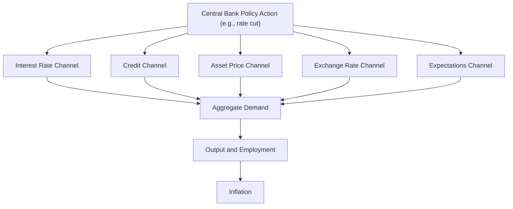

## Transmission Mechanisms of Monetary Policy

### Overview

The transmission mechanism of monetary policy describes the chain of causal channels through which a central bank's policy actions — primarily changes in the short-term policy interest rate, but also unconventional tools like quantitative easing — ultimately affect real economic variables such as output, employment, and inflation. Understanding these channels is essential because policy actions do not affect the economy instantaneously or directly; they operate through a sequence of intermediate financial and behavioral responses, each subject to variable lags and strength.

### General Transmission Framework

**Key Points**

- Monetary policy actions first affect financial market variables (interest rates, asset prices, exchange rates, credit availability) relatively quickly.
- These financial variable changes then influence economic decisions by households and firms (consumption, investment, borrowing) with a longer and more variable lag.
- Changes in aggregate spending subsequently affect output and employment, and — with the longest and most variable lag — the general price level (inflation).
- Because of this multi-stage, variable-lag process, monetary policy is frequently described as operating with "long and variable lags," a phrase closely associated with Milton Friedman's critique of activist monetary fine-tuning. [Fact regarding the historical association of this phrase with Friedman's work; the specific lag lengths are empirically estimated and vary across studies, time periods, and countries rather than being fixed, universal constants.]

### Overview of Transmission Channels

### The Interest Rate Channel

**Definition**

The traditional interest rate channel operates through the effect of policy rate changes on the cost of borrowing for consumption and investment.

**Key Points**

- A policy rate cut lowers short-term market rates, which — through the term structure — tends to reduce longer-term borrowing costs as well (mortgages, business loans, corporate bonds), though the pass-through to long-term rates is not mechanical and depends on how expectations and term premiums respond.
- Lower borrowing costs increase the present value of returns on investment projects, encouraging firms to undertake more capital expenditure, and lower the cost of consumer durable purchases (autos, housing) financed with credit.
- The strength of this channel depends on the interest-sensitivity of spending decisions, which varies across sectors, economies, and time periods depending on factors such as household debt levels and the prevalence of fixed- versus variable-rate borrowing. [Fact regarding the general dependency; the specific magnitude of interest-sensitivity for any given economy or period is an empirical question requiring current data and is not a fixed constant.]

**Illustrative Relationship**

$$\text{Policy Rate} \downarrow \Rightarrow \text{Real Interest Rate} \downarrow \Rightarrow \text{Investment \& Durable Consumption} \uparrow \Rightarrow \text{Aggregate Demand} \uparrow$$

Note that what matters for spending decisions is the **real** interest rate ($r = i - \pi^e$, nominal rate minus expected inflation), not merely the nominal policy rate — a change in expected inflation can offset or reinforce a nominal rate change's real effect.

### The Credit Channel

**Definition**

The credit channel encompasses two related sub-channels through which monetary policy affects the *availability*, not just the *price*, of credit.

**Key Points**

- **Bank lending channel**: A policy tightening that drains reserves from the banking system can constrain banks' capacity or willingness to extend loans, particularly affecting borrowers (often smaller firms and households) who depend heavily on bank credit and lack ready access to alternative funding sources like public bond markets.
- **Balance sheet channel (financial accelerator)**: Interest rate changes affect the net worth and cash flow of borrowers — for example, a rate cut can raise asset values (including collateral used to secure loans) and improve borrower balance sheets, reducing the perceived riskiness of lending to them and thereby easing credit terms further. This creates an amplifying feedback loop sometimes called the "financial accelerator," a mechanism substantially developed in academic work by Ben Bernanke, Mark Gertler, and others. [Fact regarding the existence and general content of this academic framework; the empirical magnitude of the accelerator effect varies by study and economic context.]
- The credit channel is often considered particularly important for smaller, more credit-constrained borrowers who cannot easily substitute toward non-bank financing when bank lending tightens.

### The Asset Price Channel

**Key Points**

- **Equity/wealth effect (Tobin's q and consumption wealth effects)**: Lower interest rates tend to raise equity valuations (partly because future corporate earnings are discounted at a lower rate), which can stimulate business investment (per Tobin's q theory, where firms invest more when the market value of capital exceeds its replacement cost) and household consumption (via the wealth effect, as higher portfolio values make households feel wealthier and more willing to spend).
- **Housing/real estate price effect**: Lower mortgage rates tend to support higher home prices and increase housing-related spending and construction activity, while also affecting household wealth and, through home equity, borrowing capacity.
- The strength of asset price channels depends significantly on the breadth of asset ownership across the population and the responsiveness of spending to wealth changes (the "marginal propensity to consume out of wealth"), both of which vary considerably across countries and time periods. [Fact regarding the general dependency; specific parameter values require current empirical estimation and are not universal constants.]

### The Exchange Rate Channel

**Key Points**

- A policy rate cut, all else equal, tends to reduce the relative return on domestic-currency assets compared to foreign assets, which can lead to capital outflows and depreciation of the domestic currency (via interest rate parity–type mechanisms).
- Currency depreciation makes domestically produced goods relatively cheaper for foreign buyers (boosting net exports) and imported goods relatively more expensive domestically (which can also contribute to imported inflation).
- This channel is generally considered more significant for smaller, more open economies with a higher share of trade relative to GDP, and less significant for large, relatively closed economies — though it remains a relevant channel across most modern economies to varying degrees. [Fact regarding the general open-economy macroeconomics principle; the precise relative importance for any specific economy requires current empirical assessment.]

### The Expectations Channel (Forward Guidance)

**Key Points**

- Modern monetary policy transmission relies heavily on managing expectations about the *future* path of policy, not merely the current policy rate setting — since many economically relevant rates (e.g., long-term mortgage or corporate borrowing rates) are influenced by expected future short-term rates (per the expectations theory of the term structure).
- **Forward guidance** — explicit central bank communication about the likely future policy path — is used to shape these expectations directly, potentially affecting long-term rates and financial conditions even without an immediate change in the current policy rate.
- Inflation expectations themselves matter directly: if households and firms expect the central bank to achieve its inflation target credibly, this can help anchor actual price- and wage-setting behavior, reinforcing policy effectiveness — a mechanism central to modern "expectations-augmented" macroeconomic frameworks.

### Comparative Summary of Transmission Channels

| Channel | Primary Mechanism | Key Affected Variable | Relative Importance Factors |
| --- | --- | --- | --- |
| Interest Rate | Cost of borrowing for investment/consumption | Investment, durable consumption | Interest-sensitivity of spending, debt structure |
| Credit (Bank Lending) | Bank capacity/willingness to lend | Credit availability, especially for smaller borrowers | Reliance on bank finance vs. capital markets |
| Credit (Balance Sheet) | Borrower net worth and collateral value | Credit terms via financial accelerator | Leverage levels, collateral-dependent lending |
| Asset Price | Equity and housing valuations | Investment (Tobin's q), consumption (wealth effect) | Breadth of asset ownership, marginal propensity to consume from wealth |
| Exchange Rate | Relative currency returns and trade competitiveness | Net exports, imported inflation | Economic openness, trade share of GDP |
| Expectations | Anticipated future policy path | Long-term rates, price/wage-setting behavior | Central bank credibility, communication clarity |

### Lags in Monetary Policy Transmission

**Key Points**

- **Recognition lag**: Time required to identify that an economic problem (e.g., rising inflation or slowing growth) requiring a policy response has emerged.
- **Implementation lag**: Time between recognizing the need for action and the policy body actually deciding and announcing the change (generally short for central banks relative to fiscal policy, given the speed with which policy committees can convene).
- **Transmission (impact) lag**: Time between the policy action itself and its full effect materializing in financial conditions, spending decisions, and ultimately output and inflation — historically estimated to potentially extend over multiple quarters to a few years, though such estimates vary substantially by economy, time period, and the specific channel in question. [Speculation/estimate: precise lag lengths are subject to considerable academic disagreement and are not fixed, universally applicable figures — any specific quoted lag length should be treated as a period- and model-dependent estimate rather than a settled constant.]

### Illustrative Example: Full Transmission Chain

**Example**

Consider a central bank cutting its policy rate by 50 basis points in response to slowing growth:

1. **Immediate effect**: Short-term money market rates fall roughly in line with the policy rate cut.
2. **Interest rate channel**: Banks lower mortgage and business loan rates; firms find previously marginal investment projects newly profitable.
3. **Asset price channel**: Equity valuations rise as future cash flows are discounted at a lower rate; home prices firm up as mortgage affordability improves.
4. **Credit channel**: Improved collateral values (from rising asset prices) make banks more willing to extend credit to previously borderline borrowers.
5. **Exchange rate channel**: The domestic currency depreciates modestly as the interest rate differential versus other economies narrows, supporting export competitiveness.
6. **Expectations channel**: If the central bank signals further easing is likely, longer-term rates fall by more than the immediate policy move alone would imply.
7. **Aggregate demand effect**: Higher investment, consumption (durables and wealth-effect-driven), and net exports raise aggregate demand over the following several quarters.
8. **Output and employment effect**: Higher aggregate demand raises output and, with a further lag, employment.
9. **Inflation effect**: Tighter labor and product markets eventually feed into wage and price pressures, raising inflation — typically the last and most lagged link in the chain.

### Limitations and Complications

**Key Points**

- **Zero/effective lower bound**: When policy rates are already very low, conventional interest rate channel transmission is constrained, prompting reliance on unconventional tools (QE, forward guidance, negative rates) whose transmission channels and effectiveness are less well-established empirically than conventional rate policy. [This is a widely acknowledged point in the literature; the relative effectiveness of unconventional tools compared to conventional rate policy remains an active area of empirical research and is not fully settled.]
- **Heterogeneous transmission across households and firms**: The strength of various channels can differ substantially across households (e.g., by debt levels, homeownership status, income) and firms (e.g., by size, access to capital markets), meaning aggregate transmission estimates can mask significant underlying heterogeneity.
- **Financial market frictions and disruptions**: During periods of financial stress, normal transmission channels can become impaired (e.g., credit spreads widening despite policy rate cuts), requiring central banks to address market dysfunction directly (e.g., via emergency liquidity facilities) before conventional transmission can resume effectively.

### Common Pitfalls

- Assuming monetary policy effects are immediate — the transmission mechanism involves multiple sequential stages with cumulative and variable lags before reaching output and, especially, inflation.
- Treating the interest rate channel as the sole or dominant transmission mechanism, when credit, asset price, exchange rate, and expectations channels can operate simultaneously and with varying relative strength depending on economic structure.
- Confusing nominal and real interest rate effects — what matters for most economic decisions is the real rate, so changes in inflation expectations can offset or amplify a given nominal policy rate change.
- Assuming transmission channel strength is constant over time or across countries, when empirical estimates of channel importance vary considerably with financial structure, household balance sheets, and economic openness.

**Related Topics**

- Tools of Monetary Policy: Open Market Operations, Reserve Requirements, Discount Rate
- The Money Market and Interest Rate Determination
- Central Bank Structure and Mandates
- Bond Markets and the Yield Curve
- Quantitative Easing and Unconventional Monetary Policy
- Inflation Expectations and Central Bank Credibility
- The Financial Accelerator and Balance Sheet Effects
- Exchange Rate Determination and Open Economy Macroeconomics