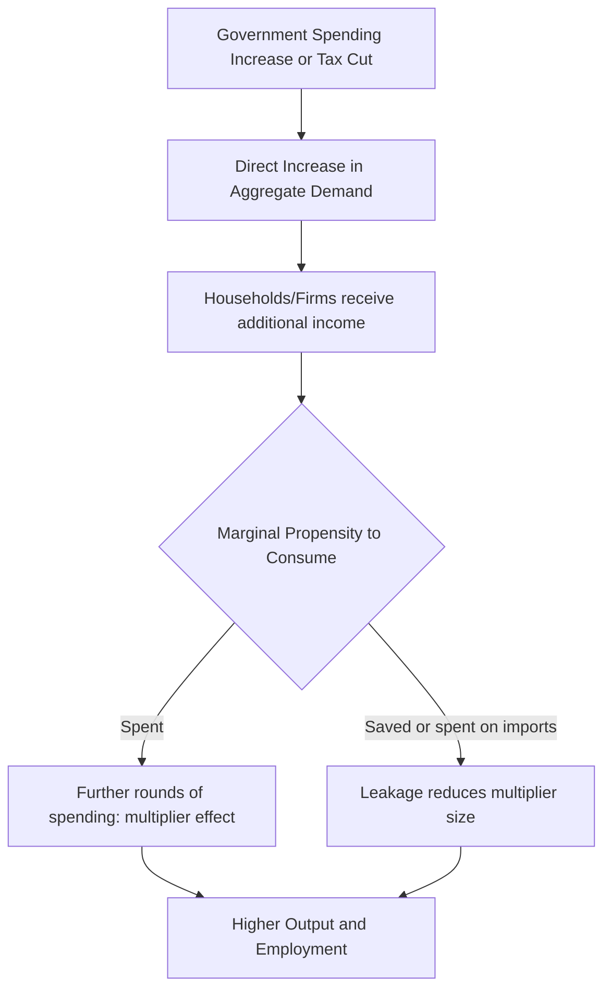

## Government Spending and Taxation

### Overview

Government spending and taxation are the two primary instruments of fiscal policy, through which governments influence aggregate demand, allocate resources, redistribute income, and provide public goods and services. The balance between spending and revenue collection determines the government's budget position (surplus, balance, or deficit) and shapes both short-run macroeconomic stabilization and long-run debt sustainability.

### Categories of Government Spending

**Key Points**

- **Government consumption expenditure**: Spending on goods and services for current use — salaries of public employees, military operations, office supplies, and similar recurring operational costs.
- **Government investment (capital expenditure)**: Spending on long-lived public assets — infrastructure (roads, bridges, ports), public buildings, and equipment intended to provide services over an extended period.
- **Transfer payments**: Payments made without a corresponding direct exchange of goods or services — social security benefits, unemployment insurance, welfare payments, and similar programs. Transfer payments are **not** counted directly in GDP under the expenditure approach, since GDP measures spending on newly produced goods and services, whereas transfers merely redistribute existing purchasing power.
- **Interest payments on public debt**: Payments owed on previously issued government debt, representing an increasingly significant budget category in economies with substantial accumulated debt.

**Note on GDP Accounting**

$$Y = C + I + G + NX$$

In this standard expenditure-approach GDP identity, $G$ (government spending) refers specifically to government *consumption and investment* expenditure — purchases of goods and services — and explicitly **excludes** transfer payments, which are captured elsewhere in the broader government budget but not directly in this GDP component.

### Categories of Taxation

**Key Points**

- **Direct taxes**: Levied directly on individuals or entities based on income, wealth, or profits — personal income tax, corporate income tax, property tax, and estate/inheritance tax.
- **Indirect taxes**: Levied on transactions, typically on goods and services, and often passed through to consumers via prices — value-added tax (VAT), sales tax, excise taxes (on specific goods such as fuel, tobacco, or alcohol), and tariffs on imports.
- **Progressive taxes**: Tax rates increase as the taxable base (typically income) increases, so higher earners pay a larger *percentage* of their income in tax — commonly associated with personal income tax systems using tiered marginal rate brackets.
- **Regressive taxes**: Tax burden, as a percentage of income, falls disproportionately on lower-income individuals — commonly associated with broad-based consumption taxes (like sales tax or VAT), since lower-income households typically spend a larger share of their income on consumption.
- **Proportional (flat) taxes**: A constant tax rate applied regardless of the income or value of the taxable base.

### Tax System Structure (svg_diagram)

<svg xmlns="http://www.w3.org/2000/svg" viewBox="0 0 700 320" font-family="Arial, sans-serif">
<text x="350" y="24" text-anchor="middle" font-size="16" font-weight="bold" fill="#1a1a1a">Tax Incidence by Income Level (svg_diagram)</text>
<line x1="80" y1="270" x2="620" y2="270" stroke="#333" stroke-width="2" />
<line x1="80" y1="270" x2="80" y2="60" stroke="#333" stroke-width="2" />
<text x="630" y="275" font-size="11" fill="#333">Income Level</text>
<text x="30" y="55" font-size="11" fill="#333">Tax Rate</text>
<text x="30" y="68" font-size="10" fill="#333">(% of income)</text>
<path d="M 120 220 Q 350 130 580 90" stroke="#2563eb" stroke-width="2.5" fill="none" />
<text x="585" y="88" font-size="11" fill="#2563eb" font-weight="bold">Progressive</text>
<line x1="120" y1="180" x2="580" y2="180" stroke="#16a34a" stroke-width="2.5" />
<text x="585" y="183" font-size="11" fill="#16a34a" font-weight="bold">Proportional</text>
<path d="M 120 100 Q 350 180 580 230" stroke="#dc2626" stroke-width="2.5" fill="none" />
<text x="585" y="233" font-size="11" fill="#dc2626" font-weight="bold">Regressive</text>
</svg>

### The Government Budget Constraint

**Definition**

The government budget balance in any given period is defined as:

$$BB_t = T_t - G_t$$

where $T_t$ is total government revenue (tax and non-tax) and $G_t$ is total government spending (including transfers, for this broader budget-level identity, as distinct from the narrower GDP-accounting $G$ discussed above).

- $BB_t > 0$: budget **surplus**
- $BB_t < 0$: budget **deficit**
- $BB_t = 0$: balanced budget

**Key Points**

- Persistent deficits accumulate into rising **public debt**, since a deficit must be financed by issuing new government debt (or, in some historical or unconventional cases, direct central bank financing, which carries distinct inflationary risk considerations).
- The **debt-to-GDP ratio** is a commonly used indicator of fiscal sustainability, since it contextualizes the absolute debt level relative to the economy's capacity to service and eventually reduce it through growth.

### Automatic Stabilizers vs. Discretionary Fiscal Policy

**Key Points**

- **Automatic stabilizers**: Elements of the tax and spending system that automatically adjust with the business cycle without requiring new legislative action — progressive income taxes automatically collect less revenue during a downturn (as incomes fall), and unemployment insurance and other means-tested transfer programs automatically pay out more during a downturn (as unemployment rises), both cushioning the decline in aggregate demand without any new policy decision.
- **Discretionary fiscal policy**: Deliberate, legislated changes to spending or tax policy in response to economic conditions — for example, a one-time stimulus spending package or a temporary tax rebate enacted specifically in response to a recession.
- Automatic stabilizers are generally considered to have an advantage in timing (they respond immediately and require no legislative delay) compared to discretionary policy, which is subject to the same recognition, decision, and implementation lags discussed in the monetary policy context — often considered even more pronounced for fiscal policy given the typically slower legislative process compared to central bank policy committees. [Fact regarding this general, widely accepted characterization in public finance and macroeconomics literature; the precise relative magnitude of these lags varies by country's specific legislative process and historical episode.]

### The Government Spending and Tax Multipliers

**Definition**

Fiscal multipliers measure the change in aggregate output resulting from a one-unit change in government spending or taxation:

$$k_G = \frac{\Delta Y}{\Delta G} \qquad k_T = \frac{\Delta Y}{\Delta T}$$

In a simple closed-economy Keynesian model with a marginal propensity to consume ($MPC$) and no other leakages:

$$k_G = \frac{1}{1 - MPC}$$

$$k_T = \frac{-MPC}{1 - MPC}$$

**Key Points**

- The government spending multiplier is generally derived as larger in magnitude than the tax multiplier in this simple framework, because a dollar of government spending enters the economy's spending stream directly and fully, whereas a dollar of tax cut is only partially spent by recipients (since some portion is saved, per the $MPC < 1$ assumption), with the remainder representing a "leakage" from the immediate spending stream.
- Empirically estimated fiscal multiplier values vary considerably depending on the state of the economy (multipliers are frequently found to be larger during recessions, particularly when interest rates are constrained near the effective lower bound, than during economic expansions), the openness of the economy (more open economies experience larger leakages to imports), and the specific type of spending or tax change involved. [Fact regarding this general, widely documented finding of state-dependence and variability in the empirical fiscal multiplier literature; any specific numerical multiplier estimate should be treated as period-, country-, and methodology-specific rather than a single universal constant.]

### Fiscal Policy Transmission

### Crowding Out

**Definition**

Crowding out refers to the phenomenon in which increased government borrowing to finance spending (or a tax cut) leads to higher interest rates, which in turn reduces private sector investment and consumption spending — partially or fully offsetting the intended stimulative effect of the fiscal expansion.

**Key Points**

- The mechanism operates through the loanable funds market: increased government borrowing raises the demand for loanable funds, pushing up the equilibrium real interest rate, which discourages interest-sensitive private investment.
- The degree of crowding out is a significant point of theoretical and empirical debate: some economists argue it can be substantial (particularly when the economy is near full employment and monetary policy does not accommodate the fiscal expansion), while others argue it is often minimal or absent, especially during recessions with significant economic slack, when private investment demand may be weak regardless of interest rate levels, and when monetary policy can offset interest rate pressure. [This reflects a genuinely long-standing and unresolved debate in macroeconomics between different schools of thought regarding the magnitude of crowding out under varying economic conditions; no single, universally agreed-upon empirical magnitude exists across all circumstances.]

### Fiscal Policy and the Business Cycle

**Key Points**

- **Countercyclical fiscal policy**: Deliberately expanding spending or cutting taxes during downturns, and contracting spending or raising taxes during expansions, intended to smooth the business cycle — a policy stance broadly consistent with Keynesian macroeconomic theory.
- **Procyclical fiscal policy**: Fiscal policy that amplifies rather than smooths the business cycle (e.g., cutting spending during a downturn to address a worsening budget deficit, which can further depress aggregate demand) — sometimes observed in economies facing binding fiscal or external financing constraints during a crisis, limiting their capacity to pursue countercyclical policy even when it might otherwise be macroeconomically desirable. [Fact regarding the general existence of this documented pattern in various historical fiscal episodes, particularly among economies facing acute financing constraints; specific country examples and the precise causal drivers in each case require dedicated case-by-case examination.]

### Taxation: Efficiency and Equity Considerations

**Key Points**

- **Tax incidence**: The economic burden of a tax may fall on a different party than the one legally responsible for remitting it, depending on the relative price elasticities of supply and demand in the taxed market — a distinction between *statutory* and *economic* incidence central to public finance analysis.
- **Deadweight loss**: Most taxes (except for specific corrective or "Pigouvian" taxes designed to address externalities) create an efficiency cost by distorting economic decisions away from what would occur in the absence of the tax, reducing overall economic surplus by more than the revenue collected — commonly illustrated as a "welfare triangle" in standard supply-and-demand tax analysis.
- **Equity considerations**: Tax system design frequently balances *horizontal equity* (similarly situated taxpayers should be treated similarly) against *vertical equity* (taxpayers with greater ability to pay should contribute proportionally more), with different tax structures (progressive, proportional) reflecting different underlying equity judgments and value trade-offs against efficiency considerations.

### Comparative Table: Spending vs. Taxation as Policy Levers

| Feature | Government Spending | Taxation |
| --- | --- | --- |
| Direct GDP effect | Direct (counted fully in $G$) | Indirect (affects $C$ via disposable income) |
| Typical multiplier size | Generally larger in simple models | Generally smaller in simple models |
| Implementation speed | Can vary; infrastructure spending often slower to deploy | Broad-based tax changes can sometimes be implemented relatively quickly |
| Targeting precision | Can be targeted to specific sectors/projects | Can be targeted to specific income groups or activities via credits/deductions |
| Political economy considerations | Spending programs can be politically difficult to reverse once established | Tax changes (especially cuts) can be politically popular to enact, difficult to reverse |

### Common Pitfalls

- Confusing the GDP-accounting definition of government spending ($G$, purchases of goods and services only) with the broader government budget concept of total spending, which includes transfer payments not directly counted in GDP.
- Assuming fiscal multipliers are fixed, universal constants, when extensive empirical research demonstrates substantial variation by economic conditions (particularly the presence of economic slack and the stance of monetary policy), economic openness, and the type of spending or tax measure.
- Treating crowding out as either always fully offsetting or always negligible, when the actual empirical magnitude is genuinely contested and likely depends on prevailing economic conditions (such as the degree of spare capacity and the central bank's policy response).
- Assuming all taxes are equally distortionary — narrowly targeted corrective (Pigouvian) taxes designed to address specific externalities function differently from broad-based taxes on income or general consumption in terms of their efficiency implications.

**Related Topics**

- Fiscal Multipliers and Business Cycle Stabilization
- The Government Budget Constraint and Public Debt Sustainability
- Automatic Stabilizers vs. Discretionary Fiscal Policy
- Crowding Out and the Loanable Funds Market
- Tax Incidence and Deadweight Loss
- Progressive vs. Regressive Tax Systems
- Fiscal Policy Coordination with Monetary Policy
- Public Debt Dynamics and Sovereign Debt Sustainability