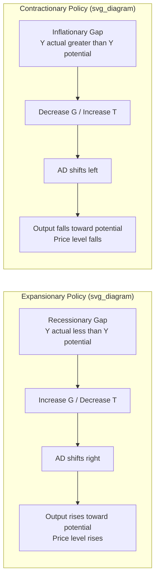

## Expansionary versus Contractionary Fiscal Policy

### Definition and Core Concept

Fiscal policy refers to the use of government spending ($G$) and taxation ($T$) to influence aggregate demand and macroeconomic outcomes. It is categorized into two directional stances based on the intended effect on aggregate demand:

- **Expansionary fiscal policy**: An increase in government spending, a decrease in taxation, or both, designed to stimulate aggregate demand (AD)
- **Contractionary fiscal policy**: A decrease in government spending, an increase in taxation, or both, designed to reduce aggregate demand

The choice between the two stances depends on the position of the economy relative to its potential output, typically assessed via the output gap:

$$\text{Output Gap} = Y_{actual} - Y_{potential}$$

A negative output gap (recessionary gap) generally calls for expansionary policy, while a positive output gap (inflationary gap) generally calls for contractionary policy.

### The Underlying Mechanism: Aggregate Demand

Both policy stances operate through the aggregate demand identity:

$$AD = C + I + G + NX$$

Where $C$ is consumption, $I$ is investment, $G$ is government spending, and $NX$ is net exports. Fiscal policy directly manipulates the $G$ term and indirectly manipulates $C$ (and sometimes $I$) through changes in $T$, since disposable income is defined as:

$$Y_d = Y - T$$

Changes in $Y_d$ affect consumption via the marginal propensity to consume (MPC), covered in detail below.

### Expansionary Fiscal Policy

#### Objectives

Expansionary fiscal policy is deployed to:

- Close a recessionary (negative) output gap
- Reduce cyclical unemployment
- Stimulate short-run economic growth during a downturn
- Counteract falling private-sector demand (e.g., during a recession or financial crisis)

#### Tools

1. **Increased government spending** — direct purchases of goods and services, infrastructure projects, public sector wages, transfer payments (though transfers are not part of $G$ in the national accounts sense, they affect $Y_d$)
2. **Tax cuts** — reductions in personal income tax, corporate tax, or consumption taxes (e.g., VAT/GST), which raise disposable income and incentivize investment
3. **Increased transfer payments** — unemployment benefits, subsidies, stimulus checks

#### Mechanism (Step-by-Step)

1. Government raises $G$ or cuts $T$
2. If $G$ rises directly, AD shifts right immediately (first-round effect)
3. If $T$ falls, households retain more $Y_d$; a fraction (the MPC) is spent, raising $C$
4. The initial injection triggers additional rounds of spending via the multiplier process
5. AD curve shifts rightward, raising both real output and the price level (assuming an upward-sloping short-run aggregate supply curve)

### Contractionary Fiscal Policy

#### Objectives

Contractionary fiscal policy is deployed to:

- Close an inflationary (positive) output gap
- Cool an overheating economy experiencing demand-pull inflation
- Reduce budget deficits or sovereign debt accumulation
- Prevent asset bubbles fueled by excess demand

#### Tools

1. **Decreased government spending** — cuts to public programs, delayed infrastructure projects, hiring freezes
2. **Tax increases** — higher income tax, corporate tax, or consumption tax rates
3. **Reduced transfer payments** — cuts to subsidies or welfare programs

#### Mechanism (Step-by-Step)

1. Government cuts $G$ or raises $T$
2. If $G$ falls, AD shifts left immediately
3. If $T$ rises, $Y_d$ falls, reducing $C$ by MPC $\times \Delta T$
4. The contraction propagates through the economy via the multiplier (in reverse)
5. AD shifts leftward, lowering the price level and real output relative to the counterfactual

### Comparative Diagram (AD-AS Framework)



### AD Curve Shifts Illustrated

<svg xmlns="http://www.w3.org/2000/svg" viewBox="0 0 720 420" font-family="Arial, sans-serif">
<text x="360" y="24" text-anchor="middle" font-size="16" font-weight="bold">AD Shifts Under Expansionary vs Contractionary Policy (svg_diagram)</text>

<g>
<text x="180" y="50" text-anchor="middle" font-size="13" font-weight="bold">Expansionary</text>
<line x1="60" y1="360" x2="60" y2="70" stroke="black" stroke-width="2" />
<line x1="60" y1="360" x2="330" y2="360" stroke="black" stroke-width="2" />
<text x="30" y="90" font-size="12">Price</text>
<text x="30" y="105" font-size="12">Level</text>
<text x="270" y="385" font-size="12">Real Output (Y)</text>



```

<path d="M 90 340 Q 200 320 300 100" stroke="#555" stroke-width="2" fill="none" />
<text x="290" y="95" font-size="11" fill="#555">SRAS</text>


<path d="M 80 120 Q 190 220 300 340" stroke="#1f77b4" stroke-width="2" fill="none" />
<text x="100" y="130" font-size="11" fill="#1f77b4">AD1</text>


<path d="M 130 100 Q 230 200 330 320" stroke="#d62728" stroke-width="2" fill="none" stroke-dasharray="5,3" />
<text x="300" y="110" font-size="11" fill="#d62728">AD2</text>


<line x1="150" y1="230" x2="190" y2="230" stroke="#d62728" stroke-width="2" marker-end="url(#arrow)" />
<text x="155" y="220" font-size="10" fill="#d62728">shift right</text>
```

</g>

<g>
<text x="540" y="50" text-anchor="middle" font-size="13" font-weight="bold">Contractionary</text>
<line x1="420" y1="360" x2="420" y2="70" stroke="black" stroke-width="2" />
<line x1="420" y1="360" x2="690" y2="360" stroke="black" stroke-width="2" />
<text x="390" y="90" font-size="12">Price</text>
<text x="390" y="105" font-size="12">Level</text>
<text x="630" y="385" font-size="12">Real Output (Y)</text>



```

<path d="M 450 340 Q 560 320 660 100" stroke="#555" stroke-width="2" fill="none" />
<text x="650" y="95" font-size="11" fill="#555">SRAS</text>


<path d="M 490 100 Q 590 200 690 320" stroke="#1f77b4" stroke-width="2" fill="none" />
<text x="660" y="110" font-size="11" fill="#1f77b4">AD1</text>


<path d="M 440 120 Q 550 220 660 340" stroke="#d62728" stroke-width="2" fill="none" stroke-dasharray="5,3" />
<text x="450" y="130" font-size="11" fill="#d62728">AD2</text>


<line x1="600" y1="230" x2="560" y2="230" stroke="#d62728" stroke-width="2" marker-end="url(#arrow)" />
<text x="555" y="220" font-size="10" fill="#d62728">shift left</text>
```

</g>
</svg>

### The Multiplier Effect

The government spending multiplier quantifies the total change in equilibrium output resulting from an initial change in $G$:

$$k_G = \frac{\Delta Y}{\Delta G} = \frac{1}{1 - MPC(1-t)}$$

Where $MPC$ is the marginal propensity to consume and $t$ is the marginal tax rate. In a simplified closed economy without taxes:

$$k_G = \frac{1}{1 - MPC}$$

The tax multiplier is smaller in absolute value than the spending multiplier because a tax cut is only partially spent (the rest is saved):

$$k_T = \frac{-MPC}{1 - MPC(1-t)}$$

**Example**: If $MPC = 0.8$ and there are no taxes, $k_G = \frac{1}{1-0.8} = 5$. A $10 billion increase in government spending would theoretically raise equilibrium output by $50 billion, before accounting for crowding-out or supply-side constraints.

For contractionary policy, the same multiplier applies symmetrically in reverse: a $10 billion cut in $G$ would reduce equilibrium output by $50 billion under identical assumptions. [Inference] Real-world multiplier values are typically smaller than these simplified textbook estimates due to leakages such as imports, savings, and crowding-out, and empirical estimates vary considerably by country, time period, and the state of the business cycle.

### Automatic Stabilizers versus Discretionary Policy

Fiscal policy operates through two channels:

| Channel | Mechanism | Example |
| --- | --- | --- |
| **Automatic stabilizers** | Built into the tax and transfer system; require no new legislation | Progressive income tax (tax revenue falls automatically in a recession); unemployment insurance (payouts rise automatically in a recession) |
| **Discretionary policy** | Requires active legislative or executive action | A stimulus bill increasing infrastructure spending; a one-time tax rebate |

Automatic stabilizers work expansionary during downturns and contractionary during booms without any policy change, smoothing the business cycle passively. Discretionary policy is deliberately calibrated (in magnitude and timing) to the perceived output gap.

### Financing Expansionary Policy

Expansionary fiscal policy, if not matched by higher taxes, results in a **budget deficit**, financed typically by issuing government debt (bonds). This raises the **public debt-to-GDP ratio** over time if deficits persist:

$$\text{Debt-to-GDP} = \frac{\text{Total Government Debt}}{\text{Nominal GDP}}$$

Contractionary fiscal policy, particularly tax increases combined with spending cuts, is often used to reduce a **budget deficit** or generate a **budget surplus**, especially in the context of fiscal consolidation or austerity programs.

### Crowding-Out Effect

**Key Points**

- Expansionary fiscal policy financed by borrowing increases demand for loanable funds
- This can raise interest rates, which discourages private investment ($I$) — the **crowding-out effect**
- The degree of crowding-out depends on the responsiveness of investment to interest rates and whether the economy is at full employment or in a liquidity trap
- In a liquidity trap (interest rates near zero), crowding-out is theoretically minimal because idle savings can be mobilized without pushing up interest rates significantly [Inference — this is a standard Keynesian prediction, and its empirical magnitude is debated among economists]
- Contractionary fiscal policy can produce the reverse: **crowding-in**, where reduced government borrowing lowers interest rates and stimulates private investment

### Time Lags in Fiscal Policy

| Lag Type | Description |
| --- | --- |
| **Recognition lag** | Time taken to identify that the economy has entered a recession or boom |
| **Decision/legislative lag** | Time taken for the government to design, debate, and pass fiscal legislation |
| **Implementation lag** | Time taken for approved spending or tax changes to be administratively executed |
| **Impact lag** | Time taken for the fiscal measure to have its full effect on aggregate demand once implemented |

These lags are longer for fiscal policy than for monetary policy, since monetary policy operates via a central bank's more agile decision-making process, making fiscal policy a comparatively blunter short-run stabilization tool. [Inference] The relative severity of these lags depends on a country's legislative structure and institutional capacity.

### Comparative Summary Table

| Dimension | Expansionary Fiscal Policy | Contractionary Fiscal Policy |
| --- | --- | --- |
| **Goal** | Raise AD, close recessionary gap | Lower AD, close inflationary gap |
| **Spending action** | Increase $G$ | Decrease $G$ |
| **Tax action** | Decrease $T$ | Increase $T$ |
| **Effect on budget balance** | Widens deficit (or shrinks surplus) | Shrinks deficit (or widens surplus) |
| **Effect on output (short run)** | Increases real GDP | Decreases real GDP |
| **Effect on price level** | Raises price level (demand-pull pressure) | Lowers price level / reduces inflationary pressure |
| **Effect on employment** | Reduces cyclical unemployment | May raise cyclical unemployment |
| **Effect on public debt** | Increases debt-to-GDP (if deficit-financed) | Can reduce debt-to-GDP over time |
| **Risk** | Inflation, crowding-out, debt sustainability concerns | Recession risk, rising unemployment, political unpopularity |
| **Typical timing** | Recession, high unemployment | Economic boom, high inflation |

### Fiscal Policy in Open Economies

In an open economy, the effectiveness of fiscal policy also depends on the exchange rate regime:

- **Under fixed exchange rates**: Fiscal policy tends to be more effective because capital flows do not fully offset the AD shift (the Mundell-Fleming model predicts limited monetary policy autonomy under fixed rates and perfect capital mobility)
- **Under floating exchange rates**: Expansionary fiscal policy can raise domestic interest rates, attracting capital inflows, appreciating the currency, and reducing net exports — partially offsetting the initial AD increase. This is a variant of crowding-out operating through the external sector rather than domestic interest rates alone

[Inference] The magnitude of this exchange-rate offset depends on the degree of capital mobility and the specific monetary policy reaction function of the central bank, both of which vary by country and time period.

### Real-World Examples

**Example**

- **Expansionary**: The American Recovery and Reinvestment Act (2009) in the United States combined tax cuts, infrastructure spending, and expanded unemployment benefits in response to the Global Financial Crisis, aiming to close a severe recessionary output gap
- **Contractionary**: The UK's austerity program following 2010 combined public spending cuts and VAT increases, aimed at reducing a large budget deficit accumulated after the financial crisis

[Unverified] Specific quantitative outcomes attributed to any single fiscal program are difficult to isolate empirically because they occur alongside monetary policy actions, external shocks, and other confounding variables; economists continue to debate the precise multiplier effects observed in these historical episodes.

### Common Misconceptions

- Expansionary fiscal policy does not guarantee proportional GDP growth equal to the multiplier prediction; real-world frictions (import leakages, crowding-out, supply constraints) typically dampen the effect
- Contractionary fiscal policy does not always reduce total public debt in absolute terms if the resulting economic slowdown reduces tax revenue enough to offset the spending cuts (this tension is central to debates over austerity during weak-growth periods) [Inference — this is a contested empirical claim, particularly associated with critiques of the "expansionary austerity" hypothesis]
- Fiscal policy and monetary policy are not mutually exclusive; they are often used in combination (policy mix), and their interaction (e.g., a central bank raising rates in response to fiscal stimulus) affects the net outcome

### Conclusion

Expansionary and contractionary fiscal policy represent opposite directional uses of government spending and taxation to manage aggregate demand relative to potential output. Expansionary policy is deployed during recessionary gaps to stimulate output and employment at the cost of higher deficits and potential inflation; contractionary policy is deployed during inflationary gaps or periods of fiscal consolidation to cool demand at the cost of slower growth and possibly higher unemployment. The actual effectiveness of either stance is mediated by the size of the fiscal multiplier, the presence of crowding-out or crowding-in effects, time lags in implementation, and the exchange rate regime in open economies.

**Related Topics**

- The Government Spending and Tax Multipliers (derivation and leakages)
- Automatic Stabilizers versus Discretionary Fiscal Policy
- Crowding-Out and Crowding-In Effects
- Budget Deficits, Surpluses, and Public Debt Sustainability
- The Mundell-Fleming Model and Fiscal Policy in Open Economies
- Fiscal Policy versus Monetary Policy: Coordination and Conflicts
- The Balanced-Budget Multiplier
- Ricardian Equivalence and Ricardian versus Keynesian Views of Tax Cuts
- Fiscal Policy Time Lags and the Case for Rules-Based Fiscal Frameworks
- Austerity and the "Expansionary Fiscal Contraction" Debate