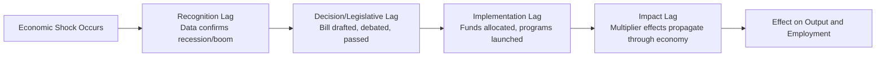

## Automatic Stabilizers versus Discretionary Policy

### Definition and Core Concept

Fiscal policy can be classified by the mechanism through which it responds to economic fluctuations:

- **Automatic stabilizers**: Fiscal mechanisms built into existing law that automatically adjust government spending or tax revenue in response to changes in economic conditions, without requiring new legislative action
- **Discretionary fiscal policy**: Deliberate, active changes to government spending or taxation enacted through new legislation or executive action, targeted at a specific economic condition

Both operate on the same aggregate demand identity:

$$AD = C + I + G + NX$$

but differ fundamentally in their trigger mechanism, timing, and political process.

### Automatic Stabilizers

#### Mechanism

Automatic stabilizers function because certain tax and transfer programs are structurally tied to the state of the economy, so their fiscal effect changes automatically as economic conditions change — no new law is passed.

#### Primary Examples

1. **Progressive income tax system**
   - As income falls during a recession, individuals move into lower tax brackets, and tax revenue falls disproportionately relative to income
   - This automatically reduces the effective tax burden during downturns, cushioning disposable income
   - During expansions, rising incomes push taxpayers into higher brackets, automatically increasing the tax burden and restraining excess demand
2. **Unemployment insurance (UI)**
   - As unemployment rises, more workers qualify for benefits, automatically increasing transfer payments and supporting aggregate demand
   - As the economy recovers and unemployment falls, UI payouts automatically decline, withdrawing stimulus
3. **Means-tested welfare programs**
   - Programs such as food assistance or income-support benefits expand automatically as more households fall below eligibility thresholds during a downturn, and contract as incomes recover
4. **Corporate tax revenue**
   - Corporate profits are highly cyclical; tax revenue collected from corporate income falls sharply in recessions and rises in booms, again without any change in the tax code itself

#### Mathematical Representation

The automatic stabilizing effect can be captured formally via the marginal tax rate $t$ in the expenditure multiplier:

$$k_G = \frac{1}{1 - MPC(1-t)}$$

A higher $t$ (a more progressive or larger tax system) produces a **smaller** multiplier $k_G$. This is precisely the stabilizing property: a larger automatic tax response dampens the amplification of any given shock to autonomous spending, reducing the volatility of output around potential GDP.

**Key Points**

- Automatic stabilizers reduce the size of the multiplier, which dampens (but does not eliminate) business cycle fluctuations
- They act symmetrically: expansionary during downturns, contractionary during booms
- They require no recognition, decision, or implementation lag because they are already legislated into the tax and transfer code
- Their magnitude scales with the size and progressivity of the welfare state; countries with larger automatic stabilizer systems (e.g., much of continental Europe) tend to experience smaller output volatility, all else equal [Inference — this is a widely supported empirical regularity in the public finance literature, though the magnitude varies by study and country sample]

#### Measuring the Automatic Stabilizer Effect: The Cyclically Adjusted Budget Balance

Economists separate the actual budget balance into a cyclical component (driven by automatic stabilizers) and a structural component (reflecting discretionary policy choices):

$$B_{actual} = B_{structural} + B_{cyclical}$$

The **cyclically adjusted budget balance** (also called the structural balance) estimates what the budget balance would be if the economy were operating at potential output, stripping out the automatic effects of the business cycle. This measure is used by institutions such as the IMF and OECD to assess the true discretionary fiscal stance, independent of where the economy happens to sit in the business cycle.

### Discretionary Fiscal Policy

#### Mechanism

Discretionary policy requires an active decision by the legislature or executive to change $G$ or $T$ in response to a perceived economic condition, distinct from automatic stabilizers, which respond mechanically.

#### Primary Examples

1. **One-time stimulus packages** — legislated tax rebates or spending bills passed in response to a specific downturn (e.g., a fiscal stimulus act)
2. **Infrastructure spending programs** — new capital expenditure programs approved to boost aggregate demand and productive capacity
3. **Temporary tax cuts or surcharges** — legislated, time-limited changes to tax rates aimed at a specific macroeconomic target
4. **Austerity programs** — legislated spending cuts or tax increases aimed at reducing a budget deficit

#### Policy Process and Lags

Discretionary policy is subject to the full sequence of fiscal policy lags:

Each stage introduces delay, and the cumulative lag can be long enough that discretionary policy risks being pro-cyclical — arriving after the economy has already begun to self-correct, thereby amplifying rather than dampening the cycle. [Inference] The severity of this risk depends on the specific legislative and administrative speed of the country in question, and is a central argument used by proponents of rules-based fiscal frameworks.

### Comparative Diagram

<svg xmlns="http://www.w3.org/2000/svg" viewBox="0 0 700 380" font-family="Arial, sans-serif">
<text x="350" y="24" text-anchor="middle" font-size="16" font-weight="bold">Automatic Stabilizers vs Discretionary Policy: Response Timeline (svg_diagram)</text>

<line x1="70" y1="320" x2="650" y2="320" stroke="black" stroke-width="2" />
<line x1="70" y1="320" x2="70" y2="60" stroke="black" stroke-width="2" />
<text x="360" y="350" text-anchor="middle" font-size="12">Time</text>
<text x="30" y="190" font-size="12" transform="rotate(-90 30 190)">Fiscal Response</text>

<line x1="150" y1="320" x2="150" y2="70" stroke="#888" stroke-width="1.5" stroke-dasharray="4,3" />
<text x="150" y="60" text-anchor="middle" font-size="11" fill="#888">Recession begins</text>

<path d="M 150 200 L 170 150 L 400 150 L 420 200" stroke="#2ca02c" stroke-width="2.5" fill="none" />
<text x="250" y="135" text-anchor="middle" font-size="11" fill="#2ca02c" font-weight="bold">Automatic Stabilizers (instant response)</text>

<path d="M 150 200 L 150 200 L 320 200 L 340 100 L 550 100 L 570 200" stroke="#d62728" stroke-width="2.5" fill="none" stroke-dasharray="6,3" />
<text x="460" y="88" text-anchor="middle" font-size="11" fill="#d62728" font-weight="bold">Discretionary Policy (delayed response)</text>

<line x1="150" y1="230" x2="320" y2="230" stroke="#555" stroke-width="1" />
<line x1="150" y1="225" x2="150" y2="235" stroke="#555" stroke-width="1" />
<line x1="320" y1="225" x2="320" y2="235" stroke="#555" stroke-width="1" />
<text x="235" y="248" text-anchor="middle" font-size="10" fill="#555">Recognition + Legislative + Implementation Lag</text>

<text x="70" y="200" font-size="10" text-anchor="end">Baseline</text>

</svg>

### Comparative Summary Table

| Dimension | Automatic Stabilizers | Discretionary Policy |
| --- | --- | --- |
| **Trigger** | Built-in response to economic conditions | Active legislative/executive decision |
| **Speed** | Immediate, no lag | Subject to recognition, decision, implementation, and impact lags |
| **Legislative action required** | None (already codified) | Yes (new bill or executive order) |
| **Political process** | Passive; not subject to debate at time of use | Politically contested; requires negotiation and approval |
| **Predictability** | Rule-based, consistent | Varies by administration and political climate |
| **Examples** | Progressive income tax, unemployment insurance, means-tested transfers | Stimulus packages, infrastructure bills, temporary tax rebates, austerity programs |
| **Risk of pro-cyclicality** | Low (responds symmetrically and immediately) | Higher (lags can cause mistimed intervention) |
| **Scale of response** | Proportional to size of existing programs; not easily scaled up quickly | Can be scaled to any size the legislature approves |
| **Measurement tool** | Captured in the cyclical component of the budget balance | Captured in the structural/cyclically adjusted budget balance |

### Interaction Between the Two

**Key Points**

- Automatic stabilizers and discretionary policy are not mutually exclusive; discretionary policy is typically layered on top of the automatic stabilizer baseline during severe downturns when automatic stabilizers alone are judged insufficient
- The overall fiscal stance in any period reflects the sum of both effects, though only the discretionary component reflects an explicit policy choice
- A government running an automatic-stabilizer-driven deficit during a recession is not necessarily practicing discretionary expansionary policy — the deficit may simply reflect the built-in cyclical response, with the structural balance unchanged
- Analysts must examine the cyclically adjusted balance, not just the headline budget balance, to correctly assess whether a government has taken an active discretionary stance

### Advantages and Limitations

#### Automatic Stabilizers

**Advantages**

- No political delay or negotiation required
- Symmetric and rule-based, reducing risk of politically motivated timing
- Continuously and proportionally responsive to the actual severity of the shock

**Limitations**

- Fixed by existing law; cannot be resized quickly to match an unusually large or unusual shock
- Effectiveness depends on the pre-existing generosity and coverage of the tax and transfer system
- Cannot target specific structural problems (e.g., a particular industry or region in distress)

#### Discretionary Policy

**Advantages**

- Can be tailored precisely to the nature, scale, and location of a specific economic shock
- Can address structural issues automatic stabilizers cannot (e.g., targeted industry support, infrastructure investment with long-run supply-side benefits)
- Scalable to match the severity of unprecedented shocks (e.g., a pandemic-driven collapse in demand)

**Limitations**

- Subject to substantial time lags, risking mistimed or pro-cyclical intervention
- Politically contentious; subject to gridlock, partisan disagreement, or watering-down during the legislative process
- Prone to being difficult to reverse once implemented (political economy bias toward permanence), which can create long-run structural deficits

### Fiscal Rules and the Policy Design Debate

Because of the lag and political-economy limitations of discretionary policy, many economists and institutions advocate strengthening automatic stabilizers relative to relying on discretionary intervention, especially for short-run stabilization:

- **Rules-based fiscal frameworks** propose pre-legislated triggers (e.g., automatic extensions of unemployment benefits tied to the unemployment rate crossing a defined threshold) that behave like automatic stabilizers but with a size or scope that can adapt to the depth of the shock
- Such "semi-automatic" stabilizers aim to combine the speed of automatic stabilizers with some of the scalability of discretionary policy, though [Speculation] their broader adoption faces political resistance because they reduce legislative control over fiscal policy timing

### Common Misconceptions

- Automatic stabilizers do not eliminate recessions or booms; they merely dampen the amplitude of fluctuations by reducing the effective multiplier
- A rising budget deficit during a recession does not, by itself, indicate that a government has adopted expansionary discretionary policy — it may be entirely attributable to automatic stabilizers, with the structural balance unchanged or even tightening
- Discretionary policy is not inherently superior to automatic stabilizers merely because it is deliberate; the lag structure of discretionary policy can make it counterproductive if mistimed, an outcome automatic stabilizers structurally avoid

### Conclusion

Automatic stabilizers and discretionary fiscal policy represent two complementary mechanisms for using government spending and taxation to manage the business cycle. Automatic stabilizers respond instantly and proportionally to economic conditions through pre-existing tax and transfer structures, avoiding the lags inherent in the legislative process, but are limited in scale and cannot be finely targeted. Discretionary policy allows precise, scalable responses tailored to a specific shock, but is exposed to recognition, legislative, and implementation lags that can undermine its effectiveness or even render it pro-cyclical. Sound fiscal policy design typically combines a strong automatic stabilizer base with judicious, well-timed discretionary intervention reserved for shocks large enough to exceed what automatic stabilizers alone can absorb.

**Related Topics**

- The Cyclically Adjusted (Structural) Budget Balance
- Fiscal Policy Time Lags and Rules-Based Fiscal Frameworks
- The Government Spending and Tax Multipliers
- Expansionary versus Contractionary Fiscal Policy
- Progressive Taxation and Its Macroeconomic Stabilizing Role
- Unemployment Insurance Design and Business Cycle Sensitivity
- Pro-Cyclical versus Counter-Cyclical Fiscal Policy
- Fiscal Policy versus Monetary Policy: Speed and Institutional Design
- The Political Economy of Fiscal Stimulus Legislation
- Semi-Automatic Stabilizers and Trigger-Based Fiscal Rules