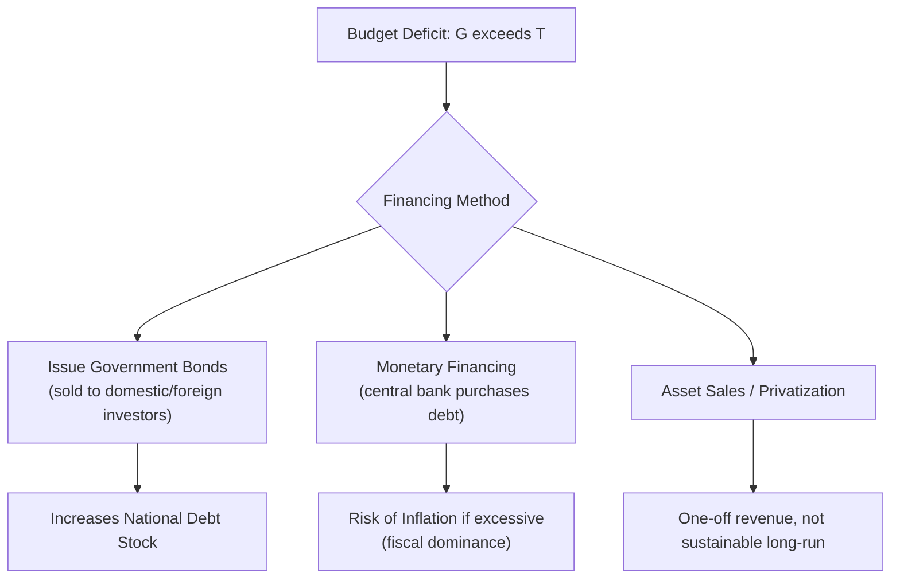

## Budget Deficits and the National Debt

### Definitions and Core Distinction

- **Budget deficit**: A flow variable representing the shortfall in a single fiscal year when government spending ($G$) exceeds government revenue ($T$):

$$\text{Budget Deficit} = G - T \quad (\text{when } G > T)$$

If $T > G$, the government runs a **budget surplus**. If $T = G$, the budget is **balanced**.

- **National debt (public debt)**: A stock variable representing the cumulative sum of all past budget deficits (net of any surpluses), plus accrued interest, still owed by the government:

$$\text{Debt}_t = \text{Debt}_{t-1} + \text{Deficit}_t$$

**Key Points**

- The deficit is analogous to a household's annual overspending in a given year; the debt is analogous to a household's total accumulated credit card balance
- A government can run a deficit in a given year while still reducing its debt-to-GDP ratio, provided nominal GDP grows faster than the debt itself (explained in the debt dynamics section below)
- "Deficit reduction" and "debt reduction" are distinct policy goals and are frequently conflated in public discourse

### The Government Budget Constraint

The government's budget constraint each period can be expressed as:

$$G_t + iB_{t-1} = T_t + \Delta B_t$$

Where $i$ is the interest rate on existing debt, $B_{t-1}$ is debt outstanding from the prior period, and $\Delta B_t$ is new borrowing (new bond issuance) in the current period. This identity shows that any gap between spending (inclusive of interest payments) and revenue must be financed by issuing new debt (or, in principle, by money creation, discussed below).

### Primary Deficit versus Total (Overall) Deficit

| Measure | Formula | Interpretation |
| --- | --- | --- |
| **Primary deficit** | $G_{primary} - T$ (excludes interest payments) | Reflects the underlying fiscal stance, independent of the debt burden inherited from the past |
| **Total (overall) deficit** | $G_{primary} + iB_{t-1} - T$ | Includes interest payments on existing debt; the actual financing need for the year |

The distinction matters because a government can be running a **primary surplus** (revenue exceeds non-interest spending) while still running an **overall deficit**, if interest payments on accumulated debt are large enough. This scenario is central to debt-sustainability analysis.

### Structural versus Cyclical Deficits

As established in the discussion of automatic stabilizers, the observed deficit decomposes into:

$$\text{Deficit}_{actual} = \text{Deficit}_{structural} + \text{Deficit}_{cyclical}$$

- **Cyclical deficit**: The portion attributable to the economy operating below potential output (lower tax revenue, higher automatic transfer payments)
- **Structural deficit**: The portion that would remain even if the economy were operating at full potential output — this reflects the government's underlying discretionary fiscal stance

A high cyclical deficit during a recession is not necessarily a sign of fiscal mismanagement; a high and persistent structural deficit during a boom is generally viewed as a more serious sustainability concern.

### Debt Dynamics: The Debt-to-GDP Ratio

The most widely used metric for assessing debt sustainability is the debt-to-GDP ratio:

$$\text{Debt-to-GDP} = \frac{B}{Y}$$

The change in this ratio over time can be decomposed into a standard debt dynamics equation:

$$\Delta \left(\frac{B}{Y}\right) = \left(\frac{r - g}{1+g}\right)\frac{B_{t-1}}{Y_{t-1}} + \frac{PD}{Y}$$

Where:

- $r$ = real interest rate on government debt
- $g$ = real GDP growth rate
- $PD$ = primary deficit (as a share of GDP)

**Key Points**

- If $r > g$ (interest rate exceeds growth rate), the debt-to-GDP ratio tends to rise automatically even with a balanced primary budget, because interest accrues faster than the economy's capacity to service it grows
- If $g > r$ (growth rate exceeds interest rate), the debt-to-GDP ratio can fall automatically even while running a modest primary deficit, because GDP growth outpaces debt growth — sometimes called "growing out of debt"
- This $r$ vs $g$ relationship is the single most important determinant of long-run debt sustainability in standard macroeconomic models [Inference — this is a widely used analytical framework in sovereign debt sustainability analysis, though real-world sustainability also depends on market confidence, currency denomination of debt, and political factors not captured in the formula alone]

### Financing a Budget Deficit

There are three principal mechanisms by which a government finances a deficit:

1. **Issuing government bonds (debt financing)** — the government sells bonds to domestic households, domestic financial institutions, foreign investors, or foreign governments/sovereign wealth funds
2. **Monetary financing (money creation)** — the central bank purchases government debt directly or the treasury issues currency to cover the shortfall; this is heavily constrained or prohibited by law in most advanced economies to preserve central bank independence and control inflation
3. **Asset sales / privatization** — a one-off, non-recurring method of raising revenue, generally not treated as a sustainable long-run financing mechanism

### Who Holds the Debt

Government debt can be held by different categories of creditors, which materially affects the macroeconomic implications:

| Holder Type | Implication |
| --- | --- |
| **Domestic households/institutions** | Interest payments largely remain within the domestic economy (a transfer from taxpayers to bondholders); the debt burden is more of a distributional issue than a net national wealth loss |
| **Domestic central bank** | Effectively a claim the government holds partially against itself; interest paid often returns to the treasury as central bank profits, reducing the net fiscal burden |
| **Foreign investors/governments** | Interest payments represent a real outflow of resources to non-residents, directly reducing national income available for domestic consumption; also introduces exposure to foreign investor sentiment and exchange rate risk |

**Key Points**

- Debt held domestically is often described as "we owe it to ourselves," a simplification that ignores intergenerational and intragenerational distributional effects, but is broadly correct regarding the *aggregate* national resource cost compared to externally held debt
- A high proportion of foreign-held debt increases a country's vulnerability to sudden shifts in international investor confidence, which can trigger capital flight and a debt crisis [Inference — this vulnerability is well documented empirically, particularly in emerging-market debt crises, though its precise threshold varies by country]

### Crowding-Out Effect Revisited

Persistent deficits financed by bond issuance can raise the demand for loanable funds, potentially raising real interest rates and crowding out private investment:

$$S_{private} + S_{government} = I_{private} + NX$$

Where $S_{government} = T - G$ (a negative value during a deficit represents government dissaving). A larger government deficit reduces national saving unless offset by higher private saving, which — under the loanable funds framework — can raise the equilibrium interest rate and reduce private investment.

### Ricardian Equivalence

**Key Points**

- The Ricardian equivalence hypothesis argues that rational, forward-looking households anticipate that a deficit-financed tax cut today implies higher taxes in the future to service the resulting debt
- Under this hypothesis, households save the entire tax cut rather than consume it, offsetting any stimulative effect of the deficit on aggregate demand, leaving national saving unchanged
- Empirical support for full Ricardian equivalence is mixed; most empirical estimates find partial, not full, offsetting behavior, implying deficit-financed tax cuts do have some genuine stimulative effect on consumption [Inference — full Ricardian equivalence relies on strong assumptions, including perfect capital markets, infinite planning horizons or operative bequest motives, and no liquidity constraints, none of which hold precisely in practice]

### Debt Sustainability Analysis

A commonly used sustainability condition asks whether the government can stabilize (or reduce) the debt-to-GDP ratio given its interest rate, growth rate, and primary balance. Rearranging the debt dynamics equation, the primary balance required to stabilize the debt ratio at its current level is:

$$PD^* = -\left(\frac{r-g}{1+g}\right)\frac{B}{Y}$$

If $r > g$, a country needs to run a **primary surplus** (of at least this magnitude) merely to prevent the debt ratio from rising. If $g > r$, the country can sustain a modest **primary deficit** while keeping the debt ratio stable or falling.

### Comparative Diagram: Debt-to-GDP Trajectories

<svg xmlns="http://www.w3.org/2000/svg" viewBox="0 0 700 400" font-family="Arial, sans-serif">
<text x="350" y="24" text-anchor="middle" font-size="16" font-weight="bold">Debt-to-GDP Trajectories Under Different r vs g Scenarios (svg_diagram)</text>
<line x1="70" y1="340" x2="650" y2="340" stroke="black" stroke-width="2" />
<line x1="70" y1="340" x2="70" y2="60" stroke="black" stroke-width="2" />
<text x="360" y="368" text-anchor="middle" font-size="12">Time</text>
<text x="30" y="200" font-size="12" transform="rotate(-90 30 200)">Debt-to-GDP Ratio</text>

<path d="M 90 260 Q 250 220 400 130 Q 500 80 620 60" stroke="#d62728" stroke-width="2.5" fill="none" />
<text x="480" y="55" font-size="11" fill="#d62728" font-weight="bold">r greater than g (unsustainable rise)</text>

<path d="M 90 260 L 620 260" stroke="#7f7f7f" stroke-width="2.5" fill="none" stroke-dasharray="6,3" />
<text x="500" y="252" font-size="11" fill="#7f7f7f" font-weight="bold">r equals g (stable ratio)</text>

<path d="M 90 260 Q 250 280 400 310 Q 500 325 620 335" stroke="#2ca02c" stroke-width="2.5" fill="none" />
<text x="480" y="325" font-size="11" fill="#2ca02c" font-weight="bold">g greater than r ("growing out of debt")</text>
<circle cx="90" cy="260" r="4" fill="black" />
<text x="90" y="280" font-size="10" text-anchor="middle">Initial debt ratio</text>
</svg>

### Costs and Risks of Sustained High Debt

1. **Higher interest burden** — a growing share of the budget is consumed by debt service, crowding out spending on other priorities (an example of the "primary vs overall deficit" distinction becoming binding)
2. **Reduced fiscal space** — high existing debt limits the government's capacity to respond to future shocks (recessions, wars, pandemics) with additional discretionary borrowing
3. **Risk premium and rollover risk** — as debt rises, investors may demand higher yields to compensate for perceived default risk, raising $r$ and worsening debt dynamics in a self-reinforcing loop
4. **Crowding-out of private investment** — as discussed above, via the loanable funds market
5. **Intergenerational burden** — future taxpayers bear the cost of servicing debt incurred to finance current consumption or investment, though this cost is partially offset if the borrowed funds financed productive public investment with future returns

### Is Government Debt Always "Bad"? — Competing Perspectives

**Key Points**

- **Conventional view**: Persistent large deficits and rising debt-to-GDP ratios threaten long-run fiscal sustainability, crowd out private investment, and risk a debt crisis if market confidence erodes
- **Functional finance / Modern Monetary Theory perspective**: For a country that borrows in its own freely floating currency, the primary constraint on deficit spending is inflation rather than solvency, since the government cannot be forced into default on debt denominated in a currency it can issue [Speculation/Unverified — this is a heterodox and actively contested framework within the economics profession; it is not the mainstream consensus view and its policy implications are disputed]
- **Golden rule of public finance**: Deficit-financed borrowing is more justifiable when used to finance productive public investment (infrastructure, education, R&D) with long-run growth returns, as opposed to financing current consumption spending

This is an active area of debate in the field, and the "correct" threshold for sustainable debt levels remains contested among economists and depends heavily on country-specific factors such as currency status, debt maturity structure, and the composition of creditors.

### Common Misconceptions

- A budget deficit is not equivalent to the national debt; the deficit is the annual flow, the debt is the cumulative stock
- Running a deficit does not automatically mean the debt-to-GDP ratio is rising; the ratio can fall even with a primary deficit if $g > r$
- Government debt does not function identically to household debt because a government has continuous taxing authority, indefinite time horizon, and (for a country with its own currency) the ability to issue currency, none of which are available to a household
- A debt-to-GDP ratio crossing a specific numerical threshold (e.g., 60% or 90%) does not, by itself, trigger a mechanical crisis; historical and empirical work has found no single universal threshold beyond which sustainability collapses, though higher ratios generally correlate with greater vulnerability [Inference]

### Conclusion

Budget deficits and national debt describe, respectively, the annual flow imbalance between government spending and revenue and the cumulative stock of obligations that imbalance generates over time. Whether a given deficit or debt level is sustainable depends less on its absolute size than on the relationship between the real interest rate and the real growth rate, the composition of the primary balance, who holds the debt, and whether borrowed funds finance productive investment or current consumption. Sound fiscal analysis therefore distinguishes structural from cyclical deficits, primary from overall deficits, and evaluates debt dynamics through the lens of long-run sustainability rather than treating any single deficit or debt figure in isolation.

**Related Topics**

- Debt Sustainability Analysis and the r versus g Framework
- Ricardian Equivalence and Its Empirical Tests
- Crowding-Out Effects and the Loanable Funds Market
- Sovereign Debt Crises and Investor Confidence
- Structural versus Cyclical Budget Balances
- Fiscal Rules: Debt Brakes, Balanced-Budget Amendments, and the Stability and Growth Pact
- Modern Monetary Theory: Claims and Critiques
- Monetary Financing of Deficits and Central Bank Independence
- The Golden Rule of Public Investment Finance
- Intergenerational Equity and Public Debt