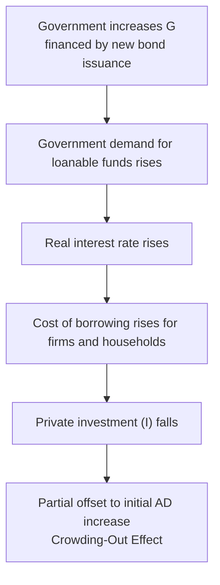

## Crowding Out and Ricardian Equivalence

### Definition and Core Concept

Both concepts address a common theoretical question: **does deficit-financed fiscal expansion actually raise aggregate demand as the simple Keynesian multiplier predicts, or is some (or all) of the intended stimulus offset by other economic responses?**

- **Crowding-out effect**: The reduction in private investment (and/or consumption and net exports) caused by government borrowing, operating primarily through higher interest rates or, in an open economy, exchange rate appreciation
- **Ricardian equivalence**: The hypothesis that deficit-financed tax cuts have no net effect on aggregate demand because rational households anticipate future tax liabilities and save the tax cut in full, leaving national saving and consumption unchanged

Both mechanisms imply that the simple fiscal multiplier ($k_G = \frac{1}{1-MPC}$) overstates the true real-world effect of fiscal expansion, though they operate through entirely different behavioral channels.

### Crowding-Out Effect

#### Mechanism (Financial/Interest-Rate Channel)

1. Government increases spending or cuts taxes, financed by issuing bonds
2. This raises the government's demand for loanable funds
3. In the loanable funds market, increased borrowing shifts the demand for funds rightward
4. Given a fixed supply of loanable funds (savings), the equilibrium real interest rate rises
5. Higher interest rates raise the cost of borrowing for private firms and households
6. Private investment ($I$) — and to a lesser extent interest-sensitive consumption (e.g., durable goods, housing) — falls
7. The decline in $I$ partially offsets the initial increase in $G$, producing a smaller net increase in aggregate demand than the simple multiplier predicts

#### Loanable Funds Market Representation

$$S_{private} + S_{government} = I$$

Where $S_{government} = T - G$. A budget deficit means $S_{government} < 0$ (government dissaving), which reduces the total supply of loanable funds available to fund private investment, absent a fully offsetting rise in private saving.



#### Degree of Crowding-Out: Key Determinants

| Factor | Effect on Crowding-Out |
| --- | --- |
| **Slope of investment demand curve (interest sensitivity)** | Steeper (less interest-elastic) investment demand → less crowding-out; flatter (more elastic) → more crowding-out |
| **State of the economy** | Near full employment / full-capacity output → crowding-out tends to be larger, since new government demand competes directly with private demand for scarce resources and loanable funds |
| **Liquidity trap conditions** | Near-zero interest rates with abundant idle savings → crowding-out is minimal, because increased borrowing can be absorbed without pushing up interest rates significantly [Inference — this is the standard Keynesian prediction associated with liquidity-trap conditions, and its empirical magnitude remains debated, particularly regarding post-2008 and post-2020 experiences in advanced economies] |
| **Monetary policy accommodation** | If the central bank keeps interest rates low despite the fiscal expansion (monetary accommodation), the interest-rate channel of crowding-out is muted |
| **Openness of the economy / exchange rate regime** | Under floating exchange rates, crowding-out can also occur via currency appreciation reducing net exports (discussed below) |

#### Financial Crowding-Out versus Exchange-Rate Crowding-Out (Open Economy)

In an open economy with floating exchange rates and reasonably mobile capital:

1. Higher domestic interest rates (from step 4 above) attract foreign capital inflows seeking higher returns
2. Increased demand for the domestic currency causes it to appreciate
3. A stronger currency makes exports more expensive and imports cheaper, reducing net exports ($NX$)
4. This is an additional channel of crowding-out operating through the external sector, sometimes called **exchange-rate crowding-out**, distinct from the domestic interest-rate/investment channel

[Inference] The relative magnitude of financial crowding-out versus exchange-rate crowding-out depends on the degree of capital mobility and the specific exchange rate regime, and is a central prediction of the Mundell-Fleming model.

#### Crowding-In (The Reverse Case)

Contractionary fiscal policy — reduced government borrowing — can produce **crowding-in**: lower government demand for loanable funds reduces interest rates, which stimulates private investment, partially offsetting the contractionary effect of the fiscal tightening on aggregate demand.

### Ricardian Equivalence

#### Theoretical Foundation

The Ricardian equivalence proposition, associated with the 19th-century economist David Ricardo and formalized in modern macroeconomics by Robert Barro, argues that the method of financing government spending (current taxation versus debt) is irrelevant to aggregate demand, because rational, forward-looking households treat government debt as deferred taxation.

#### Mechanism (Step-by-Step)

1. Government cuts taxes today, financed by issuing bonds (running a deficit) rather than by an equivalent spending cut
2. Households receive higher current disposable income
3. Rational households recognize that the government must eventually repay this debt (plus interest), which implies higher future taxes
4. To prepare for this anticipated future tax liability, households save the entire tax cut rather than increasing consumption
5. Private saving rises by exactly the amount government saving falls (i.e., by exactly the size of the deficit)
6. National saving ($S_{national} = S_{private} + S_{government}$) is unchanged
7. Aggregate demand, consumption, and the real interest rate are unaffected by the switch from tax financing to debt financing

#### Formal Condition

Under full Ricardian equivalence, the timing of taxation is irrelevant to household consumption decisions because households evaluate their **lifetime (permanent) budget constraint**, not just current-period disposable income:

$$C_t = f(\text{Present Value of Lifetime Income}) \neq f(Y_{d,t} \text{ alone})$$

A tax cut financed by debt today, matched by a tax increase in the future with the same present value, leaves the present value of lifetime after-tax income — and therefore consumption — unchanged.

#### Assumptions Required for Full Ricardian Equivalence

Ricardian equivalence relies on a demanding set of assumptions, each of which is a potential point of failure in the real world:

1. **Rational expectations and perfect foresight** about future tax liabilities
2. **Infinite planning horizons**, or equivalently, operative intergenerational bequest motives (households care about their descendants' after-tax income as much as their own)
3. **No borrowing constraints / perfect capital markets** — households can freely borrow against future income to smooth consumption
4. **No distortionary taxation** — the future taxes used to repay the debt do not themselves alter economic behavior (in reality, most taxes are distortionary)
5. **Fixed government spending path** — the analysis assumes only the timing of taxation changes, not future government spending itself
6. **Certainty about who bears the future tax burden** — no assumption that debt will be inflated away, defaulted upon, or shifted onto different taxpayers than those receiving today's tax cut

#### Comparative Diagram: Keynesian versus Ricardian Prediction

<svg xmlns="http://www.w3.org/2000/svg" viewBox="0 0 720 380" font-family="Arial, sans-serif">
<text x="360" y="24" text-anchor="middle" font-size="16" font-weight="bold">Response to a Deficit-Financed Tax Cut (svg_diagram)</text>

<g>
<text x="180" y="55" text-anchor="middle" font-size="13" font-weight="bold">Standard Keynesian View</text>
<rect x="60" y="80" width="240" height="50" fill="none" stroke="#1f77b4" stroke-width="2" />
<text x="180" y="110" text-anchor="middle" font-size="11">Tax cut raises disposable income</text>



```
<line x1="180" y1="130" x2="180" y2="160" stroke="black" stroke-width="1.5" marker-end="url(#a1)" />
<rect x="60" y="160" width="240" height="50" fill="none" stroke="#1f77b4" stroke-width="2" />
<text x="180" y="190" text-anchor="middle" font-size="11">Consumption rises (MPC x tax cut)</text>

<line x1="180" y1="210" x2="180" y2="240" stroke="black" stroke-width="1.5" marker-end="url(#a1)" />
<rect x="60" y="240" width="240" height="50" fill="#e8f0fa" stroke="#1f77b4" stroke-width="2" />
<text x="180" y="270" text-anchor="middle" font-size="11" font-weight="bold">Aggregate Demand Increases</text>
```

</g>

<g>
<text x="540" y="55" text-anchor="middle" font-size="13" font-weight="bold">Ricardian Equivalence View</text>
<rect x="420" y="80" width="240" height="50" fill="none" stroke="#d62728" stroke-width="2" />
<text x="540" y="110" text-anchor="middle" font-size="11">Tax cut raises disposable income</text>



```
<line x1="540" y1="130" x2="540" y2="160" stroke="black" stroke-width="1.5" marker-end="url(#a2)" />
<rect x="420" y="160" width="240" height="50" fill="none" stroke="#d62728" stroke-width="2" />
<text x="540" y="182" text-anchor="middle" font-size="11">Households anticipate future taxes</text>
<text x="540" y="198" text-anchor="middle" font-size="11">and save the entire tax cut</text>

<line x1="540" y1="210" x2="540" y2="240" stroke="black" stroke-width="1.5" marker-end="url(#a2)" />
<rect x="420" y="240" width="240" height="50" fill="#fbe9e7" stroke="#d62728" stroke-width="2" />
<text x="540" y="270" text-anchor="middle" font-size="11" font-weight="bold">Aggregate Demand Unchanged</text>
```

</g>
</svg>

### Empirical Evidence on Ricardian Equivalence

**Key Points**

- Empirical studies generally find only **partial** Ricardian offsetting behavior, not full equivalence — households tend to increase consumption somewhat in response to deficit-financed tax cuts, implying the assumptions above do not hold precisely in practice
- Commonly cited real-world violations of the required assumptions include: liquidity-constrained households (who cannot borrow against future income and therefore spend a tax cut immediately), finite planning horizons or weak bequest motives, and uncertainty about who will ultimately bear future tax increases
- [Inference] The degree of Ricardian offsetting found in empirical studies varies substantially by country, time period, and the specific fiscal episode studied, and remains an active area of empirical macroeconomic research without full professional consensus on the precise magnitude
- Because empirical support for full Ricardian equivalence is weak, most mainstream macroeconomic models and policy analysis continue to assume that deficit-financed fiscal policy has some genuine short-run stimulative effect on aggregate demand, net of partial crowding-out and partial Ricardian offsetting

### Relationship Between Crowding-Out and Ricardian Equivalence

| Aspect | Crowding-Out | Ricardian Equivalence |
| --- | --- | --- |
| **Channel** | Interest rates (and/or exchange rates) | Household expectations about future taxes |
| **Behavioral driver** | Firms and investors responding to changed borrowing costs | Households responding to anticipated lifetime tax liability |
| **Effect on private saving** | Does not necessarily require a change in private saving | Requires private saving to rise by exactly the amount of the tax cut |
| **Assumption about capital markets** | Assumes loanable funds market clears via interest rate adjustment | Assumes households can freely borrow/save to smooth consumption |
| **Degree in liquidity trap** | Minimal (idle savings absorb new borrowing without raising rates) | Unaffected by liquidity trap conditions — this is a separate mechanism |
| **Policy implication if fully operative** | Fiscal expansion largely displaces private investment, with limited net AD effect | Fiscal expansion (specifically tax-cut financed) has literally zero net effect on AD |

**Key Points**

- The two mechanisms are theoretically independent: an economy could exhibit strong crowding-out with weak Ricardian effects, or vice versa
- Both mechanisms are frequently invoked together in the "New Classical" critique of Keynesian fiscal policy, which argues that the real-world multiplier is smaller than the naive Keynesian textbook prediction because of these two offsetting channels
- Neither mechanism, according to most empirical evidence, operates at full theoretical strength in practice — implying that deficit-financed fiscal policy generally does have *some* meaningful stimulative effect, though smaller than the simple multiplier suggests [Inference]

### Common Misconceptions

- Crowding-out does not imply that fiscal policy is completely ineffective; it implies the net effect is smaller than the simple multiplier predicts, with the exact reduction depending on the interest-elasticity of investment and the state of the economy
- Ricardian equivalence does not claim that government debt is irrelevant to the economy in all respects (e.g., debt sustainability, interest burden, and crowding-out are unaffected by the Ricardian argument) — it specifically claims that the *financing method* (tax vs. debt) for a *given* spending path does not affect aggregate demand
- Crowding-out and Ricardian equivalence are distinct concepts and should not be treated as synonyms, despite both predicting weaker-than-naive fiscal multipliers; they operate through entirely different economic channels (interest rates versus household expectations)
- A liquidity trap reduces crowding-out via the interest-rate channel but does not, by itself, invalidate or validate Ricardian equivalence, which depends on separate assumptions about household foresight and capital-market access

### Conclusion

Crowding-out and Ricardian equivalence are the two principal theoretical mechanisms proposed to explain why deficit-financed fiscal expansion may generate a smaller increase in aggregate demand than the basic Keynesian multiplier predicts. Crowding-out operates through financial markets: government borrowing raises interest rates (or, in an open economy, appreciates the currency), displacing private investment or net exports. Ricardian equivalence operates through household expectations: forward-looking households anticipate future tax liabilities implied by current deficits and save accordingly, offsetting the intended stimulus. Empirical evidence generally supports partial, rather than full, versions of both mechanisms, implying that deficit-financed fiscal policy retains meaningful — though reduced — real-world effectiveness compared to the simple textbook multiplier.

**Related Topics**

- The Loanable Funds Market and Interest Rate Determination
- The Mundell-Fleming Model and Open-Economy Crowding-Out
- The Government Spending and Tax Multipliers
- Liquidity Traps and the Effectiveness of Fiscal Policy
- Permanent Income and Life-Cycle Hypotheses of Consumption
- Budget Deficits and the National Debt
- New Classical versus Keynesian Views of Fiscal Policy
- Empirical Estimates of Fiscal Multipliers
- Barro-Ricardo Equivalence: Theoretical Origins and Critiques
- Debt Sustainability and Intergenerational Tax Incidence