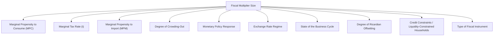

## Fiscal Multipliers and Their Determinants

### Definition and Core Concept

The fiscal multiplier measures the ratio of the total change in equilibrium output (or income) to the initial autonomous change in a fiscal instrument (government spending or taxation) that caused it:

$$\text{Multiplier} = \frac{\Delta Y}{\Delta X}$$

Where $X$ represents the fiscal instrument in question (government spending $G$, taxes $T$, or transfer payments $TR$). A multiplier greater than 1 implies the eventual change in output exceeds the size of the initial fiscal injection, reflecting successive rounds of induced spending throughout the economy.

### The Basic Spending Multiplier (Closed Economy, No Taxes)

#### Derivation

Consider an increase in autonomous government spending $\Delta G$. This raises output by $\Delta G$ in the first round. Households receiving this as income spend a fraction equal to the marginal propensity to consume ($MPC$), generating a second round of spending equal to $MPC \times \Delta G$. This process repeats indefinitely:

$$\Delta Y = \Delta G + MPC \cdot \Delta G + MPC^2 \cdot \Delta G + MPC^3 \cdot \Delta G + \dots$$

This is a geometric series with common ratio $MPC$:

$$\Delta Y = \Delta G \sum_{n=0}^{\infty} MPC^n = \frac{\Delta G}{1 - MPC}$$

Therefore, the basic government spending multiplier is:

$$k_G = \frac{\Delta Y}{\Delta G} = \frac{1}{1 - MPC}$$

**Example**: If $MPC = 0.75$, then $k_G = \frac{1}{1-0.75} = 4$. A $20 billion increase in government spending would theoretically raise equilibrium output by $80 billion.

#### The Tax Multiplier

A change in lump-sum taxes affects output indirectly, through its effect on disposable income and hence consumption, rather than directly like $G$. The first-round effect of a tax cut $\Delta T$ (a decrease, so $\Delta T < 0$) is:

$$\Delta C_{round 1} = -MPC \cdot \Delta T$$

Following the same geometric series logic:

$$k_T = \frac{\Delta Y}{\Delta T} = \frac{-MPC}{1 - MPC}$$

**Key Points**

- The tax multiplier is smaller in absolute value than the spending multiplier ($|k_T| < |k_G|$) because a tax cut is only partially spent in the first round (a fraction $1-MPC$ is saved immediately), whereas a spending increase enters the expenditure stream in full in the first round
- The tax multiplier carries a negative sign relative to a tax *increase*: a tax increase reduces output ($\Delta Y = k_T \times \Delta T$, with $\Delta T > 0$ giving $\Delta Y < 0$)

#### The Balanced-Budget Multiplier

If government spending and taxes rise by the same amount ($\Delta G = \Delta T$), the combined multiplier effect is:

$$k_{BB} = k_G + k_T = \frac{1}{1-MPC} + \frac{-MPC}{1-MPC} = \frac{1-MPC}{1-MPC} = 1$$

This is the **balanced-budget multiplier theorem**: a simultaneous, equal increase in government spending and taxes raises output by exactly the amount of the spending increase, because the full spending increase enters demand directly while the tax increase only removes the (smaller) consumption portion of household income.

### Incorporating a Marginal Tax Rate

In more realistic models, taxes are not lump-sum but proportional to income, introducing a marginal tax rate $t$. This modifies disposable income to:

$$Y_d = Y(1-t)$$

The multiplier becomes:

$$k_G = \frac{1}{1 - MPC(1-t)}$$

A higher $t$ reduces the multiplier, because a smaller fraction of each additional dollar of income translates into disposable income available for further spending — this is precisely the automatic stabilizer mechanism discussed elsewhere in this chapter.

### Incorporating Leakages: The Open Economy with Imports

In an open economy, a portion of each round of spending leaks abroad through imports, governed by the marginal propensity to import ($MPM$). The generalized multiplier becomes:

$$k_G = \frac{1}{1 - MPC(1-t) + MPM}$$

**Key Points**

- A higher $MPM$ reduces the domestic multiplier because spending that leaks into imports does not generate further rounds of domestic income and spending
- Small, highly open economies (heavily reliant on trade) tend to have smaller fiscal multipliers than large, relatively closed economies, all else equal [Inference — this is a standard theoretical prediction and broadly consistent with empirical cross-country multiplier estimates, though exact magnitudes vary by study]

### Comprehensive List of Determinants

#### 1. Marginal Propensity to Consume (MPC)

A higher $MPC$ (lower savings rate) increases the multiplier, because more of each round of income is re-spent rather than saved. Countries or households with higher savings rates exhibit smaller multipliers.

#### 2. Marginal Tax Rate ($t$)

As derived above, a higher marginal tax rate reduces the multiplier by reducing the disposable income impact of each round of spending — this is the same mechanism underlying automatic stabilizers.

#### 3. Marginal Propensity to Import ($MPM$)

Higher import propensity (more open economies) reduces the domestic multiplier via the leakage described above.

#### 4. Degree of Crowding-Out

As detailed under the crowding-out mechanism, deficit-financed fiscal expansion can raise interest rates, displacing private investment and reducing the net multiplier below its "textbook" value. The magnitude of this offset depends on the interest-elasticity of investment and how close the economy is to full capacity.

#### 5. Monetary Policy Response (Monetary Accommodation)

- If the central bank holds interest rates constant despite fiscal expansion (monetary accommodation), crowding-out is muted and the multiplier is larger
- If the central bank actively raises interest rates in response to fiscal stimulus (e.g., to counteract inflationary pressure), the multiplier is smaller, since monetary tightening directly offsets some of the fiscal impulse
- At the **zero lower bound** (interest rates near zero, unable to fall further), monetary policy cannot offset a fiscal contraction, and multipliers for fiscal expansion tend to be larger than in normal times [Inference — this is a well-supported theoretical and empirical finding in the post-2008 macroeconomic literature, though the precise magnitude of the zero-lower-bound multiplier premium is debated]

#### 6. Exchange Rate Regime

- Under **fixed exchange rates**, fiscal policy tends to have a larger multiplier because monetary policy is constrained from offsetting the fiscal impulse (a core Mundell-Fleming result under high capital mobility)
- Under **floating exchange rates**, fiscal expansion can cause currency appreciation (via the interest-rate-driven capital inflow channel), reducing net exports and shrinking the effective multiplier

#### 7. State of the Business Cycle

- Multipliers tend to be larger during recessions (particularly deep recessions with high unemployment and idle capacity) because there is less crowding-out of resources and investment, and a higher share of the population is liquidity-constrained and spends immediately
- Multipliers tend to be smaller during expansions or when the economy is near full capacity, since resources are scarcer and crowding-out effects are stronger
- This state-dependence of the multiplier is a major theme in modern empirical fiscal policy research and has been used to argue for larger fiscal responses specifically during severe downturns [Inference — while state-dependence is broadly supported in the empirical literature, exact multiplier estimates by cycle phase vary considerably across studies and countries]

#### 8. Degree of Ricardian Offsetting

As discussed previously, if households anticipate future tax increases needed to repay government borrowing, they may increase saving in response to a deficit-financed tax cut, reducing the effective multiplier below the naive Keynesian prediction. Full Ricardian equivalence would drive the tax multiplier to zero; empirical evidence generally supports only partial offsetting.

#### 9. Credit Constraints / Liquidity-Constrained Households

Households unable to borrow against future income ("hand-to-mouth" consumers) spend a larger share of any income change immediately, since they cannot smooth consumption via saving or credit. A higher proportion of credit-constrained households in the economy tends to raise the effective multiplier, since this weakens the Ricardian-equivalence channel described above.

#### 10. Type of Fiscal Instrument

Multipliers differ systematically by instrument type:

| Instrument | Relative Multiplier Size | Rationale |
| --- | --- | --- |
| **Direct government purchases of goods/services** | Largest | Enters aggregate demand directly and fully in the first round |
| **Infrastructure investment** | Large, and may raise potential output long-run | Direct first-round spending plus potential supply-side productivity effects |
| **Transfer payments to low-income/liquidity-constrained households** | Moderate-to-large | High MPC among recipients, since low-income households are more likely to be credit-constrained |
| **Broad-based tax cuts** | Moderate | Partially saved; effectiveness depends on the income distribution of recipients |
| **Tax cuts to high-income households** | Smallest | Lower MPC among higher-income households, more likely to save the tax cut |

### Comparative Diagram: Multiplier Size by Instrument and Cycle Phase

<svg xmlns="http://www.w3.org/2000/svg" viewBox="0 0 700 400" font-family="Arial, sans-serif">
<text x="350" y="24" text-anchor="middle" font-size="16" font-weight="bold">Illustrative Fiscal Multiplier Ranges (svg_diagram)</text>
<line x1="220" y1="340" x2="650" y2="340" stroke="black" stroke-width="2" />
<line x1="220" y1="340" x2="220" y2="60" stroke="black" stroke-width="2" />
<text x="30" y="70" font-size="11" font-weight="bold">Instrument</text>
<text x="435" y="368" text-anchor="middle" font-size="12">Multiplier Value</text>

<line x1="220" y1="340" x2="220" y2="335" stroke="black" />
<text x="220" y="355" text-anchor="middle" font-size="10">0.0</text>
<line x1="350" y1="340" x2="350" y2="335" stroke="black" />
<text x="350" y="355" text-anchor="middle" font-size="10">0.5</text>
<line x1="480" y1="340" x2="480" y2="335" stroke="black" />
<text x="480" y="355" text-anchor="middle" font-size="10">1.0</text>
<line x1="610" y1="340" x2="610" y2="335" stroke="black" />
<text x="610" y="355" text-anchor="middle" font-size="10">1.5</text>

<text x="30" y="100" font-size="11">Infrastructure spending</text>

<rect x="220" y="85" width="330" height="20" fill="`#1f77b4`" />

<text x="560" y="100" font-size="10">~1.0-1.5</text>

<text x="30" y="145" font-size="11">Direct govt. purchases</text>

<rect x="220" y="130" width="300" height="20" fill="`#1f77b4`" />

<text x="530" y="145" font-size="10">~0.8-1.4</text>

<text x="30" y="190" font-size="11">Transfers (low-income)</text>

<rect x="220" y="175" width="230" height="20" fill="`#2ca02c`" />

<text x="460" y="190" font-size="10">~0.5-1.0</text>

<text x="30" y="235" font-size="11">Broad-based tax cuts</text>

<rect x="220" y="220" width="150" height="20" fill="`#ff7f0e`" />

<text x="380" y="235" font-size="10">~0.3-0.6</text>

<text x="30" y="280" font-size="11">Tax cuts (high-income)</text>

<rect x="220" y="265" width="80" height="20" fill="`#d62728`" />

<text x="310" y="280" font-size="10">~0.1-0.3</text>

<text x="230" y="320" font-size="10" fill="#555" font-style="italic">Note: illustrative ranges synthesized from typical macro-model orderings, not a specific empirical study</text>

</svg>

### Empirical Estimates and Caveats

**Key Points**

- Empirical estimates of fiscal multipliers vary widely across studies, countries, and time periods, generally ranging from below 0.5 to above 1.5 depending on the specific context and methodology used
- Multiplier estimates tend to be systematically higher during deep recessions and at the zero lower bound than during normal or expansionary periods, consistent with the theoretical state-dependence described above [Inference]
- Estimating fiscal multipliers empirically is methodologically challenging because fiscal policy changes are rarely "exogenous" — governments often change spending or taxes precisely in response to economic conditions, creating identification problems (reverse causality) that researchers address using various instrumental variable and narrative-based approaches
- [Unverified] Any specific numerical multiplier value cited for a particular country or historical episode should be treated as model- and study-dependent rather than a universally agreed figure, given the wide range of estimates in the empirical literature

### Common Misconceptions

- The multiplier is not a fixed, universal constant; it varies substantially depending on the state of the economy, the type of fiscal instrument, the exchange rate regime, and the monetary policy response
- A multiplier greater than 1 does not mean fiscal policy is "free" or self-financing in a literal sense; it means the *output* effect exceeds the initial spending, not that the induced tax revenue necessarily fully repays the initial fiscal cost [Inference — under some specific high-multiplier, near-full-employment conditions, induced tax revenue could offset a meaningful share of the initial spending, but this is a case-specific, not general, result]
- The tax multiplier and spending multiplier are not the same magnitude even for equal-sized changes in $T$ and $G$; conflating them leads to significant errors in predicting fiscal policy effects, as demonstrated by the balanced-budget multiplier being distinctly different (equal to 1) from either multiplier alone

### Conclusion

The fiscal multiplier formalizes how an initial change in government spending or taxation propagates through the economy via successive rounds of induced spending, with its exact magnitude depending on the marginal propensity to consume, the marginal tax rate, import leakages, the degree of crowding-out, the monetary policy response, the exchange rate regime, the state of the business cycle, the extent of Ricardian offsetting, the prevalence of credit-constrained households, and the specific fiscal instrument used. Because these determinants vary substantially across time and countries, fiscal multipliers are best understood as context-dependent parameters rather than fixed constants, with the empirical literature generally finding larger multipliers during deep recessions, at the zero lower bound, and for instruments targeted at liquidity-constrained households.

**Related Topics**

- Expansionary versus Contractionary Fiscal Policy
- Automatic Stabilizers versus Discretionary Policy
- Crowding Out and Ricardian Equivalence
- The Zero Lower Bound and Monetary-Fiscal Policy Interaction
- The Mundell-Fleming Model and Open-Economy Fiscal Multipliers
- Marginal Propensity to Consume, Save, and Import
- State-Dependent Fiscal Multipliers: Recessions versus Expansions
- Identification Challenges in Empirical Fiscal Multiplier Estimation
- The Balanced-Budget Multiplier Theorem
- Liquidity Constraints and Hand-to-Mouth Consumer Behavior