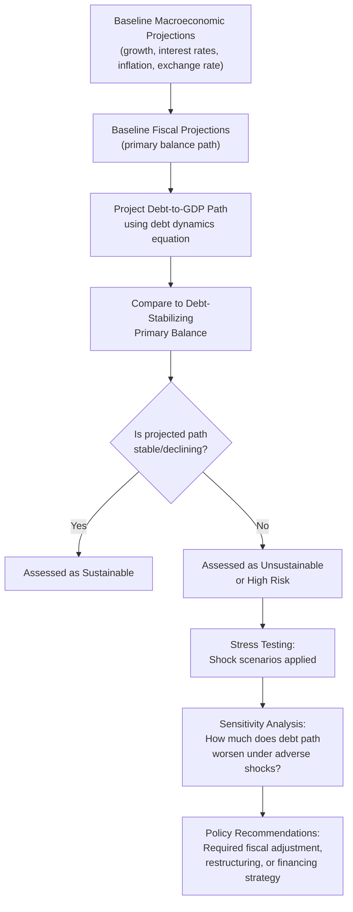

## Debt Sustainability Analysis

### Definition and Core Concept

Debt sustainability analysis (DSA) is the framework used to assess whether a government's current and projected fiscal policy path is consistent with stabilizing or reducing its public debt burden over time, without requiring an unrealistically large future policy adjustment, default, debt restructuring, or recourse to inflationary financing. It is the primary diagnostic tool used by institutions such as the IMF, the World Bank, and national fiscal councils to evaluate sovereign fiscal risk.

**Key Points**

- DSA does not answer "is this debt level acceptable?" in absolute terms; it answers "given current and projected fiscal, growth, and interest rate conditions, is this debt path stable, rising, or explosive?"
- A country can have a very high debt-to-GDP ratio and be assessed as sustainable (e.g., due to favorable growth and interest rate conditions), while another country with a lower ratio can be assessed as unsustainable (e.g., due to high borrowing costs or weak growth prospects)

### The Core Debt Dynamics Equation

The foundation of DSA is the government's intertemporal budget constraint, formalized in the debt dynamics equation introduced in the discussion of budget deficits and national debt:

$$\Delta \left(\frac{B}{Y}\right) = \left(\frac{r - g}{1+g}\right)\frac{B_{t-1}}{Y_{t-1}} + \frac{PD}{Y}$$

Where:

- $\frac{B}{Y}$ = debt-to-GDP ratio
- $r$ = effective real interest rate on government debt
- $g$ = real GDP growth rate
- $PD$ = primary deficit as a share of GDP (primary surplus enters as a negative value)

This equation decomposes the change in the debt ratio into two components: the **automatic debt dynamics** term (driven by the interest-growth differential, $r - g$) and the **primary balance** term (reflecting discretionary fiscal policy choices).

### The Interest-Growth Differential ($r - g$)

**Key Points**

- If $r > g$: the debt ratio has an inherent tendency to rise even with a balanced primary budget, because interest on existing debt accrues faster than the economy's capacity to service it grows
- If $r < g$: the debt ratio has an inherent tendency to fall even with a modest primary deficit, because GDP growth outpaces the growth of the debt stock — informally described as "growing out of debt"
- If $r = g$: the debt ratio is stable if and only if the primary balance is exactly zero
- The sign and magnitude of $r - g$ is widely regarded as the single most important determinant of long-run debt sustainability in standard sustainability frameworks [Inference — this is the standard analytical result in sovereign debt sustainability literature, though real-world sustainability also depends on market confidence, debt maturity structure, currency denomination, and political factors not captured by this equation alone]

### The Sustainability Condition: Required Primary Balance

Rearranging the debt dynamics equation, the primary balance required merely to **stabilize** the debt-to-GDP ratio at its current level (i.e., $\Delta(B/Y) = 0$) is:

$$PD^*_{stabilizing} = -\left(\frac{r-g}{1+g}\right)\frac{B}{Y}$$

- If $r > g$, the country must run a **primary surplus** of at least this magnitude merely to prevent the debt ratio from rising
- If $g > r$, the country can run a **primary deficit** up to this magnitude while still keeping the debt ratio stable or falling

This "debt-stabilizing primary balance" is a standard output of formal DSA exercises and is compared against a country's actual and projected primary balance to assess the size of any required "fiscal adjustment gap."

### DSA Methodology: Standard Components

#### 1. Baseline Macroeconomic and Fiscal Projections

Analysts construct a multi-year (typically 5-10 year) baseline projection of GDP growth, inflation, interest rates, the exchange rate, and the primary fiscal balance, generally based on current policy settings and consensus macroeconomic forecasts.

#### 2. Debt Projection

Applying the debt dynamics equation iteratively over the projection horizon generates a baseline debt-to-GDP trajectory.

#### 3. Stress Testing and Shock Scenarios

Because baseline projections are inherently uncertain, DSA frameworks apply standardized shock scenarios to test the resilience of the debt path, commonly including:

| Shock Type | Description |
| --- | --- |
| **Growth shock** | Temporary reduction in real GDP growth (e.g., a recession scenario) |
| **Interest rate shock** | Increase in borrowing costs (e.g., reflecting a loss of market confidence or global monetary tightening) |
| **Primary balance shock** | Deterioration in the primary balance (e.g., reflecting a spending overrun or revenue shortfall) |
| **Exchange rate shock** | Depreciation, which raises the local-currency value of foreign-currency-denominated debt |
| **Contingent liability shock** | Realization of previously off-balance-sheet liabilities (e.g., bank bailouts, state-owned enterprise debt, guaranteed loans) |
| **Combined/tailored shock** | A simultaneous combination of the above, often calibrated to historical worst-case episodes for the specific country |

#### 4. Fan Charts and Probabilistic Analysis

More sophisticated DSA frameworks (such as the IMF's stochastic DSA approach) generate probabilistic "fan charts" showing a range of possible debt paths based on the historical volatility of growth, interest rates, and the primary balance, rather than relying on a single deterministic baseline plus discrete shocks.

### Illustrative Debt Path Fan Chart

<svg xmlns="http://www.w3.org/2000/svg" viewBox="0 0 700 400" font-family="Arial, sans-serif">
<text x="350" y="24" text-anchor="middle" font-size="16" font-weight="bold">Illustrative Probabilistic Debt-to-GDP Fan Chart (svg_diagram)</text>
<line x1="70" y1="340" x2="650" y2="340" stroke="black" stroke-width="2" />
<line x1="70" y1="340" x2="70" y2="60" stroke="black" stroke-width="2" />
<text x="360" y="368" text-anchor="middle" font-size="12">Projection Year</text>
<text x="30" y="200" font-size="12" transform="rotate(-90 30 200)">Debt-to-GDP (%)</text>

<path d="M 150 220 L 620 100 L 620 340 L 150 220 Z" fill="#d62728" opacity="0.12" />
<path d="M 150 220 L 620 150 L 620 300 L 150 220 Z" fill="#d62728" opacity="0.2" />
<path d="M 150 220 L 620 190 L 620 250 L 150 220 Z" fill="#d62728" opacity="0.3" />

<path d="M 150 220 L 620 220" stroke="#333" stroke-width="2.5" stroke-dasharray="6,3" />
<text x="500" y="212" font-size="10" fill="#333">Median projection</text>

<path d="M 90 260 Q 120 240 150 220" stroke="black" stroke-width="2.5" fill="none" />
<line x1="150" y1="60" x2="150" y2="340" stroke="#888" stroke-dasharray="3,3" />
<text x="150" y="55" text-anchor="middle" font-size="10" fill="#888">Projection begins</text>

<text x="600" y="95" font-size="10" fill="`#d62728`">90% confidence band</text>

</svg>

### Distinguishing Sustainability Frameworks by Currency Regime

| Debt Currency Composition | Key Sustainability Consideration |
| --- | --- |
| **Debt denominated in domestic currency, issued domestically** | Lower default risk (government can, in principle, always service debt in its own currency), but risk of inflationary financing or financial repression if debt monetization is used |
| **Debt denominated in foreign currency** | Exposed to exchange rate risk; a domestic currency depreciation directly raises the local-currency debt burden and debt service cost, a major factor in emerging-market debt crises |
| **Debt held predominantly by domestic residents** | Lower rollover risk and lower sensitivity to shifts in foreign investor sentiment |
| **Debt held predominantly by foreign investors** | Higher exposure to sudden stops in capital inflows and shifts in global risk appetite |

[Inference] These distinctions are central to why headline debt-to-GDP comparisons across countries can be misleading without accounting for currency denomination and the residency of creditors — a pattern well documented in the emerging-market sovereign debt crisis literature, though the precise vulnerability threshold varies by country.

### Contingent Liabilities and Off-Balance-Sheet Risk

A rigorous DSA extends beyond the officially reported debt stock to account for **contingent liabilities** — obligations that are not part of current explicit government debt but could become government liabilities under certain conditions:

- State-owned enterprise debt (often implicitly or explicitly guaranteed)
- Public-private partnership (PPP) contractual obligations
- Pension system underfunding (unfunded actuarial liabilities)
- Financial sector bailout risk (implicit guarantees to systemically important banks)
- Natural disaster or climate-related reconstruction costs

Failure to account for these can significantly understate a country's true fiscal exposure, as demonstrated historically when banking sector bailouts (e.g., during systemic financial crises) caused sudden, large jumps in headline government debt that were not visible in pre-crisis DSA baselines.

### Market-Based Sustainability Indicators

In addition to model-based DSA, market indicators are used as real-time gauges of perceived sustainability:

| Indicator | Interpretation |
| --- | --- |
| **Sovereign bond yield spreads** | Higher spreads over a benchmark (e.g., U.S. Treasuries or German Bunds) reflect market-perceived default/rollover risk |
| **Credit default swap (CDS) spreads** | Market-implied probability of default over a given horizon |
| **Sovereign credit ratings** | Agency assessments (e.g., from major credit rating agencies) combining quantitative DSA-style analysis with qualitative institutional and political risk factors |
| **Debt auction bid-to-cover ratios** | Reflects real-time investor demand for newly issued government debt |

**Key Points**

- Market indicators can move faster than formal DSA updates and sometimes reflect shifts in market sentiment that are not fully captured by fundamentals-based models, a phenomenon associated with self-fulfilling debt crisis dynamics (multiple equilibria), where a loss of confidence itself raises $r$, worsening the debt dynamics and potentially validating the initial pessimism [Inference — this multiple-equilibria framework is a recognized theoretical result in sovereign debt models, though empirically distinguishing a fundamentals-driven crisis from a purely confidence-driven one is difficult in practice]

### Policy Responses When Debt Is Assessed as Unsustainable

1. **Fiscal consolidation (adjustment)** — sustained increase in the primary balance via spending cuts and/or tax increases, sized to close the gap to the debt-stabilizing primary balance
2. **Growth-enhancing structural reforms** — policies aimed at raising $g$, which improves the $r - g$ differential without requiring painful fiscal adjustment
3. **Debt restructuring** — negotiated reduction in the face value, interest rate, or maturity extension of existing debt with creditors, used when the required primary balance adjustment is judged politically or economically infeasible
4. **Financial repression** — policies that compel domestic financial institutions to hold government debt at below-market interest rates, effectively lowering $r$
5. **Inflating away debt** — for debt denominated in domestic currency at fixed nominal rates, unexpected inflation reduces the real value of outstanding debt, though this approach carries significant costs to central bank credibility and can raise future borrowing costs [Inference — this strategy is widely regarded as a last-resort and reputationally costly option rather than a standard sustainability tool]

### Common Misconceptions

- There is no single universal debt-to-GDP threshold beyond which a country automatically becomes unsustainable; historical and empirical research has not identified a consistent, universal tipping point, and sustainability depends jointly on $r$, $g$, the primary balance, currency composition, and creditor base [Inference]
- A country running a primary deficit is not automatically on an unsustainable debt path; if $g > r$, a primary deficit can be consistent with a stable or falling debt ratio
- DSA is a forward-looking, projection-based exercise, not a mechanical accounting statement; its conclusions are highly sensitive to the underlying growth, interest rate, and exchange rate assumptions used, and different institutions applying different assumptions can reach different sustainability conclusions for the same country
- High debt does not always precede a crisis, and low debt does not guarantee safety — the interaction between debt levels, financing conditions, and market confidence is what ultimately determines sustainability

### Conclusion

Debt sustainability analysis is the structured framework for projecting a government's future debt trajectory and assessing whether it can be stabilized or reduced without recourse to unsustainable fiscal adjustment, default, or debt restructuring. Its core analytical engine is the debt dynamics equation, in which the interest-growth differential ($r - g$) and the primary balance jointly determine the path of the debt-to-GDP ratio. Rigorous DSA extends beyond this baseline to incorporate stress testing, probabilistic fan charts, contingent liabilities, and market-based indicators, recognizing that sustainability is not defined by any single debt-level threshold but by the dynamic interaction between growth, borrowing costs, fiscal policy, and market confidence.

**Related Topics**

- Budget Deficits and the National Debt
- The Interest-Growth Differential (r versus g) in Debt Dynamics
- Sovereign Debt Crises and Multiple Equilibria Models
- Contingent Liabilities and Fiscal Risk Management
- Sovereign Credit Ratings and Bond Market Indicators
- Debt Restructuring Mechanisms and Sovereign Default
- Financial Repression as a Debt Management Strategy
- The IMF/World Bank Debt Sustainability Framework
- Fiscal Rules and Debt Anchors
- Currency Composition of Sovereign Debt and Emerging Market Vulnerability