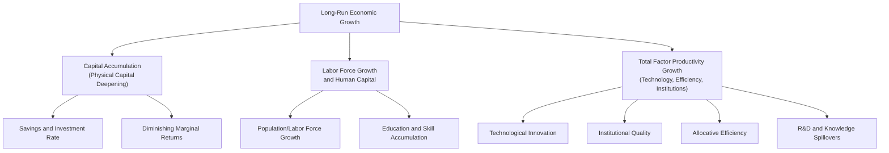

## Sources of Long-Run Economic Growth

### Definition and Core Concept

Long-run economic growth refers to the sustained increase in an economy's productive capacity over time, typically measured as the growth rate of real GDP or, more precisely for cross-country and welfare comparisons, real GDP per capita:

$$\text{Growth Rate} = \frac{Y_t - Y_{t-1}}{Y_{t-1}} \times 100\%$$

Unlike short-run fluctuations in output driven by aggregate demand (the subject of business cycle theory and stabilization policy), long-run growth is governed by the expansion of an economy's **aggregate supply** capacity — its ability to produce more goods and services sustainably over time, independent of the current position in the business cycle.

### The Aggregate Production Function Framework

The standard starting point for analyzing sources of growth is the aggregate production function:

$$Y = A \cdot F(K, L)$$

Where:

- $Y$ = aggregate output
- $A$ = total factor productivity (TFP), representing technology and efficiency
- $K$ = capital stock
- $L$ = labor input (often adjusted for human capital/skill)
- $F(\cdot)$ = a function describing how inputs combine to produce output, commonly assumed to exhibit constant returns to scale

A widely used specific functional form is the **Cobb-Douglas production function**:

$$Y = A \cdot K^{\alpha} L^{1-\alpha}$$

Where $\alpha$ is capital's share of output (typically estimated around 0.3-0.4 in most economies) and $1-\alpha$ is labor's share.

**Key Points**

- This framework implies that output can grow through three broad channels: growth in the capital stock ($K$), growth in the labor force or its quality ($L$), and growth in total factor productivity ($A$)
- Long-run per-capita income growth is driven almost entirely by TFP growth in most standard growth models once diminishing returns to capital accumulation are taken into account, a central result developed further below

### Growth Accounting

**Growth accounting** decomposes observed output growth into contributions from each input using the production function framework. Differentiating the Cobb-Douglas function with respect to time yields:

$$\frac{\Delta Y}{Y} = \frac{\Delta A}{A} + \alpha \frac{\Delta K}{K} + (1-\alpha)\frac{\Delta L}{L}$$

This equation, sometimes called the **Solow growth accounting equation**, allows economists to empirically attribute observed GDP growth to capital deepening, labor force growth, and a residual term.

#### The Solow Residual

The portion of output growth not explained by measured increases in capital and labor is called the **Solow residual**, used as an empirical proxy for total factor productivity growth:

$$\frac{\Delta A}{A} = \frac{\Delta Y}{Y} - \alpha \frac{\Delta K}{K} - (1-\alpha)\frac{\Delta L}{L}$$

**Key Points**

- The Solow residual captures technological progress, but also captures measurement error, changes in resource allocation efficiency, institutional quality changes, and other unmeasured factors — it is a residual, not a directly observed variable
- Empirically, the Solow residual has been found to explain a substantial share of long-run per-capita output growth in advanced economies, a finding often summarized as "capital accumulation alone cannot explain most of observed long-run growth" [Inference — this is a well-established empirical regularity from the growth accounting literature originating with Solow's own 1957 study, though the precise share attributed to TFP varies by country, time period, and dataset]

### The Three Proximate Sources of Growth

### 1. Capital Accumulation (Physical Capital Deepening)

#### Mechanism

Higher rates of saving and investment increase the capital stock per worker ($K/L$), raising output per worker through the standard production function relationship. In the Solow-Swan neoclassical growth model, capital accumulation is governed by:

$$\Delta k = s f(k) - (n + \delta)k$$

Where $k = K/L$ (capital per worker), $s$ is the saving rate, $f(k)$ is output per worker, $n$ is the population growth rate, and $\delta$ is the depreciation rate.

#### Diminishing Marginal Returns to Capital

**Key Points**

- Because of diminishing marginal returns to capital (a standard property of the production function), each additional unit of capital per worker raises output by a progressively smaller amount
- This implies capital accumulation alone cannot sustain permanent per-capita output growth; the economy eventually converges to a **steady state** where capital per worker (and hence output per worker) stops growing, absent ongoing technological progress
- This diminishing-returns property is the central theoretical reason the Solow model assigns the primary role in sustained *per-capita* growth to technological progress ($A$) rather than to capital accumulation alone

#### Convergence Implications

The diminishing-returns property also implies **conditional convergence**: countries with lower initial capital-to-labor ratios (relative to their own steady state) tend to grow faster than countries closer to their steady state, since the marginal product of capital — and hence the incentive to invest — is higher when capital is scarce. [Inference] Empirical evidence for convergence is stronger when controlling for a country's own steady-state determinants (savings rate, population growth, technology level) than for unconditional cross-country convergence, which is not robustly observed in the data.

### 2. Labor Force Growth and Human Capital

#### Raw Labor Force Growth

An expanding labor force (through population growth, rising labor force participation, or immigration) raises aggregate output, but does not by itself raise output *per capita*, since more workers must also be fed, housed, and equipped with capital — this is why population growth ($n$) appears as a dilution term in the capital-accumulation equation above.

#### Human Capital

**Key Points**

- Human capital — the stock of education, skills, training, and health embodied in the workforce — is typically modeled as augmenting the effective labor input, sometimes formalized as $H = e^{\phi \cdot s}L$ (where $s$ is years of schooling and $\phi$ reflects the return to an additional year of education)
- Investment in education and health raises the productive capacity of a given number of workers, functioning analogously to physical capital accumulation but often exhibiting different (and debated) returns and spillover characteristics
- Endogenous growth models (discussed below) frequently treat human capital accumulation as a potential source of *sustained* per-capita growth, in contrast to physical capital accumulation alone, since human capital investment can generate knowledge spillovers that do not fully exhibit diminishing returns at the aggregate level [Inference — this is a central theoretical claim of endogenous growth theory, and the empirical magnitude of human-capital-driven spillovers remains an active area of research with mixed findings across studies]

### 3. Total Factor Productivity (TFP) Growth

TFP growth is generally regarded as the most important source of *sustained* long-run per-capita growth once diminishing returns to factor accumulation are accounted for. Its underlying drivers include:

#### a) Technological Innovation

New production techniques, products, and processes that allow more output to be produced from the same quantity of inputs. This includes both **process innovation** (more efficient ways of producing existing goods) and **product innovation** (entirely new goods and services).

#### b) Institutional Quality

**Key Points**

- Secure property rights, effective contract enforcement, rule of law, political stability, and low corruption are widely cited in the growth literature as foundational determinants of long-run TFP and investment incentives
- Institutions affect growth indirectly by shaping the incentives for innovation, investment, and efficient resource allocation, rather than entering the production function directly as a measurable input
- Cross-country empirical growth research has found a strong association between measures of institutional quality and long-run per-capita income levels, though establishing the precise direction of causality (versus reverse causality or confounding factors such as geography and history) remains a significant methodological challenge in this literature [Inference — this reflects ongoing debate in the empirical growth and institutions literature, notably associated with the work of Acemoglu, Robinson, and others, and the causal interpretation of these correlations is contested]

#### c) Allocative Efficiency

The reallocation of capital and labor from less productive to more productive firms, sectors, or regions raises aggregate TFP even without any new technology being invented — often discussed in the context of reducing "misallocation" in developing economies.

#### d) Research and Development (R&D) and Knowledge Spillovers

Investment in R&D generates new ideas and technologies. Because knowledge is often **non-rival** (one firm's use of an idea does not prevent another from using it) and only partially **excludable** (patents provide only temporary and imperfect exclusivity), R&D investment can generate positive externalities/spillovers to the broader economy beyond the investing firm — a foundational mechanism in endogenous growth theory.

#### e) Openness to Trade and Foreign Direct Investment

Trade openness can raise TFP growth through several channels: access to a wider variety of intermediate and capital goods, competitive pressure inducing domestic firms to become more efficient, and technology transfer via foreign direct investment and international knowledge diffusion. [Inference] The empirical magnitude of trade's effect on TFP growth varies across studies and depends on complementary domestic institutional and educational conditions.

### Comparative Diagram: Capital Accumulation vs. TFP Growth Over Time

<svg xmlns="http://www.w3.org/2000/svg" viewBox="0 0 700 380" font-family="Arial, sans-serif">
<text x="350" y="24" text-anchor="middle" font-size="16" font-weight="bold">Output Per Worker: Capital Accumulation vs TFP-Driven Growth (svg_diagram)</text>
<line x1="70" y1="330" x2="650" y2="330" stroke="black" stroke-width="2" />
<line x1="70" y1="330" x2="70" y2="60" stroke="black" stroke-width="2" />
<text x="360" y="358" text-anchor="middle" font-size="12">Time</text>
<text x="30" y="195" font-size="12" transform="rotate(-90 30 195)">Output per Worker</text>

<path d="M 90 300 Q 200 180 320 140 Q 420 120 650 115" stroke="#1f77b4" stroke-width="2.5" fill="none" />
<text x="420" y="105" font-size="11" fill="#1f77b4" font-weight="bold">Capital accumulation only (converges to steady state)</text>

<path d="M 90 300 Q 200 180 320 140 Q 450 90 650 40" stroke="#2ca02c" stroke-width="2.5" fill="none" stroke-dasharray="6,3" />
<text x="440" y="55" font-size="11" fill="#2ca02c" font-weight="bold">With sustained TFP growth (no convergence)</text>
<line x1="320" y1="330" x2="320" y2="140" stroke="#888" stroke-dasharray="3,3" />
<text x="320" y="345" text-anchor="middle" font-size="10" fill="#888">Paths diverge here</text>
</svg>

### Endogenous Growth Theory: Making TFP Growth Explicit

**Key Points**

- The neoclassical (Solow) model treats technological progress as **exogenous** — arising from outside the model, unexplained by economic incentives
- **Endogenous growth models** (e.g., associated with Romer and Lucas) instead model technological progress as an outcome of purposeful economic decisions — firms and researchers investing in R&D or human capital in response to profit incentives, patent protection, and market size
- A key implication of endogenous growth theory is that, unlike in the Solow model, well-designed government policy (R&D subsidies, education investment, intellectual property protection, competition policy) can permanently affect the long-run growth *rate*, not merely the *level* of output, because knowledge spillovers can offset the diminishing-returns property that constrains capital accumulation alone [Inference — this is a foundational theoretical distinction in the endogenous growth literature, though empirically isolating the growth-rate effect of specific policies from the level effect remains methodologically difficult]

### Comparative Summary Table: Sources of Growth

| Source | Mechanism | Sustains Long-Run *Per-Capita* Growth? | Key Model |
| --- | --- | --- | --- |
| **Physical capital accumulation** | Higher saving/investment raises capital per worker | No (subject to diminishing returns; converges to steady state) | Solow-Swan model |
| **Labor force growth** | More workers raise aggregate output | No effect on per-capita output by itself (dilutes capital per worker) | Solow-Swan model |
| **Human capital accumulation** | Education/skills raise effective labor productivity | Potentially yes, if spillovers offset diminishing returns | Augmented Solow / endogenous growth models |
| **Technological progress (TFP)** | New ideas, processes, and innovations raise output for given inputs | Yes — the primary driver of sustained per-capita growth in standard theory | Solow model (exogenous) / Romer, Lucas (endogenous) |
| **Institutional quality** | Shapes incentives for investment, innovation, and efficient allocation | Indirectly yes, via its effect on investment and TFP growth | Institutions and growth literature (Acemoglu, Robinson, North) |
| **Trade openness / FDI** | Technology diffusion, competitive pressure, access to inputs | Indirectly yes, via TFP channel | Open-economy growth extensions |

### Common Misconceptions

- Growth in the labor force is not, by itself, a source of *per-capita* income growth; it must be weighed against the capital-dilution effect and is only translated into higher living standards to the extent it is accompanied by proportional capital accumulation and/or productivity gains
- Capital accumulation is not a source of *permanently sustained* per-capita growth in the standard neoclassical framework, due to diminishing marginal returns; it primarily explains transitional growth toward a steady state, not indefinite growth
- The Solow residual (TFP) is not a direct, cleanly measured variable — it is a statistical residual and therefore also captures measurement error and other unmodeled factors, a caveat frequently omitted in simplified treatments of growth accounting
- Higher measured GDP growth in a given period does not necessarily reflect higher long-run *sustainable* growth capacity; distinguishing cyclical recovery (closing an output gap) from genuine potential-output growth requires examining the sources of growth (input growth vs. TFP growth) rather than the headline growth rate alone

### Conclusion

Long-run economic growth in real GDP per capita arises from three proximate sources — physical capital accumulation, labor force and human capital growth, and total factor productivity growth — formalized through the aggregate production function and empirically decomposed via growth accounting and the Solow residual. Because capital and labor accumulation are each subject to diminishing marginal returns, sustained long-run per-capita growth in standard theory depends primarily on continuous total factor productivity growth, driven by technological innovation, institutional quality, allocative efficiency, and R&D-driven knowledge spillovers. Endogenous growth theory extends this framework by modeling technological progress itself as a response to economic incentives, implying that policy choices — unlike in the exogenous-technology Solow model — can influence not just the level but the long-run growth rate of an economy.

**Related Topics**

- The Solow-Swan Growth Model and the Steady State
- Growth Accounting and the Solow Residual
- Endogenous Growth Theory (Romer and Lucas Models)
- Conditional Convergence and Cross-Country Growth Empirics
- Institutions and Long-Run Economic Development
- Human Capital Theory and Returns to Education
- Total Factor Productivity Measurement Challenges
- Trade Openness, Technology Diffusion, and Growth
- The Golden Rule Savings Rate
- R&D Investment, Patents, and Knowledge Spillovers