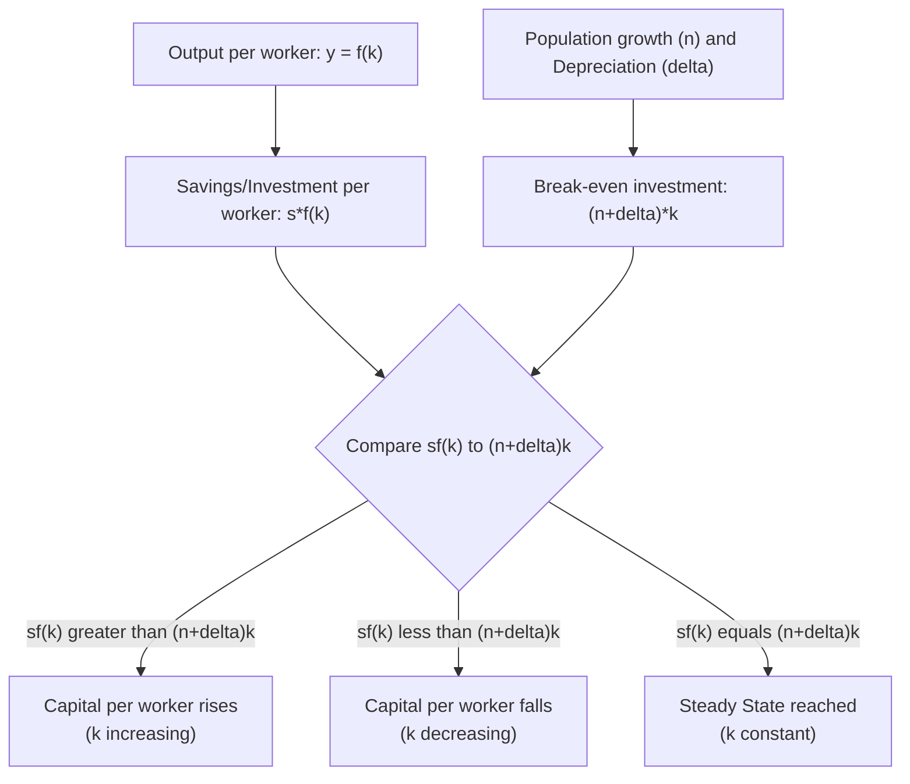

## The Solow-Swan Growth Model

### Definition and Core Concept

The Solow-Swan model (developed independently by Robert Solow and Trevor Swan in 1956) is the foundational neoclassical framework for analyzing long-run economic growth. It explains how capital accumulation, labor force growth, and technological progress interact to determine an economy's growth path, and — critically — demonstrates why capital accumulation alone cannot sustain permanent growth in output per capita.

**Key Points**

- The model treats technological progress as **exogenous** (determined outside the model), which is its most significant theoretical limitation and the primary motivation for the later development of endogenous growth theory
- Its central conclusion is that economies converge to a **steady state** in which capital per worker and output per worker stop growing, absent ongoing exogenous technological progress

### Model Setup and Assumptions

#### The Production Function

The model begins with an aggregate production function exhibiting constant returns to scale in capital and labor:

$$Y = F(K, L)$$

Expressed in **intensive (per-worker) form**, dividing through by $L$:

$$y = f(k)$$

Where $y = Y/L$ (output per worker) and $k = K/L$ (capital per worker). The production function is assumed to satisfy the **Inada conditions**:

$$f'(k) > 0, \quad f''(k) < 0, \quad \lim_{k \to 0} f'(k) = \infty, \quad \lim_{k \to \infty} f'(k) = 0$$

These conditions formalize **diminishing marginal returns to capital**: each additional unit of capital per worker raises output per worker, but by a progressively smaller amount.

#### Key Behavioral Assumptions

1. A constant fraction $s$ of output is saved and invested each period (the saving rate)
2. The labor force grows at a constant exogenous rate $n$
3. Capital depreciates at a constant rate $\delta$
4. (In the extended version) Technology $A$ grows at a constant exogenous rate $g$, and labor-augmenting technology enters the production function as $Y = F(K, AL)$

### The Fundamental Equation of the Solow Model

The change in capital per worker over time is determined by the difference between investment per worker and the amount of capital needed to equip new workers and replace depreciated capital:

$$\dot{k} = sf(k) - (n+\delta)k$$

Where:

- $sf(k)$ = actual investment per worker (savings become investment in this closed-economy framework)
- $(n+\delta)k$ = "break-even investment" — the investment required merely to keep capital per worker constant, given population growth ($n$) diluting the existing capital stock and depreciation ($\delta$) eroding it

### The Steady State

The **steady state** ($k^*$) is the level of capital per worker at which investment per worker exactly equals break-even investment, so capital per worker (and hence output per worker) remains constant over time:

$$sf(k^*) = (n+\delta)k^*$$

**Key Points**

- At the steady state, $\dot{k} = 0$: capital per worker is unchanging
- Since $y^* = f(k^*)$ is also constant at the steady state, **output per worker growth ceases entirely** in the basic model without technological progress
- Aggregate output $Y = y \cdot L$ can still grow in the steady state — but only at the rate of population/labor force growth $n$, meaning **per-capita** output growth is exactly zero in the steady state
- The steady state is **globally stable**: regardless of the initial level of $k$, the economy converges to $k^*$ over time, because $f(k)$ is concave (diminishing returns) while $(n+\delta)k$ is linear, guaranteeing they intersect exactly once at a stable equilibrium

### Diagrammatic Representation of the Steady State

<svg xmlns="http://www.w3.org/2000/svg" viewBox="0 0 700 420" font-family="Arial, sans-serif">
<text x="350" y="24" text-anchor="middle" font-size="16" font-weight="bold">Solow Model: Steady State Determination (svg_diagram)</text>
<line x1="70" y1="360" x2="650" y2="360" stroke="black" stroke-width="2" />
<line x1="70" y1="360" x2="70" y2="60" stroke="black" stroke-width="2" />
<text x="360" y="388" text-anchor="middle" font-size="12">Capital per worker (k)</text>
<text x="30" y="200" font-size="12" transform="rotate(-90 30 200)">Investment per worker</text>

<path d="M 70 360 Q 250 130 620 90" stroke="#1f77b4" stroke-width="2.5" fill="none" />
<text x="500" y="115" font-size="12" fill="#1f77b4" font-weight="bold">s * f(k) (actual investment)</text>

<line x1="70" y1="360" x2="620" y2="120" stroke="#d62728" stroke-width="2.5" />
<text x="500" y="175" font-size="12" fill="#d62728" font-weight="bold">(n + delta) * k (break-even investment)</text>

<circle cx="400" cy="185" r="5" fill="black" />
<line x1="400" y1="185" x2="400" y2="360" stroke="#555" stroke-dasharray="4,3" />
<line x1="70" y1="185" x2="400" y2="185" stroke="#555" stroke-dasharray="4,3" />
<text x="400" y="378" text-anchor="middle" font-size="12" font-weight="bold">k*</text>
<text x="40" y="189" font-size="11" text-anchor="end">i*</text>

<text x="200" y="330" font-size="11" fill="`#2ca02c`">sf(k) greater than break-even: k rising</text>

<text x="490" y="80" font-size="11" fill="`#7f0000`">sf(k) less than break-even: k falling</text>

</svg>

### Comparative Statics: Effects of Parameter Changes

| Parameter Change | Effect on Steady-State $k^*$ and $y^*$ | Effect on Growth Rate of Output Per Worker (Long Run) |
| --- | --- | --- |
| **Increase in saving rate ($s$)** | Raises $k^*$ and $y^*$ (shifts $sf(k)$ curve up) | Temporary increase in growth during transition; no effect on long-run steady-state growth rate |
| **Increase in population growth rate ($n$)** | Lowers $k^*$ and $y^*$ (steepens the break-even line) | No long-run effect on per-capita growth rate, but lowers the steady-state *level* of output per worker |
| **Increase in depreciation rate ($\delta$)** | Lowers $k^*$ and $y^*$ (steepens the break-even line) | No long-run effect on per-capita growth rate, but lowers the steady-state level |
| **Introduction of technological progress ($g > 0$)** | Steady state redefined in terms of "effective labor" ($k = K/AL$); output per worker grows at rate $g$ in the steady state | The only parameter that permanently raises the long-run per-capita output growth rate |

**Key Points**

- A striking and often counterintuitive implication of the model: **a permanent increase in the saving rate raises the level of steady-state output per worker, but does not raise the long-run growth rate of output per worker** — it produces only a temporary period of faster growth during the transition to the new, higher steady state
- This is one of the model's central and most frequently tested conclusions: **only technological progress can generate a sustained increase in the long-run growth rate of output per capita**

### Incorporating Technological Progress

To generate ongoing per-capita growth, the model is extended to include **labor-augmenting (Harrod-neutral) technological progress**, where technology $A$ grows at exogenous rate $g$:

$$Y = F(K, AL)$$

Redefining variables in terms of "effective labor" ($AL$): $\tilde{k} = K/(AL)$ and $\tilde{y} = Y/(AL)$, the fundamental equation becomes:

$$\dot{\tilde{k}} = sf(\tilde{k}) - (n+g+\delta)\tilde{k}$$

In this extended model:

- The steady state now has $\tilde{k}$ (capital per effective worker) constant
- Output **per worker** ($y = Y/L$) grows at rate $g$ in the steady state
- Total output ($Y$) grows at rate $n + g$ in the steady state

This is the model's key resolution: exogenous technological progress is the sole source of sustained growth in output *per worker* in the long run.

### The Golden Rule Savings Rate

**Key Points**

- The **Golden Rule** level of capital accumulation, $k_{gold}^*$, is the level of steady-state capital per worker that **maximizes steady-state consumption per worker**, rather than output per worker
- The Golden Rule condition is found where the marginal product of capital equals the effective depreciation rate:

$$f'(k_{gold}^*) = n + g + \delta$$

- If an economy's actual capital stock exceeds $k_{gold}^*$ (a situation called **dynamic inefficiency**), a lower saving rate would raise steady-state consumption for every generation, representing a genuine Pareto improvement
- If the economy is below $k_{gold}^*$ (the more empirically common case), reaching the Golden Rule level requires a *higher* saving rate, but this necessarily requires the current generation to accept a lower level of consumption during the transition, so it is a *tradeoff*, not a costless Pareto improvement [Inference — the empirical consensus generally finds most real-world economies below their estimated Golden Rule capital stock, though precise estimates depend on assumptions about the production function and are not universally agreed upon]

### Convergence Predictions

**Key Points**

- The model predicts **conditional convergence**: economies with the same steady-state determinants ($s$, $n$, $\delta$, $g$, and the production function) will converge to the *same* level of output per effective worker, regardless of their initial capital stock
- Countries starting further below their own steady state grow faster in the transition (because diminishing returns imply a higher marginal product of capital, and hence higher return to investment, when capital is scarce), a mechanism called the **transition dynamics** of the model
- Unconditional convergence (all countries converging to the *same* level of income regardless of their individual saving rates, population growth rates, and technology) is a much stronger and empirically far less well-supported prediction, since it requires countries to share similar steady-state parameters, which they generally do not [Inference — the distinction between conditional and unconditional convergence, and the relatively stronger empirical support for the former, is a well-established finding in the cross-country growth empirics literature]

### Limitations of the Solow-Swan Model

1. **Exogenous technology**: The model does not explain *why* or *how* technological progress occurs — it is simply assumed at a constant exogenous rate, sidestepping the economically interesting question of what drives innovation. This is the primary motivation for endogenous growth theory (Romer, Lucas models)
2. **No role for policy in affecting long-run growth rates**: Because only $g$ (exogenous technology growth) affects the long-run per-capita growth rate, the model implies that fiscal, savings, or education policy can only affect the *level* of output per worker, not the long-run growth *rate* — a conclusion many economists find unsatisfying given real-world policy debates over growth-enhancing reforms
3. **Constant, exogenous saving rate**: The basic model assumes a fixed saving rate rather than deriving it from optimizing household behavior (this limitation is addressed in the **Ramsey-Cass-Koopmans model**, which endogenizes the saving rate via intertemporal utility maximization)
4. **No explicit treatment of human capital** in the original formulation (later addressed in augmented versions, such as the Mankiw-Romer-Weil model, which adds human capital as a third factor of production)
5. **Assumes a closed economy** in its basic form, abstracting from international capital flows and trade effects on capital accumulation

### Comparative Summary: Solow Model vs. Endogenous Growth Theory

| Feature | Solow-Swan Model | Endogenous Growth Theory |
| --- | --- | --- |
| **Source of technological progress** | Exogenous (unexplained) | Endogenous (result of purposeful R&D/human capital investment decisions) |
| **Long-run effect of saving rate on growth rate** | None (affects level only) | Can affect the long-run growth rate, depending on model specification |
| **Returns to capital (broadly defined)** | Diminishing | Can be constant or increasing at the aggregate level (due to spillovers), avoiding forced convergence to a no-growth steady state |
| **Role for growth policy** | Limited to affecting the transitional path and steady-state level | Can permanently affect the long-run growth rate |
| **Convergence prediction** | Conditional convergence | Convergence not necessarily predicted; persistent growth-rate differences possible |

### Common Misconceptions

- The Solow model does not predict that economies stop growing altogether in absolute terms; it predicts that *output per worker* growth ceases in the steady state absent technological progress, while total output can still grow at the rate of population growth
- A higher saving rate is not, according to the model, a source of *permanently* higher growth; it raises the steady-state *level* of output per worker and produces only *temporary* faster growth during the transition period — a frequently misunderstood distinction
- The Golden Rule savings rate is not the rate that maximizes output per worker; it is the rate that maximizes steady-state *consumption* per worker, which generally requires a lower saving rate than the one that would maximize output alone
- Conditional convergence does not imply that all countries' income levels will converge to be equal; it implies convergence *conditional on* similar underlying structural parameters (saving rates, population growth, technology), which differ substantially across countries in practice

### Conclusion

The Solow-Swan growth model provides the foundational neoclassical framework for understanding how capital accumulation, labor force growth, and technological progress jointly determine an economy's long-run growth path. Its central and most influential result is that, because of diminishing marginal returns to capital, an economy converges to a steady state in which capital and output per worker cease to grow — meaning capital accumulation alone can only produce transitional, not permanent, per-capita growth. Only exogenous technological progress can generate sustained long-run growth in output per worker in this framework, a conclusion that highlighted the theoretical gap later filled by endogenous growth theory, which seeks to explain technological progress itself as an economic outcome rather than an exogenous assumption.

**Related Topics**

- Sources of Long-Run Economic Growth
- Endogenous Growth Theory (Romer and Lucas Models)
- The Golden Rule of Capital Accumulation and Dynamic Efficiency
- Conditional versus Unconditional Convergence
- The Ramsey-Cass-Koopmans Model (Endogenizing the Saving Rate)
- The Mankiw-Romer-Weil Model (Augmented Solow with Human Capital)
- Growth Accounting and the Solow Residual
- Transition Dynamics and Speed of Convergence
- Dynamic Inefficiency and Overaccumulation of Capital
- Technology, Institutions, and Cross-Country Income Differences