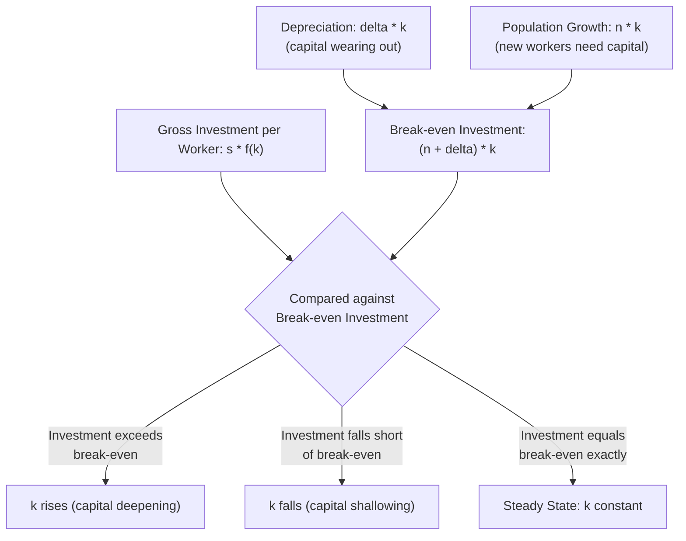

## Capital Accumulation, Depreciation, and the Steady State

### Definition and Core Concept

This topic examines the specific dynamic process by which an economy's capital stock evolves over time under the neoclassical growth framework, and how the interaction between investment, depreciation, and (where relevant) population growth determines the long-run equilibrium level of capital per worker — the **steady state**. This is the mechanical core of the Solow-Swan growth model, isolated here for detailed treatment.

### The Capital Accumulation Identity

At the aggregate level, the capital stock evolves according to:

$$K_{t+1} = K_t + I_t - \delta K_t$$

Or, expressed as the change in the capital stock:

$$\Delta K_t = I_t - \delta K_t$$

Where $I_t$ is gross investment in period $t$ and $\delta$ is the depreciation rate (the fraction of the capital stock that wears out or becomes obsolete each period). In the closed-economy neoclassical framework with no government or foreign sector, aggregate saving equals aggregate investment:

$$I_t = S_t = sY_t$$

Where $s$ is the (constant) saving rate and $Y_t$ is aggregate output.

### Per-Worker (Intensive Form) Representation

To analyze capital *per worker* ($k = K/L$) rather than the aggregate capital stock, the labor force is assumed to grow at constant rate $n$:

$$L_{t+1} = (1+n)L_t$$

Differentiating $k = K/L$ with respect to time and substituting the capital accumulation identity yields the **fundamental equation of the Solow model**:

$$\dot{k} = sf(k) - (n+\delta)k$$

This single equation is the analytical core of capital dynamics in the neoclassical growth model. Each term has a precise economic interpretation:

| Term | Interpretation |
| --- | --- |
| $sf(k)$ | Actual investment per worker — the portion of output per worker that is saved and invested |
| $\delta k$ | Depreciation per worker — capital per worker lost to wear, obsolescence, or destruction |
| $nk$ | "Capital widening" requirement — the investment per worker needed just to equip new workers entering the labor force with the same amount of capital as existing workers, so that capital per worker does not fall purely due to population growth |
| $(n+\delta)k$ | **Break-even investment** — the total investment per worker required merely to hold $k$ constant |

### The Depreciation and Capital-Widening Mechanism Explained

**Key Points**

- Depreciation ($\delta k$) reduces the existing capital stock per worker regardless of population growth — it reflects the physical wearing out or economic obsolescence of capital goods over time
- Population growth ($nk$) does not destroy capital, but it *dilutes* capital per worker unless new investment is sufficient to equip the growing labor force at the same capital intensity as existing workers — this is why $n$ enters the break-even investment term
- Both terms act as "drags" on capital per worker that must be continuously overcome by new investment merely to prevent $k$ from falling, let alone to raise it

### Defining and Solving for the Steady State

The **steady state**, denoted $k^*$, is defined as the level of capital per worker at which $\dot{k} = 0$:

$$sf(k^*) = (n+\delta)k^*$$

At this point, investment per worker exactly offsets depreciation and capital-widening needs, so capital per worker (and consequently output per worker $y^* = f(k^*)$) remains constant indefinitely, absent any change in $s$, $n$, $\delta$, or the production function itself.

#### Worked Numerical Example

**Example**

Assume a Cobb-Douglas production function $y = k^{0.5}$ (i.e., $\alpha = 0.5$), a saving rate $s = 0.2$, a population growth rate $n = 0.02$, and a depreciation rate $\delta = 0.08$.

Setting $sf(k^*) = (n+\delta)k^*$:

$$0.2 \cdot (k^*)^{0.5} = (0.02+0.08)k^*$$

$$0.2 (k^*)^{0.5} = 0.10 \, k^*$$

Dividing both sides by $(k^*)^{0.5}$:

$$0.2 = 0.10 (k^*)^{0.5}$$

$$(k^*)^{0.5} = 2$$

$$k^* = 4$$

Steady-state output per worker is therefore $y^* = (4)^{0.5} = 2$, and steady-state consumption per worker is $c^* = (1-s)y^* = 0.8 \times 2 = 1.6$.

### Convergence Dynamics: Approaching the Steady State

**Key Points**

- If the initial capital stock $k_0 < k^*$, then $sf(k_0) > (n+\delta)k_0$ (because $f(k)$ is concave while $(n+\delta)k$ is linear, actual investment exceeds break-even investment below $k^*$), so $\dot{k} > 0$ and capital per worker rises toward $k^*$
- If $k_0 > k^*$, then $sf(k_0) < (n+\delta)k_0$, so $\dot{k} < 0$ and capital per worker falls toward $k^*$
- The rate of convergence slows as the economy approaches $k^*$, because the gap between $sf(k)$ and $(n+\delta)k$ narrows — this produces the characteristic **diminishing growth rate during transition**, a pattern consistent with the empirical observation that capital-scarce economies tend to grow faster (conditional convergence)
- The steady state is therefore **globally stable**: starting from any positive initial capital stock, the economy converges monotonically to $k^*$

### Diagrammatic Representation of Convergence Paths

<svg xmlns="http://www.w3.org/2000/svg" viewBox="0 0 700 400" font-family="Arial, sans-serif">
<text x="350" y="24" text-anchor="middle" font-size="16" font-weight="bold">Convergence of Capital per Worker to the Steady State (svg_diagram)</text>
<line x1="70" y1="340" x2="650" y2="340" stroke="black" stroke-width="2" />
<line x1="70" y1="340" x2="70" y2="60" stroke="black" stroke-width="2" />
<text x="360" y="368" text-anchor="middle" font-size="12">Time</text>
<text x="30" y="200" font-size="12" transform="rotate(-90 30 200)">Capital per Worker (k)</text>

<line x1="70" y1="180" x2="650" y2="180" stroke="#555" stroke-width="1.5" stroke-dasharray="5,3" />
<text x="600" y="172" font-size="11" fill="#555">k*</text>

<path d="M 90 300 Q 200 220 350 190 Q 450 182 620 180" stroke="#2ca02c" stroke-width="2.5" fill="none" />
<text x="140" y="290" font-size="11" fill="#2ca02c" font-weight="bold">Starting below k*: rises toward k*</text>

<path d="M 90 80 Q 200 130 350 170 Q 450 178 620 180" stroke="#d62728" stroke-width="2.5" fill="none" />
<text x="140" y="75" font-size="11" fill="#d62728" font-weight="bold">Starting above k*: falls toward k*</text>
</svg>

### Effect of a Change in the Saving Rate on the Steady State

An increase in the saving rate from $s_1$ to $s_2$ shifts the $sf(k)$ curve upward, generating a new, higher steady state $k^{**} > k^*$:

**Key Points**

- Immediately after the increase in $s$, actual investment exceeds break-even investment at the old steady state $k^*$, so $k$ begins rising
- Output per worker rises during the transition, but growth decelerates as $k$ approaches the new steady state $k^{**}$
- Once the new steady state is reached, output per worker growth returns to zero (in the basic model without technological progress) — confirming that a permanent increase in $s$ raises the steady-state *level* of $k$ and $y$, but not the long-run growth *rate*
- This transition dynamic is the primary channel through which changes in saving/investment policy affect an economy in the neoclassical framework — a temporary growth acceleration, not a permanent one

### Effect of Depreciation and Population Growth Rate Changes

| Change | Effect on Break-Even Line | Effect on $k^*$ | Effect on $y^*$ |
| --- | --- | --- | --- |
| **Higher $\delta$** | Steepens (pivots up) | Falls | Falls |
| **Lower $\delta$** | Flattens (pivots down) | Rises | Rises |
| **Higher $n$** | Steepens (pivots up) | Falls | Falls |
| **Lower $n$** | Flattens (pivots down) | Rises | Rises |

**Key Points**

- Higher depreciation and higher population growth both act analogously in this model: each raises the amount of investment required simply to maintain a given level of capital per worker, so higher values of either parameter are associated with a *lower* steady-state capital and output per worker
- This provides a standard theoretical explanation (within this framework) for why, all else equal, countries with higher population growth rates tend to have lower steady-state income per worker — though [Inference] this is a *ceteris paribus* theoretical prediction, and real-world cross-country income differences are also strongly influenced by TFP and institutional factors not captured in this simplified capital-accumulation-only analysis

### Incorporating Technological Progress into the Framework

When labor-augmenting technology $A$ (growing at exogenous rate $g$) is introduced, the relevant capital variable becomes capital per **effective worker**, $\tilde{k} = K/(AL)$, and the fundamental equation is modified to:

$$\dot{\tilde{k}} = sf(\tilde{k}) - (n+g+\delta)\tilde{k}$$

The break-even investment term now includes $g$ alongside $n$ and $\delta$, since maintaining a constant $\tilde{k}$ requires investment sufficient to keep pace with the effective labor force, which grows at rate $n+g$ (population growth plus technology-driven effective labor growth), in addition to offsetting depreciation.

**Key Points**

- In the steady state of this extended model, $\tilde{k}$ is constant, but actual capital per worker $k = K/L$ grows at rate $g$, and output per worker $y = Y/L$ also grows at rate $g$
- This resolves the "no permanent per-capita growth" outcome of the basic model: sustained growth in capital and output per worker in the long run is possible, but only insofar as it is driven by ongoing technological progress, not by capital accumulation itself

### Golden Rule Level of Capital Accumulation

The steady-state level of $k^*$ that maximizes steady-state **consumption per worker** (rather than output per worker) satisfies:

$$f'(k_{gold}^*) = n + g + \delta$$

That is, the marginal product of capital at the Golden Rule level equals the effective break-even rate (population growth, technology growth, and depreciation combined). This is derived by maximizing $c^* = f(k^*) - (n+g+\delta)k^*$ with respect to $k^*$, yielding the first-order condition above.

**Key Points**

- If the actual saving rate produces a steady state with $k^* > k_{gold}^*$, the economy is **dynamically inefficient**, and a *reduction* in the saving rate would raise consumption per worker in every future period — a rare case of a costless Pareto improvement
- If $k^* < k_{gold}^*$ (empirically more common), reaching the Golden Rule requires additional saving, which necessarily reduces consumption during the transition even though it raises consumption once the new steady state is reached — a genuine intertemporal tradeoff, not a free improvement

### Common Misconceptions

- Depreciation and population growth are often conflated, but they operate through distinct mechanisms: depreciation destroys existing capital, whereas population growth dilutes capital per worker by increasing the denominator ($L$) without directly affecting the capital stock ($K$) itself
- Reaching the steady state does not mean the economy stops growing in absolute terms; aggregate output ($Y$) continues to grow at rate $n$ (or $n+g$ with technological progress), even though output *per worker* is constant (or grows only at rate $g$)
- A higher saving rate is not unambiguously "better" from a welfare perspective; if it pushes capital accumulation beyond the Golden Rule level, it can reduce steady-state consumption per worker, even though it raises steady-state output per worker
- The steady state is a long-run theoretical equilibrium concept, not a claim that any specific real-world economy is currently at its steady state; actual economies are generally understood to be in ongoing transition toward their steady state, which is itself a moving target if underlying parameters ($s$, $n$, $\delta$, $g$) change over time [Inference]

### Conclusion

The dynamics of capital accumulation, depreciation, and population growth jointly determine the steady-state level of capital and output per worker in the neoclassical growth framework, formalized in the fundamental equation $\dot{k} = sf(k) - (n+\delta)k$. The steady state — where investment exactly offsets depreciation and capital-widening needs — is a globally stable equilibrium that the economy approaches regardless of its starting point, with the speed of convergence slowing as the gap between actual and break-even investment narrows. While changes in the saving rate, depreciation rate, or population growth rate shift the steady-state *level* of capital and output per worker, only the introduction of ongoing technological progress can generate a sustained increase in the long-run *growth rate* of output per worker, a distinction central to interpreting the policy implications of this framework.

**Related Topics**

- The Solow-Swan Growth Model
- Sources of Long-Run Economic Growth
- The Golden Rule of Capital Accumulation and Dynamic Efficiency
- Conditional Convergence and Transition Dynamics
- Technological Progress in the Augmented Solow Model
- Growth Accounting and the Solow Residual
- The Ramsey-Cass-Koopmans Model (Endogenous Saving)
- Dynamic Inefficiency and Overaccumulation of Capital
- Effects of Population Growth on Per-Capita Income
- Cross-Country Differences in Saving Rates and Income Levels