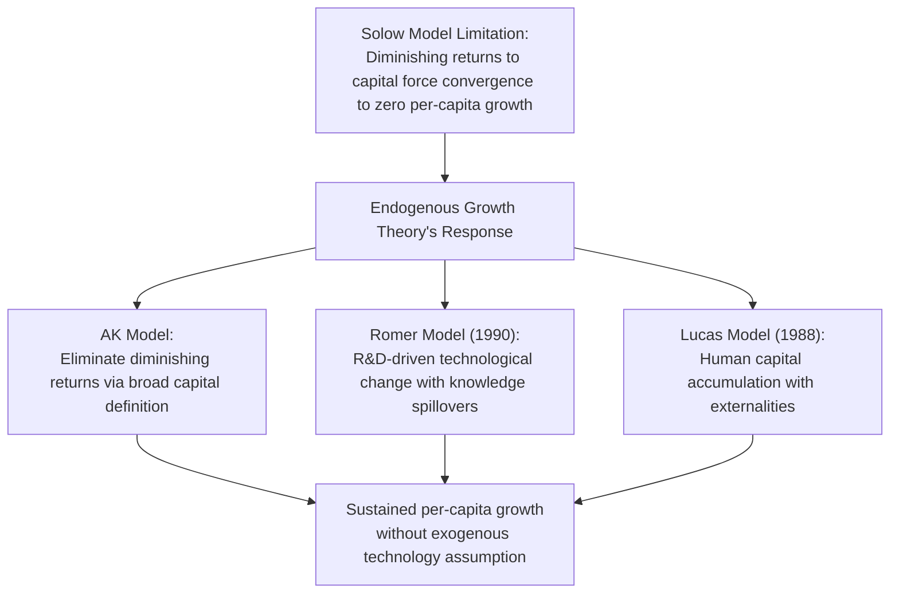
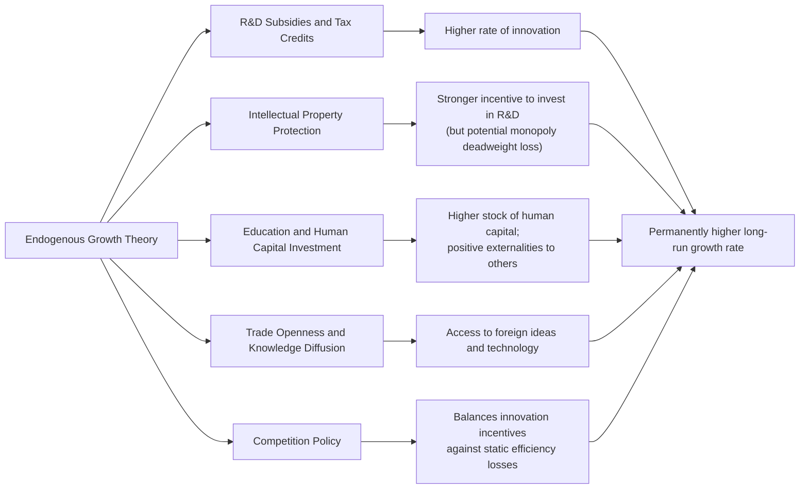

## Endogenous Growth Theory

### Definition and Core Concept

Endogenous growth theory is a body of macroeconomic growth models developed primarily in the 1980s that model technological progress and productivity growth as outcomes of purposeful economic decisions — R&D investment, human capital accumulation, and innovation driven by profit incentives — rather than as an exogenous, unexplained rate of change as in the Solow-Swan model.

**Key Points**

- The theory's central motivation is to address the Solow model's key limitation: its inability to explain *why* technological progress occurs or *how* policy might influence the long-run growth rate, since the Solow model simply assumes $g$ as an exogenous constant
- The foundational contributions are generally attributed to Paul Romer (1986, 1990) and Robert Lucas (1988), building on earlier insights from Kenneth Arrow's work on learning-by-doing
- The theory's central implication: because knowledge and human capital can generate spillovers that offset diminishing returns to capital at the aggregate level, well-designed policy can affect not just the *level* but the long-run *growth rate* of output — a sharp departure from the Solow model's conclusions

### Why the Solow Model Needed an Alternative

Recall the Solow model's core mechanism: diminishing marginal returns to capital ($f''(k) < 0$) force the economy to converge to a steady state with zero per-capita growth, absent exogenous technological progress. Endogenous growth theory's foundational strategy is to construct models in which this diminishing-returns force is offset or eliminated at the aggregate level, permitting sustained per-capita growth driven entirely by internal (endogenous) economic mechanisms.

### The AK Model: The Simplest Endogenous Growth Framework

#### Setup

The simplest endogenous growth model replaces the standard neoclassical production function with a linear form:

$$Y = AK$$

Where $K$ is broadly defined to include not just physical capital but also human capital and knowledge, and $A$ is a constant reflecting the (constant) marginal product of this broad capital measure.

#### Key Departure from Solow

**Key Points**

- Because $Y = AK$ is linear in $K$, the marginal product of capital is constant ($\partial Y/\partial K = A$), rather than diminishing as in $Y = AK^{\alpha}L^{1-\alpha}$ with $\alpha < 1$
- This eliminates the mechanism that forces the Solow model toward a zero-growth steady state, since there is no longer a point at which further capital accumulation yields negligible extra output

#### Growth Rate Derivation

With the standard capital accumulation identity $\dot{K} = sY - \delta K$, substituting $Y = AK$:

$$\dot{K} = sAK - \delta K$$

Dividing through by $K$, the growth rate of capital — and, since $Y = AK$, the growth rate of output — is:

$$g_Y = g_K = sA - \delta$$

**Key Points**

- Unlike in the Solow model, the long-run growth rate here is a positive, constant function of the saving rate $s$: **a permanent increase in $s$ permanently raises the long-run growth rate**, not merely the level of output
- This is the AK model's central and most policy-relevant departure from Solow: saving/investment policy has *permanent* growth effects, not merely *transitional* level effects
- The AK model is a highly simplified, reduced-form framework; its main pedagogical value is illustrating *how* eliminating diminishing returns generates sustained endogenous growth, rather than serving as a fully microfounded description of the innovation process (that role is filled by the Romer and Lucas models below)

### The Romer Model: R&D-Driven Technological Change

#### Core Idea

Paul Romer's 1990 model treats technology explicitly as the accumulated stock of "ideas" or "designs," produced by a dedicated research sector, and formalizes the crucial property that ideas are **non-rival**.

#### Non-Rivalry and Partial Excludability

**Key Points**

- **Non-rivalry**: Unlike physical capital or labor, an idea or blueprint can be used by many firms simultaneously without being "used up" — one firm's use of a production technique does not prevent another firm from using the same technique
- **Partial excludability**: Ideas can be partially protected from imitation through patents, trade secrets, or first-mover advantages, but this protection is imperfect and temporary, allowing some diffusion of knowledge (spillovers) to the broader economy
- This combination of non-rivalry and partial excludability is the theoretical foundation for why investment in knowledge production (R&D) can generate persistent growth: the stock of usable ideas in the economy is not depleted by use, and can be built upon cumulatively by successive innovators

#### Model Structure

The Romer model divides the economy into three sectors:

1. **Final goods sector**: Competitive firms produce output using labor, capital, and a range of specialized intermediate capital goods (each embodying a distinct "idea")
2. **Intermediate goods sector**: Monopolistically competitive firms, each holding a patent on a specific design, produce and sell capital goods, earning monopoly profits that finance and reward R&D
3. **Research sector**: Uses skilled labor (human capital) to produce new designs/ideas, with productivity in this sector depending on the *existing stock* of ideas (knowledge spillovers) — more existing knowledge makes it easier to discover new knowledge

The rate of new idea production is typically modeled as:

$$\dot{A} = \delta H_A A$$

Where $H_A$ is human capital devoted to research and $A$ is the existing stock of knowledge, capturing the "standing on the shoulders of giants" spillover effect: each researcher's productivity is enhanced by the accumulated stock of prior discoveries.

**Key Points**

- A central implication of the Romer model: **the long-run growth rate of the economy depends on the amount of human capital devoted to research**, meaning policies that raise the supply of researchers (education policy, immigration of skilled workers) or that improve R&D incentives (patent protection, tax credits) can permanently raise the growth rate
- The model also implies a **scale effect** — larger economies (with more researchers) should grow faster, a prediction that has been empirically contested and led to subsequent "second-generation" endogenous growth models designed to eliminate scale effects while preserving the core R&D mechanism [Inference — this scale-effect critique and the resulting model refinements are a well-documented episode in the growth theory literature, associated particularly with the work of Jones (1995) and others]

### The Lucas Model: Human Capital Accumulation

#### Core Idea

Robert Lucas's 1988 model locates the source of sustained growth in human capital accumulation rather than R&D-driven technology, formalizing education and skill-building as an investment process analogous to physical capital accumulation, but with an important externality.

#### Model Structure

Individuals split their time between working (using their current human capital) and studying (accumulating more human capital):

$$\dot{h} = h \cdot \delta \cdot (1-u)$$

Where $h$ is an individual's human capital, $u$ is the fraction of time spent working, and $(1-u)$ is the fraction of time spent accumulating human capital.

#### The Human Capital Externality

**Key Points**

- The model's crucial growth-sustaining feature is an **externality**: aggregate output depends not only on each individual's own human capital, but also on the *average* level of human capital in the economy (an external effect representing knowledge spillovers, network effects of a skilled workforce, and social learning)
- This externality means that private incentives to invest in education may be insufficient relative to the socially optimal level, since individuals do not fully internalize the positive spillover their own human capital investment confers on others — a standard rationale in this literature for public subsidization of education
- Because human capital accumulation, like the Romer model's knowledge stock, does not face the same diminishing-returns constraint as physical capital alone, sustained per-capita output growth is possible without relying on any assumption of exogenous technological progress

### Comparative Summary: The Three Core Endogenous Growth Frameworks

| Model | Source of Sustained Growth | Mechanism for Avoiding Diminishing Returns | Key Policy Implication |
| --- | --- | --- | --- |
| **AK Model** | Broadly defined capital accumulation | Constant (not diminishing) marginal product of capital by assumption | Saving/investment rate has permanent growth effects |
| **Romer Model (1990)** | R&D-driven technological change | Non-rivalry of ideas; knowledge spillovers raise research productivity | R&D subsidies, patent policy, and researcher supply affect long-run growth rate |
| **Lucas Model (1988)** | Human capital accumulation | Externality: aggregate human capital raises everyone's productivity | Education subsidies and human capital investment affect long-run growth rate |

### Policy Implications of Endogenous Growth Theory

**Key Points**

- Because knowledge and human capital generate positive externalities that private markets do not fully capture, most endogenous growth models imply that **market outcomes under-invest in R&D and education relative to the social optimum**, providing a standard theoretical justification for government subsidization of both activities
- Intellectual property protection (patents) creates a tension: stronger protection raises the private return to innovation (encouraging more R&D), but also creates temporary monopoly power and higher prices, generating a static efficiency loss — this tradeoff is a recurring theme in optimal patent design within this literature
- Trade openness and international integration are often highlighted in this literature as growth-enhancing channels, since they allow a country to access and build upon the global stock of ideas rather than relying solely on domestically generated knowledge

### Diagrammatic Comparison: Solow vs. Endogenous Growth Predictions

<svg viewBox="0 0 700 380" xmlns="http://www.w3.org/2000/svg" font-family="Arial, sans-serif">
<text x="350" y="24" text-anchor="middle" font-size="16" font-weight="bold">Effect of a Permanent Rise in Saving/R&D Investment (svg_diagram)</text>
<line x1="70" y1="330" x2="650" y2="330" stroke="black" stroke-width="2"/>
<line x1="70" y1="330" x2="70" y2="60" stroke="black" stroke-width="2"/>
<text x="360" y="358" text-anchor="middle" font-size="12">Time</text>
<text x="30" y="195" font-size="12" transform="rotate(-90 30 195)">Log Output per Worker</text>
<!-- Pre-change baseline -->
<line x1="90" y1="300" x2="250" y2="240" stroke="black" stroke-width="2.5"/>
<!-- Change point marker -->
<line x1="250" y1="330" x2="250" y2="60" stroke="#888" stroke-dasharray="3,3"/>
<text x="250" y="55" text-anchor="middle" font-size="10" fill="#888">Policy change occurs</text>
<!-- Solow: temporary growth boost, converges to parallel (same slope as before) -->
<path d="M 250 240 Q 350 190 450 175 L 640 155" stroke="#1f77b4" stroke-width="2.5" fill="none"/>
<text x="470" y="145" font-size="11" fill="#1f77b4" font-weight="bold">Solow: level shift, growth rate returns to original slope</text>
<!-- Endogenous growth: permanently steeper slope -->
<path d="M 250 240 L 640 60" stroke="#2ca02c" stroke-width="2.5" fill="none" stroke-dasharray="6,3"/>
<text x="460" y="80" font-size="11" fill="#2ca02c" font-weight="bold">Endogenous growth: permanently steeper growth path</text>
</svg>

### Empirical Assessment and Critiques

**Key Points**

- Direct empirical testing of endogenous growth models is challenging because the key theoretical variables (spillovers, the externality from average human capital, the exact production function for ideas) are difficult to measure precisely
- The **scale effects** prediction of early Romer-style models (larger economies/populations should grow faster) was found to be inconsistent with the observed lack of a strong positive relationship between country size and long-run per-capita growth rates historically, prompting the development of "semi-endogenous" growth models (e.g., Jones, 1995) that preserve R&D-driven growth mechanisms while removing the scale-effect prediction [Inference — this critique and subsequent model refinement is a well-documented development within the endogenous growth literature]
- Empirical support for a positive relationship between measures of R&D investment, human capital, and long-run growth is generally found in cross-country data, but isolating the *causal* endogenous-growth mechanism (versus reverse causality, where richer countries simply invest more in R&D and education) remains methodologically difficult [Inference]
- Unlike the Solow model's growth accounting exercise, which is relatively mechanical and widely agreed upon, structural estimation of endogenous growth models is less standardized and more sensitive to specific modeling choices, meaning quantitative conclusions vary more across studies

### Common Misconceptions

- Endogenous growth theory does not claim that *any* increase in saving or investment automatically produces permanent growth acceleration — this specific result is a feature of stylized models like the AK model with a constant marginal product of capital; more realistic endogenous growth models (Romer, Lucas) tie sustained growth specifically to R&D or human capital investment, not to physical capital accumulation in general
- The theory does not argue that the Solow model is simply "wrong" — the Solow model remains the standard framework for growth accounting and analyzing the levels effects of policy; endogenous growth theory instead addresses a different question (what determines the long-run growth *rate* itself) that the Solow model, by construction, leaves unanswered
- "Endogenous" in this context specifically means technological progress and its underlying determinants are explained *within* the economic model as a response to incentives, not that growth is somehow automatic or guaranteed by any specific policy
- The scale-effects critique does not invalidate the entire endogenous growth research program; it prompted refinement of specific model formulations (semi-endogenous growth models) rather than abandonment of the core insight that R&D and human capital investment matter for long-run growth

### Conclusion

Endogenous growth theory addresses the central unexplained element of the Solow-Swan model — the source of technological progress — by modeling innovation and human capital accumulation as outcomes of purposeful economic decisions responding to profit incentives, patent protection, and education investment. Through mechanisms such as the non-rivalry of ideas (Romer) and human capital externalities (Lucas), these models generate sustained per-capita growth without relying on an exogenously assumed technology growth rate, implying — in contrast to the Solow model — that policies affecting R&D investment, intellectual property protection, and education can permanently influence an economy's long-run growth rate, not merely the level of output. While empirical testing of these specific mechanisms remains methodologically challenging, and early scale-effects predictions required subsequent model refinement, the core theoretical insight that knowledge and human capital investment are central, policy-responsive drivers of long-run growth has become a foundational element of modern growth economics.

**Related Topics**

- The Solow-Swan Growth Model
- Sources of Long-Run Economic Growth
- The Romer Model and Non-Rivalry of Ideas
- The Lucas Model and Human Capital Externalities
- Semi-Endogenous Growth Models and the Scale Effects Critique
- Intellectual Property Protection and Optimal Patent Design
- R&D Subsidies and the Social versus Private Return to Innovation
- Institutions and Long-Run Economic Development
- Trade Openness and International Knowledge Diffusion
- Empirical Testing of Endogenous versus Exogenous Growth Models