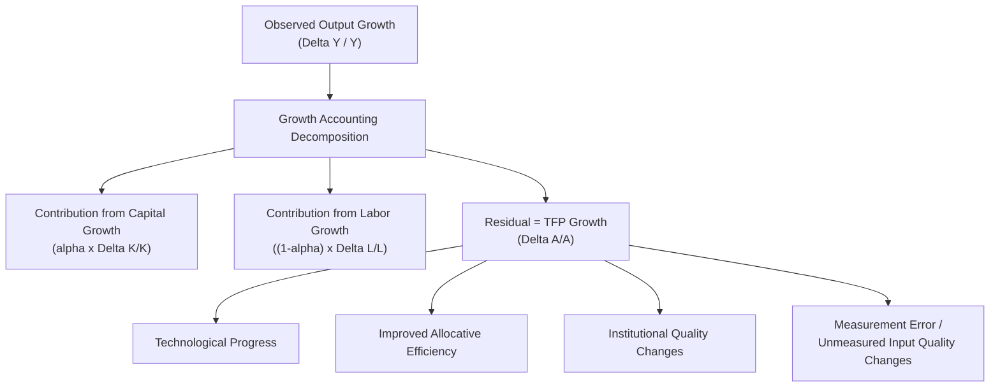
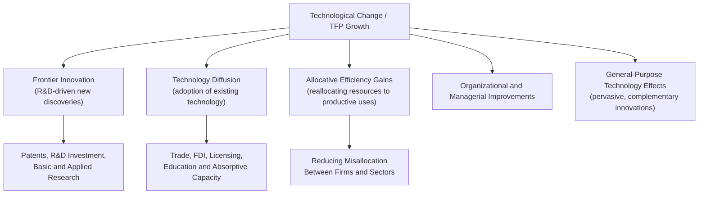
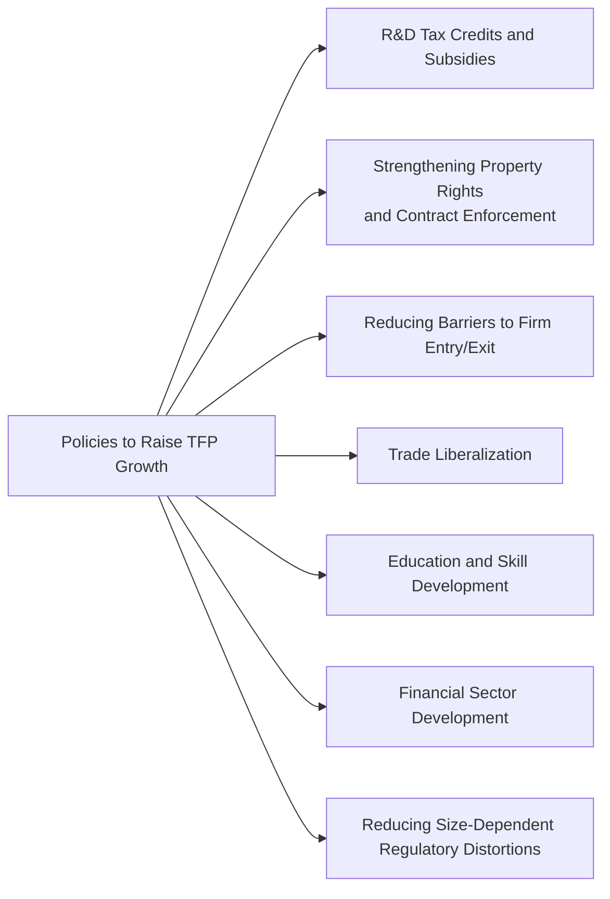

## Total Factor Productivity and Technological Change

### Definition and Core Concept

Total factor productivity (TFP) measures the portion of output growth that cannot be explained by measured increases in factor inputs (capital and labor) alone. It represents the efficiency with which an economy combines its inputs to produce output, capturing the combined effects of technological progress, organizational and managerial improvements, institutional quality, and the efficiency of resource allocation.

Formally, given the aggregate production function:

$$Y = A \cdot F(K, L)$$

$A$ is the TFP term: a multiplicative factor that scales the output produced from any given combination of capital ($K$) and labor ($L$). A rise in $A$ means more output is produced from the same quantity of measured inputs.

**Key Points**

- TFP is not itself a directly observable input like capital or labor hours; it is inferred as a residual once the contributions of measured inputs are accounted for
- TFP growth is widely regarded, within standard growth accounting frameworks, as the dominant driver of sustained long-run growth in output *per capita*, since capital accumulation alone is subject to diminishing returns

### Measuring TFP: The Solow Residual

#### Derivation

Starting from a Cobb-Douglas production function $Y = AK^{\alpha}L^{1-\alpha}$, taking logs and differentiating with respect to time yields the growth accounting equation:

$$\frac{\Delta Y}{Y} = \frac{\Delta A}{A} + \alpha\frac{\Delta K}{K} + (1-\alpha)\frac{\Delta L}{L}$$

Rearranging to solve for TFP growth — the **Solow residual**:

$$\frac{\Delta A}{A} = \frac{\Delta Y}{Y} - \alpha\frac{\Delta K}{K} - (1-\alpha)\frac{\Delta L}{L}$$

Where $\alpha$ (capital's income share) and $1-\alpha$ (labor's income share) are typically estimated from national accounts data on factor payments.

#### Worked Numerical Example

**Example**

Suppose an economy's real GDP grows by 4% in a given year, its capital stock grows by 6%, and its labor input grows by 2%. With a capital share $\alpha = 0.35$:

$$\frac{\Delta A}{A} = 0.04 - (0.35 \times 0.06) - (0.65 \times 0.02)$$

$$\frac{\Delta A}{A} = 0.04 - 0.021 - 0.013 = 0.006$$

TFP growth is estimated at 0.6% for the year — meaning roughly 15% of the observed 4% output growth ($0.006/0.04$) is attributable to the productivity residual, with the remainder attributable to measured capital and labor growth.

### What the Solow Residual Actually Captures

**Key Points**

- The Solow residual is often loosely equated with "technology," but it is more precisely understood as a catch-all measure of everything driving output growth that is not explained by the *measured* quantities of capital and labor
- This includes genuine technological innovation, but also: improvements in managerial and organizational practices, gains from reallocating resources toward more productive firms/sectors (allocative efficiency), changes in capacity utilization over the business cycle, unmeasured improvements in the quality of capital or labor inputs (if not properly adjusted for), and pure measurement error in the underlying national accounts data
- Because of this composite nature, economists distinguish between the raw, unadjusted Solow residual and more refined estimates that attempt to control for factors such as changing capacity utilization and labor quality, though even refined TFP measures retain substantial measurement uncertainty [Inference — this measurement caveat is a well-established methodological point in the growth accounting literature, extensively documented in work refining the original Solow approach]

### Sources of Technological Change

#### 1. Process Innovation

Improvements in the methods, techniques, or organization of production that allow more output to be produced from the same quantity of inputs — for example, more efficient manufacturing processes, supply chain improvements, or automation of existing tasks.

#### 2. Product Innovation

The creation of entirely new goods and services, which — while not always captured cleanly as an increase in existing output per input — represents an expansion of an economy's productive and consumption possibilities, often measured (imperfectly) through quality-adjusted price indices in national accounts.

#### 3. Diffusion of Existing Technology

Not all TFP growth arises from frontier innovation; a substantial share can come from the adoption and diffusion of already-existing technologies and best practices by firms and countries not previously using them — a particularly important channel for developing economies "catching up" to the technological frontier.

#### 4. General-Purpose Technologies (GPTs)

**Key Points**

- Certain technologies (historically, the steam engine, electricity, and more recently information and communication technology) are classified as **general-purpose technologies** because they are pervasive across many sectors, improve over time, and spawn complementary innovations across the economy
- GPT diffusion is frequently associated with a delayed and prolonged effect on measured aggregate TFP, since realizing the full productivity benefit typically requires complementary organizational restructuring, worker retraining, and business process redesign — a phenomenon sometimes summarized as the "productivity paradox" (the observation that a new technology's diffusion often precedes its measurable aggregate productivity impact by a considerable lag) [Inference — this productivity paradox pattern is a recognized empirical regularity in economic history, notably associated with the diffusion of electrification and, more recently, discussions of information technology and computerization, though the precise lag length and mechanism remain subjects of ongoing research]

### Sources of Technological Change: Structural Overview

### Determinants of TFP Growth Across Countries

| Determinant | Mechanism |
| --- | --- |
| **R&D investment** | Directly generates new technologies and processes; associated with knowledge spillovers per endogenous growth theory |
| **Institutional quality** | Secure property rights and contract enforcement improve incentives for innovation and efficient investment |
| **Human capital / education** | Raises the economy's capacity to absorb, adapt, and further develop new technologies ("absorptive capacity") |
| **Trade openness and FDI** | Facilitates technology transfer, access to a wider variety of intermediate inputs, and competitive pressure for efficiency |
| **Financial development** | Efficient capital allocation channels funds toward the most productive firms and innovative projects |
| **Competition and market structure** | Competitive pressure can spur efficiency-improving innovation, though excessive competition may reduce firms' ability to capture returns to R&D investment, creating a theoretically ambiguous net effect [Inference — the relationship between competition intensity and innovation incentives is a genuinely contested empirical and theoretical question in industrial organization and growth economics, without full professional consensus on its shape] |
| **Misallocation** | Resources trapped in low-productivity firms or sectors (due to distorted credit access, regulation, or informal-sector barriers) reduce aggregate TFP relative to an efficiently allocated benchmark |

### Allocative Efficiency and Misallocation

**Key Points**

- Even without any new technology being invented, aggregate TFP can rise if resources (capital and labor) are reallocated from less productive to more productive firms, sectors, or regions
- Empirical research comparing the dispersion of marginal products of capital and labor across firms within the same industry has found substantial misallocation in many developing economies, suggesting that reducing such distortions could generate meaningful TFP gains without requiring any new technological breakthroughs [Inference — this misallocation literature, notably associated with work by Hsieh and Klenow and related researchers, finds significant cross-country variation in estimated misallocation, though the precise magnitude of potential TFP gains from full reallocation is model-dependent and debated]
- Common sources of misallocation cited in this literature include: distorted access to credit (favoring incumbent or connected firms over more productive entrants), size-dependent regulations that discourage firm growth, and barriers to firm entry and exit

### TFP Growth Trends: Historical Patterns

**Key Points**

- Advanced economies experienced notably rapid measured TFP growth during the mid-20th century, followed by a well-documented slowdown beginning in the 1970s, and renewed debate over a possible "productivity slowdown" in more recent decades despite ongoing digital technology advancement
- Explanations proposed for periods of TFP slowdown in the literature include: measurement challenges in capturing quality improvements and new digital services, a genuine deceleration in the rate of transformative innovation, delayed realization of the productivity benefits of information technology (the GPT diffusion lag discussed above), and structural shifts toward service sectors where productivity growth has historically been slower to measure and achieve
- [Unverified] The relative importance of each of these competing explanations for any specific observed TFP slowdown episode remains an actively debated and empirically contested question among growth economists, without a single agreed-upon resolution

### TFP in Cross-Country Income Comparisons

Growth and development accounting exercises applied across countries have generally found that cross-country differences in measured TFP, rather than differences in physical or human capital per worker alone, account for a substantial share of the observed variation in income per capita across countries. [Inference — this is a widely cited finding in the development accounting literature, though the precise share attributed to TFP versus factor accumulation varies across studies depending on methodology and how human capital is measured, and remains an area of active research]

### Illustrative TFP Growth Comparison

<svg xmlns="http://www.w3.org/2000/svg" viewBox="0 0 700 380" font-family="Arial, sans-serif">
<text x="350" y="24" text-anchor="middle" font-size="16" font-weight="bold">Illustrative Decomposition of Output Growth Across Economy Types (svg_diagram)</text>
<line x1="150" y1="330" x2="650" y2="330" stroke="black" stroke-width="2" />
<line x1="150" y1="330" x2="150" y2="60" stroke="black" stroke-width="2" />
<text x="400" y="358" text-anchor="middle" font-size="12">Contribution to Annual Growth (percentage points)</text>

<text x="30" y="110" font-size="11">Advanced Economy</text>

<rect x="150" y="90" width="60" height="30" fill="`#1f77b4`" />

<rect x="210" y="90" width="40" height="30" fill="`#2ca02c`" />

<rect x="250" y="90" width="80" height="30" fill="`#ff7f0e`" />

<text x="270" y="140" font-size="9" fill="#555">K contribution | L contribution | TFP contribution</text>

<text x="30" y="210" font-size="11">Emerging Economy</text>

<rect x="150" y="190" width="140" height="30" fill="`#1f77b4`" />

<rect x="290" y="190" width="60" height="30" fill="`#2ca02c`" />

<rect x="350" y="190" width="60" height="30" fill="`#ff7f0e`" />

<text x="30" y="310" font-size="11">Frontier-Innovator Economy</text>

<rect x="150" y="290" width="50" height="30" fill="`#1f77b4`" />

<rect x="200" y="290" width="20" height="30" fill="`#2ca02c`" />

<rect x="220" y="290" width="100" height="30" fill="`#ff7f0e`" />

<rect x="450" y="70" width="15" height="15" fill="#1f77b4" />
<text x="470" y="82" font-size="10">Capital</text>
<rect x="450" y="95" width="15" height="15" fill="#2ca02c" />
<text x="470" y="107" font-size="10">Labor</text>
<rect x="450" y="120" width="15" height="15" fill="#ff7f0e" />
<text x="470" y="132" font-size="10">TFP</text>

<text x="150" y="350" font-size="9" fill="#555" font-style="italic">Note: illustrative stylized pattern, not specific empirical data</text>

</svg>

### Policy Implications for Raising TFP Growth

**Key Points**

- Because TFP is a composite measure reflecting technology, institutions, allocation, and organizational efficiency, no single policy lever addresses all its determinants; effective TFP-raising strategies typically combine several complementary reforms simultaneously
- Policies aimed at reducing resource misallocation (improving credit access for productive firms, removing barriers to firm growth) can raise measured TFP even without any new technological innovation, distinguishing this channel from R&D-focused innovation policy

### Common Misconceptions

- TFP is not synonymous with "technology" in the narrow sense of new inventions; it is a broader residual capturing efficiency, allocation, institutions, and measurement factors alongside genuine technological progress
- A country experiencing rapid GDP growth is not necessarily experiencing rapid TFP growth; much of a country's growth (particularly for capital-scarce, rapidly industrializing economies) can be attributable to capital and labor accumulation rather than productivity gains, a distinction with significant implications for the sustainability of that growth given diminishing returns to factor accumulation
- The Solow residual should not be treated as a precisely measured, error-free quantity; it inherits all measurement errors present in the underlying capital, labor, and output data, and includes cyclical factors (like capacity utilization) unless specifically adjusted for
- TFP slowdowns are not necessarily evidence that technological progress itself has stopped; they may partly reflect measurement challenges in capturing the value of new digital goods and services, structural shifts in the economy, or delayed realization lags associated with general-purpose technology diffusion, rather than a genuine cessation of innovation [Inference]

### Conclusion

Total factor productivity captures the portion of economic growth attributable to the efficiency with which an economy transforms capital and labor into output, encompassing technological innovation, technology diffusion, allocative efficiency, institutional quality, and organizational improvement. Measured empirically as the Solow residual in standard growth accounting, TFP is the dominant driver of sustained long-run per-capita growth in most theoretical and empirical growth frameworks, given that capital accumulation alone faces diminishing returns. Because TFP is a composite measure reflecting multiple underlying determinants rather than a single directly observable variable, understanding and raising it requires attention to R&D investment, institutional quality, resource allocation efficiency, human capital, and the diffusion of both frontier and existing technologies, with policy levers correspondingly spanning innovation incentives, competition policy, education, trade openness, and reforms to reduce firm-level misallocation.

**Related Topics**

- Sources of Long-Run Economic Growth
- The Solow-Swan Growth Model
- Endogenous Growth Theory
- Growth Accounting Methodology and Its Limitations
- General-Purpose Technologies and the Productivity Paradox
- Resource Misallocation and Cross-Firm Productivity Dispersion
- Development Accounting: TFP versus Factor Accumulation
- Institutions and Long-Run Economic Development
- Trade Openness and Technology Diffusion
- The Post-1970s and Post-2000s Productivity Slowdown Debates