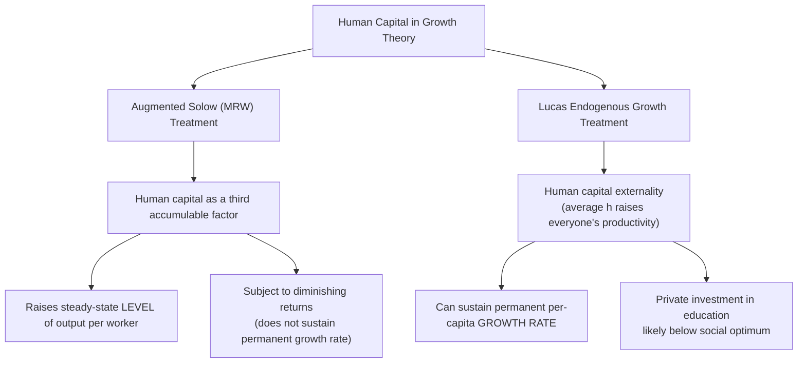
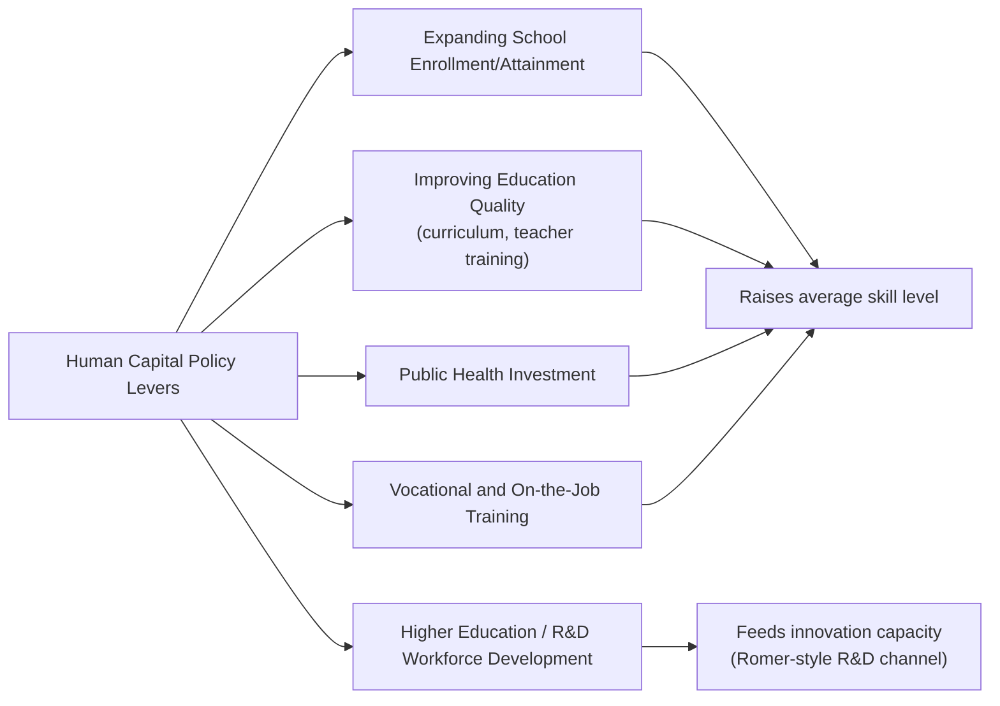

## Human Capital and Growth

### Definition and Core Concept

Human capital refers to the stock of knowledge, skills, competencies, and health embodied in individuals that enhances their productive capacity. Within growth theory, human capital is treated as an accumulable factor of production, analogous to physical capital, that can be augmented through investment (education, training, healthcare) and that contributes to both the level and, in certain model specifications, the long-run growth rate of output per capita.

$$H = \text{stock of education, skills, training, and health embodied in the workforce}$$

**Key Points**

- Human capital differs fundamentally from physical capital in that it is embodied in individuals, cannot be transferred or sold in the same way as physical assets, and is subject to depreciation not only through obsolescence but also through aging, retirement, and forgetting
- Human capital enters growth theory through two broad channels: as a directly accumulable, quality-augmenting input into production (following the Solow-augmented tradition), and as a generator of externalities/spillovers that can sustain long-run per-capita growth (following the Lucas endogenous growth tradition)

### Human Capital in the Augmented Solow Framework

#### The Mankiw-Romer-Weil (MRW) Model

A widely used extension of the basic Solow model adds human capital as a third, separately accumulable factor of production:

$$Y = K^{\alpha} H^{\beta} (AL)^{1-\alpha-\beta}$$

Where $H$ is the aggregate stock of human capital, $\alpha$ is physical capital's share, and $\beta$ is human capital's share, with $\alpha + \beta < 1$ to preserve diminishing returns to the accumulable factors taken together.

**Key Points**

- In this framework, human capital accumulation operates analogously to physical capital accumulation: a fraction of output is devoted to "investment" in human capital (schooling, training), and the economy converges to a steady state defined jointly over $k = K/AL$ and $h = H/AL$
- This model treats human capital as raising the *level* of steady-state output per worker, but — like physical capital in the basic Solow model — does not by itself generate a permanently higher long-run *growth rate*, since it remains subject to diminishing returns in the aggregate production function
- The MRW extension was originally motivated by the empirical finding that the basic Solow model (with only physical capital and raw labor) substantially understates observed cross-country income differences; adding human capital as a third factor was found to considerably improve the model's ability to explain cross-country income variation [Inference — this improved empirical fit is the well-documented original finding of Mankiw, Romer, and Weil (1992), though subsequent literature has debated the appropriate measurement of human capital and the robustness of the exact quantitative fit]

### Human Capital as a Source of Sustained Growth: The Lucas Model

#### Core Mechanism

In contrast to the augmented Solow treatment, Robert Lucas's 1988 endogenous growth model positions human capital accumulation as a mechanism capable of generating *permanent* per-capita growth, via a human capital externality.

$$\dot{h} = h \cdot \delta \cdot (1-u)$$

Where $h$ is an individual's human capital, $u$ is the fraction of time devoted to current production, and $(1-u)$ is the fraction of time devoted to human capital accumulation (schooling/training).

**Key Points**

- The crucial addition is that aggregate output depends not only on an individual's own human capital but also on the **average level of human capital in the economy** — an externality representing knowledge spillovers, social learning, and network effects among a skilled workforce
- Because this externality is not subject to the same diminishing-returns constraint as physical capital accumulation alone, human capital investment in this framework can sustain permanent per-capita output growth, distinguishing it from the augmented Solow (MRW) treatment above
- This externality also implies that private investment in education is likely to fall short of the socially optimal level, since individuals do not fully internalize the productivity benefits their own skill accumulation confers on others — a standard theoretical rationale for public education subsidies within this literature

### Channels Through Which Human Capital Affects Growth

#### 1. Direct Productivity Effect

More educated, skilled, and healthier workers are more productive in a given task, raising output for a given quantity of raw labor hours and physical capital — the most direct channel, captured in both the MRW and Lucas frameworks.

#### 2. Absorptive Capacity for Technology

**Key Points**

- Human capital enhances an economy's capacity to understand, adapt, and effectively implement existing and imported technologies — sometimes termed "absorptive capacity"
- This channel is particularly emphasized in the technology-diffusion literature: countries or firms with higher levels of human capital are generally found to be more effective at adopting and adapting frontier technologies developed elsewhere, accelerating their own TFP growth via catch-up [Inference — the absorptive-capacity mechanism is a well-established concept in the technology diffusion and development literature, though quantifying its precise contribution separately from other correlated factors, such as institutional quality, is methodologically challenging]

#### 3. Innovation Capacity

Human capital, particularly at higher levels of education (tertiary and research-oriented training), supplies the researchers and engineers who conduct R&D, directly feeding into the Romer-style endogenous technological change mechanism discussed in growth theory more broadly.

#### 4. Health as Human Capital

Health is increasingly incorporated into the human capital concept: healthier workers have higher productivity, lower absenteeism, longer effective working lives, and in childhood, better health is associated with more effective learning and skill acquisition — creating a further channel by which health investment contributes to long-run human capital accumulation and growth.

#### 5. Complementarity with Physical Capital and Technology

**Key Points**

- Human capital and physical capital/technology often exhibit complementarity: certain modern technologies (particularly information and communication technology and advanced machinery) require a sufficiently skilled workforce to be used effectively, meaning the *return* to physical capital investment can itself depend on the available stock of human capital
- This complementarity has been proposed as one explanation for why some economies fail to adopt available frontier technology despite its apparent profitability — a mismatch between the skill level required and the skill level available in the local workforce [Inference — this skill-technology complementarity mechanism is a recognized theme in the development and growth literature, though its precise quantitative importance relative to other barriers to technology adoption, such as financing constraints or institutional quality, remains an area of ongoing research]

### Measuring Human Capital

| Measurement Approach | Description | Limitations |
| --- | --- | --- |
| **Average years of schooling** | Most common cross-country proxy, drawn from census/survey data on educational attainment | Does not capture quality differences in education across countries or over time |
| **Mincerian returns-based measures** | Weights years of schooling by estimated wage returns to education (Mincer earnings function) | Assumes wage returns accurately reflect productivity, and returns estimates vary substantially across contexts |
| **Standardized test score data (cognitive skills)** | Uses internationally comparable assessments to proxy for the quality, not just quantity, of education | Coverage limited to countries and years with test participation; captures a narrow slice of skills |
| **Health-adjusted measures** | Incorporates life expectancy, nutrition, or disease burden alongside education | Combining health and education into a single index requires debatable weighting assumptions |

**Key Points**

- A substantial body of empirical growth research has found that measures incorporating the *quality* of education (e.g., standardized test performance) are more strongly associated with cross-country growth differences than measures of school attainment (years of schooling) alone, suggesting that simply expanding years of schooling without corresponding gains in learning outcomes may have limited growth impact [Inference — this quality-over-quantity finding is associated notably with the work of Hanushek and Woessmann, and while influential, the precise magnitude and causal interpretation of these results remain subjects of debate in the empirical growth literature]

### Empirical Findings on Human Capital and Growth

**Key Points**

- Cross-country growth regressions generally find a positive association between measures of human capital (schooling, test scores) and subsequent economic growth, though the estimated magnitude and statistical robustness of this relationship vary substantially depending on the specific measure used, the sample of countries, and the econometric methodology
- The relationship between the initial *level* of schooling and subsequent growth versus the *change* in schooling and growth has been a persistent point of empirical contention, with some studies finding stronger support for level effects (consistent with the augmented Solow framework) than for the growth-rate effects implied by pure Lucas-style externality models [Inference — this level-versus-growth-effect distinction and the corresponding empirical debate is a genuine, actively discussed issue in the empirical growth literature, without a fully settled consensus]
- Human capital's contribution to cross-country income differences, in development accounting exercises, is generally found to be smaller in magnitude than the contribution attributed to TFP differences, though larger than the contribution from physical capital differences alone [Inference]

### Diagrammatic Comparison: Human Capital's Effect Under Different Frameworks

<svg xmlns="http://www.w3.org/2000/svg" viewBox="0 0 700 380" font-family="Arial, sans-serif">
<text x="350" y="24" text-anchor="middle" font-size="16" font-weight="bold">Effect of a Permanent Rise in Education Investment (svg_diagram)</text>
<line x1="70" y1="330" x2="650" y2="330" stroke="black" stroke-width="2" />
<line x1="70" y1="330" x2="70" y2="60" stroke="black" stroke-width="2" />
<text x="360" y="358" text-anchor="middle" font-size="12">Time</text>
<text x="30" y="195" font-size="12" transform="rotate(-90 30 195)">Log Output per Worker</text>
<line x1="250" y1="330" x2="250" y2="60" stroke="#888" stroke-dasharray="3,3" />
<text x="250" y="55" text-anchor="middle" font-size="10" fill="#888">Education policy change</text>
<path d="M 90 300 L 250 250" stroke="black" stroke-width="2.5" />

<path d="M 250 250 Q 350 200 450 180 L 640 160" stroke="#1f77b4" stroke-width="2.5" fill="none" />
<text x="460" y="150" font-size="11" fill="#1f77b4" font-weight="bold">Augmented Solow (MRW): level shift only</text>

<path d="M 250 250 L 640 70" stroke="#2ca02c" stroke-width="2.5" fill="none" stroke-dasharray="6,3" />
<text x="460" y="90" font-size="11" fill="#2ca02c" font-weight="bold">Lucas (externality): permanently steeper growth path</text>
</svg>

### Policy Implications

**Key Points**

- Because education generates positive externalities in most human-capital growth frameworks, the standard theoretical case for public subsidization of education rests on the same logic as R&D subsidies: private investment decisions do not capture the full social return, implying under-investment absent government support
- Policy focus has increasingly shifted, in light of the quality-versus-quantity empirical findings, toward measures of learning outcomes and skill acquisition rather than school enrollment or attainment figures alone
- Health investment (nutrition, disease prevention, maternal and child health) is increasingly treated as a growth-relevant human capital policy lever, not merely a welfare or public health objective in isolation

### Common Misconceptions

- Human capital is not interchangeable across the augmented-Solow and Lucas theoretical treatments in terms of policy implications: whether education investment raises the long-run growth *rate* (Lucas-style externality) or only the steady-state *level* of output per worker (MRW-style factor accumulation) depends on which theoretical mechanism is assumed to dominate, and this remains an empirically contested question
- Expanding years of schooling does not automatically translate into proportional human capital or growth gains if the quality of education does not improve correspondingly; empirical evidence increasingly emphasizes learning outcomes over school attainment figures alone
- Human capital accumulation is not solely an education phenomenon; health, on-the-job training, and even migration-driven skill transfer are also recognized components of human capital formation within the broader growth literature
- A positive correlation between human capital measures and economic growth in cross-country data does not, by itself, establish the direction of causality; richer countries may simply be able to afford more and better education, creating a potential reverse-causality or omitted-variable concern that complicates causal interpretation of these empirical relationships [Inference]

### Conclusion

Human capital — the stock of education, skills, training, and health embodied in the workforce — plays a central role in growth theory through two principal channels: as a directly accumulable, quality-augmenting factor of production that raises the steady-state level of output per worker (as in the augmented Solow/Mankiw-Romer-Weil framework), and as a source of externality-driven spillovers capable of sustaining a permanently higher long-run per-capita growth rate (as in the Lucas endogenous growth framework). Beyond its direct productivity effect, human capital influences growth through its role in enhancing absorptive capacity for imported technology, supplying the researchers who drive frontier innovation, and complementing physical capital and technology adoption. While cross-country empirical evidence generally supports a positive association between human capital and growth, the precise magnitude, the relative importance of educational quality versus quantity, and the underlying causal mechanism remain active and only partially resolved areas of research within the field.

**Related Topics**

- The Solow-Swan Growth Model
- Endogenous Growth Theory
- The Mankiw-Romer-Weil Augmented Solow Model
- Sources of Long-Run Economic Growth
- Total Factor Productivity and Technological Change
- Education Quality versus Quantity in Growth Empirics
- Absorptive Capacity and Technology Diffusion
- Health Economics and Human Capital Formation
- Development Accounting: Decomposing Cross-Country Income Differences
- Externalities and the Case for Public Education Subsidies