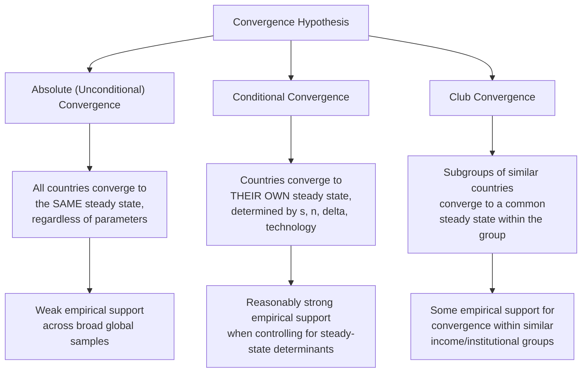
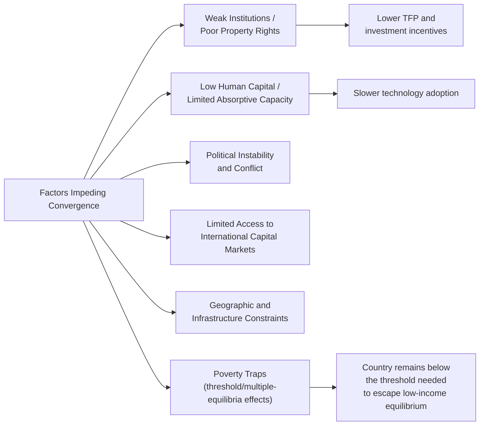

## Convergence Hypothesis and Cross-Country Growth Patterns


### Definition and Core Concept

The convergence hypothesis proposes that poorer economies, characterized by lower initial levels of capital per worker and income per capita, should grow faster than richer economies, allowing income levels across countries to converge over time. This prediction emerges directly from the diminishing-returns property of the neoclassical (Solow-Swan) production function, but its empirical validity — and the precise conditions under which it holds — has been a central and extensively debated question in growth economics.

**Key Points**

- The theoretical basis for convergence rests on diminishing marginal returns to capital: capital-scarce economies have a higher marginal product of capital, and hence a higher return to investment, generating faster growth as they accumulate capital toward their steady state
- Empirical testing has distinguished several distinct forms of convergence, each with different theoretical implications and different degrees of empirical support

### Theoretical Foundation: Convergence in the Solow Model

Recall the fundamental Solow equation:

$$\dot{k} = sf(k) - (n+\delta)k$$

Because $f(k)$ is concave (diminishing returns) while the break-even investment line $(n+\delta)k$ is linear, the gap between actual and break-even investment — and hence the growth rate of $k$ — is largest when $k$ is far below its steady-state value $k^*$, and shrinks as $k$ approaches $k^*$. This directly implies that, for economies sharing the same steady state, those starting further below it grow faster.



### Absolute (Unconditional) Convergence

#### Definition

Absolute convergence predicts that **all** economies converge to the *same* steady-state level of income per capita over time, regardless of their individual saving rates, population growth rates, or technology levels — implying that poorer countries should systematically grow faster than richer countries in an unconditional cross-country comparison.

#### Empirical Test

The standard empirical test regresses the growth rate of income per capita on the initial level of income per capita across a sample of countries:

$$g_{i} = \beta_0 + \beta_1 \ln(Y_{i,0}) + \epsilon_i$$

A negative and statistically significant $\beta_1$ would provide evidence of absolute convergence (poorer countries, with lower $\ln(Y_{i,0})$, growing faster).

**Key Points**

- Empirical tests applied to broad, heterogeneous global samples of countries have generally found **little to no evidence of unconditional convergence** — poor countries as a group have not, on average, grown systematically faster than rich countries over extended historical periods
- This finding is a central reason economists moved away from testing absolute convergence as the primary hypothesis, since the theoretical prediction of the Solow model (as formally stated) requires countries to share the *same* steady state, an assumption that does not hold once countries differ in savings behavior, population growth, institutions, and technology levels [Inference — the weak empirical support for unconditional convergence across broad global samples is a well-established finding in the empirical growth literature, notably associated with work by Barro and others from the late 1980s and 1990s onward]

### Conditional Convergence

#### Definition

Conditional convergence predicts that countries converge to **their own** steady state, which differs across countries according to their specific saving rate, population growth rate, depreciation rate, and technology level. Under this prediction, a country grows faster the further it is below *its own* steady state, not below some universal global benchmark.

#### Empirical Test

The conditional convergence test augments the basic regression with controls for the determinants of each country's steady state:

$$g_i = \beta_0 + \beta_1 \ln(Y_{i,0}) + \beta_2 X_i + \epsilon_i$$

Where $X_i$ includes proxies for steady-state determinants such as investment rates, population growth rates, and human capital/education measures.

**Key Points**

- Once these steady-state determinants are controlled for, empirical studies have generally found a negative and statistically significant coefficient on initial income, providing considerably stronger support for **conditional** convergence than for absolute convergence
- This finding is broadly consistent with the augmented Solow (Mankiw-Romer-Weil) framework, which found that adding human capital as a control substantially improved the model's fit to observed cross-country growth patterns
- [Inference] The estimated speed of conditional convergence in this empirical literature is commonly found to fall in a range implying that economies close roughly 2% of the gap to their own steady state per year, though this specific estimate varies across studies, samples, and time periods, and should not be treated as a precisely settled universal parameter

### Club Convergence

#### Definition

Club convergence proposes that convergence occurs within subgroups ("clubs") of countries that share sufficiently similar structural characteristics (institutions, technology access, initial conditions), while divergence or no clear convergence pattern may persist *between* different clubs.

**Key Points**

- This hypothesis is often invoked to explain patterns such as convergence among the group of currently high-income, industrialized economies (sometimes documented among OECD countries over the postwar period) occurring alongside a lack of clear convergence — or even divergence — between high-income and the poorest developing economies over the same historical period
- Club convergence is consistent with growth models featuring multiple steady states or threshold effects (e.g., poverty traps, where a country below a certain threshold of capital, human capital, or institutional quality may fail to accumulate the resources needed to escape low-income equilibria), rather than the single, globally stable steady state assumed in the basic Solow framework [Inference — the theoretical possibility of multiple equilibria and poverty traps is a recognized strand of growth theory, though the empirical prevalence and precise mechanisms of such traps in real-world data remain debated and are not universally accepted as the primary explanation for observed cross-country divergence]

### The "Twin Peaks" Pattern in the Global Income Distribution

**Key Points**

- Empirical studies of the evolution of the *entire* cross-country income distribution (rather than simple regression-based convergence tests) have documented a tendency toward a bimodal ("twin peaks") distribution over recent decades — a clustering of countries around both a high-income and a low-income mode, with relatively fewer countries in the middle
- This pattern has been interpreted by some researchers as evidence against simple convergence and consistent instead with club convergence or persistent structural divergence between groups of countries, though [Inference] more recent decades have seen substantial income growth in a number of large emerging economies, which some researchers argue may be altering this twin-peaks pattern; the current shape and evolution of the global income distribution remains an actively studied empirical question

### Comparative Diagram: Growth Rate versus Initial Income

<svg xmlns="http://www.w3.org/2000/svg" viewBox="0 0 700 420" font-family="Arial, sans-serif">
<text x="350" y="24" text-anchor="middle" font-size="16" font-weight="bold">Growth Rate vs Initial Income: Convergence Patterns (svg_diagram)</text>

<g>
<text x="170" y="50" text-anchor="middle" font-size="12" font-weight="bold">Unconditional (weak support)</text>
<line x1="60" y1="340" x2="300" y2="340" stroke="black" stroke-width="2" />
<line x1="60" y1="340" x2="60" y2="70" stroke="black" stroke-width="2" />
<text x="180" y="365" font-size="10" text-anchor="middle">Initial Income (log)</text>
<text x="30" y="200" font-size="10" transform="rotate(-90 30 200)">Growth Rate</text>



```

<circle cx="90" cy="150" r="4" fill="#555" />
<circle cx="110" cy="250" r="4" fill="#555" />
<circle cx="140" cy="120" r="4" fill="#555" />
<circle cx="160" cy="280" r="4" fill="#555" />
<circle cx="190" cy="180" r="4" fill="#555" />
<circle cx="220" cy="140" r="4" fill="#555" />
<circle cx="240" cy="260" r="4" fill="#555" />
<circle cx="270" cy="200" r="4" fill="#555" />
<line x1="70" y1="205" x2="290" y2="200" stroke="#d62728" stroke-width="1.5" stroke-dasharray="4,3" />
<text x="180" y="195" font-size="9" fill="#d62728">near-flat fitted line</text>
```

</g>

<g>
<text x="530" y="50" text-anchor="middle" font-size="12" font-weight="bold">Conditional (stronger support)</text>
<line x1="420" y1="340" x2="660" y2="340" stroke="black" stroke-width="2" />
<line x1="420" y1="340" x2="420" y2="70" stroke="black" stroke-width="2" />
<text x="540" y="365" font-size="10" text-anchor="middle">Initial Income (log)</text>



```
<circle cx="450" cy="120" r="4" fill="#555" />
<circle cx="470" cy="150" r="4" fill="#555" />
<circle cx="500" cy="180" r="4" fill="#555" />
<circle cx="530" cy="210" r="4" fill="#555" />
<circle cx="560" cy="240" r="4" fill="#555" />
<circle cx="590" cy="270" r="4" fill="#555" />
<circle cx="620" cy="300" r="4" fill="#555" />
<line x1="440" y1="115" x2="640" y2="305" stroke="#2ca02c" stroke-width="2" />
<text x="560" y="105" font-size="9" fill="#2ca02c">clear negative slope</text>
```

</g>
</svg>

### Determinants of Steady-State Differences (Why Conditional Convergence Is Needed)

| Determinant | Effect on a Country's Steady State |
| --- | --- |
| **Saving/investment rate ($s$)** | Higher $s$ raises the steady-state level of capital and output per worker |
| **Population growth rate ($n$)** | Higher $n$ lowers the steady-state level, all else equal |
| **Human capital investment** | Higher human capital investment raises the steady-state level (per augmented Solow) |
| **Technology level/TFP ($A$)** | Higher $A$ shifts the entire production function upward, raising output for any given $k$ |
| **Institutional quality** | Affects both the incentive to invest (influencing $s$ in practice) and TFP directly |

Since these parameters differ substantially across real-world countries, each country effectively has a different steady state, explaining why unconditional convergence — which implicitly assumes identical steady states — fails empirically while conditional convergence, which controls for these differences, finds much stronger support.

### Convergence Within versus Between Country Groups

**Key Points**

- Empirical convergence studies applied specifically to relatively homogeneous groups of economies — such as U.S. states, regions within the European Union, or OECD member countries — have generally found more consistent evidence of convergence than studies applied to the full global cross-section of countries, consistent with these groups sharing more similar institutional and technological steady-state determinants [Inference — this "convergence within homogeneous groups" finding is a well-documented pattern in the regional and cross-country growth literature, notably including studies of U.S. state-level income convergence]
- This within-group finding is often cited as indirect support for the conditional convergence hypothesis: once the "conditioning" differences across countries or regions are naturally smaller (as within a group of similarly developed economies), the underlying Solow-model convergence mechanism becomes more visible in the data

### Factors That Can Impede Convergence



**Key Points**

- Weak institutions, low human capital, political instability, and limited access to international capital are commonly cited factors that can prevent a country from converging toward the income levels of more developed economies, either by lowering its own steady-state income level or by slowing the speed at which it approaches that lower steady state
- The **poverty trap** concept — where a country below some critical threshold of capital, human capital, or institutional development remains persistently poor due to self-reinforcing mechanisms — represents a theoretical departure from the single stable steady-state assumption of the basic Solow model, implying multiple possible long-run equilibria depending on initial conditions [Inference — the theoretical possibility and empirical prevalence of poverty traps remains a genuinely debated question in development economics, with some researchers finding supporting evidence in specific contexts and others questioning how widespread such traps are in practice]

### Common Misconceptions

- Convergence, even when empirically supported, does not imply that all countries will eventually reach *equal* levels of income; conditional convergence implies convergence toward each country's own steady state, which differs across countries according to their structural characteristics
- The empirical failure of unconditional convergence does not invalidate the Solow model's diminishing-returns mechanism; it instead reflects the reality that different countries have different steady states due to differing saving rates, population growth, institutions, and technology — exactly the condition the Solow model itself implies would prevent unconditional convergence
- Observing convergence within a specific homogeneous group of countries (e.g., OECD members) does not automatically generalize to convergence across the full global cross-section, since the conditioning variables that make convergence visible within the group may differ substantially from those relevant to poorer, structurally different economies
- A negative correlation between initial income and subsequent growth in a conditional convergence regression does not establish that low initial income *causes* faster growth in some direct sense; it reflects the combined effect of diminishing returns to capital operating conditional on a country's specific steady-state determinants, which must themselves be correctly specified for the test to be valid

### Conclusion

The convergence hypothesis, rooted in the diminishing-returns property of the neoclassical growth model, predicts that capital-scarce economies should grow faster than capital-abundant ones as they approach their steady state. Empirical testing has found little support for unconditional convergence across the full global cross-section of countries, but considerably stronger support for conditional convergence once differences in saving rates, population growth, and human capital across countries are properly accounted for — a finding broadly consistent with the augmented Solow framework. Club convergence and twin-peaks patterns in the global income distribution suggest that convergence may operate more strongly within groups of structurally similar economies than across the full range of global income levels, with weak institutions, limited human capital, and potential poverty-trap dynamics cited as factors that can impede poorer economies from converging toward the income levels of more developed countries.

**Related Topics**

- The Solow-Swan Growth Model
- Capital Accumulation, Depreciation, and the Steady State
- The Mankiw-Romer-Weil Augmented Solow Model
- Poverty Traps and Multiple Equilibria in Development Economics
- Institutions and Long-Run Economic Development
- Total Factor Productivity and Technological Change
- Endogenous Growth Theory
- Regional Income Convergence (U.S. States, EU Regions)
- The Twin-Peaks Distribution and Global Income Inequality
- Empirical Methodology in Cross-Country Growth Regressions