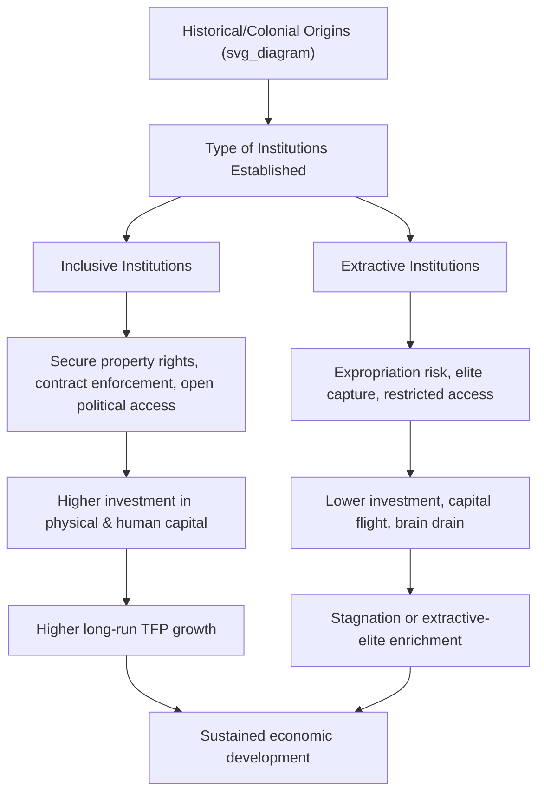

## Institutions and Long-Run Development

### Overview

Institutional economics argues that the fundamental cause of long-run differences in economic growth across countries is not geography, culture, or factor endowments alone, but the **rules of the game** — the formal and informal constraints that structure political and economic interaction. This body of theory, most closely associated with Douglass North, Daron Acemoglu, and James Robinson, treats institutions as the deep determinant that shapes how physical capital, human capital, and technology are actually deployed.

**Key Points**

- Institutions are defined as the humanly devised constraints that structure political, economic, and social interaction — comprising both formal rules (constitutions, laws, property rights) and informal constraints (norms, conventions, codes of conduct).
- The institutional view distinguishes between **proximate causes** of growth (capital accumulation, technology, labor) and **fundamental/deep causes** (institutions, geography, culture, luck).
- Property rights, rule of law, and constraints on the executive are the most commonly cited institutional determinants of investment and growth.

### Defining Institutions

Douglass North's canonical definition, from *Institutions, Institutional Change and Economic Performance* (1990), frames institutions as the humanly devised constraints that shape human interaction, reducing uncertainty by establishing a stable structure for exchange. [Unverified: this is a widely cited paraphrase of North's framing; exact wording varies slightly across editions and secondary summaries]

Institutions are typically divided into two categories:

- **Formal institutions**: Constitutions, statutory law, property rights regimes, contract enforcement mechanisms, regulatory bodies.
- **Informal institutions**: Social norms, customs, trust, codes of conduct, and conventions that are not codified but still constrain behavior.

A further influential distinction, from Acemoglu and Robinson's *Why Nations Fail* (2012), separates institutions by their economic function:

- **Inclusive institutions**: Broad-based property rights, open access to economic opportunity, and political systems that distribute power pluralistically. These incentivize investment and innovation because a broad set of actors can capture the returns to their effort.
- **Extractive institutions**: Concentrate political power and economic rents in a narrow elite, who structure rules to transfer resources to themselves rather than to broaden productive investment.

### Theoretical Mechanism: Why Institutions Matter for Growth

The core causal chain runs: **institutions → incentives → investment and innovation decisions → aggregate output and growth**.

$$Y = A \cdot F(K, H, L)$$

In a standard growth-accounting framework, $Y$ is output, $A$ is total factor productivity, $K$ is physical capital, $H$ is human capital, and $L$ is labor. Institutional economists argue that $K$, $H$, and even $A$ itself are *endogenous* to the institutional environment:

- **Property rights and expropriation risk**: If an investor cannot be confident that the returns to an investment will not be expropriated (by the state, by criminals, or by corrupt officials), the expected return on investment falls, and $K$ accumulates more slowly regardless of the nominal savings rate.
- **Contract enforcement**: Weak courts and unreliable enforcement raise transaction costs, discourage specialization and long-term contracting, and shrink the effective size of markets — limiting gains from the division of labor described by Adam Smith.
- **Human capital incentives**: Extractive institutions that block social mobility reduce the private return to education and skill acquisition, lowering $H$.
- **Innovation and $A$**: Inclusive institutions that protect intellectual property and allow open entry into markets encourage costly innovation by ensuring innovators can capture returns (creative destruction, per Schumpeter), raising total factor productivity growth over time.

### The Reversal of Fortune and Empirical Identification

A central empirical challenge in this literature is that institutions, income, and geography are all correlated, making causal identification difficult: does income cause good institutions, or do good institutions cause income (reverse causality and omitted variable bias)?

Acemoglu, Johnson, and Robinson (2001, "The Colonial Origins of Comparative Development") addressed this using **settler mortality rates** during European colonization as an instrumental variable for institutional quality:

- In regions with high European settler mortality (due to disease environments), colonizers established **extractive institutions** designed to extract resources with minimal permanent settlement.
- In regions with low settler mortality, colonizers established **inclusive institutions** resembling those of the colonizing country, since settlers intended to stay and wanted institutions protecting their own property.
- This colonial-era institutional choice persisted historically, and the paper finds that a substantial share of the variation in current income per capita across former colonies is explained by this measure of institutional quality, using settler mortality as an instrument uncorrelated with current economic conditions except through its effect on institutions.

The related "**Reversal of Fortune**" finding (Acemoglu, Johnson, and Robinson, 2002) documents that among former colonies, regions that were *relatively prosperous* in 1500 (dense populations, urbanized) are often *relatively poor today*, while regions that were sparsely populated in 1500 are often richer today — a reversal explained by the observation that densely populated, prosperous regions were more attractive targets for extractive colonial institutions (large populations to tax/exploit), while sparsely populated regions were more likely to receive institutions built for settlement and inclusive property rights. [Inference: this is the standard interpretation offered by the original authors; the reversal finding itself is a well-documented empirical pattern, but the causal institutional explanation for it remains contested among economic historians]

### Institutions vs. Competing Explanations

| Theory | Core Claim | Key Proponents | Main Critique |
| --- | --- | --- | --- |
| **Institutions** | Rules governing property rights, political power, and enforcement determine growth | North, Acemoglu, Robinson | Institutions themselves need explaining — what determines institutional quality? |
| **Geography** | Climate, disease burden, and access to trade routes/coastlines directly constrain productivity | Jeffrey Sachs, Jared Diamond | Fails to explain within-country variation (e.g., North/South Korea share geography but differ radically in institutions and outcomes) |
| **Culture** | Values, trust, work ethic, and social capital shape economic behavior | Max Weber (Protestant Ethic), David Landes | Difficult to measure rigorously; risk of circular reasoning (attributing success to "good culture" after the fact) |
| **Human Capital** | Education and skills are the primary driver, and institutions matter mainly insofar as they enable schooling | Robert Barro, Edward Glaeser | Glaeser et al. (2004) argue human capital may be more fundamental, and that institutions can improve *after* growth begins, not only before |

**Note on the geography/institutions debate**: The North/South Korea comparison is frequently used as an illustrative natural experiment — near-identical geography, climate, and pre-1948 shared culture and history, but radically divergent institutional paths after division, followed by a large and growing gap in per-capita income. This is a widely cited illustration in the literature rather than a formal econometric identification strategy on its own.

### Institutions and the Solow/Endogenous Growth Frameworks

In the **Solow model**, cross-country income differences are explained by differences in savings rates, population growth, and total factor productivity ($A$), with $A$ typically treated as exogenous ("manna from heaven"). Institutional economics can be read as an attempt to *endogenize* $A$ and the effective savings/investment rate:

$$A_{effective} = A_{technology} \times f(\text{institutional quality})$$

Poor institutions act as a "wedge" or tax on the returns to capital and innovation, meaning a country can have access to the same global technological frontier as another but fail to adopt or effectively utilize it because the domestic institutional environment discourages the investment needed to implement it.

In **endogenous growth models** (Romer, Aghion-Howitt), sustained growth depends on continuous innovation, which requires that innovators can appropriate returns — directly tying the model's core growth engine to the strength of intellectual property institutions and market entry rules.

### Illustrative Diagram: Institutional Transmission Mechanism

### Key Institutional Variables Used in Empirical Growth Research

- **Property rights protection indices** (e.g., historically referenced sources include Economic Freedom of the World data and Polity IV/V democracy scores)
- **Rule of law indices** (e.g., World Bank Worldwide Governance Indicators)
- **Constraints on the executive** (used extensively in North, Acemoglu, and Robinson's work as a proxy for political institutional quality)
- **Expropriation risk ratings** (historically drawn from private political risk services such as the International Country Risk Guide)
- **Contract-intensive money** and **judicial independence** measures as proxies for contract enforcement quality

[Unverified: specific index names, providers, and methodologies are subject to periodic revision and rebranding; verify current data source names and coverage before citing specific numeric values]

### Worked Example: Comparative Institutional Analysis

Consider two hypothetical economies with identical natural resource endowments and initial capital stock:

- **Country A** has independent courts, secure land titling, and low barriers to firm entry. An entrepreneur who develops a new product is confident that competitors cannot simply copy the innovation without legal consequence, and that profits will not be arbitrarily seized by officials.
- **Country B** has courts subject to political interference, informal land tenure with weak titling, and licensing regimes that favor politically connected incumbents. An entrepreneur in the same position faces high expropriation risk and limited legal recourse against IP theft.

Standard growth accounting might initially attribute similar growth potential to both, given equal capital and labor. The institutional framework predicts Country A will exhibit higher realized investment rates, more R&D activity, and higher total factor productivity growth over decades, even absent any difference in geography or initial resource endowment — consistent with the empirical finding that institutional quality explains a large share of cross-country income variance not accounted for by capital and labor inputs alone.

### Critiques and Open Questions

- **Endogeneity concerns**: Some economists (e.g., Glaeser, La Porta, Lopez-de-Silanes, Shleifer, 2004) argue that human capital, not institutions, is the more fundamental cause, and that good institutions are often a *consequence* of rising income and education rather than solely a cause of it.
- **Measurement difficulty**: Institutional quality is inherently harder to quantify than capital stock or years of schooling, and indices can embed subjective judgments.
- **The "institutions are endogenous too" critique**: If institutions themselves are shaped by prior economic and social conditions, treating them as a clean exogenous explanatory variable risks circularity; the instrumental variable strategies (e.g., settler mortality) were developed specifically to address this concern, but remain debated on methodological grounds. [Inference: this reflects an ongoing, unresolved debate in the empirical growth literature rather than a settled consensus]
- **Institutional change is slow and path-dependent**: North's concept of path dependence suggests institutions, once established, are costly to change even when inefficient, because they generate self-reinforcing feedback loops (vested interests benefiting from the status quo).

### Conclusion

The institutional theory of long-run development reframes the growth question from "how much capital and labor does a country have" to "what rules govern how that capital and labor can be used, and who captures the returns." While not without empirical and methodological challenges, the institutions-based framework remains one of the dominant paradigms in modern growth economics for explaining why countries with similar geography, resources, or starting technology can diverge dramatically in long-run prosperity.

**Related Topics**

- Douglass North and New Institutional Economics
- Acemoglu and Robinson's *Why Nations Fail* framework in full
- Property Rights Theory and the Coase Theorem
- Path Dependence and Institutional Persistence
- Colonial Origins Hypothesis (Acemoglu, Johnson, Robinson 2001/2002)
- Rule of Law and Contract Enforcement in Development Economics
- Political Economy of Reform: why extractive elites resist inclusive institutional change
- Human Capital vs. Institutions Debate (Glaeser et al. critique)