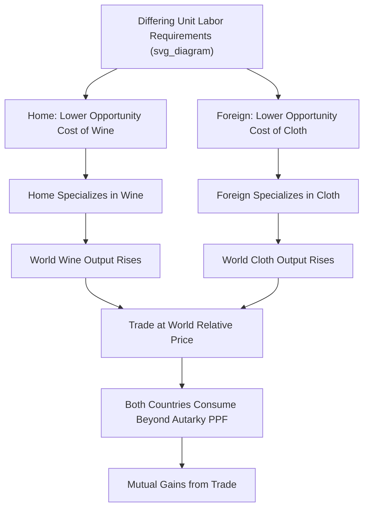

## Ricardian Model of Trade

### Overview

The Ricardian model, developed by David Ricardo in *On the Principles of Political Economy and Taxation* (1817), is the foundational theory of international trade based on **comparative advantage**. It demonstrates that countries gain from trade by specializing in producing goods for which they have a *relative* (not necessarily absolute) productivity advantage, driven by differences in labor productivity across countries.

**Key Points**

- The central insight is comparative advantage, not absolute advantage: mutually beneficial trade can occur even if one country is more productive than another in *every* good.
- The model's single factor of production is labor, and technology differences (labor productivity) are the sole source of comparative advantage.
- Gains from trade arise because specialization allows both trading countries to consume beyond their individual production possibility frontiers.

### Model Setup and Assumptions

The standard two-country, two-good Ricardian model rests on the following simplifying assumptions:

1. **Two countries** (conventionally Home and Foreign), **two goods** (e.g., wine and cloth), **one factor of production** (labor).
2. **Labor is the only input**; production technology is summarized by constant **unit labor requirements** — the amount of labor needed to produce one unit of a good.
3. **Labor is perfectly mobile within a country** (across industries) but **immobile between countries**.
4. **Constant returns to scale**: unit labor requirements do not change with output level, producing linear, non-bowed production possibility frontiers.
5. **Perfect competition** in both goods and labor markets; no transportation costs or trade barriers in the basic model.
6. **Full employment** of the fixed labor endowment in each country.

### Notation

Let:

- $a_{LW}$ = unit labor requirement for wine in Home (hours of labor per unit of wine)
- $a_{LC}$ = unit labor requirement for cloth in Home
- $a^*_{LW}, a^*_{LC}$ = corresponding unit labor requirements in Foreign (asterisk denotes Foreign)
- $L$ = total labor endowment in Home, $L^*$ = total labor endowment in Foreign

### Absolute vs. Comparative Advantage

**Absolute advantage**: A country has absolute advantage in a good if it requires less labor per unit to produce it than the other country. Home has absolute advantage in wine if $a_{LW} < a^*_{LW}$.

**Comparative advantage**: A country has comparative advantage in a good if its **opportunity cost** of producing that good, relative to the other good, is lower than the other country's opportunity cost. Home has comparative advantage in wine if:

$$\frac{a_{LW}}{a_{LC}} < \frac{a^*_{LW}}{a^*_{LC}}$$

This is the critical distinction Ricardo introduced: a country can lack absolute advantage in *both* goods yet still have comparative advantage in one of them, because comparative advantage depends on relative, not absolute, productivity ratios.

### Numerical Example

Consider unit labor requirements (hours needed to produce one unit):

|  | Wine (hours/unit) | Cloth (hours/unit) |
| --- | --- | --- |
| Home | 2 | 4 |
| Foreign | 6 | 3 |

- **Absolute advantage**: Home is more productive in wine ($2 < 6$); Foreign is more productive in cloth ($3 < 4$). Home has absolute advantage in wine, Foreign in cloth. (In this specific example, absolute and comparative advantage happen to align — a case worth noting because in some numerical setups a country lacks absolute advantage in both goods yet still has comparative advantage in one.)
- **Opportunity cost of wine** in Home: $\frac{a_{LW}}{a_{LC}} = \frac{2}{4} = 0.5$ units of cloth foregone per unit of wine.
- **Opportunity cost of wine** in Foreign: $\frac{a^*_{LW}}{a^*_{LC}} = \frac{6}{3} = 2$ units of cloth foregone per unit of wine.
- Since $0.5 < 2$, Home has comparative advantage in wine; by the mirror-image logic, Foreign has comparative advantage in cloth.

**Example — Gains from Specialization**: Suppose $L = 100$ and $L^* = 100$ labor hours. Under autarky (no trade), suppose Home allocates 50 hours to each good, producing 25 wine and 12.5 cloth; Foreign allocates 50 hours to each, producing 8.33 wine and 16.67 cloth. Combined world output: 33.33 wine, 29.17 cloth.

If each country **fully specializes** according to comparative advantage — Home produces only wine (100 hours ÷ 2 = 50 wine), Foreign produces only cloth (100 hours ÷ 3 = 33.33 cloth) — combined world output becomes 50 wine and 33.33 cloth. Both totals exceed the no-specialization combined output, demonstrating that specialization according to comparative advantage raises total world production even though total world labor input is unchanged.

### The Production Possibility Frontier (PPF)

Because unit labor requirements are constant (constant returns to scale), each country's PPF is a **straight line**, not bowed outward. Home's PPF is defined by:

$$a_{LW} \cdot Q_W + a_{LC} \cdot Q_C = L$$

The slope of this PPF, $-\frac{a_{LW}}{a_{LC}}$, equals the (negative of the) relative price of wine in terms of cloth under autarky — this **relative price under autarky equals the opportunity cost ratio**, and is the price a closed economy would settle on without trade.

### Relative Wages and the Determination of Trade Pattern

In autarky, each country's wage rate is tied to labor productivity in its industries. Under free trade, the key result is that trade is mutually beneficial as long as the **relative price of wine (in terms of cloth) that emerges in the world market lies between the two countries' autarky opportunity costs**:

$$\frac{a_{LW}}{a_{LC}} < \left(\frac{P_W}{P_C}\right)_{world} < \frac{a^*_{LW}}{a^*_{LC}}$$

Within this range, Home earns more (in terms of cloth it can buy) by selling wine at the world price than it would producing cloth domestically, and symmetrically for Foreign with cloth. The exact price within this range that prevails depends on relative world demand for the two goods (addressed by the "relative demand" curve in extended treatments of the model, sometimes called the offer curve or reciprocal demand framework, an extension building on Ricardo's original insight).

### Gains from Trade: Formal Demonstration

Gains from trade in the Ricardian model can be shown two equivalent ways:

1. **Consumption possibilities expand**: With trade, a country can consume combinations of goods outside its own autarky PPF, because it can convert its specialized output into the other good at the more favorable world relative price rather than its own (worse) domestic opportunity cost.
2. **Real wage increases**: Workers in the export sector, paid according to the value of their output at world prices, can purchase more of the imported good than they could have produced domestically with the same labor time.

**Example**: If Home specializes in wine and the world price ratio is 1 wine = 1 cloth (compared to Home's autarky ratio of 1 wine = 0.5 cloth), a Home worker who produces 1 unit of wine (in 2 hours) can trade it for 1 unit of cloth internationally — whereas producing cloth directly at home would have required 4 hours for that same 1 unit. The worker effectively "produces" cloth more cheaply via trade than via direct domestic production.

### Illustrative Diagram: Comparative Advantage and Specialization

### Extensions to the Basic Model

- **Many goods, two countries**: Dornbusch, Fischer, and Samuelson (1977) extended the model to a continuum of goods, ranking goods by relative productivity (Home/Foreign labor productivity ratio) to determine which goods each country produces, generalizing the two-good logic. [Unverified: specific model details beyond the core continuum-of-goods concept should be verified against the original paper if cited in technical detail]
- **Multiple countries, two goods**: Comparative advantage can be extended by ranking countries by relative unit labor cost, with the pattern of specialization following a "chain" of comparative advantage.
- **Technology change and the "immiserizing growth" question**: If a trading partner's productivity improves in the good it already exports, this can shift the world relative price against the other country — the Ricardian model can therefore be used to analyze how *technology transfer* between countries affects the direction and terms of trade over time. [Inference: this is a standard extension discussed in trade theory courses, though which specific implications draw the most attention varies across textbooks]

### Ricardian Model vs. Heckscher-Ohlin Model

| Feature | Ricardian Model | Heckscher-Ohlin Model |
| --- | --- | --- |
| Factors of production | One (labor) | Two or more (labor, capital) |
| Source of comparative advantage | Cross-country technology/productivity differences | Cross-country factor endowment differences (same technology) |
| Production possibility frontier | Linear (constant opportunity cost) | Bowed outward (increasing opportunity cost) |
| Within-country distributional effects | Not the focus (single factor, so trade doesn't create within-country winners/losers directly from factor prices) | Central prediction: trade changes relative factor returns (Stolper-Samuelson theorem) |
| Best used to explain | Trade patterns driven by technology gaps (e.g., North-South trade) | Trade patterns driven by resource abundance (e.g., capital-abundant vs. labor-abundant countries) |

### Limitations of the Ricardian Model

- **Single factor of production**: By assuming only labor matters, the model cannot address how trade affects the distribution of income *between* factors (e.g., capital owners vs. workers) within a country — this is precisely what the Heckscher-Ohlin model and Stolper-Samuelson theorem were developed to address.
- **Constant returns to scale**: Real-world production often exhibits increasing or decreasing returns, which the model abstracts away.
- **No transportation costs, tariffs, or non-traded goods** in the basic version, limiting direct real-world quantitative application without extension.
- **Full employment assumption**: The basic model does not address short-run unemployment or adjustment costs as labor reallocates between sectors following trade liberalization — the model is fundamentally a long-run, full-employment framework.
- **Static technology within the basic two-good model**: Unit labor requirements are treated as fixed parameters rather than something that responds endogenously to trade, though extensions relax this.

### Conclusion

The Ricardian model's enduring contribution is the demonstration that mutually beneficial trade does not require one country to be more productive than another overall — it requires only that relative productivity differ across goods. This reframing, from absolute to comparative advantage, remains one of the most robust and widely taught results in economics, and continues to underpin modern explanations of trade patterns driven by cross-country technology and productivity gaps.

**Next Steps**

- Heckscher-Ohlin Model and Factor Endowment Theory
- Stolper-Samuelson Theorem and distributional effects of trade
- Dornbusch-Fischer-Samuelson continuum-of-goods extension
- Terms of Trade and the determination of world relative prices (offer curves)
- Specific Factors Model (short-run trade model with sector-specific capital)
- Empirical tests of comparative advantage (e.g., MacDougall's productivity/export share studies)
- Gains from trade under imperfect competition and increasing returns (New Trade Theory)